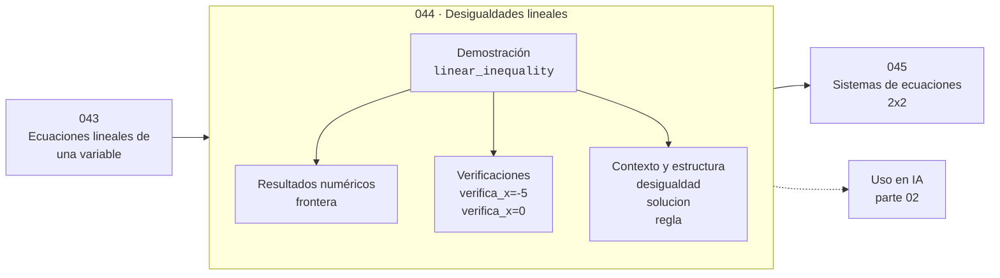

# 044 — Desigualdades lineales

> [⬅️ 043 Ecuaciones lineales de una variable](../043-ecuaciones-lineales-de-una-variable/README.md) · [📚 Parte 02](../README.md) · [🏠 Programa](../../../README.md) · [045 Sistemas de ecuaciones 2x2 ➡️](../045-sistemas-de-ecuaciones-2x2/README.md)

**Parte:** 02 — Álgebra y funciones · **Nivel:** `basico` · **Horas estimadas:** 4
**Motor:** `engines.part02` · **Demostración:** `linear_inequality` · **Clase 4 de 20** de la parte

---

## 🎯 Propósito

**Multiplicar o dividir una desigualdad por un número negativo invierte su sentido.**

Manipulación simbólica con criterio y la función como objeto central: dominio, imagen, composición, inversa y familias lineal, cuadrática, exponencial y logarítmica.

## ✅ Resultados de aprendizaje

Al terminar podrás:

1. Explicar **Desigualdades lineales** con lenguaje cotidiano y con notación matemática.
2. Resolver un caso pequeño a mano y anticipar el orden de magnitud del resultado.
3. Ejecutar y modificar `lab.py`, que corre la demostración `linear_inequality`.
4. Interpretar las 6 salidas del laboratorio y decir qué comprueba cada una.
5. Detectar el error típico de esta parte: dividir por una expresión que puede anularse y perder soluciones.

## 🧩 Fórmulas de la clase

```text
a < b  y  k > 0  ⟹  ka < kb
a < b  y  k < 0  ⟹  ka > kb
```

## 🗺️ Ubicación en el programa



## 📖 Fundamentos

Una desigualdad describe un conjunto, no un punto. La solución de `−3x + 4 > 10` no es
un número: es el intervalo `(−∞, −2)`. Esa diferencia de naturaleza explica por qué el
resultado se expresa como intervalo o como condición, y por qué conviene comprobarlo
con un valor de prueba dentro y otro fuera.

La regla del signo tiene una justificación geométrica clara. Multiplicar por un
negativo refleja la recta numérica respecto al origen, y una reflexión invierte el
orden: lo que estaba a la izquierda queda a la derecha. Es la misma «media vuelta» que
la clase 002 usó para explicar el producto de signos.

Al resolver, el hábito seguro es despejar sin dividir por negativos: pasar los términos
de modo que el coeficiente de la incógnita quede positivo. Si no se puede evitar, hay
que invertir el símbolo y **marcarlo explícitamente**, porque es el error más frecuente
y el más silencioso: produce el intervalo complementario, que suele parecer razonable.

Las desigualdades son el lenguaje de las restricciones en optimización. La parte 12
escribe `g(x) ≤ 0` para cada restricción, y las condiciones KKT (clase 257) tratan por
separado las restricciones activas —donde se cumple la igualdad— de las inactivas.

## 🧮 Ejemplo trabajado

Resolver −3x + 4 > 10 y comprobar con dos valores.

```text
−3x + 4 > 10
−3x     > 6          (restar 4)
  x     < −2         (dividir por −3: SE INVIERTE)

Frontera: x = −2

Prueba dentro  (x = −5):  −3(−5) + 4 = 19 > 10   ✓
Prueba fuera   (x =  0):  −3(0)  + 4 =  4 > 10   ✗

Solución: (−∞, −2)
```

## 🔬 Qué ejecuta el laboratorio

`linear_inequality` — Multiplicar por un negativo invierte el sentido de la desigualdad.

| Grupo | Salidas |
|---|---|
| 🔢 Resultados numéricos (1) | `frontera` |
| ✅ Comprobaciones de invariante (2) | `verifica_x=-5`, `verifica_x=0` |

Las claves booleanas no son adorno: si alguna fuera `False`, el resultado numérico
no sería fiable aunque el programa terminase sin error.

```bash
python classes/part-02-algebra-y-funciones/044-desigualdades-lineales/lab.py
compmath run 044
```

> [!TIP]
> Antes de ejecutar, **escribe tu predicción**. Un laboratorio que confirma lo que
> esperabas enseña tanto como uno que te contradice, pero solo si la predicción
> existía antes del resultado.

## ⚠️ Errores conceptuales frecuentes

1. Olvidar invertir el símbolo al dividir por un negativo.
2. Dar la solución como un punto en lugar de como un intervalo.
3. No comprobar con un valor dentro y otro fuera del intervalo obtenido.

## 🚀 Dónde se usa de verdad

Restricciones en optimización (parte 12), rangos de validez de un modelo, umbrales de
decisión de un clasificador y condiciones de estabilidad numérica (h < 2/|λ|).

## 🤖 Conexión con IA

Una red neuronal es una composición de funciones parametrizadas. La sigmoide, la softmax y la log-verosimilitud son álgebra de exponenciales y logaritmos.

## 📓 Notebooks

| Archivo | Para qué |
|---|---|
| [`notebook.ipynb`](notebook.ipynb) | recorrido guiado con la demostración ejecutada |
| [`notebook_student.ipynb`](notebook_student.ipynb) | versión con `TODO` para resolver |
| [`notebook_solution.ipynb`](notebook_solution.ipynb) | solución de referencia verificada |

## 📝 Evaluación

| Criterio | Peso |
|---|---:|
| Comprensión conceptual | 25 % |
| Resolución manual | 25 % |
| Implementación y verificación | 25 % |
| Interpretación y comunicación | 15 % |
| Conexión con aplicación real | 10 % |

Detalle y criterios de error crítico en [`assessment.md`](assessment.md).

## ❓ Preguntas de comprobación

1. ¿Cuál es la entrada, cuál la salida y qué unidades tienen?
2. ¿Qué operación domina el comportamiento del resultado?
3. ¿Qué caso extremo revelaría un error conceptual?
4. ¿Cómo verificarías el resultado por un método independiente?
5. ¿Dónde aparece esto en modelado de crecimiento?

Si necesitas releer el código para responderlas, la clase todavía no está superada.

## 📥 Entregable

`notebook_student.ipynb` resuelto más un párrafo que explique el resultado **sin citar
código**: qué entra, qué sale, qué invariante se comprueba y qué pasaría en un caso límite.

## 🔗 Referencias

- [Stewart, J. *Precalculus*, 7ª ed., Cengage, 2015](https://www.cengage.com/c/precalculus-mathematics-for-calculus-7e-stewart/)
- [Boyd & Vandenberghe. *Convex Optimization*. Cambridge, 2004, cap. 2](https://web.stanford.edu/~boyd/cvxbook/)

Bibliografía completa de la parte en [`../../../docs/BIBLIOGRAPHY.md`](../../../docs/BIBLIOGRAPHY.md).

## 📂 Material de la clase

[`intuition.md`](intuition.md) · [`theory.md`](theory.md) · [`derivation.md`](derivation.md) · [`exercises.md`](exercises.md) · [`assessment.md`](assessment.md) · [`where-is-this-used.md`](where-is-this-used.md) · [`lesson.yaml`](lesson.yaml)

---

> [⬅️ 043 Ecuaciones lineales de una variable](../043-ecuaciones-lineales-de-una-variable/README.md) · [📚 Parte 02](../README.md) · [🏠 Programa](../../../README.md) · [045 Sistemas de ecuaciones 2x2 ➡️](../045-sistemas-de-ecuaciones-2x2/README.md)
