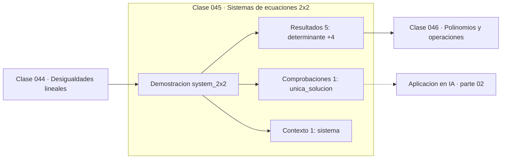

# 045 — Sistemas de ecuaciones 2x2

> [⬅️ 044 Desigualdades lineales](../044-desigualdades-lineales/README.md) · [📚 Parte 02](../README.md) · [🏠 Programa](../../../README.md) · [046 Polinomios y operaciones ➡️](../046-polinomios-y-operaciones/README.md)

**Parte:** 02 — Álgebra y funciones · **Nivel:** `basico` · **Horas estimadas:** 4
**Motor:** `engines.part02` · **Demostración:** `system_2x2` · **Clase 5 de 20** de la parte

---

## 🎯 Propósito

**Un sistema 2×2 tiene solución única si y solo si su determinante es no nulo.**

Manipulación simbólica con criterio y la función como objeto central: dominio, imagen, composición, inversa y familias lineal, cuadrática, exponencial y logarítmica.

## ✅ Resultados de aprendizaje

Al terminar podrás:

1. Explicar **Sistemas de ecuaciones 2x2** con lenguaje cotidiano y con notación matemática.
2. Resolver un caso pequeño a mano y anticipar el orden de magnitud del resultado.
3. Ejecutar y modificar `lab.py`, que corre la demostración `system_2x2`.
4. Interpretar las 7 salidas del laboratorio y decir qué comprueba cada una.
5. Detectar el error típico de esta parte: aplicar log a valores no positivos sin declarar el dominio.

## 🧩 Fórmulas de la clase

```text
det = a₁b₂ − a₂b₁
x = (c₁b₂ − c₂b₁)/det,   y = (a₁c₂ − a₂c₁)/det
```

## 🗺️ Ubicación en el programa



## 📖 Fundamentos

Un sistema de dos ecuaciones lineales con dos incógnitas admite tres lecturas
geométricas: dos rectas que se cortan en un punto (solución única), dos rectas
paralelas (sin solución) o dos rectas coincidentes (infinitas soluciones). El
determinante distingue los casos: si es no nulo, las rectas tienen pendientes
distintas y se cortan.

La regla de Cramer da las soluciones como cocientes de determinantes. Es elegante y
útil para 2×2, pero **no escala**: para n×n requiere calcular n+1 determinantes, con un
coste factorial si se hace por la definición. La parte 05 introduce la eliminación de
Gauss, que resuelve el mismo problema en O(n³) y es lo que usan las bibliotecas reales.

El determinante no solo dice si hay solución: dice cuán bien condicionado está el
problema. Un determinante muy cercano a cero significa rectas casi paralelas, y
entonces una perturbación mínima de los coeficientes mueve mucho el punto de corte. Es
el número de condición de la clase 035 aplicado a sistemas, y en la parte 06 se medirá
correctamente con los valores singulares.

La verificación sigue siendo la misma: sustituir la solución en **ambas** ecuaciones y
comprobar los residuos. Con dos ecuaciones es barato; con doscientas es la única forma
de saber si el solver hizo su trabajo.

## 🧮 Ejemplo trabajado

Resolver el sistema 2x + 3y = 12, 4x − y = 10.

```text
det = 2·(−1) − 4·3 = −2 − 12 = −14 ≠ 0   → solución única

x = (12·(−1) − 10·3) / (−14) = (−12 − 30)/(−14) = 3
y = (2·10 − 4·12)   / (−14) = (20 − 48)/(−14)   = 2

Verificación:
  2·3 + 3·2 = 6 + 6 = 12    ✓
  4·3 − 1·2 = 12 − 2 = 10   ✓
```

Si el determinante hubiera sido 0, habría que distinguir entre sistema incompatible
(rectas paralelas) y compatible indeterminado (rectas coincidentes).

## 🔬 Qué ejecuta el laboratorio

`system_2x2` — Sistema 2x2 por determinantes (regla de Cramer) y verificación.

| Grupo | Salidas |
|---|---|
| 🔢 Resultados numéricos (5) | `determinante`, `x`, `y`, `verificacion_1`, `verificacion_2` |
| ✅ Comprobaciones de invariante (1) | `unica_solucion` |

Las claves booleanas no son adorno: si alguna fuera `False`, el resultado numérico
no sería fiable aunque el programa terminase sin error.

```bash
python classes/part-02-algebra-y-funciones/045-sistemas-de-ecuaciones-2x2/lab.py
compmath run 045
```

> [!TIP]
> Antes de ejecutar, **escribe tu predicción**. Un laboratorio que confirma lo que
> esperabas enseña tanto como uno que te contradice, pero solo si la predicción
> existía antes del resultado.

## ⚠️ Errores conceptuales frecuentes

1. Aplicar Cramer sin comprobar antes que el determinante es no nulo.
2. No distinguir entre sistema sin solución y sistema con infinitas soluciones.
3. Verificar la solución en una sola de las dos ecuaciones.

## 🚀 Dónde se usa de verdad

Es el caso 2×2 del problema central de la parte 05. Cualquier ajuste lineal, sistema
de equilibrio o intersección geométrica se reduce a esto en dimensión baja.

## 🤖 Conexión con IA

Una red neuronal es una composición de funciones parametrizadas. La sigmoide, la softmax y la log-verosimilitud son álgebra de exponenciales y logaritmos.

## 📓 Notebooks

| Archivo | Para qué |
|---|---|
| [`notebook.ipynb`](notebook.ipynb) | recorrido guiado con la demostración ejecutada |
| [`notebook_student.ipynb`](notebook_student.ipynb) | versión con `TODO` para resolver |
| [`notebook_solution.ipynb`](notebook_solution.ipynb) | solución de referencia verificada |

## 📝 Evaluación

| Criterio | Peso |
|---|---:|
| Comprensión conceptual | 25 % |
| Resolución manual | 25 % |
| Implementación y verificación | 25 % |
| Interpretación y comunicación | 15 % |
| Conexión con aplicación real | 10 % |

Detalle y criterios de error crítico en [`assessment.md`](assessment.md).

## ❓ Preguntas de comprobación

1. ¿Cuál es la entrada, cuál la salida y qué unidades tienen?
2. ¿Qué operación domina el comportamiento del resultado?
3. ¿Qué caso extremo revelaría un error conceptual?
4. ¿Cómo verificarías el resultado por un método independiente?
5. ¿Dónde aparece esto en modelado de crecimiento?

Si necesitas releer el código para responderlas, la clase todavía no está superada.

## 📥 Entregable

`notebook_student.ipynb` resuelto más un párrafo que explique el resultado **sin citar
código**: qué entra, qué sale, qué invariante se comprueba y qué pasaría en un caso límite.

## 🔗 Referencias

- [Strang, G. *Introduction to Linear Algebra*, 6ª ed., 2023, cap. 1](https://math.mit.edu/~gs/linearalgebra/) — *uso:* exposición alternativa del tema en «Sistemas de ecuaciones 2x2».
- [Stewart, J. *Precalculus*, 7ª ed., Cengage, 2015](https://www.cengage.com/c/precalculus-mathematics-for-calculus-7e-stewart/) — *uso:* obra de referencia consultada en «Sistemas de ecuaciones 2x2».

Bibliografía completa de la parte en [`../../../docs/BIBLIOGRAPHY.md`](../../../docs/BIBLIOGRAPHY.md) · localizador verificable de cada obra en [`sources/bibliography.json`](../../../sources/bibliography.json).

## 📂 Material de la clase

[`intuition.md`](intuition.md) · [`theory.md`](theory.md) · [`derivation.md`](derivation.md) · [`exercises.md`](exercises.md) · [`assessment.md`](assessment.md) · [`where-is-this-used.md`](where-is-this-used.md) · [`lesson.yaml`](lesson.yaml)

---

> [⬅️ 044 Desigualdades lineales](../044-desigualdades-lineales/README.md) · [📚 Parte 02](../README.md) · [🏠 Programa](../../../README.md) · [046 Polinomios y operaciones ➡️](../046-polinomios-y-operaciones/README.md)
