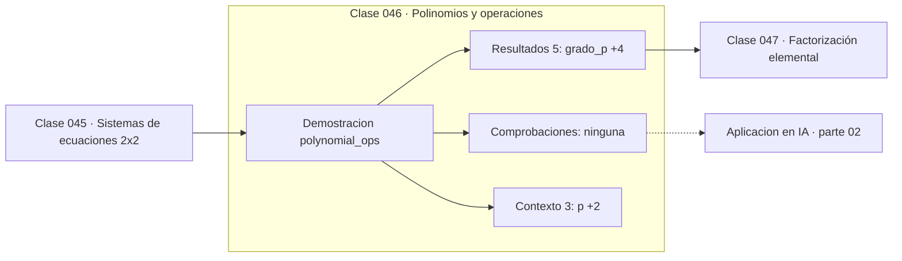

# 046 — Polinomios y operaciones

> [⬅️ 045 Sistemas de ecuaciones 2x2](../045-sistemas-de-ecuaciones-2x2/README.md) · [📚 Parte 02](../README.md) · [🏠 Programa](../../../README.md) · [047 Factorización elemental ➡️](../047-factorizacion-elemental/README.md)

**Parte:** 02 — Álgebra y funciones · **Nivel:** `basico` · **Horas estimadas:** 4
**Motor:** `engines.part02` · **Demostración:** `polynomial_ops` · **Clase 6 de 20** de la parte

---

## 🎯 Propósito

**El esquema de Horner evalúa un polinomio de grado n con n multiplicaciones en lugar de n(n+1)/2.**

Manipulación simbólica con criterio y la función como objeto central: dominio, imagen, composición, inversa y familias lineal, cuadrática, exponencial y logarítmica.

## ✅ Resultados de aprendizaje

Al terminar podrás:

1. Explicar **Polinomios y operaciones** con lenguaje cotidiano y con notación matemática.
2. Resolver un caso pequeño a mano y anticipar el orden de magnitud del resultado.
3. Ejecutar y modificar `lab.py`, que corre la demostración `polynomial_ops`.
4. Interpretar las 8 salidas del laboratorio y decir qué comprueba cada una.
5. Detectar el error típico de esta parte: confundir función inversa con recíproco.

## 🧩 Fórmulas de la clase

```text
p(x) = aₙxⁿ + ... + a₁x + a₀
Horner: p(x) = (...((aₙx + aₙ₋₁)x + aₙ₋₂)x + ...) + a₀
grado(p·q) = grado(p) + grado(q)
```

## 🗺️ Ubicación en el programa



## 📖 Fundamentos

Los polinomios son las funciones más simples después de las lineales, y su aritmética
es la de los enteros con otra notación: se suman término a término y se multiplican por
convolución de coeficientes. Esa operación —multiplicar polinomios es convolucionar sus
coeficientes— es literalmente la misma que la convolución discreta de la clase 271, y
es la razón por la que la FFT sirve para multiplicar polinomios grandes.

Evaluar un polinomio de forma ingenua calcula cada potencia por separado: `x²`, `x³`,
`x⁴`... lo que suma n(n+1)/2 multiplicaciones. El esquema de Horner factoriza
sucesivamente y necesita solo n multiplicaciones y n sumas. Para grado 100, eso son 100
operaciones frente a 5050.

Horner no es solo más rápido: es **más estable numéricamente**, porque evita calcular
potencias grandes que luego se cancelan con coeficientes pequeños. Es el algoritmo que
usan las bibliotecas para evaluar polinomios, incluidos los que aproximan `sin`, `exp`
o `log` internamente.

El grado del producto es la suma de los grados, hecho que parece trivial y tiene
consecuencias: multiplicar dos polinomios de grado 50 da uno de grado 100, y por eso el
coste de las operaciones simbólicas crece rápido. Es la razón por la que el álgebra
computacional es cara.

## 🧮 Ejemplo trabajado

Producto y evaluación de p(x) = x² − 3x + 2.

```text
p = x² − 3x + 2       (grado 2)
q = 2x + 1            (grado 1)

p·q: convolución de [1,−3,2] con [2,1]
     = 2x³ − 5x² + x + 2      (grado 3 = 2 + 1)  ✓

Evaluar p(3):
  directo: 3² − 3·3 + 2 = 9 − 9 + 2 = 2
  Horner:  ((1)·3 + (−3))·3 + 2 = (0)·3 + 2 = 2   ✓

  multiplicaciones directas: 3   (x², y dos productos)
  multiplicaciones Horner:   2
```

## 🔬 Qué ejecuta el laboratorio

`polynomial_ops` — Suma, producto y evaluación de polinomios por Horner.

| Grupo | Salidas |
|---|---|
| 🔢 Resultados numéricos (5) | `grado_p`, `grado_producto`, `p(3)_horner`, `p(3)_directo`, `multiplicaciones_horner` |
| ✅ Comprobaciones de invariante (0) | — |

Las claves booleanas no son adorno: si alguna fuera `False`, el resultado numérico
no sería fiable aunque el programa terminase sin error.

```bash
python classes/part-02-algebra-y-funciones/046-polinomios-y-operaciones/lab.py
compmath run 046
```

> [!TIP]
> Antes de ejecutar, **escribe tu predicción**. Un laboratorio que confirma lo que
> esperabas enseña tanto como uno que te contradice, pero solo si la predicción
> existía antes del resultado.

## ⚠️ Errores conceptuales frecuentes

1. Evaluar potencias por separado en polinomios de grado alto.
2. Confundir el producto de polinomios con el producto término a término.
3. Olvidar los coeficientes nulos al escribir el vector de coeficientes.

## 🚀 Dónde se usa de verdad

Evaluación de funciones especiales en bibliotecas matemáticas, interpolación
(clase 225), ajuste polinómico y aritmética de precisión arbitraria. La convolución
de coeficientes es la misma operación que en señales.

## 🤖 Conexión con IA

Una red neuronal es una composición de funciones parametrizadas. La sigmoide, la softmax y la log-verosimilitud son álgebra de exponenciales y logaritmos.

## 📓 Notebooks

| Archivo | Para qué |
|---|---|
| [`notebook.ipynb`](notebook.ipynb) | recorrido guiado con la demostración ejecutada |
| [`notebook_student.ipynb`](notebook_student.ipynb) | versión con `TODO` para resolver |
| [`notebook_solution.ipynb`](notebook_solution.ipynb) | solución de referencia verificada |

## 📝 Evaluación

| Criterio | Peso |
|---|---:|
| Comprensión conceptual | 25 % |
| Resolución manual | 25 % |
| Implementación y verificación | 25 % |
| Interpretación y comunicación | 15 % |
| Conexión con aplicación real | 10 % |

Detalle y criterios de error crítico en [`assessment.md`](assessment.md).

## ❓ Preguntas de comprobación

1. ¿Cuál es la entrada, cuál la salida y qué unidades tienen?
2. ¿Qué operación domina el comportamiento del resultado?
3. ¿Qué caso extremo revelaría un error conceptual?
4. ¿Cómo verificarías el resultado por un método independiente?
5. ¿Dónde aparece esto en modelado de crecimiento?

Si necesitas releer el código para responderlas, la clase todavía no está superada.

## 📥 Entregable

`notebook_student.ipynb` resuelto más un párrafo que explique el resultado **sin citar
código**: qué entra, qué sale, qué invariante se comprueba y qué pasaría en un caso límite.

## 🔗 Referencias

- [Knuth, D. *The Art of Computer Programming*, vol. 2, 3ª ed., 1997, secc. 4.6](https://www-cs-faculty.stanford.edu/~knuth/taocp.html)
- [NumPy: `polyval` y el esquema de Horner](https://numpy.org/doc/stable/reference/generated/numpy.polyval.html)

Bibliografía completa de la parte en [`../../../docs/BIBLIOGRAPHY.md`](../../../docs/BIBLIOGRAPHY.md).

## 📂 Material de la clase

[`intuition.md`](intuition.md) · [`theory.md`](theory.md) · [`derivation.md`](derivation.md) · [`exercises.md`](exercises.md) · [`assessment.md`](assessment.md) · [`where-is-this-used.md`](where-is-this-used.md) · [`lesson.yaml`](lesson.yaml)

---

> [⬅️ 045 Sistemas de ecuaciones 2x2](../045-sistemas-de-ecuaciones-2x2/README.md) · [📚 Parte 02](../README.md) · [🏠 Programa](../../../README.md) · [047 Factorización elemental ➡️](../047-factorizacion-elemental/README.md)
