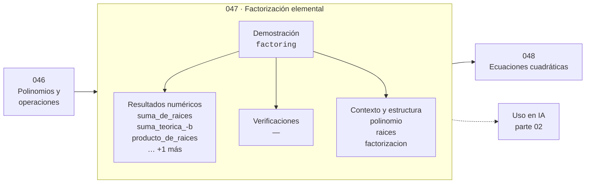

# 047 — Factorización elemental

> [⬅️ 046 Polinomios y operaciones](../046-polinomios-y-operaciones/README.md) · [📚 Parte 02](../README.md) · [🏠 Programa](../../../README.md) · [048 Ecuaciones cuadráticas ➡️](../048-ecuaciones-cuadraticas/README.md)

**Parte:** 02 — Álgebra y funciones · **Nivel:** `basico` · **Horas estimadas:** 4
**Motor:** `engines.part02` · **Demostración:** `factoring` · **Clase 7 de 20** de la parte

---

## 🎯 Propósito

**Factorizar expone las raíces; las relaciones de Vieta las conectan con los coeficientes.**

Manipulación simbólica con criterio y la función como objeto central: dominio, imagen, composición, inversa y familias lineal, cuadrática, exponencial y logarítmica.

## ✅ Resultados de aprendizaje

Al terminar podrás:

1. Explicar **Factorización elemental** con lenguaje cotidiano y con notación matemática.
2. Resolver un caso pequeño a mano y anticipar el orden de magnitud del resultado.
3. Ejecutar y modificar `lab.py`, que corre la demostración `factoring`.
4. Interpretar las 7 salidas del laboratorio y decir qué comprueba cada una.
5. Detectar el error típico de esta parte: dividir por una expresión que puede anularse y perder soluciones.

## 🧩 Fórmulas de la clase

```text
x² + bx + c = (x − r₁)(x − r₂)
r₁ + r₂ = −b,   r₁·r₂ = c
```

## 🗺️ Ubicación en el programa



## 📖 Fundamentos

Factorizar un polinomio es escribirlo como producto de factores más simples. Su valor
práctico es que las raíces se leen directamente: si `p(x) = (x−1)(x−2)`, las raíces son
1 y 2 sin resolver nada. Esa es la razón por la que factorizar es útil, y no un
ejercicio de manipulación.

Las relaciones de Vieta conectan las raíces con los coeficientes sin calcularlas: para
`x² + bx + c`, la suma de las raíces es `−b` y su producto es `c`. Esto sirve para dos
cosas. Primero, para **adivinar** factorizaciones con coeficientes enteros: hay que
buscar dos números que sumen `−b` y multipliquen `c`. Segundo, y más importante en este
programa, para **verificar**: si las raíces calculadas no satisfacen las relaciones,
hay un error.

Esa verificación es exactamente la que la clase 036 usó para detectar la inestabilidad
de la fórmula cuadrática. El producto de las raíces debe ser `c/a`; cuando la fórmula
ingenua sufre cancelación, la relación de Vieta lo delata de inmediato.

No todo polinomio factoriza sobre los racionales. `x² + 1` no tiene raíces reales y
`x² − 2` las tiene irracionales. El teorema fundamental del álgebra garantiza que sobre
los complejos todo polinomio de grado n tiene exactamente n raíces contando
multiplicidad, y ese es el marco en el que la factorización siempre existe.

## 🧮 Ejemplo trabajado

Factorizar x² − 3x + 2 y verificar con Vieta.

```text
Buscar r₁, r₂ con  r₁ + r₂ = 3  y  r₁·r₂ = 2
Candidatos enteros: 1 y 2

x² − 3x + 2 = (x − 1)(x − 2)

Verificación desarrollando:
  (x−1)(x−2) = x² − 2x − x + 2 = x² − 3x + 2   ✓

Vieta:
  suma:     1 + 2 = 3 = −b   ✓   (b = −3)
  producto: 1 · 2 = 2 =  c   ✓
```

## 🔬 Qué ejecuta el laboratorio

`factoring` — Factorizar x² - 3x + 2 y comprobar las raíces.

| Grupo | Salidas |
|---|---|
| 🔢 Resultados numéricos (4) | `suma_de_raices`, `suma_teorica_-b`, `producto_de_raices`, `producto_teorico_c` |
| ✅ Comprobaciones de invariante (0) | — |

Las claves booleanas no son adorno: si alguna fuera `False`, el resultado numérico
no sería fiable aunque el programa terminase sin error.

```bash
python classes/part-02-algebra-y-funciones/047-factorizacion-elemental/lab.py
compmath run 047
```

> [!TIP]
> Antes de ejecutar, **escribe tu predicción**. Un laboratorio que confirma lo que
> esperabas enseña tanto como uno que te contradice, pero solo si la predicción
> existía antes del resultado.

## ⚠️ Errores conceptuales frecuentes

1. Buscar solo factorizaciones con enteros: muchos polinomios no las tienen.
2. Equivocar el signo al aplicar Vieta: la suma es −b, no b.
3. Factorizar sin verificar desarrollando el producto.

## 🚀 Dónde se usa de verdad

Simplificación de expresiones racionales, análisis de estabilidad por raíces del
polinomio característico y verificación de solvers de raíces (clase 036).

## 🤖 Conexión con IA

Una red neuronal es una composición de funciones parametrizadas. La sigmoide, la softmax y la log-verosimilitud son álgebra de exponenciales y logaritmos.

## 📓 Notebooks

| Archivo | Para qué |
|---|---|
| [`notebook.ipynb`](notebook.ipynb) | recorrido guiado con la demostración ejecutada |
| [`notebook_student.ipynb`](notebook_student.ipynb) | versión con `TODO` para resolver |
| [`notebook_solution.ipynb`](notebook_solution.ipynb) | solución de referencia verificada |

## 📝 Evaluación

| Criterio | Peso |
|---|---:|
| Comprensión conceptual | 25 % |
| Resolución manual | 25 % |
| Implementación y verificación | 25 % |
| Interpretación y comunicación | 15 % |
| Conexión con aplicación real | 10 % |

Detalle y criterios de error crítico en [`assessment.md`](assessment.md).

## ❓ Preguntas de comprobación

1. ¿Cuál es la entrada, cuál la salida y qué unidades tienen?
2. ¿Qué operación domina el comportamiento del resultado?
3. ¿Qué caso extremo revelaría un error conceptual?
4. ¿Cómo verificarías el resultado por un método independiente?
5. ¿Dónde aparece esto en modelado de crecimiento?

Si necesitas releer el código para responderlas, la clase todavía no está superada.

## 📥 Entregable

`notebook_student.ipynb` resuelto más un párrafo que explique el resultado **sin citar
código**: qué entra, qué sale, qué invariante se comprueba y qué pasaría en un caso límite.

## 🔗 Referencias

- [Artin, M. *Algebra*, 2ª ed., Pearson, 2011](https://www.pearson.com/en-us/subject-catalog/p/algebra/P200000006131)
- [Vieta's formulas — Wolfram MathWorld](https://mathworld.wolfram.com/VietasFormulas.html)

Bibliografía completa de la parte en [`../../../docs/BIBLIOGRAPHY.md`](../../../docs/BIBLIOGRAPHY.md).

## 📂 Material de la clase

[`intuition.md`](intuition.md) · [`theory.md`](theory.md) · [`derivation.md`](derivation.md) · [`exercises.md`](exercises.md) · [`assessment.md`](assessment.md) · [`where-is-this-used.md`](where-is-this-used.md) · [`lesson.yaml`](lesson.yaml)

---

> [⬅️ 046 Polinomios y operaciones](../046-polinomios-y-operaciones/README.md) · [📚 Parte 02](../README.md) · [🏠 Programa](../../../README.md) · [048 Ecuaciones cuadráticas ➡️](../048-ecuaciones-cuadraticas/README.md)
