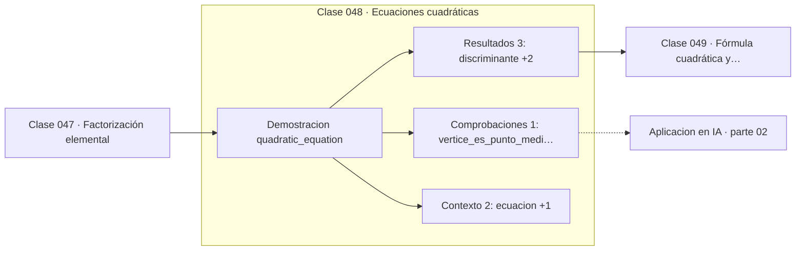

# 048 — Ecuaciones cuadráticas

> [⬅️ 047 Factorización elemental](../047-factorizacion-elemental/README.md) · [📚 Parte 02](../README.md) · [🏠 Programa](../../../README.md) · [049 Fórmula cuadrática y discriminante ➡️](../049-formula-cuadratica-y-discriminante/README.md)

**Parte:** 02 — Álgebra y funciones · **Nivel:** `basico` · **Horas estimadas:** 4
**Motor:** `engines.part02` · **Demostración:** `quadratic_equation` · **Clase 8 de 20** de la parte

---

## 🎯 Propósito

**El vértice de una parábola está en x = −b/2a y es el punto medio de las raíces.**

Manipulación simbólica con criterio y la función como objeto central: dominio, imagen, composición, inversa y familias lineal, cuadrática, exponencial y logarítmica.

## ✅ Resultados de aprendizaje

Al terminar podrás:

1. Explicar **Ecuaciones cuadráticas** con lenguaje cotidiano y con notación matemática.
2. Resolver un caso pequeño a mano y anticipar el orden de magnitud del resultado.
3. Ejecutar y modificar `lab.py`, que corre la demostración `quadratic_equation`.
4. Interpretar las 6 salidas del laboratorio y decir qué comprueba cada una.
5. Detectar el error típico de esta parte: aplicar log a valores no positivos sin declarar el dominio.

## 🧩 Fórmulas de la clase

```text
raíces: x = (−b ± √(b²−4ac)) / 2a
vértice: xᵥ = −b/2a,  yᵥ = a·xᵥ² + b·xᵥ + c
```

## 🗺️ Ubicación en el programa



## 📖 Fundamentos

La ecuación cuadrática es el primer caso en que la solución exige una fórmula y no solo
despejar. Su deducción —completar el cuadrado— es instructiva porque es la misma
técnica que aparece en la parte 06 al diagonalizar formas cuadráticas y en la parte 09
al normalizar la densidad de una gaussiana.

El vértice está en `x = −b/2a`, que es exactamente el punto medio entre las dos raíces.
Eso no es coincidencia: la parábola es simétrica respecto a la recta vertical que pasa
por su vértice, y las raíces son simétricas respecto a ella. De ahí que el vértice se
pueda calcular sin conocer las raíces, y viceversa.

La forma de vértice, `a(x − xᵥ)² + yᵥ`, hace evidente lo que la forma estándar oculta:
el signo de `a` decide si el vértice es mínimo o máximo, y `yᵥ` es el valor extremo. En
optimización esto es el caso más simple posible de la condición de segundo orden que la
parte 08 generaliza con el Hessiano.

La minimización de una cuadrática es el problema modelo de toda la parte 12: la función
objetivo `x² + 20y²` que usan los optimizadores es una cuadrática multivariable, y su
mínimo se conoce analíticamente, lo que permite medir cuánto se acerca cada algoritmo.

## 🧮 Ejemplo trabajado

Analizar 2x² − 8x + 6 = 0.

```text
a = 2, b = −8, c = 6
discriminante = 64 − 48 = 16 > 0  → dos raíces reales

raíces: (8 ± 4)/4  →  r₁ = 3,  r₂ = 1

vértice: xᵥ = −(−8)/(2·2) = 2
         yᵥ = 2·4 − 8·2 + 6 = −2

Comprobación de simetría:
  punto medio de las raíces = (3 + 1)/2 = 2 = xᵥ   ✓

Como a = 2 > 0, la parábola abre hacia arriba y el vértice es un MÍNIMO.
```

## 🔬 Qué ejecuta el laboratorio

`quadratic_equation` — Resolver una cuadrática y contrastar con la forma de vértice.

| Grupo | Salidas |
|---|---|
| 🔢 Resultados numéricos (3) | `discriminante`, `vertice_x`, `vertice_y` |
| ✅ Comprobaciones de invariante (1) | `vertice_es_punto_medio_de_raices` |

Las claves booleanas no son adorno: si alguna fuera `False`, el resultado numérico
no sería fiable aunque el programa terminase sin error.

```bash
python classes/part-02-algebra-y-funciones/048-ecuaciones-cuadraticas/lab.py
compmath run 048
```

> [!TIP]
> Antes de ejecutar, **escribe tu predicción**. Un laboratorio que confirma lo que
> esperabas enseña tanto como uno que te contradice, pero solo si la predicción
> existía antes del resultado.

## ⚠️ Errores conceptuales frecuentes

1. Olvidar dividir por 2a en la fórmula de las raíces.
2. Confundir el signo del vértice: xᵥ = −b/2a, no b/2a.
3. Suponer que el vértice es siempre un mínimo sin mirar el signo de a.

## 🚀 Dónde se usa de verdad

Optimización cuadrática (clase 258), ajuste por mínimos cuadrados —cuyo objetivo es una
cuadrática— y análisis de trayectorias parabólicas en física y videojuegos.

## 🤖 Conexión con IA

Una red neuronal es una composición de funciones parametrizadas. La sigmoide, la softmax y la log-verosimilitud son álgebra de exponenciales y logaritmos.

## 📓 Notebooks

| Archivo | Para qué |
|---|---|
| [`notebook.ipynb`](notebook.ipynb) | recorrido guiado con la demostración ejecutada |
| [`notebook_student.ipynb`](notebook_student.ipynb) | versión con `TODO` para resolver |
| [`notebook_solution.ipynb`](notebook_solution.ipynb) | solución de referencia verificada |

## 📝 Evaluación

| Criterio | Peso |
|---|---:|
| Comprensión conceptual | 25 % |
| Resolución manual | 25 % |
| Implementación y verificación | 25 % |
| Interpretación y comunicación | 15 % |
| Conexión con aplicación real | 10 % |

Detalle y criterios de error crítico en [`assessment.md`](assessment.md).

## ❓ Preguntas de comprobación

1. ¿Cuál es la entrada, cuál la salida y qué unidades tienen?
2. ¿Qué operación domina el comportamiento del resultado?
3. ¿Qué caso extremo revelaría un error conceptual?
4. ¿Cómo verificarías el resultado por un método independiente?
5. ¿Dónde aparece esto en modelado de crecimiento?

Si necesitas releer el código para responderlas, la clase todavía no está superada.

## 📥 Entregable

`notebook_student.ipynb` resuelto más un párrafo que explique el resultado **sin citar
código**: qué entra, qué sale, qué invariante se comprueba y qué pasaría en un caso límite.

## 🔗 Referencias

- [Stewart, J. *Precalculus*, 7ª ed., Cengage, 2015](https://www.cengage.com/c/precalculus-mathematics-for-calculus-7e-stewart/) — *uso:* obra de referencia consultada en «Ecuaciones cuadráticas».
- [Boyd & Vandenberghe. *Convex Optimization*. Cambridge, 2004](https://web.stanford.edu/~boyd/cvxbook/) — *uso:* obra de referencia consultada en «Ecuaciones cuadráticas».

Bibliografía completa de la parte en [`../../../docs/BIBLIOGRAPHY.md`](../../../docs/BIBLIOGRAPHY.md) · localizador verificable de cada obra en [`sources/bibliography.json`](../../../sources/bibliography.json).

## 📂 Material de la clase

[`intuition.md`](intuition.md) · [`theory.md`](theory.md) · [`derivation.md`](derivation.md) · [`exercises.md`](exercises.md) · [`assessment.md`](assessment.md) · [`where-is-this-used.md`](where-is-this-used.md) · [`lesson.yaml`](lesson.yaml)

---

> [⬅️ 047 Factorización elemental](../047-factorizacion-elemental/README.md) · [📚 Parte 02](../README.md) · [🏠 Programa](../../../README.md) · [049 Fórmula cuadrática y discriminante ➡️](../049-formula-cuadratica-y-discriminante/README.md)
