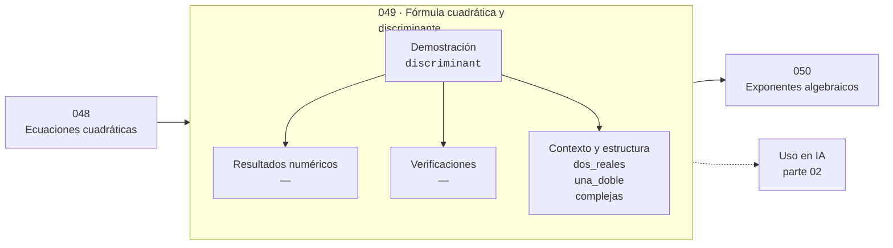

# 049 — Fórmula cuadrática y discriminante

> [⬅️ 048 Ecuaciones cuadráticas](../048-ecuaciones-cuadraticas/README.md) · [📚 Parte 02](../README.md) · [🏠 Programa](../../../README.md) · [050 Exponentes algebraicos ➡️](../050-exponentes-algebraicos/README.md)

**Parte:** 02 — Álgebra y funciones · **Nivel:** `basico` · **Horas estimadas:** 4
**Motor:** `engines.part02` · **Demostración:** `discriminant` · **Clase 9 de 20** de la parte

---

## 🎯 Propósito

**El discriminante clasifica las raíces antes de calcularlas.**

Manipulación simbólica con criterio y la función como objeto central: dominio, imagen, composición, inversa y familias lineal, cuadrática, exponencial y logarítmica.

## ✅ Resultados de aprendizaje

Al terminar podrás:

1. Explicar **Fórmula cuadrática y discriminante** con lenguaje cotidiano y con notación matemática.
2. Resolver un caso pequeño a mano y anticipar el orden de magnitud del resultado.
3. Ejecutar y modificar `lab.py`, que corre la demostración `discriminant`.
4. Interpretar las 3 salidas del laboratorio y decir qué comprueba cada una.
5. Detectar el error típico de esta parte: confundir función inversa con recíproco.

## 🧩 Fórmulas de la clase

```text
Δ = b² − 4ac
Δ > 0: dos raíces reales · Δ = 0: una doble · Δ < 0: dos complejas conjugadas
```

## 🗺️ Ubicación en el programa



## 📖 Fundamentos

El discriminante es un ejemplo de una idea muy general: obtener información cualitativa
sobre la solución sin resolver. Su signo determina la naturaleza de las raíces, y
calcularlo cuesta tres operaciones frente a las siete de la fórmula completa. En una
implementación, comprobar el discriminante antes de llamar a `sqrt` evita una excepción
o un `NaN`.

Los tres casos tienen lectura geométrica: `Δ > 0` significa que la parábola corta el eje
x en dos puntos; `Δ = 0`, que lo toca en uno (el vértice está sobre el eje); `Δ < 0`,
que no lo corta. Las raíces complejas no son un artefacto: describen oscilaciones, y en
la parte 13 aparecerán como las frecuencias de una señal.

El caso `Δ = 0` es delicado numéricamente. Comprobar `Δ == 0` con floats casi nunca es
correcto: el discriminante calculado rara vez da exactamente cero aunque la raíz sea
doble. Hay que usar una tolerancia relativa a la escala de los coeficientes, decisión
que debe documentarse.

La misma idea —un indicador que clasifica antes de resolver— reaparece en el
determinante para sistemas (clase 045), en el signo de los autovalores del Hessiano
para puntos críticos (clase 169) y en el signo del producto `f(a)·f(b)` para la
bisección (clase 222).

## 🧮 Ejemplo trabajado

Los tres casos con sus coeficientes.

```text
Caso              (a, b, c)      Δ = b²−4ac    naturaleza
dos reales        (1, −5,  6)    25 − 24 = 1   2 raíces: 3 y 2
una doble         (1, −4,  4)    16 − 16 = 0   1 raíz doble: 2
complejas         (1,  1,  1)     1 −  4 = −3  2 conjugadas

Complejas explícitas: (−1 ± i√3)/2

Precaución numérica:
  comprobar Δ == 0 con floats es casi siempre incorrecto;
  usar |Δ| < tol · max(|b²|, |4ac|)
```

## 🔬 Qué ejecuta el laboratorio

`discriminant` — El discriminante clasifica las raíces antes de calcularlas.

| Grupo | Salidas |
|---|---|
| 🔢 Resultados numéricos (0) | — |
| ✅ Comprobaciones de invariante (0) | — |

Las claves booleanas no son adorno: si alguna fuera `False`, el resultado numérico
no sería fiable aunque el programa terminase sin error.

```bash
python classes/part-02-algebra-y-funciones/049-formula-cuadratica-y-discriminante/lab.py
compmath run 049
```

> [!TIP]
> Antes de ejecutar, **escribe tu predicción**. Un laboratorio que confirma lo que
> esperabas enseña tanto como uno que te contradice, pero solo si la predicción
> existía antes del resultado.

## ⚠️ Errores conceptuales frecuentes

1. Comparar el discriminante con cero usando == en aritmética de punto flotante.
2. Llamar a sqrt sin comprobar antes el signo del discriminante.
3. Tratar las raíces complejas como un error en lugar de como información.

## 🚀 Dónde se usa de verdad

Estabilidad de sistemas dinámicos (raíces del polinomio característico), clasificación
de cónicas y decisión previa en cualquier solver de raíces.

## 🤖 Conexión con IA

Una red neuronal es una composición de funciones parametrizadas. La sigmoide, la softmax y la log-verosimilitud son álgebra de exponenciales y logaritmos.

## 📓 Notebooks

| Archivo | Para qué |
|---|---|
| [`notebook.ipynb`](notebook.ipynb) | recorrido guiado con la demostración ejecutada |
| [`notebook_student.ipynb`](notebook_student.ipynb) | versión con `TODO` para resolver |
| [`notebook_solution.ipynb`](notebook_solution.ipynb) | solución de referencia verificada |

## 📝 Evaluación

| Criterio | Peso |
|---|---:|
| Comprensión conceptual | 25 % |
| Resolución manual | 25 % |
| Implementación y verificación | 25 % |
| Interpretación y comunicación | 15 % |
| Conexión con aplicación real | 10 % |

Detalle y criterios de error crítico en [`assessment.md`](assessment.md).

## ❓ Preguntas de comprobación

1. ¿Cuál es la entrada, cuál la salida y qué unidades tienen?
2. ¿Qué operación domina el comportamiento del resultado?
3. ¿Qué caso extremo revelaría un error conceptual?
4. ¿Cómo verificarías el resultado por un método independiente?
5. ¿Dónde aparece esto en modelado de crecimiento?

Si necesitas releer el código para responderlas, la clase todavía no está superada.

## 📥 Entregable

`notebook_student.ipynb` resuelto más un párrafo que explique el resultado **sin citar
código**: qué entra, qué sale, qué invariante se comprueba y qué pasaría en un caso límite.

## 🔗 Referencias

- [Higham, N. J. *Accuracy and Stability of Numerical Algorithms*, 2ª ed., SIAM, 2002](https://epubs.siam.org/doi/book/10.1137/1.9780898718027)
- [Stewart, J. *Precalculus*, 7ª ed., Cengage, 2015](https://www.cengage.com/c/precalculus-mathematics-for-calculus-7e-stewart/)

Bibliografía completa de la parte en [`../../../docs/BIBLIOGRAPHY.md`](../../../docs/BIBLIOGRAPHY.md).

## 📂 Material de la clase

[`intuition.md`](intuition.md) · [`theory.md`](theory.md) · [`derivation.md`](derivation.md) · [`exercises.md`](exercises.md) · [`assessment.md`](assessment.md) · [`where-is-this-used.md`](where-is-this-used.md) · [`lesson.yaml`](lesson.yaml)

---

> [⬅️ 048 Ecuaciones cuadráticas](../048-ecuaciones-cuadraticas/README.md) · [📚 Parte 02](../README.md) · [🏠 Programa](../../../README.md) · [050 Exponentes algebraicos ➡️](../050-exponentes-algebraicos/README.md)
