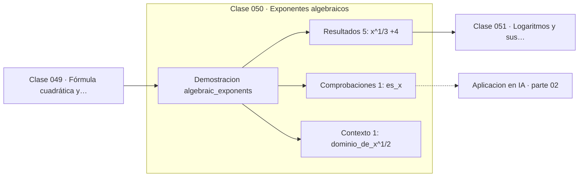

# 050 — Exponentes algebraicos

> [⬅️ 049 Fórmula cuadrática y discriminante](../049-formula-cuadratica-y-discriminante/README.md) · [📚 Parte 02](../README.md) · [🏠 Programa](../../../README.md) · [051 Logaritmos y sus propiedades ➡️](../051-logaritmos-y-sus-propiedades/README.md)

**Parte:** 02 — Álgebra y funciones · **Nivel:** `basico` · **Horas estimadas:** 4
**Motor:** `engines.part02` · **Demostración:** `algebraic_exponents` · **Clase 10 de 20** de la parte

---

## 🎯 Propósito

**Los exponentes fraccionarios extienden las leyes de potencias y definen las raíces.**

Manipulación simbólica con criterio y la función como objeto central: dominio, imagen, composición, inversa y familias lineal, cuadrática, exponencial y logarítmica.

## ✅ Resultados de aprendizaje

Al terminar podrás:

1. Explicar **Exponentes algebraicos** con lenguaje cotidiano y con notación matemática.
2. Resolver un caso pequeño a mano y anticipar el orden de magnitud del resultado.
3. Ejecutar y modificar `lab.py`, que corre la demostración `algebraic_exponents`.
4. Interpretar las 7 salidas del laboratorio y decir qué comprueba cada una.
5. Detectar el error típico de esta parte: dividir por una expresión que puede anularse y perder soluciones.

## 🧩 Fórmulas de la clase

```text
a^(m/n) = ⁿ√(aᵐ)
a^(1/3) · a^(2/3) = a
dominio de a^(1/2): a ≥ 0 en ℝ
```

## 🗺️ Ubicación en el programa



## 📖 Fundamentos

La extensión de los exponentes a números fraccionarios sigue el mismo principio que la
clase 008 aplicó a los negativos: se elige la definición que **conserva las leyes**. Si
`a^(1/n)` debe cumplir `(a^(1/n))ⁿ = a^(n/n) = a`, entonces `a^(1/n)` es la raíz
n-ésima. La notación de exponente no es una alternativa a la de radical: es la que
permite operar sin casos especiales.

Con esa definición, el álgebra funciona: `a^(1/3) · a^(2/3) = a^(1/3+2/3) = a¹ = a`. El
laboratorio comprueba precisamente esa identidad, y en punto flotante se cumple solo
dentro de una tolerancia, porque cada potencia fraccionaria introduce redondeo.

El dominio sigue las reglas de la clase 009: con denominador par, la base debe ser no
negativa en los reales. Y hay una trampa de implementación que conviene conocer:
`(-8) ** (1/3)` en Python devuelve un complejo o `nan` según el tipo, porque `1/3` es un
float que no es exactamente un tercio. Para raíces cúbicas de negativos hay que
calcular `-(8 ** (1/3))` explícitamente, como hace el motor.

Extender aún más —a exponentes reales arbitrarios— exige definir `a^x = e^(x ln a)`,
que es la ruta que toma el análisis y la que usa la implementación de `pow`. Ese es el
puente hacia las funciones exponencial y logarítmica de las clases 055 y 056.

## 🧮 Ejemplo trabajado

Exponentes fraccionarios con base 8.

```text
8^(1/3)  = 2.0            (raíz cúbica)
8^(2/3)  = 4.0            (raíz cúbica al cuadrado)
8^(−1)   = 0.125
8^(−1/3) = 0.5

Ley del producto:
  8^(1/3) · 8^(2/3) = 2.0 · 4.0 = 8.0 = 8¹   ✓

Dominio:
  (−8)^(1/3) en ℝ  →  −2   (raíz impar, existe)
  (−8)^(1/2) en ℝ  →  no existe
  En Python: (-8) ** (1/3) NO devuelve −2; hay que escribir −(8 ** (1/3))
```

## 🔬 Qué ejecuta el laboratorio

`algebraic_exponents` — Exponentes negativos, fraccionarios y su dominio.

| Grupo | Salidas |
|---|---|
| 🔢 Resultados numéricos (5) | `x^(1/3)`, `x^(2/3)`, `x^(-1)`, `x^(-1/3)`, `producto_x^(1/3)*x^(2/3)` |
| ✅ Comprobaciones de invariante (1) | `es_x` |

Las claves booleanas no son adorno: si alguna fuera `False`, el resultado numérico
no sería fiable aunque el programa terminase sin error.

```bash
python classes/part-02-algebra-y-funciones/050-exponentes-algebraicos/lab.py
compmath run 050
```

> [!TIP]
> Antes de ejecutar, **escribe tu predicción**. Un laboratorio que confirma lo que
> esperabas enseña tanto como uno que te contradice, pero solo si la predicción
> existía antes del resultado.

## ⚠️ Errores conceptuales frecuentes

1. Escribir (-8) ** (1/3) esperando −2.
2. Aplicar exponentes fraccionarios a bases negativas sin comprobar la paridad del denominador.
3. Comparar identidades de exponentes con == en lugar de con tolerancia.

## 🚀 Dónde se usa de verdad

Normas Lp con p no entero (clase 104), transformaciones de potencia en estadística
(Box-Cox) y escalado de leyes de potencia en las leyes de escala (clase 359).

## 🤖 Conexión con IA

Una red neuronal es una composición de funciones parametrizadas. La sigmoide, la softmax y la log-verosimilitud son álgebra de exponenciales y logaritmos.

## 📓 Notebooks

| Archivo | Para qué |
|---|---|
| [`notebook.ipynb`](notebook.ipynb) | recorrido guiado con la demostración ejecutada |
| [`notebook_student.ipynb`](notebook_student.ipynb) | versión con `TODO` para resolver |
| [`notebook_solution.ipynb`](notebook_solution.ipynb) | solución de referencia verificada |

## 📝 Evaluación

| Criterio | Peso |
|---|---:|
| Comprensión conceptual | 25 % |
| Resolución manual | 25 % |
| Implementación y verificación | 25 % |
| Interpretación y comunicación | 15 % |
| Conexión con aplicación real | 10 % |

Detalle y criterios de error crítico en [`assessment.md`](assessment.md).

## ❓ Preguntas de comprobación

1. ¿Cuál es la entrada, cuál la salida y qué unidades tienen?
2. ¿Qué operación domina el comportamiento del resultado?
3. ¿Qué caso extremo revelaría un error conceptual?
4. ¿Cómo verificarías el resultado por un método independiente?
5. ¿Dónde aparece esto en modelado de crecimiento?

Si necesitas releer el código para responderlas, la clase todavía no está superada.

## 📥 Entregable

`notebook_student.ipynb` resuelto más un párrafo que explique el resultado **sin citar
código**: qué entra, qué sale, qué invariante se comprueba y qué pasaría en un caso límite.

## 🔗 Referencias

- [Python: `math.pow` y el operador `**`](https://docs.python.org/3/library/math.html#math.pow)
- [Gelfand & Shen. *Algebra*. Birkhäuser, 2002](https://link.springer.com/book/10.1007/978-1-4612-0335-5)

Bibliografía completa de la parte en [`../../../docs/BIBLIOGRAPHY.md`](../../../docs/BIBLIOGRAPHY.md).

## 📂 Material de la clase

[`intuition.md`](intuition.md) · [`theory.md`](theory.md) · [`derivation.md`](derivation.md) · [`exercises.md`](exercises.md) · [`assessment.md`](assessment.md) · [`where-is-this-used.md`](where-is-this-used.md) · [`lesson.yaml`](lesson.yaml)

---

> [⬅️ 049 Fórmula cuadrática y discriminante](../049-formula-cuadratica-y-discriminante/README.md) · [📚 Parte 02](../README.md) · [🏠 Programa](../../../README.md) · [051 Logaritmos y sus propiedades ➡️](../051-logaritmos-y-sus-propiedades/README.md)
