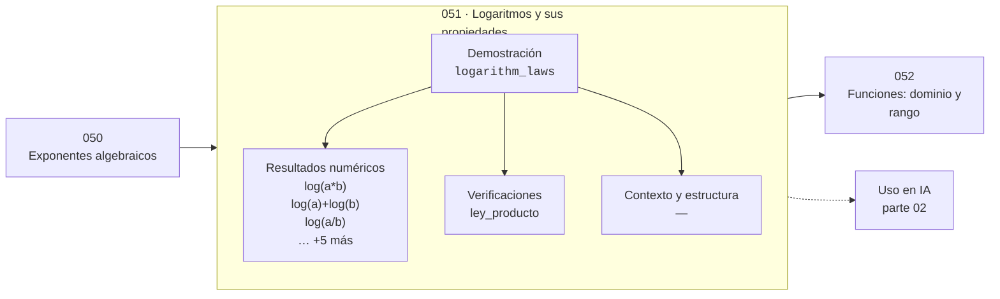

# 051 — Logaritmos y sus propiedades

> [⬅️ 050 Exponentes algebraicos](../050-exponentes-algebraicos/README.md) · [📚 Parte 02](../README.md) · [🏠 Programa](../../../README.md) · [052 Funciones: dominio y rango ➡️](../052-funciones-dominio-y-rango/README.md)

**Parte:** 02 — Álgebra y funciones · **Nivel:** `basico` · **Horas estimadas:** 4
**Motor:** `engines.part02` · **Demostración:** `logarithm_laws` · **Clase 11 de 20** de la parte

---

## 🎯 Propósito

**El logaritmo convierte productos en sumas, y por eso toda verosimilitud se calcula en escala logarítmica.**

Manipulación simbólica con criterio y la función como objeto central: dominio, imagen, composición, inversa y familias lineal, cuadrática, exponencial y logarítmica.

## ✅ Resultados de aprendizaje

Al terminar podrás:

1. Explicar **Logaritmos y sus propiedades** con lenguaje cotidiano y con notación matemática.
2. Resolver un caso pequeño a mano y anticipar el orden de magnitud del resultado.
3. Ejecutar y modificar `lab.py`, que corre la demostración `logarithm_laws`.
4. Interpretar las 9 salidas del laboratorio y decir qué comprueba cada una.
5. Detectar el error típico de esta parte: aplicar log a valores no positivos sin declarar el dominio.

## 🧩 Fórmulas de la clase

```text
log(ab) = log a + log b
log(a/b) = log a − log b
log(aⁿ) = n log a
log_b(a) = ln a / ln b
```

## 🗺️ Ubicación en el programa



## 📖 Fundamentos

El logaritmo se inventó, literalmente, para convertir multiplicaciones en sumas. Napier
publicó sus tablas en 1614 con ese propósito explícito: antes de las calculadoras,
multiplicar dos números de seis cifras era costoso y sumar sus logaritmos no. Esa misma
propiedad, cuatro siglos después, es la razón por la que el logaritmo está en el centro
de la estadística y del machine learning.

El motivo es de precisión, no de velocidad. Multiplicar diez mil probabilidades —cada
una menor que 1— produce un número tan pequeño que hace underflow a cero en float64
(clase 033). Sumar diez mil logaritmos no tiene ese problema. Por eso la verosimilitud
se maximiza siempre como **log-verosimilitud** (clase 215) y por eso la pérdida de un
clasificador es cross-entropy, que es una suma de logaritmos (clase 263).

Las tres leyes se deducen directamente de las de exponentes, porque el logaritmo es su
función inversa. `log(ab) = log a + log b` es exactamente `aᵐ·aⁿ = aᵐ⁺ⁿ` leído al revés.
El cambio de base, `log_b(a) = ln a / ln b`, permite calcular cualquier logaritmo con
uno solo implementado.

Numéricamente hay dos precauciones. El dominio es `x > 0`, y `log(0)` es `−inf`: por eso
toda implementación de cross-entropy añade un epsilon. Y `log(1 + x)` para x pequeño
sufre cancelación, de ahí que exista `log1p` (clase 040).

## 🧮 Ejemplo trabajado

Las tres leyes verificadas con a = 12, b = 5.

```text
log(12·5) = log(60) = 4.094345
log 12 + log 5 = 2.484907 + 1.609438 = 4.094345    ✓

log(12/5) = log(2.4) = 0.875469
log 12 − log 5 = 2.484907 − 1.609438 = 0.875469    ✓

log(12³) = log(1728) = 7.454720
3·log 12 = 3 · 2.484907 = 7.454720                 ✓

Cambio de base:
  log₂(12) = ln 12 / ln 2 = 2.484907/0.693147 = 3.584963
  math.log2(12) = 3.584963                          ✓
```

## 🔬 Qué ejecuta el laboratorio

`logarithm_laws` — Las tres leyes del logaritmo verificadas numéricamente.

| Grupo | Salidas |
|---|---|
| 🔢 Resultados numéricos (8) | `log(a*b)`, `log(a)+log(b)`, `log(a/b)`, `log(a)-log(b)`, `log(a^3)`, `3*log(a)`, `cambio_de_base_log2(a)`, `math.log2(a)` |
| ✅ Comprobaciones de invariante (1) | `ley_producto` |

Las claves booleanas no son adorno: si alguna fuera `False`, el resultado numérico
no sería fiable aunque el programa terminase sin error.

```bash
python classes/part-02-algebra-y-funciones/051-logaritmos-y-sus-propiedades/lab.py
compmath run 051
```

> [!TIP]
> Antes de ejecutar, **escribe tu predicción**. Un laboratorio que confirma lo que
> esperabas enseña tanto como uno que te contradice, pero solo si la predicción
> existía antes del resultado.

## ⚠️ Errores conceptuales frecuentes

1. Aplicar log a valores no positivos sin proteger el dominio.
2. Escribir log(a + b) = log a + log b: la ley es para el producto, no para la suma.
3. Multiplicar muchas probabilidades en lugar de sumar sus logaritmos.

## 🚀 Dónde se usa de verdad

Log-verosimilitud, cross-entropy, entropía, escalas logarítmicas (decibelios, pH,
magnitud sísmica), perplejidad de un modelo de lenguaje y leyes de escala.

## 🤖 Conexión con IA

Una red neuronal es una composición de funciones parametrizadas. La sigmoide, la softmax y la log-verosimilitud son álgebra de exponenciales y logaritmos.

## 📓 Notebooks

| Archivo | Para qué |
|---|---|
| [`notebook.ipynb`](notebook.ipynb) | recorrido guiado con la demostración ejecutada |
| [`notebook_student.ipynb`](notebook_student.ipynb) | versión con `TODO` para resolver |
| [`notebook_solution.ipynb`](notebook_solution.ipynb) | solución de referencia verificada |

## 📝 Evaluación

| Criterio | Peso |
|---|---:|
| Comprensión conceptual | 25 % |
| Resolución manual | 25 % |
| Implementación y verificación | 25 % |
| Interpretación y comunicación | 15 % |
| Conexión con aplicación real | 10 % |

Detalle y criterios de error crítico en [`assessment.md`](assessment.md).

## ❓ Preguntas de comprobación

1. ¿Cuál es la entrada, cuál la salida y qué unidades tienen?
2. ¿Qué operación domina el comportamiento del resultado?
3. ¿Qué caso extremo revelaría un error conceptual?
4. ¿Cómo verificarías el resultado por un método independiente?
5. ¿Dónde aparece esto en modelado de crecimiento?

Si necesitas releer el código para responderlas, la clase todavía no está superada.

## 📥 Entregable

`notebook_student.ipynb` resuelto más un párrafo que explique el resultado **sin citar
código**: qué entra, qué sale, qué invariante se comprueba y qué pasaría en un caso límite.

## 🔗 Referencias

- [Napier, J. *Mirifici Logarithmorum Canonis Descriptio*, 1614 — contexto histórico](https://mathshistory.st-andrews.ac.uk/Biographies/Napier/)
- [Python: `math.log`, `math.log1p`, `math.log2`](https://docs.python.org/3/library/math.html#math.log)

Bibliografía completa de la parte en [`../../../docs/BIBLIOGRAPHY.md`](../../../docs/BIBLIOGRAPHY.md).

## 📂 Material de la clase

[`intuition.md`](intuition.md) · [`theory.md`](theory.md) · [`derivation.md`](derivation.md) · [`exercises.md`](exercises.md) · [`assessment.md`](assessment.md) · [`where-is-this-used.md`](where-is-this-used.md) · [`lesson.yaml`](lesson.yaml)

---

> [⬅️ 050 Exponentes algebraicos](../050-exponentes-algebraicos/README.md) · [📚 Parte 02](../README.md) · [🏠 Programa](../../../README.md) · [052 Funciones: dominio y rango ➡️](../052-funciones-dominio-y-rango/README.md)
