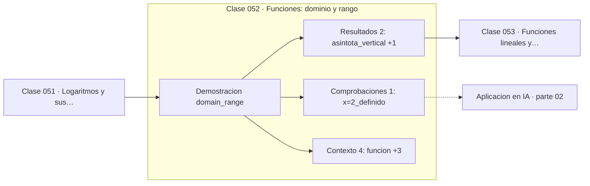

# 052 — Funciones: dominio y rango

> [⬅️ 051 Logaritmos y sus propiedades](../051-logaritmos-y-sus-propiedades/README.md) · [📚 Parte 02](../README.md) · [🏠 Programa](../../../README.md) · [053 Funciones lineales y pendiente ➡️](../053-funciones-lineales-y-pendiente/README.md)

**Parte:** 02 — Álgebra y funciones · **Nivel:** `basico` · **Horas estimadas:** 4
**Motor:** `engines.part02` · **Demostración:** `domain_range` · **Clase 12 de 20** de la parte

---

## 🎯 Propósito

**El dominio forma parte de la definición de una función: cambiarlo cambia la función.**

Manipulación simbólica con criterio y la función como objeto central: dominio, imagen, composición, inversa y familias lineal, cuadrática, exponencial y logarítmica.

## ✅ Resultados de aprendizaje

Al terminar podrás:

1. Explicar **Funciones: dominio y rango** con lenguaje cotidiano y con notación matemática.
2. Resolver un caso pequeño a mano y anticipar el orden de magnitud del resultado.
3. Ejecutar y modificar `lab.py`, que corre la demostración `domain_range`.
4. Interpretar las 7 salidas del laboratorio y decir qué comprueba cada una.
5. Detectar el error típico de esta parte: confundir función inversa con recíproco.

## 🧩 Fórmulas de la clase

```text
f(x) = 1/(x−2),  dominio ℝ \ {2},  imagen ℝ \ {0}
asíntota vertical en x = 2, horizontal en y = 0
```

## 🗺️ Ubicación en el programa



## 📖 Fundamentos

Una función es una terna: dominio, codominio y regla de asignación. Dos funciones con
la misma fórmula y distinto dominio son funciones **distintas**. Esa precisión, que
parece pedante, es la que evita evaluar una expresión fuera de donde tiene sentido —el
error de modelado más común— y la que hace que preguntas como «¿es invertible?» tengan
respuesta.

Determinar el dominio consiste en excluir lo que no está definido: denominadores nulos,
raíces pares de negativos, logaritmos de valores no positivos. La imagen es más
difícil: exige razonar sobre qué valores alcanza realmente la función, no solo cuáles
son plausibles.

Las asíntotas describen el comportamiento en las fronteras del dominio y en el
infinito. `1/(x−2)` tiene una asíntota vertical en 2 —donde el dominio se rompe— y una
horizontal en 0 —el valor al que tiende cuando x crece—. Ambas son, en el fondo,
límites, y la parte 07 las formalizará.

En implementación esto se traduce en una regla simple: **toda función debe declarar y
validar su dominio**. Un modelo que recibe una entrada fuera de su rango de validez no
falla ruidosamente: devuelve un número, y ese número no significa nada. La validación
de entradas es el equivalente en ingeniería de declarar el dominio.

## 🧮 Ejemplo trabajado

Analizar f(x) = 1/(x−2).

```text
Dominio: ℝ \ {2}         (el denominador se anula en x = 2)
Imagen:  ℝ \ {0}         (nunca vale 0: 1/algo ≠ 0)

valores:
  f(0)   = −0.5
  f(1.9) = −10.0         se dispara al acercarse por la izquierda
  f(2.1) =  10.0         y por la derecha, con signo opuesto
  f(5)   =  0.333

asíntota vertical:   x = 2
asíntota horizontal: y = 0
¿f(2) definido?      No
```

## 🔬 Qué ejecuta el laboratorio

`domain_range` — El dominio forma parte de la definición de la función.

| Grupo | Salidas |
|---|---|
| 🔢 Resultados numéricos (2) | `asintota_vertical`, `asintota_horizontal` |
| ✅ Comprobaciones de invariante (1) | `x=2_definido` |

Las claves booleanas no son adorno: si alguna fuera `False`, el resultado numérico
no sería fiable aunque el programa terminase sin error.

```bash
python classes/part-02-algebra-y-funciones/052-funciones-dominio-y-rango/lab.py
compmath run 052
```

> [!TIP]
> Antes de ejecutar, **escribe tu predicción**. Un laboratorio que confirma lo que
> esperabas enseña tanto como uno que te contradice, pero solo si la predicción
> existía antes del resultado.

## ⚠️ Errores conceptuales frecuentes

1. Evaluar una función fuera de su dominio y aceptar el resultado.
2. Confundir codominio (donde puede caer) con imagen (donde realmente cae).
3. Suponer que una función continua en su dominio no tiene asíntotas.

## 🚀 Dónde se usa de verdad

Validación de entradas, rango de validez de un modelo, dominio de una activación y
detección de valores fuera de distribución en inferencia.

## 🤖 Conexión con IA

Una red neuronal es una composición de funciones parametrizadas. La sigmoide, la softmax y la log-verosimilitud son álgebra de exponenciales y logaritmos.

## 📓 Notebooks

| Archivo | Para qué |
|---|---|
| [`notebook.ipynb`](notebook.ipynb) | recorrido guiado con la demostración ejecutada |
| [`notebook_student.ipynb`](notebook_student.ipynb) | versión con `TODO` para resolver |
| [`notebook_solution.ipynb`](notebook_solution.ipynb) | solución de referencia verificada |

## 📝 Evaluación

| Criterio | Peso |
|---|---:|
| Comprensión conceptual | 25 % |
| Resolución manual | 25 % |
| Implementación y verificación | 25 % |
| Interpretación y comunicación | 15 % |
| Conexión con aplicación real | 10 % |

Detalle y criterios de error crítico en [`assessment.md`](assessment.md).

## ❓ Preguntas de comprobación

1. ¿Cuál es la entrada, cuál la salida y qué unidades tienen?
2. ¿Qué operación domina el comportamiento del resultado?
3. ¿Qué caso extremo revelaría un error conceptual?
4. ¿Cómo verificarías el resultado por un método independiente?
5. ¿Dónde aparece esto en modelado de crecimiento?

Si necesitas releer el código para responderlas, la clase todavía no está superada.

## 📥 Entregable

`notebook_student.ipynb` resuelto más un párrafo que explique el resultado **sin citar
código**: qué entra, qué sale, qué invariante se comprueba y qué pasaría en un caso límite.

## 🔗 Referencias

- [Spivak, M. *Calculus*, 4ª ed., 2008, cap. 3](https://www.mathpop.com/calculus)
- [Gelfand, Glagoleva & Shnol. *Functions and Graphs*. Dover, 2002](https://store.doverpublications.com/products/9780486425641)

Bibliografía completa de la parte en [`../../../docs/BIBLIOGRAPHY.md`](../../../docs/BIBLIOGRAPHY.md).

## 📂 Material de la clase

[`intuition.md`](intuition.md) · [`theory.md`](theory.md) · [`derivation.md`](derivation.md) · [`exercises.md`](exercises.md) · [`assessment.md`](assessment.md) · [`where-is-this-used.md`](where-is-this-used.md) · [`lesson.yaml`](lesson.yaml)

---

> [⬅️ 051 Logaritmos y sus propiedades](../051-logaritmos-y-sus-propiedades/README.md) · [📚 Parte 02](../README.md) · [🏠 Programa](../../../README.md) · [053 Funciones lineales y pendiente ➡️](../053-funciones-lineales-y-pendiente/README.md)
