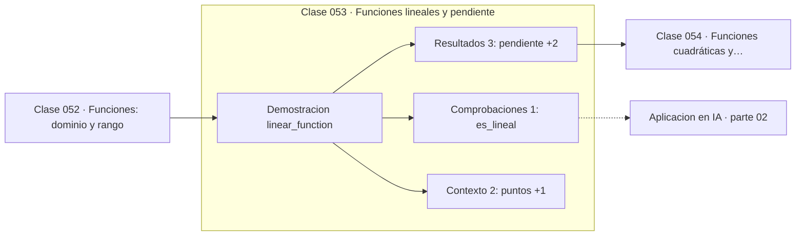

# 053 — Funciones lineales y pendiente

> [⬅️ 052 Funciones: dominio y rango](../052-funciones-dominio-y-rango/README.md) · [📚 Parte 02](../README.md) · [🏠 Programa](../../../README.md) · [054 Funciones cuadráticas y parábolas ➡️](../054-funciones-cuadraticas-y-parabolas/README.md)

**Parte:** 02 — Álgebra y funciones · **Nivel:** `basico` · **Horas estimadas:** 4
**Motor:** `engines.part02` · **Demostración:** `linear_function` · **Clase 13 de 20** de la parte

---

## 🎯 Propósito

**Una función lineal tiene razón de cambio constante; la pendiente es esa razón.**

Manipulación simbólica con criterio y la función como objeto central: dominio, imagen, composición, inversa y familias lineal, cuadrática, exponencial y logarítmica.

## ✅ Resultados de aprendizaje

Al terminar podrás:

1. Explicar **Funciones lineales y pendiente** con lenguaje cotidiano y con notación matemática.
2. Resolver un caso pequeño a mano y anticipar el orden de magnitud del resultado.
3. Ejecutar y modificar `lab.py`, que corre la demostración `linear_function`.
4. Interpretar las 6 salidas del laboratorio y decir qué comprueba cada una.
5. Detectar el error típico de esta parte: dividir por una expresión que puede anularse y perder soluciones.

## 🧩 Fórmulas de la clase

```text
y = mx + b
m = (y₂ − y₁)/(x₂ − x₁)
```

## 🗺️ Ubicación en el programa



## 📖 Fundamentos

La función lineal es el modelo más simple que no es constante, y por eso es la primera
hipótesis razonable ante cualquier conjunto de datos. Su propiedad definitoria es que
la razón de cambio es constante: aumentar x en una unidad siempre cambia y en `m`,
independientemente de dónde se esté.

Comprobar linealidad es directo: calcular la pendiente con dos puntos y verificar que
predice correctamente un tercero. Si no lo hace, la relación no es lineal, y conviene
saberlo antes de ajustar una recta. Esa comprobación es la versión elemental del
análisis de residuos que la parte 10 formaliza.

La pendiente es un **peso** en el sentido del machine learning: dice cuánto contribuye
la entrada a la salida. La generalización a varias entradas, `y = w₁x₁ + ... + wₙxₙ + b`,
es exactamente una capa lineal, y cada `wᵢ` es la pendiente parcial respecto a `xᵢ` —lo
que la parte 08 llamará derivada parcial—.

Una advertencia que el programa repetirá: casi ninguna relación real es lineal en todo
su rango. La linealidad es una **aproximación local**, y la parte 07 explicará por qué:
la derivada es precisamente la pendiente de la mejor recta que aproxima la función
cerca de un punto.

## 🧮 Ejemplo trabajado

Comprobar linealidad con tres puntos.

```text
puntos: (1, 5), (3, 11), (7, 23)

pendiente con los dos primeros:
  m = (11 − 5)/(3 − 1) = 6/2 = 3

intercepto:
  b = 5 − 3·1 = 2

modelo: y = 3x + 2

predicción del tercer punto:
  3·7 + 2 = 23     observado: 23     ✓  es lineal
```

Si el tercer punto hubiera sido (7, 30), el modelo lineal quedaría descartado con una
sola comprobación.

## 🔬 Qué ejecuta el laboratorio

`linear_function` — Pendiente como razón de cambio constante.

| Grupo | Salidas |
|---|---|
| 🔢 Resultados numéricos (3) | `pendiente`, `intercepto`, `predice_tercer_punto` |
| ✅ Comprobaciones de invariante (1) | `es_lineal` |

Las claves booleanas no son adorno: si alguna fuera `False`, el resultado numérico
no sería fiable aunque el programa terminase sin error.

```bash
python classes/part-02-algebra-y-funciones/053-funciones-lineales-y-pendiente/lab.py
compmath run 053
```

> [!TIP]
> Antes de ejecutar, **escribe tu predicción**. Un laboratorio que confirma lo que
> esperabas enseña tanto como uno que te contradice, pero solo si la predicción
> existía antes del resultado.

## ⚠️ Errores conceptuales frecuentes

1. Ajustar una recta sin comprobar antes que la relación es aproximadamente lineal.
2. Confundir pendiente con correlación: la pendiente tiene unidades, la correlación no.
3. Extrapolar un modelo lineal fuera del rango de los datos observados.

## 🚀 Dónde se usa de verdad

Regresión lineal (clase 282), capas densas (clase 110), tasas de cambio y cualquier
aproximación de primer orden. La derivada es la pendiente de la recta tangente.

## 🤖 Conexión con IA

Una red neuronal es una composición de funciones parametrizadas. La sigmoide, la softmax y la log-verosimilitud son álgebra de exponenciales y logaritmos.

## 📓 Notebooks

| Archivo | Para qué |
|---|---|
| [`notebook.ipynb`](notebook.ipynb) | recorrido guiado con la demostración ejecutada |
| [`notebook_student.ipynb`](notebook_student.ipynb) | versión con `TODO` para resolver |
| [`notebook_solution.ipynb`](notebook_solution.ipynb) | solución de referencia verificada |

## 📝 Evaluación

| Criterio | Peso |
|---|---:|
| Comprensión conceptual | 25 % |
| Resolución manual | 25 % |
| Implementación y verificación | 25 % |
| Interpretación y comunicación | 15 % |
| Conexión con aplicación real | 10 % |

Detalle y criterios de error crítico en [`assessment.md`](assessment.md).

## ❓ Preguntas de comprobación

1. ¿Cuál es la entrada, cuál la salida y qué unidades tienen?
2. ¿Qué operación domina el comportamiento del resultado?
3. ¿Qué caso extremo revelaría un error conceptual?
4. ¿Cómo verificarías el resultado por un método independiente?
5. ¿Dónde aparece esto en modelado de crecimiento?

Si necesitas releer el código para responderlas, la clase todavía no está superada.

## 📥 Entregable

`notebook_student.ipynb` resuelto más un párrafo que explique el resultado **sin citar
código**: qué entra, qué sale, qué invariante se comprueba y qué pasaría en un caso límite.

## 📚 Bibliografía de la clase

Esta clase enseña **Álgebra y funciones**. Cada obra dice qué aporta aquí y cómo se comprobó su localizador:

- [Stewart, J. *Precalculus*, 7ª ed., Cengage, 2015](https://www.cengage.com/c/precalculus-mathematics-for-calculus-7e-stewart/) — Álgebra y funciones: el tema de esta clase · URL de la fuente primaria, pendiente de resolver.
- [Strang, G. *Introduction to Linear Algebra*, 6ª ed., 2023](https://math.mit.edu/~gs/linearalgebra/) — Álgebra lineal: conexión declarada de esta parte · ISBN-13 `9781733146678` verificado en International ISBN Agency (2026-08-19).

Bibliografía de todas las clases, con el porqué de cada obra, en [`docs/BIBLIOGRAPHY.md`](../../../docs/BIBLIOGRAPHY.md) · localizador y estado de cada obra en [`sources/bibliography.json`](../../../sources/bibliography.json).

## 📂 Material de la clase

[`intuition.md`](intuition.md) · [`theory.md`](theory.md) · [`derivation.md`](derivation.md) · [`exercises.md`](exercises.md) · [`assessment.md`](assessment.md) · [`where-is-this-used.md`](where-is-this-used.md) · [`lesson.yaml`](lesson.yaml)

---

> [⬅️ 052 Funciones: dominio y rango](../052-funciones-dominio-y-rango/README.md) · [📚 Parte 02](../README.md) · [🏠 Programa](../../../README.md) · [054 Funciones cuadráticas y parábolas ➡️](../054-funciones-cuadraticas-y-parabolas/README.md)
