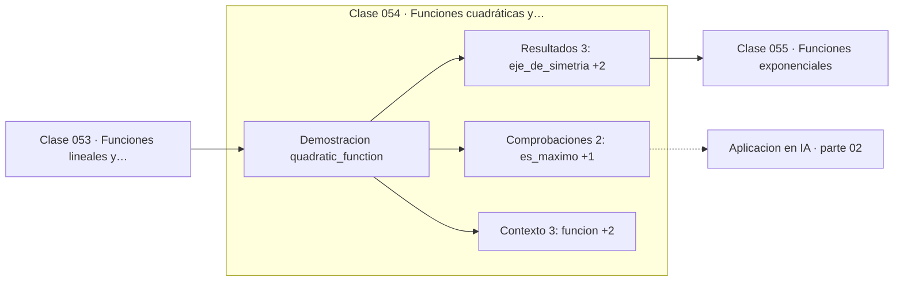

# 054 — Funciones cuadráticas y parábolas

> [⬅️ 053 Funciones lineales y pendiente](../053-funciones-lineales-y-pendiente/README.md) · [📚 Parte 02](../README.md) · [🏠 Programa](../../../README.md) · [055 Funciones exponenciales ➡️](../055-funciones-exponenciales/README.md)

**Parte:** 02 — Álgebra y funciones · **Nivel:** `basico` · **Horas estimadas:** 4
**Motor:** `engines.part02` · **Demostración:** `quadratic_function` · **Clase 14 de 20** de la parte

---

## 🎯 Propósito

**El signo del coeficiente principal decide la concavidad, y el vértice es el extremo.**

Manipulación simbólica con criterio y la función como objeto central: dominio, imagen, composición, inversa y familias lineal, cuadrática, exponencial y logarítmica.

## ✅ Resultados de aprendizaje

Al terminar podrás:

1. Explicar **Funciones cuadráticas y parábolas** con lenguaje cotidiano y con notación matemática.
2. Resolver un caso pequeño a mano y anticipar el orden de magnitud del resultado.
3. Ejecutar y modificar `lab.py`, que corre la demostración `quadratic_function`.
4. Interpretar las 8 salidas del laboratorio y decir qué comprueba cada una.
5. Detectar el error típico de esta parte: aplicar log a valores no positivos sin declarar el dominio.

## 🧩 Fórmulas de la clase

```text
f(x) = ax² + bx + c
xᵥ = −b/2a;  a > 0 ⟹ mínimo,  a < 0 ⟹ máximo
```

## 🗺️ Ubicación en el programa



## 📖 Fundamentos

La función cuadrática es el primer modelo con un extremo, y por eso es el ejemplo
canónico de optimización. Todo lo que la parte 12 hace con funciones complicadas se
puede visualizar aquí: hay un punto donde la derivada se anula, y el signo de la
curvatura decide si es mínimo o máximo.

La concavidad la determina `a`: positivo abre hacia arriba y el vértice es un mínimo;
negativo abre hacia abajo y es un máximo. En la parte 08 ese `a` se convertirá en el
Hessiano, y «positivo» en «definido positivo», pero la lógica es idéntica.

La simetría respecto al eje vertical `x = xᵥ` es una propiedad estructural: `f(xᵥ − h)`
y `f(xᵥ + h)` valen lo mismo para cualquier h. Comprobarlo numéricamente es una
verificación barata de que el vértice se calculó bien.

Las cuadráticas son además el problema modelo de la optimización numérica porque su
mínimo se conoce en forma cerrada. Toda la parte 12 usa `f(x,y) = x² + 20y²` como banco
de pruebas precisamente por eso: se puede medir exactamente cuánto se aleja cada
optimizador del óptimo conocido.

## 🧮 Ejemplo trabajado

Analizar f(x) = −x² + 6x − 5.

```text
a = −1 < 0  →  abre hacia abajo, el vértice es un MÁXIMO

xᵥ = −6/(2·(−1)) = 3
yᵥ = −9 + 18 − 5 = 4

Simetría (h = 2):
  f(1) = −1 + 6 − 5 = 0
  f(5) = −25 + 30 − 5 = 0     ✓  iguales

raíces: −x² + 6x − 5 = 0 → x = 1, x = 5
punto medio: (1+5)/2 = 3 = xᵥ   ✓
```

## 🔬 Qué ejecuta el laboratorio

`quadratic_function` — Vértice, eje de simetría y concavidad.

| Grupo | Salidas |
|---|---|
| 🔢 Resultados numéricos (3) | `eje_de_simetria`, `f(xv-2)`, `f(xv+2)` |
| ✅ Comprobaciones de invariante (2) | `es_maximo`, `simetria_verificada` |

Las claves booleanas no son adorno: si alguna fuera `False`, el resultado numérico
no sería fiable aunque el programa terminase sin error.

```bash
python classes/part-02-algebra-y-funciones/054-funciones-cuadraticas-y-parabolas/lab.py
compmath run 054
```

> [!TIP]
> Antes de ejecutar, **escribe tu predicción**. Un laboratorio que confirma lo que
> esperabas enseña tanto como uno que te contradice, pero solo si la predicción
> existía antes del resultado.

## ⚠️ Errores conceptuales frecuentes

1. Suponer que el vértice es siempre un mínimo.
2. Calcular xᵥ como b/2a en lugar de −b/2a.
3. Confundir el vértice (punto) con el valor extremo (ordenada del vértice).

## 🚀 Dónde se usa de verdad

Optimización cuadrática, ajuste por mínimos cuadrados, trayectorias balísticas y
aproximación de segundo orden de cualquier función suave (Taylor, clase 151).

## 🤖 Conexión con IA

Una red neuronal es una composición de funciones parametrizadas. La sigmoide, la softmax y la log-verosimilitud son álgebra de exponenciales y logaritmos.

## 📓 Notebooks

| Archivo | Para qué |
|---|---|
| [`notebook.ipynb`](notebook.ipynb) | recorrido guiado con la demostración ejecutada |
| [`notebook_student.ipynb`](notebook_student.ipynb) | versión con `TODO` para resolver |
| [`notebook_solution.ipynb`](notebook_solution.ipynb) | solución de referencia verificada |

## 📝 Evaluación

| Criterio | Peso |
|---|---:|
| Comprensión conceptual | 25 % |
| Resolución manual | 25 % |
| Implementación y verificación | 25 % |
| Interpretación y comunicación | 15 % |
| Conexión con aplicación real | 10 % |

Detalle y criterios de error crítico en [`assessment.md`](assessment.md).

## ❓ Preguntas de comprobación

1. ¿Cuál es la entrada, cuál la salida y qué unidades tienen?
2. ¿Qué operación domina el comportamiento del resultado?
3. ¿Qué caso extremo revelaría un error conceptual?
4. ¿Cómo verificarías el resultado por un método independiente?
5. ¿Dónde aparece esto en modelado de crecimiento?

Si necesitas releer el código para responderlas, la clase todavía no está superada.

## 📥 Entregable

`notebook_student.ipynb` resuelto más un párrafo que explique el resultado **sin citar
código**: qué entra, qué sale, qué invariante se comprueba y qué pasaría en un caso límite.

## 🔗 Referencias

- [Nocedal & Wright. *Numerical Optimization*, 2ª ed., Springer, 2006, cap. 2](https://link.springer.com/book/10.1007/978-0-387-40065-5)
- [Stewart, J. *Precalculus*, 7ª ed., Cengage, 2015](https://www.cengage.com/c/precalculus-mathematics-for-calculus-7e-stewart/)

Bibliografía completa de la parte en [`../../../docs/BIBLIOGRAPHY.md`](../../../docs/BIBLIOGRAPHY.md).

## 📂 Material de la clase

[`intuition.md`](intuition.md) · [`theory.md`](theory.md) · [`derivation.md`](derivation.md) · [`exercises.md`](exercises.md) · [`assessment.md`](assessment.md) · [`where-is-this-used.md`](where-is-this-used.md) · [`lesson.yaml`](lesson.yaml)

---

> [⬅️ 053 Funciones lineales y pendiente](../053-funciones-lineales-y-pendiente/README.md) · [📚 Parte 02](../README.md) · [🏠 Programa](../../../README.md) · [055 Funciones exponenciales ➡️](../055-funciones-exponenciales/README.md)
