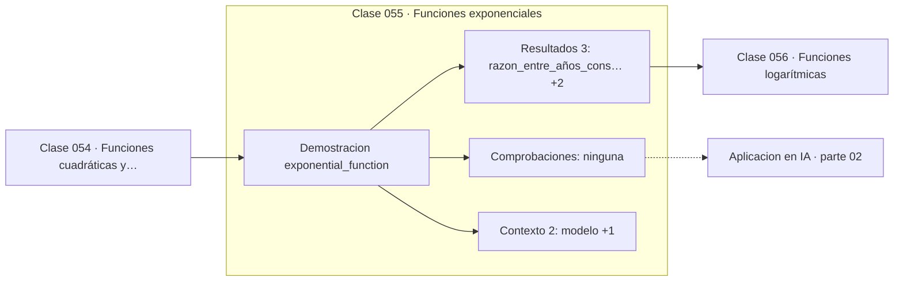

# 055 — Funciones exponenciales

> [⬅️ 054 Funciones cuadráticas y parábolas](../054-funciones-cuadraticas-y-parabolas/README.md) · [📚 Parte 02](../README.md) · [🏠 Programa](../../../README.md) · [056 Funciones logarítmicas ➡️](../056-funciones-logaritmicas/README.md)

**Parte:** 02 — Álgebra y funciones · **Nivel:** `basico` · **Horas estimadas:** 4
**Motor:** `engines.part02` · **Demostración:** `exponential_function` · **Clase 15 de 20** de la parte

---

## 🎯 Propósito

**El crecimiento exponencial tiene razón constante, no diferencia constante.**

Manipulación simbólica con criterio y la función como objeto central: dominio, imagen, composición, inversa y familias lineal, cuadrática, exponencial y logarítmica.

## ✅ Resultados de aprendizaje

Al terminar podrás:

1. Explicar **Funciones exponenciales** con lenguaje cotidiano y con notación matemática.
2. Resolver un caso pequeño a mano y anticipar el orden de magnitud del resultado.
3. Ejecutar y modificar `lab.py`, que corre la demostración `exponential_function`.
4. Interpretar las 5 salidas del laboratorio y decir qué comprueba cada una.
5. Detectar el error típico de esta parte: confundir función inversa con recíproco.

## 🧩 Fórmulas de la clase

```text
P(t) = P₀·bᵗ
tiempo de duplicación = ln 2 / ln b
regla del 72: t ≈ 72 / (porcentaje anual)
```

## 🗺️ Ubicación en el programa



## 📖 Fundamentos

La diferencia entre crecimiento lineal y exponencial es la diferencia entre sumar y
multiplicar una cantidad fija en cada periodo. Es fácil de enunciar y difícil de
intuir: la intuición humana es lineal, y por eso las predicciones sobre procesos
exponenciales —epidemias, interés compuesto, capacidad de cómputo— fallan
sistemáticamente por defecto.

El indicador más útil es el **tiempo de duplicación**: cuánto tarda la cantidad en
multiplicarse por dos. Se obtiene de `ln 2 / ln b` y no depende del valor inicial, lo
que lo convierte en una propiedad del proceso. La «regla del 72» es su aproximación
mental: dividir 72 entre el porcentaje anual da los años aproximados.

Todo crecimiento exponencial real termina saturándose, porque los recursos son finitos.
El modelo exponencial es válido en la fase inicial y deja de serlo después; el modelo
logístico describe la transición. Aplicar un exponencial fuera de su fase de validez
produce predicciones absurdas, y ese es el error de modelado más citado en divulgación
científica.

En machine learning el crecimiento exponencial aparece en el decaimiento del learning
rate, en las medias móviles exponenciales de Adam (clase 250) y en el término `e^z` de
la softmax, cuyo desbordamiento obliga a restar el máximo (clase 321).

## 🧮 Ejemplo trabajado

Población que crece un 8 % anual desde un millón.

```text
P(t) = 10⁶ · 1.08ᵗ

t = 0     1 000 000
t = 5     1 469 328
t = 10    2 158 925
t = 20    4 660 957

razón entre años consecutivos: P(6)/P(5) = 1.08   (constante) ✓

tiempo de duplicación: ln 2 / ln 1.08 = 0.6931/0.07696 = 9.006 años
regla del 72:          72/8 = 9 años                      ✓ aproximación
```

## 🔬 Qué ejecuta el laboratorio

`exponential_function` — Crecimiento exponencial: razón constante, no diferencia constante.

| Grupo | Salidas |
|---|---|
| 🔢 Resultados numéricos (3) | `razon_entre_años_consecutivos`, `tiempo_de_duplicacion`, `regla_del_72_aproximada` |
| ✅ Comprobaciones de invariante (0) | — |

Las claves booleanas no son adorno: si alguna fuera `False`, el resultado numérico
no sería fiable aunque el programa terminase sin error.

```bash
python classes/part-02-algebra-y-funciones/055-funciones-exponenciales/lab.py
compmath run 055
```

> [!TIP]
> Antes de ejecutar, **escribe tu predicción**. Un laboratorio que confirma lo que
> esperabas enseña tanto como uno que te contradice, pero solo si la predicción
> existía antes del resultado.

## ⚠️ Errores conceptuales frecuentes

1. Modelar como lineal un proceso con razón constante.
2. Extrapolar un exponencial más allá de su fase de validez.
3. Confundir la razón (multiplicativa) con la diferencia (aditiva) entre periodos.

## 🚀 Dónde se usa de verdad

Interés compuesto, crecimiento de usuarios, propagación epidémica, decaimiento del
learning rate y medias móviles exponenciales de los optimizadores.

## 🤖 Conexión con IA

Una red neuronal es una composición de funciones parametrizadas. La sigmoide, la softmax y la log-verosimilitud son álgebra de exponenciales y logaritmos.

## 📓 Notebooks

| Archivo | Para qué |
|---|---|
| [`notebook.ipynb`](notebook.ipynb) | recorrido guiado con la demostración ejecutada |
| [`notebook_student.ipynb`](notebook_student.ipynb) | versión con `TODO` para resolver |
| [`notebook_solution.ipynb`](notebook_solution.ipynb) | solución de referencia verificada |

## 📝 Evaluación

| Criterio | Peso |
|---|---:|
| Comprensión conceptual | 25 % |
| Resolución manual | 25 % |
| Implementación y verificación | 25 % |
| Interpretación y comunicación | 15 % |
| Conexión con aplicación real | 10 % |

Detalle y criterios de error crítico en [`assessment.md`](assessment.md).

## ❓ Preguntas de comprobación

1. ¿Cuál es la entrada, cuál la salida y qué unidades tienen?
2. ¿Qué operación domina el comportamiento del resultado?
3. ¿Qué caso extremo revelaría un error conceptual?
4. ¿Cómo verificarías el resultado por un método independiente?
5. ¿Dónde aparece esto en modelado de crecimiento?

Si necesitas releer el código para responderlas, la clase todavía no está superada.

## 📥 Entregable

`notebook_student.ipynb` resuelto más un párrafo que explique el resultado **sin citar
código**: qué entra, qué sale, qué invariante se comprueba y qué pasaría en un caso límite.

## 🔗 Referencias

- [Stewart, J. *Precalculus*, 7ª ed., Cengage, 2015](https://www.cengage.com/c/precalculus-mathematics-for-calculus-7e-stewart/)
- [Bartlett, A. *Arithmetic, Population and Energy* (conferencia sobre crecimiento exponencial)](https://www.albartlett.org/presentations/arithmetic_population_energy.html)

Bibliografía completa de la parte en [`../../../docs/BIBLIOGRAPHY.md`](../../../docs/BIBLIOGRAPHY.md).

## 📂 Material de la clase

[`intuition.md`](intuition.md) · [`theory.md`](theory.md) · [`derivation.md`](derivation.md) · [`exercises.md`](exercises.md) · [`assessment.md`](assessment.md) · [`where-is-this-used.md`](where-is-this-used.md) · [`lesson.yaml`](lesson.yaml)

---

> [⬅️ 054 Funciones cuadráticas y parábolas](../054-funciones-cuadraticas-y-parabolas/README.md) · [📚 Parte 02](../README.md) · [🏠 Programa](../../../README.md) · [056 Funciones logarítmicas ➡️](../056-funciones-logaritmicas/README.md)
