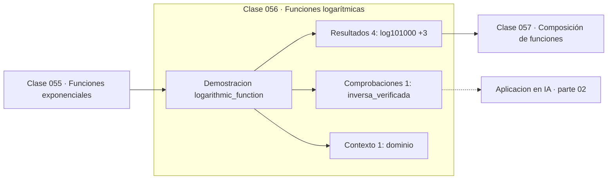

# 056 — Funciones logarítmicas

> [⬅️ 055 Funciones exponenciales](../055-funciones-exponenciales/README.md) · [📚 Parte 02](../README.md) · [🏠 Programa](../../../README.md) · [057 Composición de funciones ➡️](../057-composicion-de-funciones/README.md)

**Parte:** 02 — Álgebra y funciones · **Nivel:** `basico` · **Horas estimadas:** 4
**Motor:** `engines.part02` · **Demostración:** `logarithmic_function` · **Clase 16 de 20** de la parte

---

## 🎯 Propósito

**El logaritmo es la inversa de la exponencial y convierte factores en distancias iguales.**

Manipulación simbólica con criterio y la función como objeto central: dominio, imagen, composición, inversa y familias lineal, cuadrática, exponencial y logarítmica.

## ✅ Resultados de aprendizaje

Al terminar podrás:

1. Explicar **Funciones logarítmicas** con lenguaje cotidiano y con notación matemática.
2. Resolver un caso pequeño a mano y anticipar el orden de magnitud del resultado.
3. Ejecutar y modificar `lab.py`, que corre la demostración `logarithmic_function`.
4. Interpretar las 6 salidas del laboratorio y decir qué comprueba cada una.
5. Detectar el error típico de esta parte: dividir por una expresión que puede anularse y perder soluciones.

## 🧩 Fórmulas de la clase

```text
y = log_b(x)  ⟺  x = bʸ
escala logarítmica: distancias iguales ⟹ factores iguales
```

## 🗺️ Ubicación en el programa



## 📖 Fundamentos

La función logarítmica deshace la exponencial, y esa relación de inversa es lo que la
hace útil: convierte una pregunta sobre crecimiento («¿cuánto tarda en multiplicarse
por 10?») en una pregunta sobre suma. Su crecimiento es extraordinariamente lento —de
10³ a 10⁶ el logaritmo decimal solo sube 3— y por eso comprime rangos enormes.

La escala logarítmica es la aplicación práctica más visible. En un eje logarítmico, una
exponencial se ve como una recta, lo que permite identificar el modelo a simple vista y
leer la tasa como pendiente. Los decibelios, el pH, la escala de magnitud sísmica y las
curvas de aprendizaje de los modelos usan esa propiedad.

El dominio es `x > 0`, sin excepciones: no hay ningún exponente al que elevar una base
positiva para obtener un número negativo. `log(0)` tiende a `−inf`, y ese es el motivo
técnico por el que toda implementación de entropía o cross-entropy protege el argumento
con un epsilon (clase 263).

En las leyes de escala de los modelos de lenguaje (clase 359), la relación entre
pérdida y número de parámetros es una ley de potencia, que en escala log-log es una
recta cuya pendiente es el exponente. Leer esas gráficas exige entender esta clase.

## 🧮 Ejemplo trabajado

Logaritmo como inversa y como escala.

```text
log₁₀(1000) = 3       porque 10³ = 1000
10^log₁₀(1000) = 1000                    ✓ inversa verificada

Escala: de 10³ a 10⁶ hay un factor 1000
  log₁₀(10⁶) − log₁₀(10³) = 6 − 3 = 3
  tres unidades en el eje = tres órdenes de magnitud

Decibelios: 10·log₁₀(10⁻³) = −30 dB

Dominio: x > 0.  log(0) → −inf,  log(−1) no existe en ℝ
```

## 🔬 Qué ejecuta el laboratorio

`logarithmic_function` — El logaritmo como inversa de la exponencial y como escala.

| Grupo | Salidas |
|---|---|
| 🔢 Resultados numéricos (4) | `log10(1000)`, `10^3`, `escala_decibel_de_1e-3`, `crecimiento_de_log_entre_1e3_y_1e6` |
| ✅ Comprobaciones de invariante (1) | `inversa_verificada` |

Las claves booleanas no son adorno: si alguna fuera `False`, el resultado numérico
no sería fiable aunque el programa terminase sin error.

```bash
python classes/part-02-algebra-y-funciones/056-funciones-logaritmicas/lab.py
compmath run 056
```

> [!TIP]
> Antes de ejecutar, **escribe tu predicción**. Un laboratorio que confirma lo que
> esperabas enseña tanto como uno que te contradice, pero solo si la predicción
> existía antes del resultado.

## ⚠️ Errores conceptuales frecuentes

1. Aplicar logaritmo a cero o a valores negativos sin protección.
2. Leer una gráfica logarítmica como si fuera lineal.
3. Confundir log natural, log₁₀ y log₂ al comparar resultados (entropía en nats vs bits).

## 🚀 Dónde se usa de verdad

Escalas de medida, visualización de rangos amplios, log-verosimilitud, entropía,
perplejidad y lectura de leyes de escala en log-log.

## 🤖 Conexión con IA

Una red neuronal es una composición de funciones parametrizadas. La sigmoide, la softmax y la log-verosimilitud son álgebra de exponenciales y logaritmos.

## 📓 Notebooks

| Archivo | Para qué |
|---|---|
| [`notebook.ipynb`](notebook.ipynb) | recorrido guiado con la demostración ejecutada |
| [`notebook_student.ipynb`](notebook_student.ipynb) | versión con `TODO` para resolver |
| [`notebook_solution.ipynb`](notebook_solution.ipynb) | solución de referencia verificada |

## 📝 Evaluación

| Criterio | Peso |
|---|---:|
| Comprensión conceptual | 25 % |
| Resolución manual | 25 % |
| Implementación y verificación | 25 % |
| Interpretación y comunicación | 15 % |
| Conexión con aplicación real | 10 % |

Detalle y criterios de error crítico en [`assessment.md`](assessment.md).

## ❓ Preguntas de comprobación

1. ¿Cuál es la entrada, cuál la salida y qué unidades tienen?
2. ¿Qué operación domina el comportamiento del resultado?
3. ¿Qué caso extremo revelaría un error conceptual?
4. ¿Cómo verificarías el resultado por un método independiente?
5. ¿Dónde aparece esto en modelado de crecimiento?

Si necesitas releer el código para responderlas, la clase todavía no está superada.

## 📥 Entregable

`notebook_student.ipynb` resuelto más un párrafo que explique el resultado **sin citar
código**: qué entra, qué sale, qué invariante se comprueba y qué pasaría en un caso límite.

## 🔗 Referencias

- [Python: `math.log` y variantes](https://docs.python.org/3/library/math.html#math.log)
- [Cover & Thomas. *Elements of Information Theory*, 2ª ed., Wiley, 2006](https://onlinelibrary.wiley.com/doi/book/10.1002/047174882X)

Bibliografía completa de la parte en [`../../../docs/BIBLIOGRAPHY.md`](../../../docs/BIBLIOGRAPHY.md).

## 📂 Material de la clase

[`intuition.md`](intuition.md) · [`theory.md`](theory.md) · [`derivation.md`](derivation.md) · [`exercises.md`](exercises.md) · [`assessment.md`](assessment.md) · [`where-is-this-used.md`](where-is-this-used.md) · [`lesson.yaml`](lesson.yaml)

---

> [⬅️ 055 Funciones exponenciales](../055-funciones-exponenciales/README.md) · [📚 Parte 02](../README.md) · [🏠 Programa](../../../README.md) · [057 Composición de funciones ➡️](../057-composicion-de-funciones/README.md)
