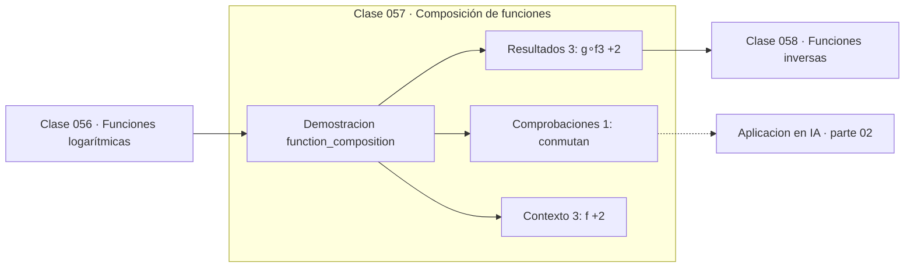

# 057 — Composición de funciones

> [⬅️ 056 Funciones logarítmicas](../056-funciones-logaritmicas/README.md) · [📚 Parte 02](../README.md) · [🏠 Programa](../../../README.md) · [058 Funciones inversas ➡️](../058-funciones-inversas/README.md)

**Parte:** 02 — Álgebra y funciones · **Nivel:** `basico` · **Horas estimadas:** 4
**Motor:** `engines.part02` · **Demostración:** `function_composition` · **Clase 17 de 20** de la parte

---

## 🎯 Propósito

**La composición aplica funciones en cadena y no es conmutativa: (g∘f) ≠ (f∘g).**

Manipulación simbólica con criterio y la función como objeto central: dominio, imagen, composición, inversa y familias lineal, cuadrática, exponencial y logarítmica.

## ✅ Resultados de aprendizaje

Al terminar podrás:

1. Explicar **Composición de funciones** con lenguaje cotidiano y con notación matemática.
2. Resolver un caso pequeño a mano y anticipar el orden de magnitud del resultado.
3. Ejecutar y modificar `lab.py`, que corre la demostración `function_composition`.
4. Interpretar las 7 salidas del laboratorio y decir qué comprueba cada una.
5. Detectar el error típico de esta parte: aplicar log a valores no positivos sin declarar el dominio.

## 🧩 Fórmulas de la clase

```text
(g∘f)(x) = g(f(x))
dominio de g∘f: {x ∈ dom f : f(x) ∈ dom g}
```

## 🗺️ Ubicación en el programa



## 📖 Fundamentos

Componer es encadenar: la salida de una función entra en la siguiente. El orden importa
y casi nunca conmuta, hecho que se comprueba con un solo ejemplo numérico. Leer
`(g∘f)(x)` correctamente —primero f, luego g, aunque g esté escrita a la izquierda— es
una de las causas frecuentes de error al trasladar fórmulas.

El dominio de la composición no es el dominio de f: hay que exigir además que `f(x)`
caiga dentro del dominio de g. Si `g` es un logaritmo, hay que garantizar que `f(x) > 0`.
Este detalle es la fuente de los `NaN` que aparecen cuando una activación produce
valores fuera del dominio de la siguiente capa.

Y aquí está la idea que conecta esta parte con todo el resto del programa: **una red
neuronal es una composición de funciones parametrizadas**. `f(x) = f_L(...f_2(f_1(x)))`,
donde cada `f_i` es «transformación lineal seguida de no linealidad». Nada más. La
profundidad de una red es la longitud de esa cadena.

La consecuencia inmediata, que la clase 302 hará explícita: si todas las `f_i` fueran
lineales, su composición sería lineal, y apilar capas no aportaría nada. La no
linealidad entre capas es lo que hace que la composición sea más expresiva que sus
partes. Y derivar una composición es exactamente la regla de la cadena (clase 147).

## 🧮 Ejemplo trabajado

Componer f(x) = 2x + 1 con g(x) = x².

```text
(g∘f)(3) = g(f(3)) = g(7)  = 49
(f∘g)(3) = f(g(3)) = f(9)  = 19
¿conmutan?  No     49 ≠ 19

Cadena de tres:
  f(g(f(3))) = f(g(7)) = f(49) = 99

Analogía directa:
  red neuronal = f_L(...f_2(f_1(x)))
  cada f_i = no_linealidad(W_i · entrada + b_i)
```

## 🔬 Qué ejecuta el laboratorio

`function_composition` — (g∘f) no es (f∘g): la composición no conmuta.

| Grupo | Salidas |
|---|---|
| 🔢 Resultados numéricos (3) | `(g∘f)(3)`, `(f∘g)(3)`, `cadena_de_3` |
| ✅ Comprobaciones de invariante (1) | `conmutan` |

Las claves booleanas no son adorno: si alguna fuera `False`, el resultado numérico
no sería fiable aunque el programa terminase sin error.

```bash
python classes/part-02-algebra-y-funciones/057-composicion-de-funciones/lab.py
compmath run 057
```

> [!TIP]
> Antes de ejecutar, **escribe tu predicción**. Un laboratorio que confirma lo que
> esperabas enseña tanto como uno que te contradice, pero solo si la predicción
> existía antes del resultado.

## ⚠️ Errores conceptuales frecuentes

1. Leer (g∘f) como «primero g»: se aplica f primero.
2. Olvidar restringir el dominio para que f(x) caiga en el dominio de g.
3. Suponer que la composición conmuta.

## 🚀 Dónde se usa de verdad

Arquitectura de redes neuronales, pipelines de transformación de datos, cambio de
variable en integración (clase 157) y la regla de la cadena.

## 🤖 Conexión con IA

Una red neuronal es una composición de funciones parametrizadas. La sigmoide, la softmax y la log-verosimilitud son álgebra de exponenciales y logaritmos.

## 📓 Notebooks

| Archivo | Para qué |
|---|---|
| [`notebook.ipynb`](notebook.ipynb) | recorrido guiado con la demostración ejecutada |
| [`notebook_student.ipynb`](notebook_student.ipynb) | versión con `TODO` para resolver |
| [`notebook_solution.ipynb`](notebook_solution.ipynb) | solución de referencia verificada |

## 📝 Evaluación

| Criterio | Peso |
|---|---:|
| Comprensión conceptual | 25 % |
| Resolución manual | 25 % |
| Implementación y verificación | 25 % |
| Interpretación y comunicación | 15 % |
| Conexión con aplicación real | 10 % |

Detalle y criterios de error crítico en [`assessment.md`](assessment.md).

## ❓ Preguntas de comprobación

1. ¿Cuál es la entrada, cuál la salida y qué unidades tienen?
2. ¿Qué operación domina el comportamiento del resultado?
3. ¿Qué caso extremo revelaría un error conceptual?
4. ¿Cómo verificarías el resultado por un método independiente?
5. ¿Dónde aparece esto en modelado de crecimiento?

Si necesitas releer el código para responderlas, la clase todavía no está superada.

## 📥 Entregable

`notebook_student.ipynb` resuelto más un párrafo que explique el resultado **sin citar
código**: qué entra, qué sale, qué invariante se comprueba y qué pasaría en un caso límite.

## 🔗 Referencias

- [Goodfellow, Bengio & Courville. *Deep Learning*. MIT Press, 2016, cap. 6](https://www.deeplearningbook.org/) — *uso:* obra de referencia consultada en «Composición de funciones».
- [Spivak, M. *Calculus*, 4ª ed., 2008](https://www.mathpop.com/calculus) — *uso:* exposición alternativa del tema en «Composición de funciones».

Bibliografía completa de la parte en [`../../../docs/BIBLIOGRAPHY.md`](../../../docs/BIBLIOGRAPHY.md) · localizador verificable de cada obra en [`sources/bibliography.json`](../../../sources/bibliography.json).

## 📂 Material de la clase

[`intuition.md`](intuition.md) · [`theory.md`](theory.md) · [`derivation.md`](derivation.md) · [`exercises.md`](exercises.md) · [`assessment.md`](assessment.md) · [`where-is-this-used.md`](where-is-this-used.md) · [`lesson.yaml`](lesson.yaml)

---

> [⬅️ 056 Funciones logarítmicas](../056-funciones-logaritmicas/README.md) · [📚 Parte 02](../README.md) · [🏠 Programa](../../../README.md) · [058 Funciones inversas ➡️](../058-funciones-inversas/README.md)
