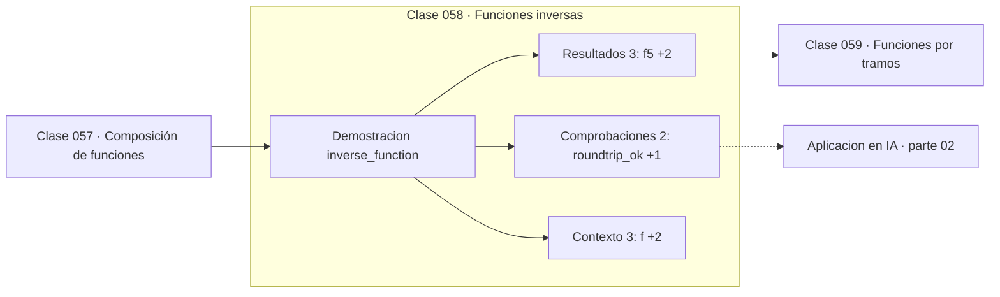

# 058 — Funciones inversas

> [⬅️ 057 Composición de funciones](../057-composicion-de-funciones/README.md) · [📚 Parte 02](../README.md) · [🏠 Programa](../../../README.md) · [059 Funciones por tramos ➡️](../059-funciones-por-tramos/README.md)

**Parte:** 02 — Álgebra y funciones · **Nivel:** `basico` · **Horas estimadas:** 4
**Motor:** `engines.part02` · **Demostración:** `inverse_function` · **Clase 18 de 20** de la parte

---

## 🎯 Propósito

**La inversa deshace la función y existe solo si es inyectiva; no es el recíproco 1/f.**

Manipulación simbólica con criterio y la función como objeto central: dominio, imagen, composición, inversa y familias lineal, cuadrática, exponencial y logarítmica.

## ✅ Resultados de aprendizaje

Al terminar podrás:

1. Explicar **Funciones inversas** con lenguaje cotidiano y con notación matemática.
2. Resolver un caso pequeño a mano y anticipar el orden de magnitud del resultado.
3. Ejecutar y modificar `lab.py`, que corre la demostración `inverse_function`.
4. Interpretar las 8 salidas del laboratorio y decir qué comprueba cada una.
5. Detectar el error típico de esta parte: confundir función inversa con recíproco.

## 🧩 Fórmulas de la clase

```text
f⁻¹(f(x)) = x  para todo x del dominio
f inyectiva ⟺ f(a) = f(b) ⟹ a = b
```

## 🗺️ Ubicación en el programa



## 📖 Fundamentos

La función inversa deshace lo que la original hizo. Para que exista, la función debe
ser **inyectiva**: dos entradas distintas no pueden dar la misma salida, porque de lo
contrario la inversa no sabría a cuál volver. `f(x) = x²` no es invertible en todo ℝ
—2 y −2 dan lo mismo— pero sí lo es restringida a `x ≥ 0`, y esa restricción es la que
define la raíz cuadrada.

La notación `f⁻¹` es desafortunada porque se parece a `f⁻¹ = 1/f`, y **no lo es**. Para
`f(x) = 3x − 4`, la inversa es `(y+4)/3` y el recíproco es `1/(3x−4)`. Son funciones
completamente distintas y confundirlas es un error clásico.

Gráficamente, la inversa es la reflexión respecto a la recta `y = x`, lo que da una
forma visual de comprobar si existe: si alguna recta horizontal corta la gráfica más de
una vez, la función no es inyectiva y no tiene inversa global.

En machine learning las inversas aparecen en los *normalizing flows*, que exigen
transformaciones invertibles con jacobiano calculable, y en toda transformación de
datos que deba deshacerse para interpretar una predicción en las unidades originales
(desestandarizar).

## 🧮 Ejemplo trabajado

Inversa de f(x) = 3x − 4 y contraste con el recíproco.

```text
Despejar:  y = 3x − 4  →  x = (y + 4)/3
f⁻¹(y) = (y + 4)/3

Comprobación en x = 5:
  f(5) = 11
  f⁻¹(11) = (11 + 4)/3 = 5      ✓ roundtrip

Recíproco (COSA DISTINTA):
  1/f(5) = 1/11 = 0.0909

¿f⁻¹ = 1/f?   No.

Condición: f debe ser inyectiva. 3x − 4 lo es en todo ℝ.
```

## 🔬 Qué ejecuta el laboratorio

`inverse_function` — Inversa frente a recíproco: dos objetos distintos.

| Grupo | Salidas |
|---|---|
| 🔢 Resultados numéricos (3) | `f(5)`, `f_inv(f(5))`, `reciproco_1/f(5)` |
| ✅ Comprobaciones de invariante (2) | `roundtrip_ok`, `inversa_es_reciproco` |

Las claves booleanas no son adorno: si alguna fuera `False`, el resultado numérico
no sería fiable aunque el programa terminase sin error.

```bash
python classes/part-02-algebra-y-funciones/058-funciones-inversas/lab.py
compmath run 058
```

> [!TIP]
> Antes de ejecutar, **escribe tu predicción**. Un laboratorio que confirma lo que
> esperabas enseña tanto como uno que te contradice, pero solo si la predicción
> existía antes del resultado.

## ⚠️ Errores conceptuales frecuentes

1. Confundir la inversa f⁻¹ con el recíproco 1/f.
2. Invertir una función sin comprobar que es inyectiva.
3. Olvidar restringir el dominio para que la inversa exista (raíz cuadrada).

## 🚀 Dónde se usa de verdad

Desestandarizar predicciones, normalizing flows, cambio de variable en probabilidad
(con su jacobiano) y la relación entre exponencial y logaritmo.

## 🤖 Conexión con IA

Una red neuronal es una composición de funciones parametrizadas. La sigmoide, la softmax y la log-verosimilitud son álgebra de exponenciales y logaritmos.

## 📓 Notebooks

| Archivo | Para qué |
|---|---|
| [`notebook.ipynb`](notebook.ipynb) | recorrido guiado con la demostración ejecutada |
| [`notebook_student.ipynb`](notebook_student.ipynb) | versión con `TODO` para resolver |
| [`notebook_solution.ipynb`](notebook_solution.ipynb) | solución de referencia verificada |

## 📝 Evaluación

| Criterio | Peso |
|---|---:|
| Comprensión conceptual | 25 % |
| Resolución manual | 25 % |
| Implementación y verificación | 25 % |
| Interpretación y comunicación | 15 % |
| Conexión con aplicación real | 10 % |

Detalle y criterios de error crítico en [`assessment.md`](assessment.md).

## ❓ Preguntas de comprobación

1. ¿Cuál es la entrada, cuál la salida y qué unidades tienen?
2. ¿Qué operación domina el comportamiento del resultado?
3. ¿Qué caso extremo revelaría un error conceptual?
4. ¿Cómo verificarías el resultado por un método independiente?
5. ¿Dónde aparece esto en modelado de crecimiento?

Si necesitas releer el código para responderlas, la clase todavía no está superada.

## 📥 Entregable

`notebook_student.ipynb` resuelto más un párrafo que explique el resultado **sin citar
código**: qué entra, qué sale, qué invariante se comprueba y qué pasaría en un caso límite.

## 📚 Bibliografía de la clase

Esta clase enseña **Álgebra y funciones · Cálculo**. Cada obra dice qué aporta aquí y cómo se comprobó su localizador:

- [Spivak, M. *Calculus*, 4ª ed., 2008, cap. 12](https://www.mathpop.com/calculus) — Cálculo: el tema de esta clase · ISBN-13 `9780914098911` verificado en International ISBN Agency (2026-08-19).
- [Papamakarios, G. et al. *Normalizing Flows for Probabilistic Modeling and Inference*. JMLR, 2021](https://jmlr.org/papers/v22/19-1028.html) — Deep learning y Modelos generativos y Probabilidad: conexión declarada de esta parte · URL de la fuente primaria comprobada en Journal of Machine Learning Research (2026-08-19).

Bibliografía de todas las clases, con el porqué de cada obra, en [`docs/BIBLIOGRAPHY.md`](../../../docs/BIBLIOGRAPHY.md) · localizador y estado de cada obra en [`sources/bibliography.json`](../../../sources/bibliography.json).

## 📂 Material de la clase

[`intuition.md`](intuition.md) · [`theory.md`](theory.md) · [`derivation.md`](derivation.md) · [`exercises.md`](exercises.md) · [`assessment.md`](assessment.md) · [`where-is-this-used.md`](where-is-this-used.md) · [`lesson.yaml`](lesson.yaml)

---

> [⬅️ 057 Composición de funciones](../057-composicion-de-funciones/README.md) · [📚 Parte 02](../README.md) · [🏠 Programa](../../../README.md) · [059 Funciones por tramos ➡️](../059-funciones-por-tramos/README.md)
