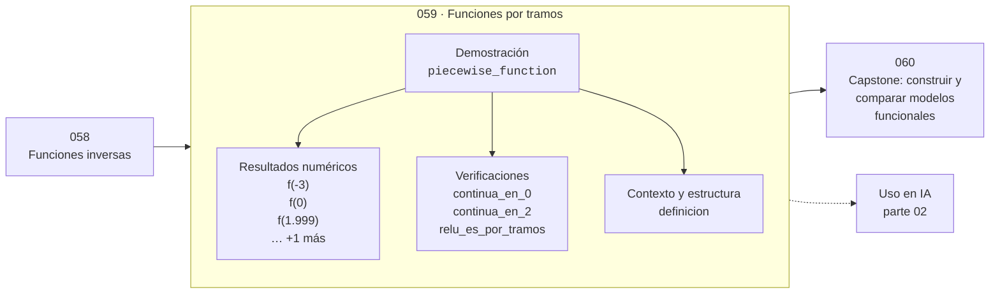

# 059 — Funciones por tramos

> [⬅️ 058 Funciones inversas](../058-funciones-inversas/README.md) · [📚 Parte 02](../README.md) · [🏠 Programa](../../../README.md) · [060 Capstone: construir y comparar modelos funcionales ➡️](../060-capstone-construir-y-comparar-modelos-funcionales/README.md)

**Parte:** 02 — Álgebra y funciones · **Nivel:** `basico` · **Horas estimadas:** 4
**Motor:** `engines.part02` · **Demostración:** `piecewise_function` · **Clase 19 de 20** de la parte

---

## 🎯 Propósito

**Una función por tramos se define con reglas distintas en subconjuntos del dominio; ReLU es el ejemplo dominante en IA.**

Manipulación simbólica con criterio y la función como objeto central: dominio, imagen, composición, inversa y familias lineal, cuadrática, exponencial y logarítmica.

## ✅ Resultados de aprendizaje

Al terminar podrás:

1. Explicar **Funciones por tramos** con lenguaje cotidiano y con notación matemática.
2. Resolver un caso pequeño a mano y anticipar el orden de magnitud del resultado.
3. Ejecutar y modificar `lab.py`, que corre la demostración `piecewise_function`.
4. Interpretar las 8 salidas del laboratorio y decir qué comprueba cada una.
5. Detectar el error típico de esta parte: dividir por una expresión que puede anularse y perder soluciones.

## 🧩 Fórmulas de la clase

```text
ReLU(x) = max(0, x)
continuidad en el corte: límite por la izquierda = límite por la derecha = valor
```

## 🗺️ Ubicación en el programa



## 📖 Fundamentos

Definir una función por tramos es lo natural cuando el fenómeno cambia de régimen: una
tarifa con tramos, un impuesto progresivo, una penalización que solo actúa por encima
de un umbral. La única pregunta técnica es qué ocurre en los puntos de corte, y ahí hay
que comprobar dos cosas: si la función es **continua** (los límites laterales coinciden
con el valor) y si es **derivable** (las pendientes laterales coinciden).

Continua y derivable no son lo mismo. ReLU es continua en 0 —ambos lados tienden a 0—
pero no derivable, porque la pendiente salta de 0 a 1. En la práctica, los frameworks
definen la derivada en 0 por convenio (habitualmente 0), y eso funciona porque el punto
exacto tiene medida nula.

ReLU es la activación más usada en deep learning y es literalmente una función por
tramos. Su éxito frente a la sigmoide tiene una explicación directa que la clase 303
desarrolla: su derivada vale exactamente 1 en el semieje positivo, así que el gradiente
no se atenúa al propagarse por muchas capas. La sigmoide, cuya derivada máxima es 0.25,
hace que el gradiente se desvanezca (clase 314).

La contrapartida también es visible aquí: para `x < 0` la derivada de ReLU es 0, así que
una neurona que caiga en esa región deja de recibir gradiente y «muere». Leaky ReLU
—otro tramo, con pendiente pequeña en lugar de nula— existe para evitarlo.

## 🧮 Ejemplo trabajado

Analizar una función de tres tramos.

```text
f(x) = |x|    si x < 0
       x²     si 0 ≤ x < 2
       4      si x ≥ 2

f(−3)    = 3
f(0)     = 0
f(1.999) = 3.996
f(2)     = 4

Continuidad en x = 0:  lím⁻ = 0,  lím⁺ = 0,  f(0) = 0     ✓
Continuidad en x = 2:  lím⁻ = 4,  lím⁺ = 4,  f(2) = 4     ✓

Derivabilidad en x = 0:
  pendiente por la izquierda: −1
  pendiente por la derecha:    0        ✗ no derivable
```

## 🔬 Qué ejecuta el laboratorio

`piecewise_function` — Una función por tramos y su continuidad en el punto de corte.

| Grupo | Salidas |
|---|---|
| 🔢 Resultados numéricos (4) | `f(-3)`, `f(0)`, `f(1.999)`, `f(2)` |
| ✅ Comprobaciones de invariante (3) | `continua_en_0`, `continua_en_2`, `relu_es_por_tramos` |

Las claves booleanas no son adorno: si alguna fuera `False`, el resultado numérico
no sería fiable aunque el programa terminase sin error.

```bash
python classes/part-02-algebra-y-funciones/059-funciones-por-tramos/lab.py
compmath run 059
```

> [!TIP]
> Antes de ejecutar, **escribe tu predicción**. Un laboratorio que confirma lo que
> esperabas enseña tanto como uno que te contradice, pero solo si la predicción
> existía antes del resultado.

## ⚠️ Errores conceptuales frecuentes

1. Comprobar continuidad y dar por hecha la derivabilidad.
2. Olvidar definir el valor en el punto de corte.
3. Suponer que ReLU es derivable en 0: no lo es; su derivada allí es un convenio.

## 🚀 Dónde se usa de verdad

Activaciones ReLU y Leaky ReLU, funciones de pérdida robustas como Huber (clase 304),
tarifas por tramos e impuestos progresivos.

## 🤖 Conexión con IA

Una red neuronal es una composición de funciones parametrizadas. La sigmoide, la softmax y la log-verosimilitud son álgebra de exponenciales y logaritmos.

## 📓 Notebooks

| Archivo | Para qué |
|---|---|
| [`notebook.ipynb`](notebook.ipynb) | recorrido guiado con la demostración ejecutada |
| [`notebook_student.ipynb`](notebook_student.ipynb) | versión con `TODO` para resolver |
| [`notebook_solution.ipynb`](notebook_solution.ipynb) | solución de referencia verificada |

## 📝 Evaluación

| Criterio | Peso |
|---|---:|
| Comprensión conceptual | 25 % |
| Resolución manual | 25 % |
| Implementación y verificación | 25 % |
| Interpretación y comunicación | 15 % |
| Conexión con aplicación real | 10 % |

Detalle y criterios de error crítico en [`assessment.md`](assessment.md).

## ❓ Preguntas de comprobación

1. ¿Cuál es la entrada, cuál la salida y qué unidades tienen?
2. ¿Qué operación domina el comportamiento del resultado?
3. ¿Qué caso extremo revelaría un error conceptual?
4. ¿Cómo verificarías el resultado por un método independiente?
5. ¿Dónde aparece esto en modelado de crecimiento?

Si necesitas releer el código para responderlas, la clase todavía no está superada.

## 📥 Entregable

`notebook_student.ipynb` resuelto más un párrafo que explique el resultado **sin citar
código**: qué entra, qué sale, qué invariante se comprueba y qué pasaría en un caso límite.

## 🔗 Referencias

- [Glorot, Bordes & Bengio. *Deep Sparse Rectifier Neural Networks*. AISTATS, 2011](https://proceedings.mlr.press/v15/glorot11a.html)
- [Goodfellow, Bengio & Courville. *Deep Learning*. MIT Press, 2016, cap. 6](https://www.deeplearningbook.org/)

Bibliografía completa de la parte en [`../../../docs/BIBLIOGRAPHY.md`](../../../docs/BIBLIOGRAPHY.md).

## 📂 Material de la clase

[`intuition.md`](intuition.md) · [`theory.md`](theory.md) · [`derivation.md`](derivation.md) · [`exercises.md`](exercises.md) · [`assessment.md`](assessment.md) · [`where-is-this-used.md`](where-is-this-used.md) · [`lesson.yaml`](lesson.yaml)

---

> [⬅️ 058 Funciones inversas](../058-funciones-inversas/README.md) · [📚 Parte 02](../README.md) · [🏠 Programa](../../../README.md) · [060 Capstone: construir y comparar modelos funcionales ➡️](../060-capstone-construir-y-comparar-modelos-funcionales/README.md)
