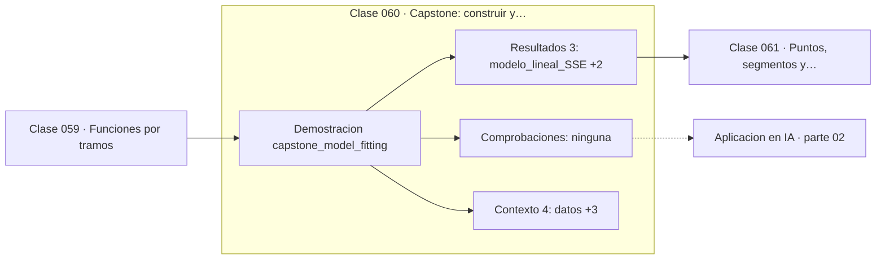

# 060 — Capstone: construir y comparar modelos funcionales

> [⬅️ 059 Funciones por tramos](../059-funciones-por-tramos/README.md) · [📚 Parte 02](../README.md) · [🏠 Programa](../../../README.md) · [061 Puntos, segmentos y distancias ➡️](../../part-03-geometria-trigonometria-y-geometria-analitica/061-puntos-segmentos-y-distancias/README.md)

**Parte:** 02 — Álgebra y funciones · **Nivel:** `basico` · **Horas estimadas:** 4
**Motor:** `engines.part02` · **Demostración:** `capstone_model_fitting` · **Clase 20 de 20** de la parte

---

## 🎯 Propósito

**Elegir modelo es comparar residuos sobre los mismos datos, no elegir la familia que parece más elegante.**

Manipulación simbólica con criterio y la función como objeto central: dominio, imagen, composición, inversa y familias lineal, cuadrática, exponencial y logarítmica.

## ✅ Resultados de aprendizaje

Al terminar podrás:

1. Explicar **Capstone: construir y comparar modelos funcionales** con lenguaje cotidiano y con notación matemática.
2. Resolver un caso pequeño a mano y anticipar el orden de magnitud del resultado.
3. Ejecutar y modificar `lab.py`, que corre la demostración `capstone_model_fitting`.
4. Interpretar las 7 salidas del laboratorio y decir qué comprueba cada una.
5. Detectar el error típico de esta parte: aplicar log a valores no positivos sin declarar el dominio.

## 🧩 Fórmulas de la clase

```text
SSE = Σ(yᵢ − ŷᵢ)²
linealizar exponencial: ln y = ln a + b·x
```

## 🗺️ Ubicación en el programa



## 📖 Fundamentos

El capstone plantea la pregunta que cierra la parte: dados unos datos, ¿qué familia de
funciones los describe? La respuesta no se decide mirando la gráfica ni por preferencia
estética: se decide comparando el error de cada candidato sobre **los mismos** datos,
con la misma métrica.

La suma de residuos al cuadrado (SSE) es el criterio más simple. Penaliza más los
errores grandes que los pequeños, lo que la hace sensible a valores atípicos —tema de
la clase 304— pero la convierte en el objetivo de mínimos cuadrados, que tiene solución
cerrada (clase 131).

El truco central para ajustar un exponencial es **linealizarlo**: tomando logaritmos,
`y = a·e^(bx)` se convierte en `ln y = ln a + b·x`, que es una recta. Ajustar por
mínimos cuadrados en el espacio logarítmico y volver da los parámetros. Conviene saber
que esto minimiza el error relativo, no el absoluto, lo que a veces es preferible y a
veces no.

La honestidad del procedimiento exige dos advertencias. Primera: un SSE menor no
demuestra que el modelo sea correcto, solo que ajusta mejor **esos** datos; un
polinomio de grado suficiente ajusta cualquier cosa (clase 298). Segunda: la
comparación solo es válida si ambos modelos se evalúan en la misma escala; comparar
un SSE calculado en escala logarítmica con otro en escala lineal no significa nada.

## 🧮 Ejemplo trabajado

Decidir entre lineal y exponencial con seis puntos.

```text
x:  1     2     3      4      5      6
y:  2.1   4.4   8.9   17.5   35.2   70.8

Pista: cada y es aproximadamente el doble del anterior
       → razón ≈ 2 constante → exponencial

Linealización: ln y contra x
  ln y:  0.74  1.48  2.19  2.86  3.56  4.26
  diferencias: ~0.70 constantes → recta ✓

Ajuste:  y = 1.055 · e^(0.702x)
         razón de crecimiento: e^0.702 = 2.018

SSE lineal:      ~1010
SSE exponencial: ~1.5
Modelo elegido: exponencial
```

## 🔬 Qué ejecuta el laboratorio

`capstone_model_fitting` — Capstone: ¿lineal, cuadrático o exponencial? Decidir con residuos.

| Grupo | Salidas |
|---|---|
| 🔢 Resultados numéricos (3) | `modelo_lineal_SSE`, `modelo_exponencial_SSE`, `razon_de_crecimiento` |
| ✅ Comprobaciones de invariante (0) | — |

Las claves booleanas no son adorno: si alguna fuera `False`, el resultado numérico
no sería fiable aunque el programa terminase sin error.

```bash
python classes/part-02-algebra-y-funciones/060-capstone-construir-y-comparar-modelos-funcionales/lab.py
compmath run 060
```

> [!TIP]
> Antes de ejecutar, **escribe tu predicción**. Un laboratorio que confirma lo que
> esperabas enseña tanto como uno que te contradice, pero solo si la predicción
> existía antes del resultado.

## ⚠️ Errores conceptuales frecuentes

1. Elegir modelo por inspección visual sin medir residuos.
2. Comparar SSE calculados en escalas distintas (lineal frente a logarítmica).
3. Concluir que el modelo con menor SSE es «el correcto» en lugar de «el que mejor ajusta estos datos».

## 🚀 Dónde se usa de verdad

Selección de modelos, ajuste de curvas de crecimiento, análisis de escalabilidad y la
lectura de leyes de escala. Es el precursor directo de la regresión de la parte 14.

## 🤖 Conexión con IA

Una red neuronal es una composición de funciones parametrizadas. La sigmoide, la softmax y la log-verosimilitud son álgebra de exponenciales y logaritmos.

## 📓 Notebooks

| Archivo | Para qué |
|---|---|
| [`notebook.ipynb`](notebook.ipynb) | recorrido guiado con la demostración ejecutada |
| [`notebook_student.ipynb`](notebook_student.ipynb) | versión con `TODO` para resolver |
| [`notebook_solution.ipynb`](notebook_solution.ipynb) | solución de referencia verificada |

## 📝 Evaluación

| Criterio | Peso |
|---|---:|
| Comprensión conceptual | 25 % |
| Resolución manual | 25 % |
| Implementación y verificación | 25 % |
| Interpretación y comunicación | 15 % |
| Conexión con aplicación real | 10 % |

Detalle y criterios de error crítico en [`assessment.md`](assessment.md).

## ❓ Preguntas de comprobación

1. ¿Cuál es la entrada, cuál la salida y qué unidades tienen?
2. ¿Qué operación domina el comportamiento del resultado?
3. ¿Qué caso extremo revelaría un error conceptual?
4. ¿Cómo verificarías el resultado por un método independiente?
5. ¿Dónde aparece esto en modelado de crecimiento?

Si necesitas releer el código para responderlas, la clase todavía no está superada.

## 📥 Entregable

`notebook_student.ipynb` resuelto más un párrafo que explique el resultado **sin citar
código**: qué entra, qué sale, qué invariante se comprueba y qué pasaría en un caso límite.

## 🔗 Referencias

- [Hastie, Tibshirani & Friedman. *The Elements of Statistical Learning*, 2ª ed., Springer, 2009](https://hastie.su.domains/ElemStatLearn/)
- [Stewart, J. *Precalculus*, 7ª ed., Cengage, 2015](https://www.cengage.com/c/precalculus-mathematics-for-calculus-7e-stewart/)

Bibliografía completa de la parte en [`../../../docs/BIBLIOGRAPHY.md`](../../../docs/BIBLIOGRAPHY.md).

## 📂 Material de la clase

[`intuition.md`](intuition.md) · [`theory.md`](theory.md) · [`derivation.md`](derivation.md) · [`exercises.md`](exercises.md) · [`assessment.md`](assessment.md) · [`where-is-this-used.md`](where-is-this-used.md) · [`lesson.yaml`](lesson.yaml)

---

> [⬅️ 059 Funciones por tramos](../059-funciones-por-tramos/README.md) · [📚 Parte 02](../README.md) · [🏠 Programa](../../../README.md) · [061 Puntos, segmentos y distancias ➡️](../../part-03-geometria-trigonometria-y-geometria-analitica/061-puntos-segmentos-y-distancias/README.md)
