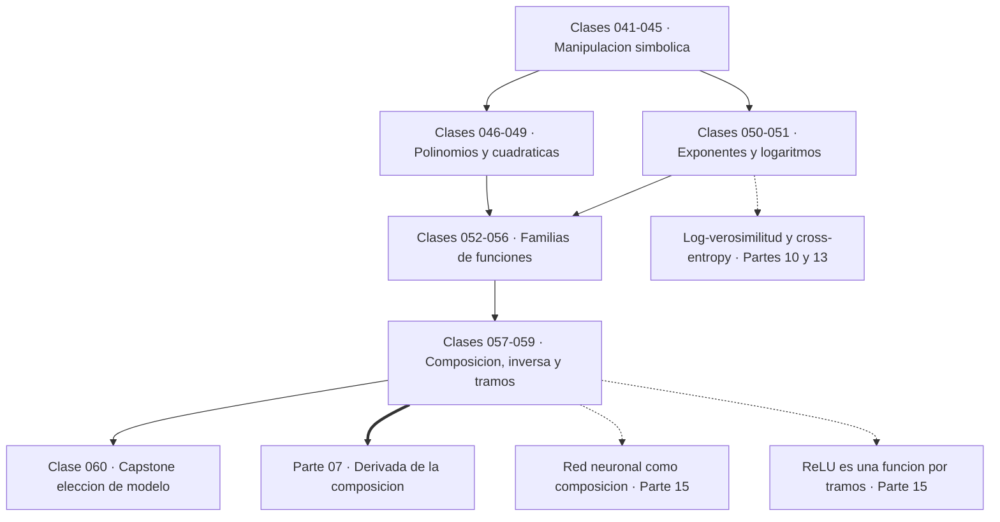

# 📐 Parte 02 — Álgebra y funciones

> [⬅️ Parte 01 — Aritmética computacional y representación numérica](../part-01-aritmetica-computacional-y-representacion-numerica/README.md) · [🏠 Programa](../../README.md) · [📇 Catálogo](../README.md) · [Parte 03 — Geometría, trigonometría y geometría analítica ➡️](../part-03-geometria-trigonometria-y-geometria-analitica/README.md)

**Nivel:** `basico` · **Clases:** 20 · **Horas estimadas:** 80 · **Motor:** [`part02.py`](../../src/computational_math/engines/part02.py)

---

## 🎯 De qué trata esta parte

Manipulación simbólica con criterio y la función como objeto central: dominio, imagen, composición, inversa y familias lineal, cuadrática, exponencial y logarítmica.

El álgebra tiene mala fama porque se enseña como manipulación de símbolos sin objeto.
Esta parte invierte el orden: primero el **objeto** —la función—, después las reglas para
manipularlo. Una función no es una fórmula: es una asignación que a cada elemento de un
dominio le hace corresponder exactamente uno de un codominio. La fórmula es solo una de
las formas de describirla, y el dominio forma parte de su identidad.

Las clases 041 a 051 construyen la maquinaria simbólica: términos semejantes,
propiedades, ecuaciones, sistemas, polinomios, factorización, cuadráticas, exponentes y
logaritmos. El énfasis no está en resolver rápido sino en saber **qué operación es
reversible**. Dividir por una expresión que puede anularse pierde soluciones; elevar al
cuadrado introduce soluciones falsas. Cada paso de un despeje es un compromiso, y hay que
saber cuál.

Las clases 052 a 059 son el corazón de la parte. Dominio y rango, familias lineal,
cuadrática, exponencial y logarítmica, composición, inversa y funciones por tramos. Estas
cinco familias cubren casi todo el modelado elemental, y saber reconocer cuál describe un
conjunto de datos es una competencia directamente evaluable: el capstone 060 lo hace con
residuos.

Dos ideas de esta parte reaparecen literalmente en deep learning. La primera es la
**composición**: una red neuronal es `f_n(...f_2(f_1(x)))`, una composición de funciones
parametrizadas, y la regla de la cadena de la parte 07 es la derivada de esa composición.
La segunda es que el **logaritmo convierte productos en sumas**, que es exactamente por
qué toda función de pérdida probabilística se escribe en escala logarítmica: multiplicar
diez mil probabilidades produce underflow, sumar diez mil logaritmos no.

La función por tramos de la clase 059 merece atención especial: ReLU, la activación más
usada en deep learning, es literalmente una función por tramos, y su comportamiento
—derivada 1 en un lado, 0 en el otro— se entiende aquí antes de que aparezca con nombre
técnico.

Al terminar la parte deberías poder mirar una curva y decir qué familia la describe, mirar
una fórmula y decir cuál es su dominio, y mirar una composición y decir en qué orden se
aplican sus piezas.

## 🗺️ Mapa conceptual



## 🧠 Ideas centrales

- Una ecuación restringe; una función asigna. No son lo mismo.
- El dominio forma parte de la definición: cambiarlo cambia la función.
- El discriminante decide la naturaleza de las raíces antes de calcularlas.
- El logaritmo convierte producto en suma: por eso aparece en toda función de pérdida.
- Componer funciones es la operación que después llamaremos «capa» en una red neuronal.

## 🤖 Por qué importa en IA

> [!IMPORTANT]
> Una red neuronal es una composición de funciones parametrizadas. La sigmoide, la softmax y la log-verosimilitud son álgebra de exponenciales y logaritmos.

## ⚠️ Errores frecuentes de esta parte

- Dividir por una expresión que puede anularse y perder soluciones.
- Aplicar log a valores no positivos sin declarar el dominio.
- Confundir función inversa con recíproco.

## 🧭 Secuencia de la parte

```mermaid
flowchart LR
    subgraph B1["Bloque 1"]
        direction TB
        L041["041 · Expresiones algebraicas y…"]
        L042["042 · Propiedades distributiva,…"]
        L043["043 · Ecuaciones lineales de una…"]
        L044["044 · Desigualdades lineales"]
        L045["045 · Sistemas de ecuaciones 2x2"]
        L041 --> L042
        L042 --> L043
        L043 --> L044
        L044 --> L045
    end
    subgraph B2["Bloque 2"]
        direction TB
        L046["046 · Polinomios y operaciones"]
        L047["047 · Factorización elemental"]
        L048["048 · Ecuaciones cuadráticas"]
        L049["049 · Fórmula cuadrática y…"]
        L050["050 · Exponentes algebraicos"]
        L046 --> L047
        L047 --> L048
        L048 --> L049
        L049 --> L050
    end
    subgraph B3["Bloque 3"]
        direction TB
        L051["051 · Logaritmos y sus propiedades"]
        L052["052 · Funciones: dominio y rango"]
        L053["053 · Funciones lineales y pendiente"]
        L054["054 · Funciones cuadráticas y…"]
        L055["055 · Funciones exponenciales"]
        L051 --> L052
        L052 --> L053
        L053 --> L054
        L054 --> L055
    end
    subgraph B4["Bloque 4"]
        direction TB
        L056["056 · Funciones logarítmicas"]
        L057["057 · Composición de funciones"]
        L058["058 · Funciones inversas"]
        L059["059 · Funciones por tramos"]
        L060["060 · Capstone: construir y…"]
        L056 --> L057
        L057 --> L058
        L058 --> L059
        L059 --> L060
    end
    L045 --> L046
    L050 --> L051
    L055 --> L056
```



## 📚 Las clases

| # | Clase | Demostración | Idea central |
|---|---|---|---|
| `041` | [Expresiones algebraicas y términos](041-expresiones-algebraicas-y-terminos/README.md) | `algebraic_terms` | Solo se suman términos con la misma parte literal; simplificar reduce operaciones sin cambiar el valor. |
| `042` | [Propiedades distributiva, asociativa y conmutativa](042-propiedades-distributiva-asociativa-y-conmutativa/README.md) | `algebra_properties` | Conmutativa, asociativa y distributiva son válidas en ℝ, pero la asociatividad falla en punto flotante. |
| `043` | [Ecuaciones lineales de una variable](043-ecuaciones-lineales-de-una-variable/README.md) | `linear_equation` | Resolver una ecuación es aplicar operaciones reversibles hasta aislar la incógnita. |
| `044` | [Desigualdades lineales](044-desigualdades-lineales/README.md) | `linear_inequality` | Multiplicar o dividir una desigualdad por un número negativo invierte su sentido. |
| `045` | [Sistemas de ecuaciones 2x2](045-sistemas-de-ecuaciones-2x2/README.md) | `system_2x2` | Un sistema 2×2 tiene solución única si y solo si su determinante es no nulo. |
| `046` | [Polinomios y operaciones](046-polinomios-y-operaciones/README.md) | `polynomial_ops` | El esquema de Horner evalúa un polinomio de grado n con n multiplicaciones en lugar de n(n+1)/2. |
| `047` | [Factorización elemental](047-factorizacion-elemental/README.md) | `factoring` | Factorizar expone las raíces; las relaciones de Vieta las conectan con los coeficientes. |
| `048` | [Ecuaciones cuadráticas](048-ecuaciones-cuadraticas/README.md) | `quadratic_equation` | El vértice de una parábola está en x = −b/2a y es el punto medio de las raíces. |
| `049` | [Fórmula cuadrática y discriminante](049-formula-cuadratica-y-discriminante/README.md) | `discriminant` | El discriminante clasifica las raíces antes de calcularlas. |
| `050` | [Exponentes algebraicos](050-exponentes-algebraicos/README.md) | `algebraic_exponents` | Los exponentes fraccionarios extienden las leyes de potencias y definen las raíces. |
| `051` | [Logaritmos y sus propiedades](051-logaritmos-y-sus-propiedades/README.md) | `logarithm_laws` | El logaritmo convierte productos en sumas, y por eso toda verosimilitud se calcula en escala logarítmica. |
| `052` | [Funciones: dominio y rango](052-funciones-dominio-y-rango/README.md) | `domain_range` | El dominio forma parte de la definición de una función: cambiarlo cambia la función. |
| `053` | [Funciones lineales y pendiente](053-funciones-lineales-y-pendiente/README.md) | `linear_function` | Una función lineal tiene razón de cambio constante; la pendiente es esa razón. |
| `054` | [Funciones cuadráticas y parábolas](054-funciones-cuadraticas-y-parabolas/README.md) | `quadratic_function` | El signo del coeficiente principal decide la concavidad, y el vértice es el extremo. |
| `055` | [Funciones exponenciales](055-funciones-exponenciales/README.md) | `exponential_function` | El crecimiento exponencial tiene razón constante, no diferencia constante. |
| `056` | [Funciones logarítmicas](056-funciones-logaritmicas/README.md) | `logarithmic_function` | El logaritmo es la inversa de la exponencial y convierte factores en distancias iguales. |
| `057` | [Composición de funciones](057-composicion-de-funciones/README.md) | `function_composition` | La composición aplica funciones en cadena y no es conmutativa: (g∘f) ≠ (f∘g). |
| `058` | [Funciones inversas](058-funciones-inversas/README.md) | `inverse_function` | La inversa deshace la función y existe solo si es inyectiva; no es el recíproco 1/f. |
| `059` | [Funciones por tramos](059-funciones-por-tramos/README.md) | `piecewise_function` | Una función por tramos se define con reglas distintas en subconjuntos del dominio; ReLU es el ejemplo dominante en IA. |
| `060` | [Capstone: construir y comparar modelos funcionales](060-capstone-construir-y-comparar-modelos-funcionales/README.md) | `capstone_model_fitting` | Elegir modelo es comparar residuos sobre los mismos datos, no elegir la familia que parece más elegante. |

## 📖 Glosario de la parte (20 términos)

Definiciones precisas en [`GLOSARIO.md`](GLOSARIO.md).

## 🧰 Stack de referencia

`math`, `cmath`, `sympy (opcional)`

Los laboratorios se ejecutan con biblioteca estándar; estas herramientas aparecen
como contraste profesional, no como requisito.

## 🧪 Ejecutar toda la parte

```bash
compmath run --part 02
compmath catalog --part 02
```

## 📊 Evaluación de la parte

| Componente | Peso |
|---|---:|
| Clases y ejercicios | 40 % |
| Laboratorios y notebooks | 25 % |
| Explicación oral o escrita | 15 % |
| Capstone ([060](060-capstone-construir-y-comparar-modelos-funcionales/README.md)) | 20 % |

## 📖 Bibliografía

Obras de referencia de la parte:

- Axler, S. *Precalculus: A Prelude to Calculus*. 3ª ed., Wiley, 2017.
- Gelfand, I. M.; Glagoleva, E.; Shnol, E. *Functions and Graphs*. Dover, 2002.
- Stewart, J. *Precalculus: Mathematics for Calculus*. 7ª ed., Cengage, 2015.

Las 20 clases de esta parte citan 23 obras distintas. Cuál sostiene cada clase, y por qué, en [`docs/BIBLIOGRAPHY.md`](../../docs/BIBLIOGRAPHY.md#parte-02-algebra-y-funciones).

---

> [⬅️ Parte 01 — Aritmética computacional y representación numérica](../part-01-aritmetica-computacional-y-representacion-numerica/README.md) · [🏠 Programa](../../README.md) · [📇 Catálogo](../README.md) · [Parte 03 — Geometría, trigonometría y geometría analítica ➡️](../part-03-geometria-trigonometria-y-geometria-analitica/README.md)
