# 📐 Parte 02 — Álgebra y funciones

> [⬅️ Parte 01 — Aritmética computacional y representación numérica](../part-01-aritmetica-computacional-y-representacion-numerica/README.md) · [🏠 Programa](../../README.md) · [📇 Catálogo](../README.md) · [Parte 03 — Geometría, trigonometría y geometría analítica ➡️](../part-03-geometria-trigonometria-y-geometria-analitica/README.md)

**Nivel:** `basico` · **Clases:** 20 · **Horas estimadas:** 80 · **Motor:** [`part02.py`](../../src/computational_math/engines/part02.py)

---

## 🎯 De qué trata esta parte

Manipulación simbólica con criterio y la función como objeto central: dominio, imagen, composición, inversa y familias lineal, cuadrática, exponencial y logarítmica.

## 🧠 Ideas centrales

- Una ecuación restringe; una función asigna. No son lo mismo.
- El dominio forma parte de la definición: cambiarlo cambia la función.
- El discriminante decide la naturaleza de las raíces antes de calcularlas.
- El logaritmo convierte producto en suma: por eso aparece en toda función de pérdida.
- Componer funciones es la operación que después llamaremos «capa» en una red neuronal.

## 🤖 Por qué importa en IA

> [!IMPORTANT]
> Una red neuronal es una composición de funciones parametrizadas. La sigmoide, la softmax y la log-verosimilitud son álgebra de exponenciales y logaritmos.

## ⚠️ Errores frecuentes de esta parte

- Dividir por una expresión que puede anularse y perder soluciones.
- Aplicar log a valores no positivos sin declarar el dominio.
- Confundir función inversa con recíproco.

## 🧭 Secuencia de la parte

```mermaid
flowchart LR
    subgraph B1["Bloque 1"]
        direction TB
        L041["041<br/>Expresiones algebraicas<br/>y términos"]
        L042["042<br/>Propiedades<br/>distributiva, asociativa<br/>y conmutativa"]
        L043["043<br/>Ecuaciones lineales de<br/>una variable"]
        L044["044<br/>Desigualdades lineales"]
        L045["045<br/>Sistemas de ecuaciones<br/>2x2"]
        L041 --> L042
        L042 --> L043
        L043 --> L044
        L044 --> L045
    end
    subgraph B2["Bloque 2"]
        direction TB
        L046["046<br/>Polinomios y operaciones"]
        L047["047<br/>Factorización elemental"]
        L048["048<br/>Ecuaciones cuadráticas"]
        L049["049<br/>Fórmula cuadrática y<br/>discriminante"]
        L050["050<br/>Exponentes algebraicos"]
        L046 --> L047
        L047 --> L048
        L048 --> L049
        L049 --> L050
    end
    subgraph B3["Bloque 3"]
        direction TB
        L051["051<br/>Logaritmos y sus<br/>propiedades"]
        L052["052<br/>Funciones: dominio y<br/>rango"]
        L053["053<br/>Funciones lineales y<br/>pendiente"]
        L054["054<br/>Funciones cuadráticas y<br/>parábolas"]
        L055["055<br/>Funciones exponenciales"]
        L051 --> L052
        L052 --> L053
        L053 --> L054
        L054 --> L055
    end
    subgraph B4["Bloque 4"]
        direction TB
        L056["056<br/>Funciones logarítmicas"]
        L057["057<br/>Composición de funciones"]
        L058["058<br/>Funciones inversas"]
        L059["059<br/>Funciones por tramos"]
        L060["060<br/>Capstone: construir y<br/>comparar modelos<br/>funcionales"]
        L056 --> L057
        L057 --> L058
        L058 --> L059
        L059 --> L060
    end
    L045 --> L046
    L050 --> L051
    L055 --> L056
```



## 📚 Las clases

| # | Clase | Demostración | Idea central |
|---|---|---|---|
| `041` | [Expresiones algebraicas y términos](041-expresiones-algebraicas-y-terminos/README.md) | `algebraic_terms` | Términos semejantes y evaluación de una expresión. |
| `042` | [Propiedades distributiva, asociativa y conmutativa](042-propiedades-distributiva-asociativa-y-conmutativa/README.md) | `algebra_properties` | Conmutativa, asociativa y distributiva: válidas en ℝ, no siempre en float. |
| `043` | [Ecuaciones lineales de una variable](043-ecuaciones-lineales-de-una-variable/README.md) | `linear_equation` | Resolver ax + b = c y verificar el residuo. |
| `044` | [Desigualdades lineales](044-desigualdades-lineales/README.md) | `linear_inequality` | Multiplicar por un negativo invierte el sentido de la desigualdad. |
| `045` | [Sistemas de ecuaciones 2x2](045-sistemas-de-ecuaciones-2x2/README.md) | `system_2x2` | Sistema 2x2 por determinantes (regla de Cramer) y verificación. |
| `046` | [Polinomios y operaciones](046-polinomios-y-operaciones/README.md) | `polynomial_ops` | Suma, producto y evaluación de polinomios por Horner. |
| `047` | [Factorización elemental](047-factorizacion-elemental/README.md) | `factoring` | Factorizar x² - 3x + 2 y comprobar las raíces. |
| `048` | [Ecuaciones cuadráticas](048-ecuaciones-cuadraticas/README.md) | `quadratic_equation` | Resolver una cuadrática y contrastar con la forma de vértice. |
| `049` | [Fórmula cuadrática y discriminante](049-formula-cuadratica-y-discriminante/README.md) | `discriminant` | El discriminante clasifica las raíces antes de calcularlas. |
| `050` | [Exponentes algebraicos](050-exponentes-algebraicos/README.md) | `algebraic_exponents` | Exponentes negativos, fraccionarios y su dominio. |
| `051` | [Logaritmos y sus propiedades](051-logaritmos-y-sus-propiedades/README.md) | `logarithm_laws` | Las tres leyes del logaritmo verificadas numéricamente. |
| `052` | [Funciones: dominio y rango](052-funciones-dominio-y-rango/README.md) | `domain_range` | El dominio forma parte de la definición de la función. |
| `053` | [Funciones lineales y pendiente](053-funciones-lineales-y-pendiente/README.md) | `linear_function` | Pendiente como razón de cambio constante. |
| `054` | [Funciones cuadráticas y parábolas](054-funciones-cuadraticas-y-parabolas/README.md) | `quadratic_function` | Vértice, eje de simetría y concavidad. |
| `055` | [Funciones exponenciales](055-funciones-exponenciales/README.md) | `exponential_function` | Crecimiento exponencial: razón constante, no diferencia constante. |
| `056` | [Funciones logarítmicas](056-funciones-logaritmicas/README.md) | `logarithmic_function` | El logaritmo como inversa de la exponencial y como escala. |
| `057` | [Composición de funciones](057-composicion-de-funciones/README.md) | `function_composition` | (g∘f) no es (f∘g): la composición no conmuta. |
| `058` | [Funciones inversas](058-funciones-inversas/README.md) | `inverse_function` | Inversa frente a recíproco: dos objetos distintos. |
| `059` | [Funciones por tramos](059-funciones-por-tramos/README.md) | `piecewise_function` | Una función por tramos y su continuidad en el punto de corte. |
| `060` | [Capstone: construir y comparar modelos funcionales](060-capstone-construir-y-comparar-modelos-funcionales/README.md) | `capstone_model_fitting` | Capstone: ¿lineal, cuadrático o exponencial? Decidir con residuos. |

## 🧰 Stack de referencia

`math`, `cmath`, `sympy (opcional)`

Los laboratorios se ejecutan con biblioteca estándar; estas herramientas aparecen
como contraste profesional, no como requisito.

## 🧪 Ejecutar toda la parte

```bash
compmath run --part 02
compmath catalog --part 02
```

## 📊 Evaluación de la parte

| Componente | Peso |
|---|---:|
| Clases y ejercicios | 40 % |
| Laboratorios y notebooks | 25 % |
| Explicación oral o escrita | 15 % |
| Capstone ([060](060-capstone-construir-y-comparar-modelos-funcionales/README.md)) | 20 % |

## 📖 Bibliografía

- Axler, S. *Precalculus: A Prelude to Calculus*. 3ª ed., Wiley, 2017.
- Gelfand, I. M.; Glagoleva, E.; Shnol, E. *Functions and Graphs*. Dover, 2002.
- Stewart, J. *Precalculus: Mathematics for Calculus*. 7ª ed., Cengage, 2015.

---

> [⬅️ Parte 01 — Aritmética computacional y representación numérica](../part-01-aritmetica-computacional-y-representacion-numerica/README.md) · [🏠 Programa](../../README.md) · [📇 Catálogo](../README.md) · [Parte 03 — Geometría, trigonometría y geometría analítica ➡️](../part-03-geometria-trigonometria-y-geometria-analitica/README.md)
