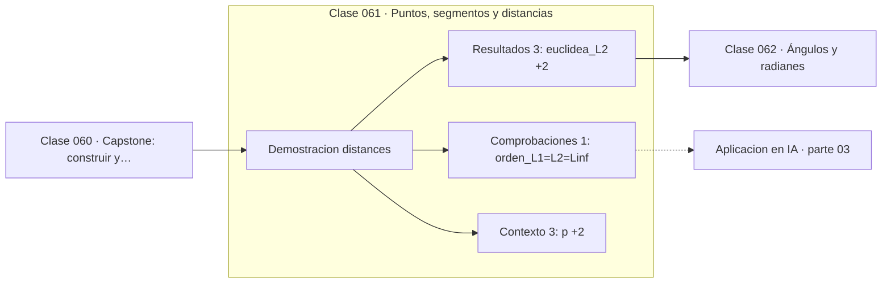

# 061 — Puntos, segmentos y distancias

> [⬅️ 060 Capstone: construir y comparar modelos funcionales](../../part-02-algebra-y-funciones/060-capstone-construir-y-comparar-modelos-funcionales/README.md) · [📚 Parte 03](../README.md) · [🏠 Programa](../../../README.md) · [062 Ángulos y radianes ➡️](../062-angulos-y-radianes/README.md)

**Parte:** 03 — Geometría, trigonometría y geometría analítica · **Nivel:** `basico-intermedio` · **Horas estimadas:** 4
**Motor:** `engines.part03` · **Demostración:** `distances` · **Clase 1 de 20** de la parte

---

## 🎯 Propósito

**La distancia euclídea es una de varias métricas posibles; cuál se elige cambia qué está cerca.**

Del espacio a las coordenadas: distancia, ángulo, trigonometría, transformaciones lineales en el plano, coordenadas polares y proyección.

## ✅ Resultados de aprendizaje

Al terminar podrás:

1. Explicar **Puntos, segmentos y distancias** con lenguaje cotidiano y con notación matemática.
2. Resolver un caso pequeño a mano y anticipar el orden de magnitud del resultado.
3. Ejecutar y modificar `lab.py`, que corre la demostración `distances`.
4. Interpretar las 7 salidas del laboratorio y decir qué comprueba cada una.
5. Detectar el error típico de esta parte: mezclar grados y radianes en la misma expresión.

## 🧩 Fórmulas de la clase

```text
L2: d(p,q) = √Σ(pᵢ−qᵢ)²
L1: d(p,q) = Σ|pᵢ−qᵢ|
L∞: d(p,q) = máx|pᵢ−qᵢ|
```

## 🗺️ Ubicación en el programa



## 📖 Fundamentos

Una distancia no es «la» distancia: es cualquier función que cumpla tres condiciones
—no negatividad con `d(p,q)=0` solo si `p=q`, simetría y desigualdad triangular—. Bajo
esa definición, la euclídea es una entre muchas, y elegir una u otra cambia qué puntos
se consideran cercanos.

Las tres más usadas tienen interpretación directa. La **euclídea (L2)** es la línea
recta: la que mediría una regla. La **Manhattan (L1)** es la distancia por calles en
cuadrícula, y su nombre viene de ahí. La **Chebyshev (L∞)** es el máximo de las
diferencias por coordenada: el movimiento del rey en ajedrez.

Siempre se cumple `L∞ ≤ L2 ≤ L1`, hecho que conviene comprobar numéricamente porque da
una intuición útil: L1 penaliza más el total de desviaciones, L∞ solo mira la peor. Esa
diferencia reaparece en la parte 14 como la diferencia entre regularización Lasso (L1)
y Ridge (L2), y en la 15 entre pérdida MAE y MSE.

En alta dimensión la intuición euclídea falla. Todas las distancias entre puntos
aleatorios se concentran alrededor de un valor común, y la noción de «vecino más
cercano» pierde significado. Es la maldición de la dimensionalidad, y es la razón por
la que en embeddings se usa similitud coseno en lugar de distancia euclídea.

## 🧮 Ejemplo trabajado

Tres distancias entre p = (1,2) y q = (4,6).

```text
diferencias: (3, 4)

L2 (euclídea):  √(9 + 16) = √25 = 5.0
L1 (Manhattan): |3| + |4|       = 7.0
L∞ (Chebyshev): máx(3, 4)       = 4.0

Orden:  L∞ (4) ≤ L2 (5) ≤ L1 (7)      ✓

Punto medio: ((1+4)/2, (2+6)/2) = (2.5, 4.0)
```

El triángulo (3,4,5) no es casual: es la terna pitagórica más simple, tema de la
clase 064.

## 🔬 Qué ejecuta el laboratorio

`distances` — Distancia euclídea, Manhattan y Chebyshev sobre los mismos puntos.

| Grupo | Salidas |
|---|---|
| 🔢 Resultados numéricos (3) | `euclidea_L2`, `manhattan_L1`, `chebyshev_Linf` |
| ✅ Comprobaciones de invariante (1) | `orden_L1>=L2>=Linf` |

Las claves booleanas no son adorno: si alguna fuera `False`, el resultado numérico
no sería fiable aunque el programa terminase sin error.

```bash
python classes/part-03-geometria-trigonometria-y-geometria-analitica/061-puntos-segmentos-y-distancias/lab.py
compmath run 061
```

> [!TIP]
> Antes de ejecutar, **escribe tu predicción**. Un laboratorio que confirma lo que
> esperabas enseña tanto como uno que te contradice, pero solo si la predicción
> existía antes del resultado.

## ⚠️ Errores conceptuales frecuentes

1. Suponer que «distancia» siempre significa euclídea.
2. Comparar distancias entre variables de escalas distintas sin estandarizar.
3. Confiar en la intuición euclídea de 2D o 3D al trabajar en dimensión 768.

## 🚀 Dónde se usa de verdad

k-NN y k-means (parte 14), detección de anomalías, búsqueda de vecinos en embeddings y
elección de norma en regularización.

## 🤖 Conexión con IA

Las transformaciones geométricas son el caso visual de las transformaciones lineales que una red aplica a sus activaciones; la similitud coseno es trigonometría en alta dimensión.

## 📓 Notebooks

| Archivo | Para qué |
|---|---|
| [`notebook.ipynb`](notebook.ipynb) | recorrido guiado con la demostración ejecutada |
| [`notebook_student.ipynb`](notebook_student.ipynb) | versión con `TODO` para resolver |
| [`notebook_solution.ipynb`](notebook_solution.ipynb) | solución de referencia verificada |

## 📝 Evaluación

| Criterio | Peso |
|---|---:|
| Comprensión conceptual | 25 % |
| Resolución manual | 25 % |
| Implementación y verificación | 25 % |
| Interpretación y comunicación | 15 % |
| Conexión con aplicación real | 10 % |

Detalle y criterios de error crítico en [`assessment.md`](assessment.md).

## ❓ Preguntas de comprobación

1. ¿Cuál es la entrada, cuál la salida y qué unidades tienen?
2. ¿Qué operación domina el comportamiento del resultado?
3. ¿Qué caso extremo revelaría un error conceptual?
4. ¿Cómo verificarías el resultado por un método independiente?
5. ¿Dónde aparece esto en gráficos por computador?

Si necesitas releer el código para responderlas, la clase todavía no está superada.

## 📥 Entregable

`notebook_student.ipynb` resuelto más un párrafo que explique el resultado **sin citar
código**: qué entra, qué sale, qué invariante se comprueba y qué pasaría en un caso límite.

## 📚 Bibliografía de la clase

Esta clase enseña **Geometría y trigonometría**. Cada obra dice qué aporta aquí y cómo se comprobó su localizador:

- [Aggarwal, Hinneburg & Keim. *On the Surprising Behavior of Distance Metrics in High Dimensional Space*. ICDT, 2001](https://bib.dbvis.de/uploadedFiles/155.pdf) — Geometría y trigonometría: el tema de esta clase · URL de la fuente primaria comprobada en bib.dbvis.de (2026-08-19).
- [Python: `math.dist`](https://docs.python.org/3/library/math.html#math.dist) — documentación de la herramienta que ejecuta el laboratorio · URL de la fuente primaria comprobada en Python Software Foundation (2026-08-19).

Bibliografía de todas las clases, con el porqué de cada obra, en [`docs/BIBLIOGRAPHY.md`](../../../docs/BIBLIOGRAPHY.md) · localizador y estado de cada obra en [`sources/bibliography.json`](../../../sources/bibliography.json).

## 📂 Material de la clase

[`intuition.md`](intuition.md) · [`theory.md`](theory.md) · [`derivation.md`](derivation.md) · [`exercises.md`](exercises.md) · [`assessment.md`](assessment.md) · [`where-is-this-used.md`](where-is-this-used.md) · [`lesson.yaml`](lesson.yaml)

---

> [⬅️ 060 Capstone: construir y comparar modelos funcionales](../../part-02-algebra-y-funciones/060-capstone-construir-y-comparar-modelos-funcionales/README.md) · [📚 Parte 03](../README.md) · [🏠 Programa](../../../README.md) · [062 Ángulos y radianes ➡️](../062-angulos-y-radianes/README.md)
