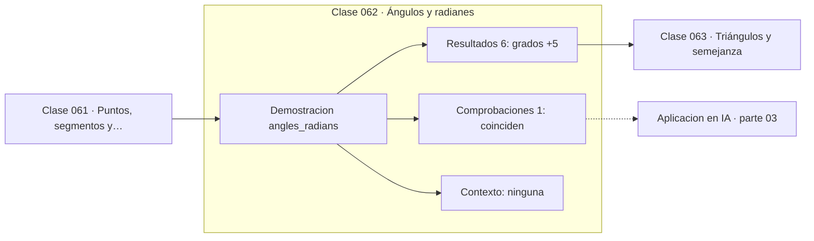

# 062 — Ángulos y radianes

> [⬅️ 061 Puntos, segmentos y distancias](../061-puntos-segmentos-y-distancias/README.md) · [📚 Parte 03](../README.md) · [🏠 Programa](../../../README.md) · [063 Triángulos y semejanza ➡️](../063-triangulos-y-semejanza/README.md)

**Parte:** 03 — Geometría, trigonometría y geometría analítica · **Nivel:** `basico-intermedio` · **Horas estimadas:** 4
**Motor:** `engines.part03` · **Demostración:** `angles_radians` · **Clase 2 de 20** de la parte

---

## 🎯 Propósito

**El radián es la unidad natural del ángulo: en ella, la derivada del seno es el coseno sin factores de conversión.**

Del espacio a las coordenadas: distancia, ángulo, trigonometría, transformaciones lineales en el plano, coordenadas polares y proyección.

## ✅ Resultados de aprendizaje

Al terminar podrás:

1. Explicar **Ángulos y radianes** con lenguaje cotidiano y con notación matemática.
2. Resolver un caso pequeño a mano y anticipar el orden de magnitud del resultado.
3. Ejecutar y modificar `lab.py`, que corre la demostración `angles_radians`.
4. Interpretar las 7 salidas del laboratorio y decir qué comprueba cada una.
5. Detectar el error típico de esta parte: aplicar rotación y traslación en el orden equivocado.

## 🧩 Fórmulas de la clase

```text
θ(rad) = θ(grados) · π/180
vuelta completa = 2π rad = 360°
d(sin x)/dx = cos x   solo si x está en radianes
```

## 🗺️ Ubicación en el programa



## 📖 Fundamentos

Un radián es el ángulo cuyo arco mide lo mismo que el radio. Esa definición hace que la
longitud de arco sea simplemente `s = rθ`, sin constantes, y es el primer indicio de
por qué el radián es «natural»: elimina factores arbitrarios.

El motivo profundo aparece en cálculo. La derivada de `sin x` es `cos x` **únicamente**
si x está en radianes; en grados, la derivada es `(π/180)·cos x`. Ese factor
contaminaría cada derivada, cada serie de Taylor y cada ecuación diferencial. Por eso
todas las bibliotecas matemáticas trabajan internamente en radianes, y `math.sin(90)`
no devuelve 1 sino el seno de 90 radianes.

El error de unidad angular es de los más frecuentes y de los más silenciosos: el
resultado no lanza excepción, simplemente es incorrecto por un factor. La defensa es la
misma que la clase 012 propuso: declarar la unidad en el nombre de la variable
(`angulo_rad`, `angulo_deg`) y convertir explícitamente en las fronteras.

La comprobación numérica que hace el laboratorio es directa: calcular la derivada de
`sin` por diferencias finitas en un ángulo dado en radianes y verificar que coincide con
el coseno de ese ángulo. Si se hiciera en grados, la discrepancia sería de un factor
57.3.

## 🧮 Ejemplo trabajado

Verificar que d(sin)/dx = cos solo en radianes.

```text
30° = 30 · π/180 = 0.5236 rad = π/6

Derivada numérica en x = 0.5236 rad:
  (sin(x+h) − sin(x−h)) / 2h   con h = 1e−7
  = 0.8660254

cos(0.5236) = 0.8660254                      ✓ coinciden

Si el ángulo se pasara en grados (x = 30):
  d(sin)/dx en grados = (π/180)·cos(30°) = 0.01511
  factor de discrepancia: 180/π = 57.3
```

## 🔬 Qué ejecuta el laboratorio

`angles_radians` — Grados y radianes: por qué el radián es la unidad natural.

| Grupo | Salidas |
|---|---|
| 🔢 Resultados numéricos (6) | `grados`, `radianes`, `pi/6`, `vuelta_completa_rad`, `d(sin)/dx_en_radianes`, `cos(x)` |
| ✅ Comprobaciones de invariante (1) | `coinciden` |

Las claves booleanas no son adorno: si alguna fuera `False`, el resultado numérico
no sería fiable aunque el programa terminase sin error.

```bash
python classes/part-03-geometria-trigonometria-y-geometria-analitica/062-angulos-y-radianes/lab.py
compmath run 062
```

> [!TIP]
> Antes de ejecutar, **escribe tu predicción**. Un laboratorio que confirma lo que
> esperabas enseña tanto como uno que te contradice, pero solo si la predicción
> existía antes del resultado.

## ⚠️ Errores conceptuales frecuentes

1. Pasar grados a una función trigonométrica que espera radianes.
2. Convertir con 180/π donde correspondía π/180.
3. No declarar la unidad angular en el nombre de la variable.

## 🚀 Dónde se usa de verdad

Toda la trigonometría computacional, rotaciones en gráficos y robótica, positional
encoding de los Transformers (clase 323) y análisis de Fourier (parte 13).

## 🤖 Conexión con IA

Las transformaciones geométricas son el caso visual de las transformaciones lineales que una red aplica a sus activaciones; la similitud coseno es trigonometría en alta dimensión.

## 📓 Notebooks

| Archivo | Para qué |
|---|---|
| [`notebook.ipynb`](notebook.ipynb) | recorrido guiado con la demostración ejecutada |
| [`notebook_student.ipynb`](notebook_student.ipynb) | versión con `TODO` para resolver |
| [`notebook_solution.ipynb`](notebook_solution.ipynb) | solución de referencia verificada |

## 📝 Evaluación

| Criterio | Peso |
|---|---:|
| Comprensión conceptual | 25 % |
| Resolución manual | 25 % |
| Implementación y verificación | 25 % |
| Interpretación y comunicación | 15 % |
| Conexión con aplicación real | 10 % |

Detalle y criterios de error crítico en [`assessment.md`](assessment.md).

## ❓ Preguntas de comprobación

1. ¿Cuál es la entrada, cuál la salida y qué unidades tienen?
2. ¿Qué operación domina el comportamiento del resultado?
3. ¿Qué caso extremo revelaría un error conceptual?
4. ¿Cómo verificarías el resultado por un método independiente?
5. ¿Dónde aparece esto en gráficos por computador?

Si necesitas releer el código para responderlas, la clase todavía no está superada.

## 📥 Entregable

`notebook_student.ipynb` resuelto más un párrafo que explique el resultado **sin citar
código**: qué entra, qué sale, qué invariante se comprueba y qué pasaría en un caso límite.

## 📚 Bibliografía de la clase

Esta clase enseña **Geometría y trigonometría · Cálculo**. Cada obra dice qué aporta aquí y cómo se comprobó su localizador:

- [Python: `math.radians` y `math.degrees`](https://docs.python.org/3/library/math.html#math.radians) — documentación de la herramienta que ejecuta el laboratorio · URL de la fuente primaria comprobada en Python Software Foundation (2026-08-19).
- [Spivak, M. *Calculus*, 4ª ed., 2008, cap. 15](https://www.mathpop.com/calculus) — Cálculo: el tema de esta clase · ISBN-13 `9780914098911` verificado en International ISBN Agency (2026-08-19).

Bibliografía de todas las clases, con el porqué de cada obra, en [`docs/BIBLIOGRAPHY.md`](../../../docs/BIBLIOGRAPHY.md) · localizador y estado de cada obra en [`sources/bibliography.json`](../../../sources/bibliography.json).

## 📂 Material de la clase

[`intuition.md`](intuition.md) · [`theory.md`](theory.md) · [`derivation.md`](derivation.md) · [`exercises.md`](exercises.md) · [`assessment.md`](assessment.md) · [`where-is-this-used.md`](where-is-this-used.md) · [`lesson.yaml`](lesson.yaml)

---

> [⬅️ 061 Puntos, segmentos y distancias](../061-puntos-segmentos-y-distancias/README.md) · [📚 Parte 03](../README.md) · [🏠 Programa](../../../README.md) · [063 Triángulos y semejanza ➡️](../063-triangulos-y-semejanza/README.md)
