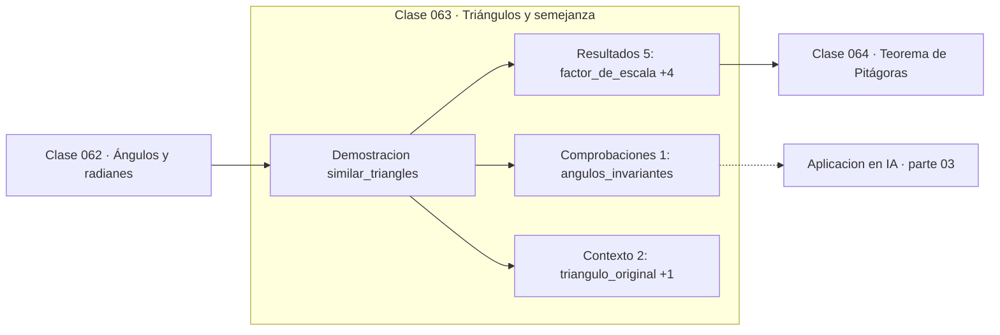

# 063 — Triángulos y semejanza

> [⬅️ 062 Ángulos y radianes](../062-angulos-y-radianes/README.md) · [📚 Parte 03](../README.md) · [🏠 Programa](../../../README.md) · [064 Teorema de Pitágoras ➡️](../064-teorema-de-pitagoras/README.md)

**Parte:** 03 — Geometría, trigonometría y geometría analítica · **Nivel:** `basico-intermedio` · **Horas estimadas:** 4
**Motor:** `engines.part03` · **Demostración:** `similar_triangles` · **Clase 3 de 20** de la parte

---

## 🎯 Propósito

**En figuras semejantes los ángulos se conservan, las longitudes escalan con k y las áreas con k².**

Del espacio a las coordenadas: distancia, ángulo, trigonometría, transformaciones lineales en el plano, coordenadas polares y proyección.

## ✅ Resultados de aprendizaje

Al terminar podrás:

1. Explicar **Triángulos y semejanza** con lenguaje cotidiano y con notación matemática.
2. Resolver un caso pequeño a mano y anticipar el orden de magnitud del resultado.
3. Ejecutar y modificar `lab.py`, que corre la demostración `similar_triangles`.
4. Interpretar las 8 salidas del laboratorio y decir qué comprueba cada una.
5. Detectar el error típico de esta parte: olvidar normalizar antes de comparar direcciones.

## 🧩 Fórmulas de la clase

```text
longitudes: L' = k·L
áreas: A' = k²·A
volúmenes: V' = k³·V
```

## 🗺️ Ubicación en el programa



## 📖 Fundamentos

Dos figuras son semejantes si tienen los mismos ángulos y sus lados son proporcionales.
La consecuencia que sorprende es la ley de escalado: al multiplicar las longitudes por
k, las áreas se multiplican por k² y los volúmenes por k³. Duplicar el tamaño de una
figura cuadruplica su área y octuplica su volumen.

Esta ley explica fenómenos aparentemente inconexos. Por qué los animales grandes tienen
extremidades proporcionalmente más gruesas (el peso crece con el volumen, la resistencia
del hueso con la sección); por qué una pizza de 40 cm tiene cuatro veces más superficie
que una de 20; por qué duplicar la resolución de una imagen cuadruplica los píxeles y,
con ellos, el coste de procesarla.

En computación la ley de escalado es la que convierte una decisión aparentemente menor
en un factor de coste. Pasar de imágenes de 224×224 a 448×448 no duplica el cómputo de
una CNN: lo cuadruplica. Y en la atención de un Transformer, la memoria crece con el
**cuadrado** de la longitud de secuencia, que es la razón de casi toda la investigación
en atención eficiente.

El criterio de semejanza AA —dos ángulos iguales bastan— es el que hace útil el
concepto: permite deducir proporcionalidad de lados sin medirlos, y es la base de la
trigonometría, donde las razones seno y coseno dependen solo del ángulo precisamente
porque todos los triángulos rectángulos con ese ángulo son semejantes.

## 🧮 Ejemplo trabajado

Escalar un triángulo 3-4-5 por k = 2.5.

```text
original:   catetos 3 y 4, hipotenusa 5
            perímetro 12,  área 6

escalado:   catetos 7.5 y 10, hipotenusa 12.5
            perímetro 30,  área 37.5

razón de perímetros: 30/12  = 2.5  = k     ✓
razón de áreas:      37.5/6 = 6.25 = k²    ✓

Los ángulos no cambian: 36.87°, 53.13°, 90°
```

## 🔬 Qué ejecuta el laboratorio

`similar_triangles` — Semejanza: los ángulos se conservan, las longitudes escalan.

| Grupo | Salidas |
|---|---|
| 🔢 Resultados numéricos (5) | `factor_de_escala`, `razon_de_perimetros`, `razon_de_areas`, `area_original`, `area_escalada` |
| ✅ Comprobaciones de invariante (1) | `angulos_invariantes` |

Las claves booleanas no son adorno: si alguna fuera `False`, el resultado numérico
no sería fiable aunque el programa terminase sin error.

```bash
python classes/part-03-geometria-trigonometria-y-geometria-analitica/063-triangulos-y-semejanza/lab.py
compmath run 063
```

> [!TIP]
> Antes de ejecutar, **escribe tu predicción**. Un laboratorio que confirma lo que
> esperabas enseña tanto como uno que te contradice, pero solo si la predicción
> existía antes del resultado.

## ⚠️ Errores conceptuales frecuentes

1. Suponer que al duplicar las dimensiones se duplica el área.
2. Comparar densidades o costes entre figuras de escalas distintas sin normalizar.
3. Olvidar que la semejanza exige ángulos iguales, no solo proporción de algunos lados.

## 🚀 Dónde se usa de verdad

Coste de procesar imágenes según resolución, memoria cuadrática de la atención,
escalado de mallas en gráficos y análisis dimensional en ingeniería.

## 🤖 Conexión con IA

Las transformaciones geométricas son el caso visual de las transformaciones lineales que una red aplica a sus activaciones; la similitud coseno es trigonometría en alta dimensión.

## 📓 Notebooks

| Archivo | Para qué |
|---|---|
| [`notebook.ipynb`](notebook.ipynb) | recorrido guiado con la demostración ejecutada |
| [`notebook_student.ipynb`](notebook_student.ipynb) | versión con `TODO` para resolver |
| [`notebook_solution.ipynb`](notebook_solution.ipynb) | solución de referencia verificada |

## 📝 Evaluación

| Criterio | Peso |
|---|---:|
| Comprensión conceptual | 25 % |
| Resolución manual | 25 % |
| Implementación y verificación | 25 % |
| Interpretación y comunicación | 15 % |
| Conexión con aplicación real | 10 % |

Detalle y criterios de error crítico en [`assessment.md`](assessment.md).

## ❓ Preguntas de comprobación

1. ¿Cuál es la entrada, cuál la salida y qué unidades tienen?
2. ¿Qué operación domina el comportamiento del resultado?
3. ¿Qué caso extremo revelaría un error conceptual?
4. ¿Cómo verificarías el resultado por un método independiente?
5. ¿Dónde aparece esto en gráficos por computador?

Si necesitas releer el código para responderlas, la clase todavía no está superada.

## 📥 Entregable

`notebook_student.ipynb` resuelto más un párrafo que explique el resultado **sin citar
código**: qué entra, qué sale, qué invariante se comprueba y qué pasaría en un caso límite.

## 📚 Bibliografía de la clase

Esta clase enseña **Geometría y trigonometría**. Cada obra dice qué aporta aquí y cómo se comprobó su localizador:

- [Coxeter, H. S. M. *Introduction to Geometry*, 2ª ed., Wiley, 1989](https://www.wiley.com/en-us/Introduction+to+Geometry%2C+2nd+Edition-p-9780471504580) — Geometría y trigonometría: el tema de esta clase · ISBN-13 `9780471504580` verificado en International ISBN Agency (2026-08-19).
- [Haldane, J. B. S. *On Being the Right Size*, 1926](https://www.phys.ufl.edu/courses/phy3221/spring10/HaldaneRightSize.pdf) — Geometría y trigonometría: el tema de esta clase · URL de la fuente primaria, pendiente de resolver.

Bibliografía de todas las clases, con el porqué de cada obra, en [`docs/BIBLIOGRAPHY.md`](../../../docs/BIBLIOGRAPHY.md) · localizador y estado de cada obra en [`sources/bibliography.json`](../../../sources/bibliography.json).

## 📂 Material de la clase

[`intuition.md`](intuition.md) · [`theory.md`](theory.md) · [`derivation.md`](derivation.md) · [`exercises.md`](exercises.md) · [`assessment.md`](assessment.md) · [`where-is-this-used.md`](where-is-this-used.md) · [`lesson.yaml`](lesson.yaml)

---

> [⬅️ 062 Ángulos y radianes](../062-angulos-y-radianes/README.md) · [📚 Parte 03](../README.md) · [🏠 Programa](../../../README.md) · [064 Teorema de Pitágoras ➡️](../064-teorema-de-pitagoras/README.md)
