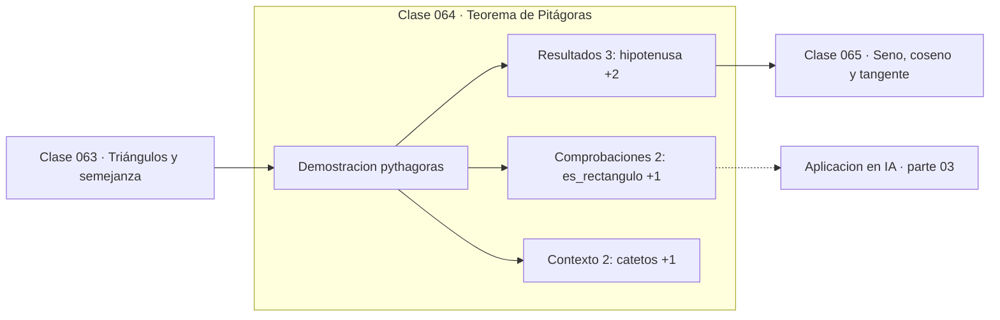

# 064 — Teorema de Pitágoras

> [⬅️ 063 Triángulos y semejanza](../063-triangulos-y-semejanza/README.md) · [📚 Parte 03](../README.md) · [🏠 Programa](../../../README.md) · [065 Seno, coseno y tangente ➡️](../065-seno-coseno-y-tangente/README.md)

**Parte:** 03 — Geometría, trigonometría y geometría analítica · **Nivel:** `basico-intermedio` · **Horas estimadas:** 4
**Motor:** `engines.part03` · **Demostración:** `pythagoras` · **Clase 4 de 20** de la parte

---

## 🎯 Propósito

**El teorema de Pitágoras y su recíproco caracterizan el ángulo recto; las ternas se generan sistemáticamente.**

Del espacio a las coordenadas: distancia, ángulo, trigonometría, transformaciones lineales en el plano, coordenadas polares y proyección.

## ✅ Resultados de aprendizaje

Al terminar podrás:

1. Explicar **Teorema de Pitágoras** con lenguaje cotidiano y con notación matemática.
2. Resolver un caso pequeño a mano y anticipar el orden de magnitud del resultado.
3. Ejecutar y modificar `lab.py`, que corre la demostración `pythagoras`.
4. Interpretar las 7 salidas del laboratorio y decir qué comprueba cada una.
5. Detectar el error típico de esta parte: mezclar grados y radianes en la misma expresión.

## 🧩 Fórmulas de la clase

```text
a² + b² = c²  ⟺  el triángulo es rectángulo
generador: a = m²−n²,  b = 2mn,  c = m²+n²  (m > n > 0)
```

## 🗺️ Ubicación en el programa



## 📖 Fundamentos

El teorema de Pitágoras es la relación métrica más usada de toda la matemática
computacional, aunque casi nunca se la llame por su nombre: cada vez que se calcula una
norma euclídea, se está aplicando. Su recíproco es igual de útil: si `a² + b² = c²`,
el triángulo **es** rectángulo, lo que da una prueba de perpendicularidad sin medir
ángulos.

Las ternas pitagóricas —tríos de enteros que lo cumplen— se generan con la fórmula de
Euclides a partir de dos enteros m > n: `(m²−n², 2mn, m²+n²)`. Con m=2, n=1 sale la
(3,4,5); con m=3, n=2 la (5,12,13). Que exista una parametrización completa es un
resultado clásico de teoría de números, y conecta esta clase con la parte 04.

La generalización a n dimensiones es directa: `‖v‖² = Σvᵢ²`. Y la generalización
conceptual es aún más importante: en cualquier espacio con producto interno, si dos
vectores son ortogonales entonces `‖u+v‖² = ‖u‖² + ‖v‖²`. Ese es el teorema de
Pitágoras abstracto, y es lo que hace que la descomposición de la varianza en
estadística funcione (clase 214) y que la proyección ortogonal sea la mejor
aproximación (clase 119).

Una precaución numérica: calcular `√(a² + b²)` directamente puede desbordar si a o b
son grandes, aunque el resultado quepa. Por eso existe `math.hypot`, que reescala antes
de elevar al cuadrado.

## 🧮 Ejemplo trabajado

Generar una terna y verificar el recíproco.

```text
Generador con m = 3, n = 2:
  a = 9 − 4 = 5
  b = 2·3·2 = 12
  c = 9 + 4 = 13

Verificación:  25 + 144 = 169 = 13²      ✓ rectángulo

Contraejemplo:  triángulo 5-5-7
  25 + 25 = 50 ≠ 49 = 7²                 ✗ no es rectángulo

Precaución numérica:
  √(1e200² + 1e200²) desborda
  math.hypot(1e200, 1e200) = 1.414e200    ✓
```

## 🔬 Qué ejecuta el laboratorio

`pythagoras` — Pitágoras, su recíproco y una terna pitagórica generada.

| Grupo | Salidas |
|---|---|
| 🔢 Resultados numéricos (3) | `hipotenusa`, `a²+b²`, `c²` |
| ✅ Comprobaciones de invariante (2) | `es_rectangulo`, `triangulo_5_5_7_es_rectangulo` |

Las claves booleanas no son adorno: si alguna fuera `False`, el resultado numérico
no sería fiable aunque el programa terminase sin error.

```bash
python classes/part-03-geometria-trigonometria-y-geometria-analitica/064-teorema-de-pitagoras/lab.py
compmath run 064
```

> [!TIP]
> Antes de ejecutar, **escribe tu predicción**. Un laboratorio que confirma lo que
> esperabas enseña tanto como uno que te contradice, pero solo si la predicción
> existía antes del resultado.

## ⚠️ Errores conceptuales frecuentes

1. Aplicar el teorema a un triángulo que no es rectángulo.
2. Calcular √(a²+b²) directamente con valores grandes en lugar de usar hypot.
3. Confundir el teorema (rectángulo ⟹ relación) con su recíproco (relación ⟹ rectángulo); ambos son ciertos, pero son afirmaciones distintas.

## 🚀 Dónde se usa de verdad

Norma euclídea, cálculo de distancias, verificación de ortogonalidad, descomposición de
la varianza y el teorema de Pitágoras en espacios de Hilbert.

## 🤖 Conexión con IA

Las transformaciones geométricas son el caso visual de las transformaciones lineales que una red aplica a sus activaciones; la similitud coseno es trigonometría en alta dimensión.

## 📓 Notebooks

| Archivo | Para qué |
|---|---|
| [`notebook.ipynb`](notebook.ipynb) | recorrido guiado con la demostración ejecutada |
| [`notebook_student.ipynb`](notebook_student.ipynb) | versión con `TODO` para resolver |
| [`notebook_solution.ipynb`](notebook_solution.ipynb) | solución de referencia verificada |

## 📝 Evaluación

| Criterio | Peso |
|---|---:|
| Comprensión conceptual | 25 % |
| Resolución manual | 25 % |
| Implementación y verificación | 25 % |
| Interpretación y comunicación | 15 % |
| Conexión con aplicación real | 10 % |

Detalle y criterios de error crítico en [`assessment.md`](assessment.md).

## ❓ Preguntas de comprobación

1. ¿Cuál es la entrada, cuál la salida y qué unidades tienen?
2. ¿Qué operación domina el comportamiento del resultado?
3. ¿Qué caso extremo revelaría un error conceptual?
4. ¿Cómo verificarías el resultado por un método independiente?
5. ¿Dónde aparece esto en gráficos por computador?

Si necesitas releer el código para responderlas, la clase todavía no está superada.

## 📥 Entregable

`notebook_student.ipynb` resuelto más un párrafo que explique el resultado **sin citar
código**: qué entra, qué sale, qué invariante se comprueba y qué pasaría en un caso límite.

## 📚 Bibliografía de la clase

Esta clase enseña **Geometría y trigonometría**. Cada obra dice qué aporta aquí y cómo se comprobó su localizador:

- [Python: `math.hypot`](https://docs.python.org/3/library/math.html#math.hypot) — documentación de la herramienta que ejecuta el laboratorio · URL de la fuente primaria comprobada en Python Software Foundation (2026-08-19).
- [Maor, E. *The Pythagorean Theorem: A 4,000-Year History*. Princeton, 2007](https://press.princeton.edu/books/paperback/9780691196886/the-pythagorean-theorem) — Geometría y trigonometría: el tema de esta clase · ISBN-13 `9780691196886` verificado en International ISBN Agency (2026-08-19).

Bibliografía de todas las clases, con el porqué de cada obra, en [`docs/BIBLIOGRAPHY.md`](../../../docs/BIBLIOGRAPHY.md) · localizador y estado de cada obra en [`sources/bibliography.json`](../../../sources/bibliography.json).

## 📂 Material de la clase

[`intuition.md`](intuition.md) · [`theory.md`](theory.md) · [`derivation.md`](derivation.md) · [`exercises.md`](exercises.md) · [`assessment.md`](assessment.md) · [`where-is-this-used.md`](where-is-this-used.md) · [`lesson.yaml`](lesson.yaml)

---

> [⬅️ 063 Triángulos y semejanza](../063-triangulos-y-semejanza/README.md) · [📚 Parte 03](../README.md) · [🏠 Programa](../../../README.md) · [065 Seno, coseno y tangente ➡️](../065-seno-coseno-y-tangente/README.md)
