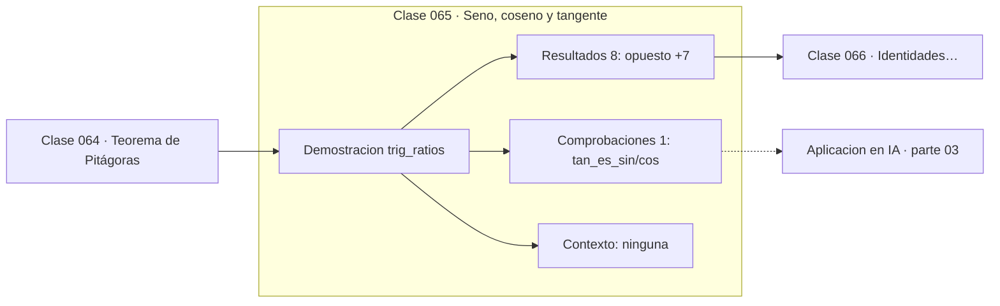

# 065 — Seno, coseno y tangente

> [⬅️ 064 Teorema de Pitágoras](../064-teorema-de-pitagoras/README.md) · [📚 Parte 03](../README.md) · [🏠 Programa](../../../README.md) · [066 Identidades trigonométricas básicas ➡️](../066-identidades-trigonometricas-basicas/README.md)

**Parte:** 03 — Geometría, trigonometría y geometría analítica · **Nivel:** `basico-intermedio` · **Horas estimadas:** 4
**Motor:** `engines.part03` · **Demostración:** `trig_ratios` · **Clase 5 de 20** de la parte

---

## 🎯 Propósito

**Seno, coseno y tangente son razones que dependen solo del ángulo, por semejanza de triángulos.**

Del espacio a las coordenadas: distancia, ángulo, trigonometría, transformaciones lineales en el plano, coordenadas polares y proyección.

## ✅ Resultados de aprendizaje

Al terminar podrás:

1. Explicar **Seno, coseno y tangente** con lenguaje cotidiano y con notación matemática.
2. Resolver un caso pequeño a mano y anticipar el orden de magnitud del resultado.
3. Ejecutar y modificar `lab.py`, que corre la demostración `trig_ratios`.
4. Interpretar las 9 salidas del laboratorio y decir qué comprueba cada una.
5. Detectar el error típico de esta parte: aplicar rotación y traslación en el orden equivocado.

## 🧩 Fórmulas de la clase

```text
sin θ = opuesto/hipotenusa,  cos θ = adyacente/hipotenusa
tan θ = sin θ / cos θ
atan2(y, x) devuelve el ángulo en el cuadrante correcto
```

## 🗺️ Ubicación en el programa



## 📖 Fundamentos

Las razones trigonométricas están bien definidas gracias a la semejanza (clase 063):
todos los triángulos rectángulos con el mismo ángulo agudo son semejantes, así que la
razón entre dos de sus lados no depende del tamaño del triángulo, solo del ángulo. Sin
ese hecho, «el seno de 30°» no significaría nada.

La tangente es el cociente de las otras dos, y por eso no está definida donde el coseno
se anula: en 90° y 270° la tangente diverge. Esa singularidad es real y hay que
manejarla; en implementaciones se evita la tangente siempre que se pueda, usando
directamente seno y coseno.

Para recuperar el ángulo a partir de las coordenadas, la función correcta es **atan2**,
no `atan`. `atan(y/x)` pierde la información del cuadrante —el cociente es el mismo para
(1,1) y (−1,−1)— y además falla si x es cero. `atan2(y, x)` recibe los dos argumentos
por separado, devuelve el ángulo en el rango (−π, π] y maneja los cuatro cuadrantes.
Usar `atan` donde correspondía `atan2` es un error clásico en robótica y gráficos.

El programa usa estas razones en la clase 076 (coordenadas polares), en la 323
(positional encoding, construido con senos y cosenos de frecuencias distintas) y en
cualquier cálculo de ángulo entre vectores.

## 🧮 Ejemplo trabajado

Triángulo con catetos 3 y 4.

```text
opuesto = 3,  adyacente = 4
hipotenusa = √(9+16) = 5

θ = atan2(3, 4) = 0.6435 rad = 36.87°

sin θ = 3/5 = 0.6
cos θ = 4/5 = 0.8
tan θ = 3/4 = 0.75

Comprobación: tan θ = sin θ / cos θ = 0.6/0.8 = 0.75    ✓

Por qué atan2 y no atan:
  atan(3/4)   = 0.6435   (cuadrante I)
  atan(-3/-4) = 0.6435   ← ¡mismo valor, cuadrante III!
  atan2(-3,-4) = -2.498  ✓ correcto
```

## 🔬 Qué ejecuta el laboratorio

`trig_ratios` — Seno, coseno y tangente sobre un triángulo rectángulo concreto.

| Grupo | Salidas |
|---|---|
| 🔢 Resultados numéricos (8) | `opuesto`, `adyacente`, `hipotenusa`, `angulo_rad`, `angulo_grados`, `sin`, `cos`, `tan` |
| ✅ Comprobaciones de invariante (1) | `tan_es_sin/cos` |

Las claves booleanas no son adorno: si alguna fuera `False`, el resultado numérico
no sería fiable aunque el programa terminase sin error.

```bash
python classes/part-03-geometria-trigonometria-y-geometria-analitica/065-seno-coseno-y-tangente/lab.py
compmath run 065
```

> [!TIP]
> Antes de ejecutar, **escribe tu predicción**. Un laboratorio que confirma lo que
> esperabas enseña tanto como uno que te contradice, pero solo si la predicción
> existía antes del resultado.

## ⚠️ Errores conceptuales frecuentes

1. Usar atan(y/x) en lugar de atan2(y, x) y perder el cuadrante.
2. Evaluar la tangente cerca de 90° sin controlar la singularidad.
3. Confundir cateto opuesto con adyacente al identificar el ángulo.

## 🚀 Dónde se usa de verdad

Cálculo de ángulos en robótica y gráficos, conversión a coordenadas polares, positional
encoding y análisis de fase en señales.

## 🤖 Conexión con IA

Las transformaciones geométricas son el caso visual de las transformaciones lineales que una red aplica a sus activaciones; la similitud coseno es trigonometría en alta dimensión.

## 📓 Notebooks

| Archivo | Para qué |
|---|---|
| [`notebook.ipynb`](notebook.ipynb) | recorrido guiado con la demostración ejecutada |
| [`notebook_student.ipynb`](notebook_student.ipynb) | versión con `TODO` para resolver |
| [`notebook_solution.ipynb`](notebook_solution.ipynb) | solución de referencia verificada |

## 📝 Evaluación

| Criterio | Peso |
|---|---:|
| Comprensión conceptual | 25 % |
| Resolución manual | 25 % |
| Implementación y verificación | 25 % |
| Interpretación y comunicación | 15 % |
| Conexión con aplicación real | 10 % |

Detalle y criterios de error crítico en [`assessment.md`](assessment.md).

## ❓ Preguntas de comprobación

1. ¿Cuál es la entrada, cuál la salida y qué unidades tienen?
2. ¿Qué operación domina el comportamiento del resultado?
3. ¿Qué caso extremo revelaría un error conceptual?
4. ¿Cómo verificarías el resultado por un método independiente?
5. ¿Dónde aparece esto en gráficos por computador?

Si necesitas releer el código para responderlas, la clase todavía no está superada.

## 📥 Entregable

`notebook_student.ipynb` resuelto más un párrafo que explique el resultado **sin citar
código**: qué entra, qué sale, qué invariante se comprueba y qué pasaría en un caso límite.

## 🔗 Referencias

- [Python: `math.atan2`](https://docs.python.org/3/library/math.html#math.atan2) — *uso:* documentación de la herramienta que ejecuta el laboratorio en «Seno, coseno y tangente».
- [Lengyel, E. *Mathematics for 3D Game Programming and Computer Graphics*, 3ª ed., 2011](https://www.cengage.com/c/mathematics-for-3d-game-programming-and-computer-graphics-3e-lengyel/) — *uso:* obra de referencia consultada en «Seno, coseno y tangente».

Bibliografía completa de la parte en [`../../../docs/BIBLIOGRAPHY.md`](../../../docs/BIBLIOGRAPHY.md) · localizador verificable de cada obra en [`sources/bibliography.json`](../../../sources/bibliography.json).

## 📂 Material de la clase

[`intuition.md`](intuition.md) · [`theory.md`](theory.md) · [`derivation.md`](derivation.md) · [`exercises.md`](exercises.md) · [`assessment.md`](assessment.md) · [`where-is-this-used.md`](where-is-this-used.md) · [`lesson.yaml`](lesson.yaml)

---

> [⬅️ 064 Teorema de Pitágoras](../064-teorema-de-pitagoras/README.md) · [📚 Parte 03](../README.md) · [🏠 Programa](../../../README.md) · [066 Identidades trigonométricas básicas ➡️](../066-identidades-trigonometricas-basicas/README.md)
