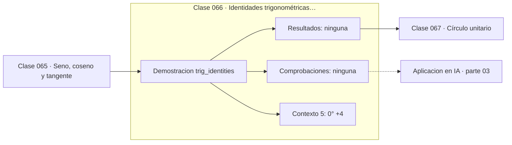

# 066 — Identidades trigonométricas básicas

> [⬅️ 065 Seno, coseno y tangente](../065-seno-coseno-y-tangente/README.md) · [📚 Parte 03](../README.md) · [🏠 Programa](../../../README.md) · [067 Círculo unitario ➡️](../067-circulo-unitario/README.md)

**Parte:** 03 — Geometría, trigonometría y geometría analítica · **Nivel:** `basico-intermedio` · **Horas estimadas:** 4
**Motor:** `engines.part03` · **Demostración:** `trig_identities` · **Clase 6 de 20** de la parte

---

## 🎯 Propósito

**La identidad pitagórica es el teorema de Pitágoras sobre el círculo unitario; de ella se derivan las demás.**

Del espacio a las coordenadas: distancia, ángulo, trigonometría, transformaciones lineales en el plano, coordenadas polares y proyección.

## ✅ Resultados de aprendizaje

Al terminar podrás:

1. Explicar **Identidades trigonométricas básicas** con lenguaje cotidiano y con notación matemática.
2. Resolver un caso pequeño a mano y anticipar el orden de magnitud del resultado.
3. Ejecutar y modificar `lab.py`, que corre la demostración `trig_identities`.
4. Interpretar las 5 salidas del laboratorio y decir qué comprueba cada una.
5. Detectar el error típico de esta parte: olvidar normalizar antes de comparar direcciones.

## 🧩 Fórmulas de la clase

```text
sin²θ + cos²θ = 1
sin(2θ) = 2 sin θ cos θ
cos(2θ) = cos²θ − sin²θ
```

## 🗺️ Ubicación en el programa



## 📖 Fundamentos

La identidad fundamental `sin²θ + cos²θ = 1` no es una fórmula que memorizar: es el
teorema de Pitágoras aplicado al triángulo que forma un punto del círculo unitario con
los ejes. La hipotenusa es el radio, que vale 1, y los catetos son el coseno y el seno.
Verla así hace innecesario recordarla.

De ella se derivan las demás mediante las fórmulas de suma de ángulos. La del ángulo
doble, `sin(2θ) = 2 sin θ cos θ`, es el caso particular de `sin(a+b)` con a = b, y su
utilidad es de eficiencia: permite calcular una función de 2θ sin evaluar la función
trigonométrica de nuevo.

Las identidades cumplen además un papel de **verificación**: comprobar que
`sin²θ + cos²θ` da 1 en varios ángulos es una prueba barata de que una implementación
trigonométrica funciona. En punto flotante el resultado no será exactamente 1, y esa
desviación —del orden del epsilon de máquina— es una medida de la calidad de la
biblioteca.

En procesamiento de señales estas identidades permiten reescribir productos de
senoidales como sumas, que es lo que hace la modulación y lo que subyace al análisis de
Fourier de la parte 13. Y en el positional encoding de los Transformers, la fórmula de
suma de ángulos es la que garantiza que un desplazamiento de posición sea una
transformación lineal de la codificación.

## 🧮 Ejemplo trabajado

Verificar las identidades en cinco ángulos.

```text
θ       sin²+cos²    sin(2θ)      2·sin·cos    coinciden
0°      1.000000     0.000000     0.000000     ✓
30°     1.000000     0.866025     0.866025     ✓
45°     1.000000     1.000000     1.000000     ✓
60°     1.000000     0.866025     0.866025     ✓
90°     1.000000     0.000000     0.000000     ✓

Nota numérica: sin²+cos² da 1.0 con error < 1e−16
(es una prueba de calidad de la implementación)
```

## 🔬 Qué ejecuta el laboratorio

`trig_identities` — Identidades fundamentales verificadas en varios ángulos.

| Grupo | Salidas |
|---|---|
| 🔢 Resultados numéricos (0) | — |
| ✅ Comprobaciones de invariante (0) | — |

Las claves booleanas no son adorno: si alguna fuera `False`, el resultado numérico
no sería fiable aunque el programa terminase sin error.

```bash
python classes/part-03-geometria-trigonometria-y-geometria-analitica/066-identidades-trigonometricas-basicas/lab.py
compmath run 066
```

> [!TIP]
> Antes de ejecutar, **escribe tu predicción**. Un laboratorio que confirma lo que
> esperabas enseña tanto como uno que te contradice, pero solo si la predicción
> existía antes del resultado.

## ⚠️ Errores conceptuales frecuentes

1. Memorizar las identidades en lugar de derivarlas del círculo unitario.
2. Comparar identidades con == en punto flotante en lugar de con tolerancia.
3. Confundir sin²θ con sin(θ²).

## 🚀 Dónde se usa de verdad

Simplificación de expresiones trigonométricas, modulación de señales, verificación de
bibliotecas matemáticas y la construcción del positional encoding.

## 🤖 Conexión con IA

Las transformaciones geométricas son el caso visual de las transformaciones lineales que una red aplica a sus activaciones; la similitud coseno es trigonometría en alta dimensión.

## 📓 Notebooks

| Archivo | Para qué |
|---|---|
| [`notebook.ipynb`](notebook.ipynb) | recorrido guiado con la demostración ejecutada |
| [`notebook_student.ipynb`](notebook_student.ipynb) | versión con `TODO` para resolver |
| [`notebook_solution.ipynb`](notebook_solution.ipynb) | solución de referencia verificada |

## 📝 Evaluación

| Criterio | Peso |
|---|---:|
| Comprensión conceptual | 25 % |
| Resolución manual | 25 % |
| Implementación y verificación | 25 % |
| Interpretación y comunicación | 15 % |
| Conexión con aplicación real | 10 % |

Detalle y criterios de error crítico en [`assessment.md`](assessment.md).

## ❓ Preguntas de comprobación

1. ¿Cuál es la entrada, cuál la salida y qué unidades tienen?
2. ¿Qué operación domina el comportamiento del resultado?
3. ¿Qué caso extremo revelaría un error conceptual?
4. ¿Cómo verificarías el resultado por un método independiente?
5. ¿Dónde aparece esto en gráficos por computador?

Si necesitas releer el código para responderlas, la clase todavía no está superada.

## 📥 Entregable

`notebook_student.ipynb` resuelto más un párrafo que explique el resultado **sin citar
código**: qué entra, qué sale, qué invariante se comprueba y qué pasaría en un caso límite.

## 📚 Bibliografía de la clase

Esta clase enseña **Geometría y trigonometría**. Cada obra dice qué aporta aquí y cómo se comprobó su localizador:

- [Gelfand, I. M.; Saul, M. *Trigonometry*. Birkhäuser, 2001](https://link.springer.com/book/10.1007/978-1-4612-0149-8) — Geometría y trigonometría: el tema de esta clase · DOI `10.1007/978-1-4612-0149-8`, pendiente de resolver.
- [Vaswani, A. et al. *Attention Is All You Need*. NeurIPS, 2017 (sección 3.5)](https://arxiv.org/abs/1706.03762) — Deep learning y Modelos de lenguaje: conexión declarada de esta parte · DOI `10.48550/arxiv.1706.03762` verificado en DataCite (2026-08-19).

Bibliografía de todas las clases, con el porqué de cada obra, en [`docs/BIBLIOGRAPHY.md`](../../../docs/BIBLIOGRAPHY.md) · localizador y estado de cada obra en [`sources/bibliography.json`](../../../sources/bibliography.json).

## 📂 Material de la clase

[`intuition.md`](intuition.md) · [`theory.md`](theory.md) · [`derivation.md`](derivation.md) · [`exercises.md`](exercises.md) · [`assessment.md`](assessment.md) · [`where-is-this-used.md`](where-is-this-used.md) · [`lesson.yaml`](lesson.yaml)

---

> [⬅️ 065 Seno, coseno y tangente](../065-seno-coseno-y-tangente/README.md) · [📚 Parte 03](../README.md) · [🏠 Programa](../../../README.md) · [067 Círculo unitario ➡️](../067-circulo-unitario/README.md)
