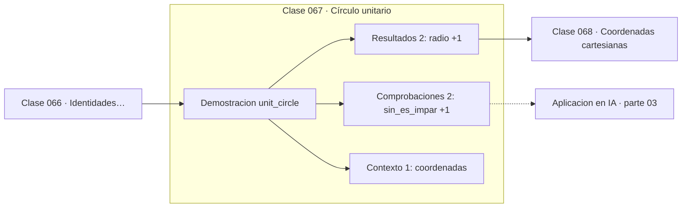

# 067 — Círculo unitario

> [⬅️ 066 Identidades trigonométricas básicas](../066-identidades-trigonometricas-basicas/README.md) · [📚 Parte 03](../README.md) · [🏠 Programa](../../../README.md) · [068 Coordenadas cartesianas ➡️](../068-coordenadas-cartesianas/README.md)

**Parte:** 03 — Geometría, trigonometría y geometría analítica · **Nivel:** `basico-intermedio` · **Horas estimadas:** 4
**Motor:** `engines.part03` · **Demostración:** `unit_circle` · **Clase 7 de 20** de la parte

---

## 🎯 Propósito

**El círculo unitario extiende seno y coseno a cualquier ángulo real y muestra su periodicidad y paridad.**

Del espacio a las coordenadas: distancia, ángulo, trigonometría, transformaciones lineales en el plano, coordenadas polares y proyección.

## ✅ Resultados de aprendizaje

Al terminar podrás:

1. Explicar **Círculo unitario** con lenguaje cotidiano y con notación matemática.
2. Resolver un caso pequeño a mano y anticipar el orden de magnitud del resultado.
3. Ejecutar y modificar `lab.py`, que corre la demostración `unit_circle`.
4. Interpretar las 5 salidas del laboratorio y decir qué comprueba cada una.
5. Detectar el error típico de esta parte: mezclar grados y radianes en la misma expresión.

## 🧩 Fórmulas de la clase

```text
punto del círculo: (cos θ, sin θ)
periodo: sin(θ + 2π) = sin θ
paridad: sin(−θ) = −sin θ,  cos(−θ) = cos θ
```

## 🗺️ Ubicación en el programa



## 📖 Fundamentos

El triángulo rectángulo solo define las razones trigonométricas para ángulos entre 0 y
90°. El círculo unitario las extiende a **cualquier** número real: el punto que resulta
de recorrer un arco de longitud θ desde (1,0) tiene coordenadas `(cos θ, sin θ)`, y esa
definición funciona para ángulos negativos, mayores que una vuelta o irracionales.

De esa definición se leen dos propiedades sin cálculo. La **periodicidad**: dar una
vuelta completa devuelve al mismo punto, así que `sin(θ + 2π) = sin θ`. Y la
**paridad**: reflejar respecto al eje x cambia el signo de la ordenada pero no de la
abscisa, así que el seno es impar y el coseno es par.

La periodicidad tiene una consecuencia práctica que conviene tener presente: los
ángulos no son comparables directamente. La diferencia entre 359° y 1° es de 2°, no de
358°. Calcular diferencias angulares exige normalizar al rango (−π, π], y olvidarlo
produce saltos bruscos en robótica y en seguimiento de orientación.

La tabla de valores notables —0, 90, 180, 270, 360— conviene poder reconstruirla
mirando el círculo en lugar de memorizarla: en 90° el punto es (0,1), así que el coseno
es 0 y el seno 1. Numéricamente hay un detalle: `cos(π/2)` no da exactamente 0 sino
6.1e−17, porque π/2 no es representable exactamente.

## 🧮 Ejemplo trabajado

Coordenadas en los ángulos notables.

```text
ángulo    (cos, sin)
  0°      ( 1,  0)
 90°      ( 0,  1)
180°      (−1,  0)
270°      ( 0, −1)
360°      ( 1,  0)      ← igual que 0°: periodo 2π

Paridad:
  sin(−1) = −0.841471 = −sin(1)     ✓ impar
  cos(−1) =  0.540302 =  cos(1)     ✓ par

Detalle numérico: cos(π/2) = 6.12e−17, no exactamente 0
(π/2 no es representable en float64)
```

## 🔬 Qué ejecuta el laboratorio

`unit_circle` — El círculo unitario como diccionario de ángulos notables.

| Grupo | Salidas |
|---|---|
| 🔢 Resultados numéricos (2) | `radio`, `periodo_sin` |
| ✅ Comprobaciones de invariante (2) | `sin_es_impar`, `cos_es_par` |

Las claves booleanas no son adorno: si alguna fuera `False`, el resultado numérico
no sería fiable aunque el programa terminase sin error.

```bash
python classes/part-03-geometria-trigonometria-y-geometria-analitica/067-circulo-unitario/lab.py
compmath run 067
```

> [!TIP]
> Antes de ejecutar, **escribe tu predicción**. Un laboratorio que confirma lo que
> esperabas enseña tanto como uno que te contradice, pero solo si la predicción
> existía antes del resultado.

## ⚠️ Errores conceptuales frecuentes

1. Restar ángulos sin normalizar el resultado al rango (−π, π].
2. Esperar que cos(π/2) sea exactamente 0.
3. Limitar la definición de seno y coseno a ángulos agudos.

## 🚀 Dónde se usa de verdad

Orientación en robótica, ángulos de fase en señales, animación cíclica y cualquier
fenómeno periódico. La periodicidad es la propiedad que explota Fourier.

## 🤖 Conexión con IA

Las transformaciones geométricas son el caso visual de las transformaciones lineales que una red aplica a sus activaciones; la similitud coseno es trigonometría en alta dimensión.

## 📓 Notebooks

| Archivo | Para qué |
|---|---|
| [`notebook.ipynb`](notebook.ipynb) | recorrido guiado con la demostración ejecutada |
| [`notebook_student.ipynb`](notebook_student.ipynb) | versión con `TODO` para resolver |
| [`notebook_solution.ipynb`](notebook_solution.ipynb) | solución de referencia verificada |

## 📝 Evaluación

| Criterio | Peso |
|---|---:|
| Comprensión conceptual | 25 % |
| Resolución manual | 25 % |
| Implementación y verificación | 25 % |
| Interpretación y comunicación | 15 % |
| Conexión con aplicación real | 10 % |

Detalle y criterios de error crítico en [`assessment.md`](assessment.md).

## ❓ Preguntas de comprobación

1. ¿Cuál es la entrada, cuál la salida y qué unidades tienen?
2. ¿Qué operación domina el comportamiento del resultado?
3. ¿Qué caso extremo revelaría un error conceptual?
4. ¿Cómo verificarías el resultado por un método independiente?
5. ¿Dónde aparece esto en gráficos por computador?

Si necesitas releer el código para responderlas, la clase todavía no está superada.

## 📥 Entregable

`notebook_student.ipynb` resuelto más un párrafo que explique el resultado **sin citar
código**: qué entra, qué sale, qué invariante se comprueba y qué pasaría en un caso límite.

## 🔗 Referencias

- [Gelfand, I. M.; Saul, M. *Trigonometry*. Birkhäuser, 2001](https://link.springer.com/book/10.1007/978-1-4612-0149-8)
- [Python: `math.fmod` y normalización de ángulos](https://docs.python.org/3/library/math.html#math.fmod)

Bibliografía completa de la parte en [`../../../docs/BIBLIOGRAPHY.md`](../../../docs/BIBLIOGRAPHY.md).

## 📂 Material de la clase

[`intuition.md`](intuition.md) · [`theory.md`](theory.md) · [`derivation.md`](derivation.md) · [`exercises.md`](exercises.md) · [`assessment.md`](assessment.md) · [`where-is-this-used.md`](where-is-this-used.md) · [`lesson.yaml`](lesson.yaml)

---

> [⬅️ 066 Identidades trigonométricas básicas](../066-identidades-trigonometricas-basicas/README.md) · [📚 Parte 03](../README.md) · [🏠 Programa](../../../README.md) · [068 Coordenadas cartesianas ➡️](../068-coordenadas-cartesianas/README.md)
