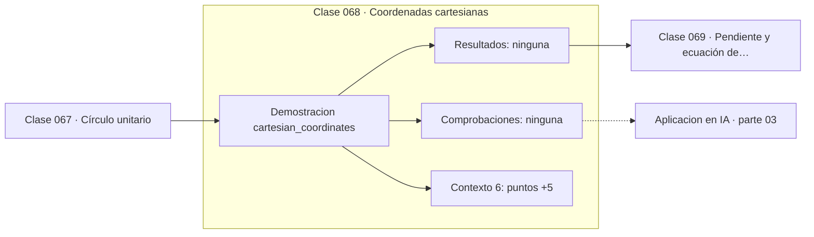

# 068 — Coordenadas cartesianas

> [⬅️ 067 Círculo unitario](../067-circulo-unitario/README.md) · [📚 Parte 03](../README.md) · [🏠 Programa](../../../README.md) · [069 Pendiente y ecuación de la recta ➡️](../069-pendiente-y-ecuacion-de-la-recta/README.md)

**Parte:** 03 — Geometría, trigonometría y geometría analítica · **Nivel:** `basico-intermedio` · **Horas estimadas:** 4
**Motor:** `engines.part03` · **Demostración:** `cartesian_coordinates` · **Clase 8 de 20** de la parte

---

## 🎯 Propósito

**Las coordenadas convierten preguntas geométricas en preguntas algebraicas.**

Del espacio a las coordenadas: distancia, ángulo, trigonometría, transformaciones lineales en el plano, coordenadas polares y proyección.

## ✅ Resultados de aprendizaje

Al terminar podrás:

1. Explicar **Coordenadas cartesianas** con lenguaje cotidiano y con notación matemática.
2. Resolver un caso pequeño a mano y anticipar el orden de magnitud del resultado.
3. Ejecutar y modificar `lab.py`, que corre la demostración `cartesian_coordinates`.
4. Interpretar las 6 salidas del laboratorio y decir qué comprueba cada una.
5. Detectar el error típico de esta parte: aplicar rotación y traslación en el orden equivocado.

## 🧩 Fórmulas de la clase

```text
simetría respecto a x: (a, b) → (a, −b)
simetría respecto a y: (a, b) → (−a, b)
simetría respecto al origen: (a, b) → (−a, −b)
```

## 🗺️ Ubicación en el programa



## 📖 Fundamentos

La idea de Descartes —identificar el plano con ℝ²— es probablemente la más productiva
de la matemática moderna. Convierte la geometría en álgebra: una recta es una ecuación,
una circunferencia es otra, y la intersección de dos figuras es la solución de un
sistema. Sin ella no habría gráficos por computador ni análisis de datos.

Los cuatro cuadrantes se numeran en sentido antihorario empezando por el de coordenadas
positivas. Esa convención importa al interpretar `atan2`, cuyo signo depende del
cuadrante, y al leer gráficas donde el eje y crece hacia abajo —convención habitual en
pantallas e imágenes, que invierte el sentido de las rotaciones.

Las simetrías se expresan como cambios de signo, y ese es el primer ejemplo de que una
transformación geométrica es una operación algebraica sobre coordenadas. La reflexión
respecto al eje x es la matriz `diag(1, −1)`, y su determinante negativo indica que
invierte la orientación (clase 075).

En machine learning el «espacio de features» es literalmente un espacio de coordenadas,
y cada observación es un punto. Toda la intuición geométrica de esta parte —distancia,
proyección, frontera— se traslada directamente allí, con la advertencia de la clase 061
sobre la alta dimensión.

## 🧮 Ejemplo trabajado

Los cuatro cuadrantes y las simetrías.

```text
punto      cuadrante
( 3,  2)       I
(−3,  2)       II
(−3, −2)       III
( 3, −2)       IV

Simetrías de (3, 2):
  respecto al eje x:  ( 3, −2)
  respecto al eje y:  (−3,  2)
  respecto al origen: (−3, −2)

Traslación (+1, −1): (3,2) → (4,1)
```

## 🔬 Qué ejecuta el laboratorio

`cartesian_coordinates` — Cuadrantes, simetrías y traslación de origen.

| Grupo | Salidas |
|---|---|
| 🔢 Resultados numéricos (0) | — |
| ✅ Comprobaciones de invariante (0) | — |

Las claves booleanas no son adorno: si alguna fuera `False`, el resultado numérico
no sería fiable aunque el programa terminase sin error.

```bash
python classes/part-03-geometria-trigonometria-y-geometria-analitica/068-coordenadas-cartesianas/lab.py
compmath run 068
```

> [!TIP]
> Antes de ejecutar, **escribe tu predicción**. Un laboratorio que confirma lo que
> esperabas enseña tanto como uno que te contradice, pero solo si la predicción
> existía antes del resultado.

## ⚠️ Errores conceptuales frecuentes

1. Olvidar que en pantallas e imágenes el eje y suele crecer hacia abajo.
2. Numerar los cuadrantes en sentido horario.
3. Confundir traslación (sumar) con escala (multiplicar).

## 🚀 Dónde se usa de verdad

Espacios de features, sistemas de coordenadas de pantalla frente a mundo, visualización
de datos y transformaciones geométricas.

## 🤖 Conexión con IA

Las transformaciones geométricas son el caso visual de las transformaciones lineales que una red aplica a sus activaciones; la similitud coseno es trigonometría en alta dimensión.

## 📓 Notebooks

| Archivo | Para qué |
|---|---|
| [`notebook.ipynb`](notebook.ipynb) | recorrido guiado con la demostración ejecutada |
| [`notebook_student.ipynb`](notebook_student.ipynb) | versión con `TODO` para resolver |
| [`notebook_solution.ipynb`](notebook_solution.ipynb) | solución de referencia verificada |

## 📝 Evaluación

| Criterio | Peso |
|---|---:|
| Comprensión conceptual | 25 % |
| Resolución manual | 25 % |
| Implementación y verificación | 25 % |
| Interpretación y comunicación | 15 % |
| Conexión con aplicación real | 10 % |

Detalle y criterios de error crítico en [`assessment.md`](assessment.md).

## ❓ Preguntas de comprobación

1. ¿Cuál es la entrada, cuál la salida y qué unidades tienen?
2. ¿Qué operación domina el comportamiento del resultado?
3. ¿Qué caso extremo revelaría un error conceptual?
4. ¿Cómo verificarías el resultado por un método independiente?
5. ¿Dónde aparece esto en gráficos por computador?

Si necesitas releer el código para responderlas, la clase todavía no está superada.

## 📥 Entregable

`notebook_student.ipynb` resuelto más un párrafo que explique el resultado **sin citar
código**: qué entra, qué sale, qué invariante se comprueba y qué pasaría en un caso límite.

## 📚 Bibliografía de la clase

Esta clase enseña **Geometría y trigonometría**. Cada obra dice qué aporta aquí y cómo se comprobó su localizador:

- [Descartes, R. *La Géométrie*, 1637 — contexto histórico](https://mathshistory.st-andrews.ac.uk/Biographies/Descartes/) — Geometría y trigonometría: el tema de esta clase · URL de la fuente primaria comprobada en University of St Andrews (2026-08-19).
- [Stewart, J. *Precalculus*, 7ª ed., Cengage, 2015](https://www.cengage.com/c/precalculus-mathematics-for-calculus-7e-stewart/) — Álgebra y funciones: conexión declarada de esta parte · URL de la fuente primaria, pendiente de resolver.

Bibliografía de todas las clases, con el porqué de cada obra, en [`docs/BIBLIOGRAPHY.md`](../../../docs/BIBLIOGRAPHY.md) · localizador y estado de cada obra en [`sources/bibliography.json`](../../../sources/bibliography.json).

## 📂 Material de la clase

[`intuition.md`](intuition.md) · [`theory.md`](theory.md) · [`derivation.md`](derivation.md) · [`exercises.md`](exercises.md) · [`assessment.md`](assessment.md) · [`where-is-this-used.md`](where-is-this-used.md) · [`lesson.yaml`](lesson.yaml)

---

> [⬅️ 067 Círculo unitario](../067-circulo-unitario/README.md) · [📚 Parte 03](../README.md) · [🏠 Programa](../../../README.md) · [069 Pendiente y ecuación de la recta ➡️](../069-pendiente-y-ecuacion-de-la-recta/README.md)
