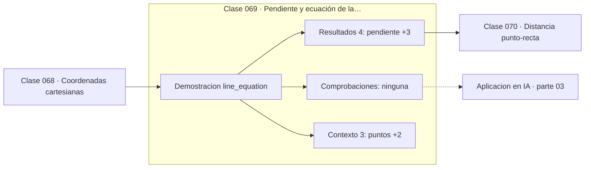

# 069 — Pendiente y ecuación de la recta

> [⬅️ 068 Coordenadas cartesianas](../068-coordenadas-cartesianas/README.md) · [📚 Parte 03](../README.md) · [🏠 Programa](../../../README.md) · [070 Distancia punto-recta ➡️](../070-distancia-punto-recta/README.md)

**Parte:** 03 — Geometría, trigonometría y geometría analítica · **Nivel:** `basico-intermedio` · **Horas estimadas:** 4
**Motor:** `engines.part03` · **Demostración:** `line_equation` · **Clase 9 de 20** de la parte

---

## 🎯 Propósito

**La forma general Ax + By + C = 0 es la misma expresión que la frontera de decisión de un clasificador lineal.**

Del espacio a las coordenadas: distancia, ángulo, trigonometría, transformaciones lineales en el plano, coordenadas polares y proyección.

## ✅ Resultados de aprendizaje

Al terminar podrás:

1. Explicar **Pendiente y ecuación de la recta** con lenguaje cotidiano y con notación matemática.
2. Resolver un caso pequeño a mano y anticipar el orden de magnitud del resultado.
3. Ejecutar y modificar `lab.py`, que corre la demostración `line_equation`.
4. Interpretar las 7 salidas del laboratorio y decir qué comprueba cada una.
5. Detectar el error típico de esta parte: olvidar normalizar antes de comparar direcciones.

## 🧩 Fórmulas de la clase

```text
explícita: y = mx + b
general: Ax + By + C = 0
perpendicular: m⊥ = −1/m
```

## 🗺️ Ubicación en el programa



## 📖 Fundamentos

Una recta admite varias escrituras y cada una sirve para algo distinto. La forma
**explícita** `y = mx + b` es cómoda para evaluar y graficar, pero no puede representar
rectas verticales (pendiente infinita). La forma **general** `Ax + By + C = 0` no tiene
esa limitación y es la que se usa en geometría computacional.

La forma general tiene además una lectura vectorial importante: el vector `(A, B)` es
**normal** a la recta, es decir, perpendicular a ella. Y esa observación es la que
conecta esta clase con machine learning: la frontera de decisión de un clasificador
lineal es `wᵀx + b = 0`, exactamente la misma ecuación, donde `w` es el vector normal.
El signo de `wᵀx + b` dice de qué lado cae un punto, que es literalmente la predicción.

La condición de perpendicularidad `m·m⊥ = −1` se deduce de que los vectores directores
deben tener producto punto nulo. Es un caso particular de ortogonalidad, concepto que la
parte 05 generaliza a cualquier dimensión.

Calcular la pendiente entre dos puntos exige cuidado numérico: si las abscisas son casi
iguales, la resta del denominador sufre cancelación (clase 032) y la pendiente resultante
es ruido. En geometría computacional se prefiere la forma general precisamente por eso.

## 🧮 Ejemplo trabajado

Recta por (1,2) y (5,10).

```text
pendiente:  m = (10 − 2)/(5 − 1) = 2
intercepto: b = 2 − 2·1 = 0

explícita: y = 2x
general:   2x − y + 0 = 0        →  A = 2, B = −1, C = 0

Verificación en (1,2):  2·1 − 1·2 + 0 = 0    ✓

Vector normal: (2, −1)
Pendiente perpendicular: −1/2

Lectura en ML:
  w = (2, −1),  b = 0
  clasificador: signo(wᵀx + b)
```

## 🔬 Qué ejecuta el laboratorio

`line_equation` — Recta en forma pendiente-intercepto y en forma general.

| Grupo | Salidas |
|---|---|
| 🔢 Resultados numéricos (4) | `pendiente`, `intercepto`, `verifica_p`, `pendiente_perpendicular` |
| ✅ Comprobaciones de invariante (0) | — |

Las claves booleanas no son adorno: si alguna fuera `False`, el resultado numérico
no sería fiable aunque el programa terminase sin error.

```bash
python classes/part-03-geometria-trigonometria-y-geometria-analitica/069-pendiente-y-ecuacion-de-la-recta/lab.py
compmath run 069
```

> [!TIP]
> Antes de ejecutar, **escribe tu predicción**. Un laboratorio que confirma lo que
> esperabas enseña tanto como uno que te contradice, pero solo si la predicción
> existía antes del resultado.

## ⚠️ Errores conceptuales frecuentes

1. Usar la forma explícita para rectas verticales.
2. Calcular la pendiente con abscisas casi iguales sin considerar la cancelación.
3. Confundir el vector normal (A,B) con el vector director (B,−A).

## 🚀 Dónde se usa de verdad

Fronteras de decisión lineales, detección de colisiones, ajuste de rectas y geometría
computacional en general.

## 🤖 Conexión con IA

Las transformaciones geométricas son el caso visual de las transformaciones lineales que una red aplica a sus activaciones; la similitud coseno es trigonometría en alta dimensión.

## 📓 Notebooks

| Archivo | Para qué |
|---|---|
| [`notebook.ipynb`](notebook.ipynb) | recorrido guiado con la demostración ejecutada |
| [`notebook_student.ipynb`](notebook_student.ipynb) | versión con `TODO` para resolver |
| [`notebook_solution.ipynb`](notebook_solution.ipynb) | solución de referencia verificada |

## 📝 Evaluación

| Criterio | Peso |
|---|---:|
| Comprensión conceptual | 25 % |
| Resolución manual | 25 % |
| Implementación y verificación | 25 % |
| Interpretación y comunicación | 15 % |
| Conexión con aplicación real | 10 % |

Detalle y criterios de error crítico en [`assessment.md`](assessment.md).

## ❓ Preguntas de comprobación

1. ¿Cuál es la entrada, cuál la salida y qué unidades tienen?
2. ¿Qué operación domina el comportamiento del resultado?
3. ¿Qué caso extremo revelaría un error conceptual?
4. ¿Cómo verificarías el resultado por un método independiente?
5. ¿Dónde aparece esto en gráficos por computador?

Si necesitas releer el código para responderlas, la clase todavía no está superada.

## 📥 Entregable

`notebook_student.ipynb` resuelto más un párrafo que explique el resultado **sin citar
código**: qué entra, qué sale, qué invariante se comprueba y qué pasaría en un caso límite.

## 📚 Bibliografía de la clase

Esta clase enseña **Geometría y trigonometría · Álgebra y funciones**. Cada obra dice qué aporta aquí y cómo se comprobó su localizador:

- [Hastie, Tibshirani & Friedman. *The Elements of Statistical Learning*, 2ª ed., 2009, cap. 4](https://hastie.su.domains/ElemStatLearn/) — Estadística e inferencia y Machine learning: conexión declarada de esta parte · ISBN-13 `9780387848570` verificado en International ISBN Agency (2026-08-19).
- [Stewart, J. *Precalculus*, 7ª ed., Cengage, 2015](https://www.cengage.com/c/precalculus-mathematics-for-calculus-7e-stewart/) — Álgebra y funciones: el tema de esta clase · URL de la fuente primaria, pendiente de resolver.

Bibliografía de todas las clases, con el porqué de cada obra, en [`docs/BIBLIOGRAPHY.md`](../../../docs/BIBLIOGRAPHY.md) · localizador y estado de cada obra en [`sources/bibliography.json`](../../../sources/bibliography.json).

## 📂 Material de la clase

[`intuition.md`](intuition.md) · [`theory.md`](theory.md) · [`derivation.md`](derivation.md) · [`exercises.md`](exercises.md) · [`assessment.md`](assessment.md) · [`where-is-this-used.md`](where-is-this-used.md) · [`lesson.yaml`](lesson.yaml)

---

> [⬅️ 068 Coordenadas cartesianas](../068-coordenadas-cartesianas/README.md) · [📚 Parte 03](../README.md) · [🏠 Programa](../../../README.md) · [070 Distancia punto-recta ➡️](../070-distancia-punto-recta/README.md)
