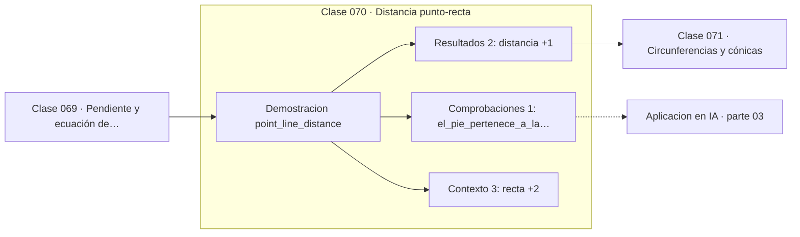

# 070 — Distancia punto-recta

> [⬅️ 069 Pendiente y ecuación de la recta](../069-pendiente-y-ecuacion-de-la-recta/README.md) · [📚 Parte 03](../README.md) · [🏠 Programa](../../../README.md) · [071 Circunferencias y cónicas ➡️](../071-circunferencias-y-conicas/README.md)

**Parte:** 03 — Geometría, trigonometría y geometría analítica · **Nivel:** `basico-intermedio` · **Horas estimadas:** 4
**Motor:** `engines.part03` · **Demostración:** `point_line_distance` · **Clase 10 de 20** de la parte

---

## 🎯 Propósito

**La distancia de un punto a una recta es la misma fórmula que define el margen de una SVM.**

Del espacio a las coordenadas: distancia, ángulo, trigonometría, transformaciones lineales en el plano, coordenadas polares y proyección.

## ✅ Resultados de aprendizaje

Al terminar podrás:

1. Explicar **Distancia punto-recta** con lenguaje cotidiano y con notación matemática.
2. Resolver un caso pequeño a mano y anticipar el orden de magnitud del resultado.
3. Ejecutar y modificar `lab.py`, que corre la demostración `point_line_distance`.
4. Interpretar las 6 salidas del laboratorio y decir qué comprueba cada una.
5. Detectar el error típico de esta parte: mezclar grados y radianes en la misma expresión.

## 🧩 Fórmulas de la clase

```text
d = |Ax₀ + By₀ + C| / √(A² + B²)
pie de perpendicular: p − ((Ap₁+Bp₂+C)/(A²+B²))·(A,B)
```

## 🗺️ Ubicación en el programa



## 📖 Fundamentos

La distancia de un punto a una recta es la longitud del segmento perpendicular que los
une, y esa longitud tiene fórmula cerrada. El numerador `|Ax₀ + By₀ + C|` mide cuánto
«falla» el punto la ecuación de la recta; el denominador `√(A²+B²)` normaliza por la
longitud del vector normal, para que el resultado sea una distancia y no dependa de
cómo se escaló la ecuación.

Esa normalización es exactamente lo que ocurre en una SVM. El margen geométrico de un
punto respecto al hiperplano `wᵀx + b = 0` es `|wᵀx + b| / ‖w‖`, la misma expresión.
Maximizar el margen equivale entonces a minimizar `‖w‖` sujeto a que todos los puntos
queden bien clasificados, que es precisamente el problema de la clase 289.

El **pie de perpendicular** es el punto de la recta más cercano, y calcularlo es
proyectar. La comprobación es doble: el pie debe satisfacer la ecuación de la recta, y
la distancia del punto al pie debe coincidir con la fórmula. El laboratorio verifica
ambas cosas.

La generalización a un hiperplano en ℝⁿ es inmediata y no requiere ideas nuevas: la
fórmula es idéntica con más términos. Esa es la ventaja de haber escrito la recta en
forma general en lugar de explícita.

## 🧮 Ejemplo trabajado

Distancia del punto (2,7) a la recta 3x − 4y + 5 = 0.

```text
numerador:   |3·2 − 4·7 + 5| = |6 − 28 + 5| = 17
denominador: √(9 + 16) = 5
distancia:   17/5 = 3.4

Pie de perpendicular:
  t = (3·2 − 4·7 + 5)/(9+16) = −17/25 = −0.68
  pie = (2 − 3·(−0.68), 7 − (−4)·(−0.68)) = (4.04, 4.28)

Verificaciones:
  3·4.04 − 4·4.28 + 5 = 0        ✓ el pie está en la recta
  dist((2,7), (4.04,4.28)) = 3.4  ✓ coincide con la fórmula
```

## 🔬 Qué ejecuta el laboratorio

`point_line_distance` — Distancia de un punto a una recta y su proyección.

| Grupo | Salidas |
|---|---|
| 🔢 Resultados numéricos (2) | `distancia`, `distancia_al_pie` |
| ✅ Comprobaciones de invariante (1) | `el_pie_pertenece_a_la_recta` |

Las claves booleanas no son adorno: si alguna fuera `False`, el resultado numérico
no sería fiable aunque el programa terminase sin error.

```bash
python classes/part-03-geometria-trigonometria-y-geometria-analitica/070-distancia-punto-recta/lab.py
compmath run 070
```

> [!TIP]
> Antes de ejecutar, **escribe tu predicción**. Un laboratorio que confirma lo que
> esperabas enseña tanto como uno que te contradice, pero solo si la predicción
> existía antes del resultado.

## ⚠️ Errores conceptuales frecuentes

1. Olvidar el valor absoluto en el numerador y obtener distancias negativas.
2. No normalizar por √(A²+B²): el resultado deja de ser una distancia.
3. Suponer que la fórmula solo vale en 2D: se generaliza sin cambios.

## 🚀 Dónde se usa de verdad

Margen de una SVM, detección de colisiones, clustering basado en distancia a fronteras y
métricas de separabilidad.

## 🤖 Conexión con IA

Las transformaciones geométricas son el caso visual de las transformaciones lineales que una red aplica a sus activaciones; la similitud coseno es trigonometría en alta dimensión.

## 📓 Notebooks

| Archivo | Para qué |
|---|---|
| [`notebook.ipynb`](notebook.ipynb) | recorrido guiado con la demostración ejecutada |
| [`notebook_student.ipynb`](notebook_student.ipynb) | versión con `TODO` para resolver |
| [`notebook_solution.ipynb`](notebook_solution.ipynb) | solución de referencia verificada |

## 📝 Evaluación

| Criterio | Peso |
|---|---:|
| Comprensión conceptual | 25 % |
| Resolución manual | 25 % |
| Implementación y verificación | 25 % |
| Interpretación y comunicación | 15 % |
| Conexión con aplicación real | 10 % |

Detalle y criterios de error crítico en [`assessment.md`](assessment.md).

## ❓ Preguntas de comprobación

1. ¿Cuál es la entrada, cuál la salida y qué unidades tienen?
2. ¿Qué operación domina el comportamiento del resultado?
3. ¿Qué caso extremo revelaría un error conceptual?
4. ¿Cómo verificarías el resultado por un método independiente?
5. ¿Dónde aparece esto en gráficos por computador?

Si necesitas releer el código para responderlas, la clase todavía no está superada.

## 📥 Entregable

`notebook_student.ipynb` resuelto más un párrafo que explique el resultado **sin citar
código**: qué entra, qué sale, qué invariante se comprueba y qué pasaría en un caso límite.

## 📚 Bibliografía de la clase

Esta clase enseña **Geometría y trigonometría**. Cada obra dice qué aporta aquí y cómo se comprobó su localizador:

- [Cortes, C.; Vapnik, V. *Support-Vector Networks*. Machine Learning, 1995](https://link.springer.com/article/10.1007/BF00994018) — Machine learning y Métodos de kernel: conexión declarada de esta parte · DOI `10.1007/bf00994018` verificado en Crossref (2026-08-19).
- [Hartley & Zisserman. *Multiple View Geometry in Computer Vision*, 2ª ed., Cambridge, 2004](https://www.robots.ox.ac.uk/~vgg/hzbook/) — Geometría y trigonometría: el tema de esta clase · ISBN-13 `9780511186189` verificado en International ISBN Agency (2026-08-19).

Bibliografía de todas las clases, con el porqué de cada obra, en [`docs/BIBLIOGRAPHY.md`](../../../docs/BIBLIOGRAPHY.md) · localizador y estado de cada obra en [`sources/bibliography.json`](../../../sources/bibliography.json).

## 📂 Material de la clase

[`intuition.md`](intuition.md) · [`theory.md`](theory.md) · [`derivation.md`](derivation.md) · [`exercises.md`](exercises.md) · [`assessment.md`](assessment.md) · [`where-is-this-used.md`](where-is-this-used.md) · [`lesson.yaml`](lesson.yaml)

---

> [⬅️ 069 Pendiente y ecuación de la recta](../069-pendiente-y-ecuacion-de-la-recta/README.md) · [📚 Parte 03](../README.md) · [🏠 Programa](../../../README.md) · [071 Circunferencias y cónicas ➡️](../071-circunferencias-y-conicas/README.md)
