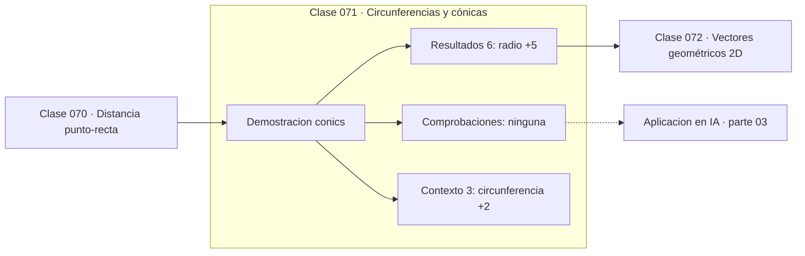

# 071 — Circunferencias y cónicas

> [⬅️ 070 Distancia punto-recta](../070-distancia-punto-recta/README.md) · [📚 Parte 03](../README.md) · [🏠 Programa](../../../README.md) · [072 Vectores geométricos 2D ➡️](../072-vectores-geometricos-2d/README.md)

**Parte:** 03 — Geometría, trigonometría y geometría analítica · **Nivel:** `basico-intermedio` · **Horas estimadas:** 4
**Motor:** `engines.part03` · **Demostración:** `conics` · **Clase 11 de 20** de la parte

---

## 🎯 Propósito

**La excentricidad clasifica las cónicas en una única familia continua.**

Del espacio a las coordenadas: distancia, ángulo, trigonometría, transformaciones lineales en el plano, coordenadas polares y proyección.

## ✅ Resultados de aprendizaje

Al terminar podrás:

1. Explicar **Circunferencias y cónicas** con lenguaje cotidiano y con notación matemática.
2. Resolver un caso pequeño a mano y anticipar el orden de magnitud del resultado.
3. Ejecutar y modificar `lab.py`, que corre la demostración `conics`.
4. Interpretar las 9 salidas del laboratorio y decir qué comprueba cada una.
5. Detectar el error típico de esta parte: aplicar rotación y traslación en el orden equivocado.

## 🧩 Fórmulas de la clase

```text
circunferencia: x² + y² = r²
elipse: x²/a² + y²/b² = 1,  c = √(a²−b²),  e = c/a
parábola y = x²: foco en (0, 1/4)
```

## 🗺️ Ubicación en el programa



## 📖 Fundamentos

Las cónicas —circunferencia, elipse, parábola e hipérbola— son las curvas que resultan
de cortar un cono con un plano, y ese origen común explica que compartan una
descripción unificada. La **excentricidad** `e` es el parámetro que las distingue: 0
para la circunferencia, entre 0 y 1 para la elipse, exactamente 1 para la parábola y
mayor que 1 para la hipérbola.

No son una curiosidad clásica. Las órbitas planetarias son elipses con el Sol en un
foco (primera ley de Kepler); las antenas parabólicas concentran las señales paralelas
en el foco; las curvas de nivel de una forma cuadrática definida positiva son elipses,
hecho central en la parte 06 y en la parte 12, donde la forma de esas elipses determina
lo rápido que converge el descenso de gradiente.

Esa última conexión merece énfasis. Cuando la función objetivo tiene curvas de nivel muy
alargadas —elipses de excentricidad alta—, el gradiente apunta casi perpendicular a la
dirección del mínimo y el descenso zigzaguea. El cociente entre los semiejes es
precisamente el número de condición del Hessiano.

La propiedad focal de la parábola —todos los rayos paralelos al eje se reflejan hacia
el foco— es la que la hace útil en antenas y faros, y se demuestra con geometría
elemental.

## 🧮 Ejemplo trabajado

Tres cónicas y sus parámetros.

```text
Circunferencia x² + y² = 9
  radio 3,  área = π·9 = 28.27,  e = 0

Elipse x²/25 + y²/9 = 1
  a = 5 (semieje mayor), b = 3 (semieje menor)
  c = √(25 − 9) = 4        (distancia focal)
  e = c/a = 0.8            (bastante alargada)

Parábola y = x²
  foco en (0, 0.25),  e = 1

Lectura en optimización:
  curvas de nivel de x² + 20y² → elipse con e alta
  → el descenso de gradiente zigzaguea
```

## 🔬 Qué ejecuta el laboratorio

`conics` — Circunferencia, elipse y parábola desde su ecuación.

| Grupo | Salidas |
|---|---|
| 🔢 Resultados numéricos (6) | `radio`, `area_circulo`, `semieje_mayor`, `semieje_menor`, `distancia_focal`, `excentricidad` |
| ✅ Comprobaciones de invariante (0) | — |

Las claves booleanas no son adorno: si alguna fuera `False`, el resultado numérico
no sería fiable aunque el programa terminase sin error.

```bash
python classes/part-03-geometria-trigonometria-y-geometria-analitica/071-circunferencias-y-conicas/lab.py
compmath run 071
```

> [!TIP]
> Antes de ejecutar, **escribe tu predicción**. Un laboratorio que confirma lo que
> esperabas enseña tanto como uno que te contradice, pero solo si la predicción
> existía antes del resultado.

## ⚠️ Errores conceptuales frecuentes

1. Confundir el semieje mayor con el menor al calcular la distancia focal.
2. Suponer que las órbitas planetarias son circulares.
3. Olvidar que la excentricidad de una elipse informa sobre el condicionamiento del problema asociado.

## 🚀 Dónde se usa de verdad

Órbitas, óptica, curvas de nivel de formas cuadráticas y diagnóstico de convergencia en
optimización.

## 🤖 Conexión con IA

Las transformaciones geométricas son el caso visual de las transformaciones lineales que una red aplica a sus activaciones; la similitud coseno es trigonometría en alta dimensión.

## 📓 Notebooks

| Archivo | Para qué |
|---|---|
| [`notebook.ipynb`](notebook.ipynb) | recorrido guiado con la demostración ejecutada |
| [`notebook_student.ipynb`](notebook_student.ipynb) | versión con `TODO` para resolver |
| [`notebook_solution.ipynb`](notebook_solution.ipynb) | solución de referencia verificada |

## 📝 Evaluación

| Criterio | Peso |
|---|---:|
| Comprensión conceptual | 25 % |
| Resolución manual | 25 % |
| Implementación y verificación | 25 % |
| Interpretación y comunicación | 15 % |
| Conexión con aplicación real | 10 % |

Detalle y criterios de error crítico en [`assessment.md`](assessment.md).

## ❓ Preguntas de comprobación

1. ¿Cuál es la entrada, cuál la salida y qué unidades tienen?
2. ¿Qué operación domina el comportamiento del resultado?
3. ¿Qué caso extremo revelaría un error conceptual?
4. ¿Cómo verificarías el resultado por un método independiente?
5. ¿Dónde aparece esto en gráficos por computador?

Si necesitas releer el código para responderlas, la clase todavía no está superada.

## 📥 Entregable

`notebook_student.ipynb` resuelto más un párrafo que explique el resultado **sin citar
código**: qué entra, qué sale, qué invariante se comprueba y qué pasaría en un caso límite.

## 📚 Bibliografía de la clase

Esta clase enseña **Geometría y trigonometría**. Cada obra dice qué aporta aquí y cómo se comprobó su localizador:

- [Coxeter, H. S. M. *Introduction to Geometry*, 2ª ed., Wiley, 1989](https://www.wiley.com/en-us/Introduction+to+Geometry%2C+2nd+Edition-p-9780471504580) — Geometría y trigonometría: el tema de esta clase · ISBN-13 `9780471504580` verificado en International ISBN Agency (2026-08-19).
- [Nocedal & Wright. *Numerical Optimization*, 2ª ed., Springer, 2006](https://link.springer.com/book/10.1007/978-0-387-40065-5) — Métodos numéricos y Optimización: conexión declarada de esta parte · ISBN-13 `9780387400655` verificado en International ISBN Agency (2026-08-19).

Bibliografía de todas las clases, con el porqué de cada obra, en [`docs/BIBLIOGRAPHY.md`](../../../docs/BIBLIOGRAPHY.md) · localizador y estado de cada obra en [`sources/bibliography.json`](../../../sources/bibliography.json).

## 📂 Material de la clase

[`intuition.md`](intuition.md) · [`theory.md`](theory.md) · [`derivation.md`](derivation.md) · [`exercises.md`](exercises.md) · [`assessment.md`](assessment.md) · [`where-is-this-used.md`](where-is-this-used.md) · [`lesson.yaml`](lesson.yaml)

---

> [⬅️ 070 Distancia punto-recta](../070-distancia-punto-recta/README.md) · [📚 Parte 03](../README.md) · [🏠 Programa](../../../README.md) · [072 Vectores geométricos 2D ➡️](../072-vectores-geometricos-2d/README.md)
