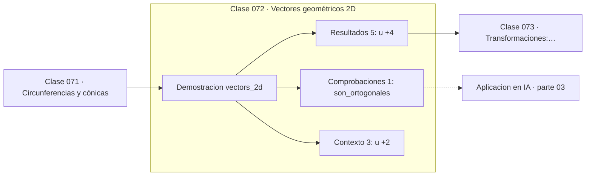

# 072 — Vectores geométricos 2D

> [⬅️ 071 Circunferencias y cónicas](../071-circunferencias-y-conicas/README.md) · [📚 Parte 03](../README.md) · [🏠 Programa](../../../README.md) · [073 Transformaciones: traslación y escala ➡️](../073-transformaciones-traslacion-y-escala/README.md)

**Parte:** 03 — Geometría, trigonometría y geometría analítica · **Nivel:** `basico-intermedio` · **Horas estimadas:** 4
**Motor:** `engines.part03` · **Demostración:** `vectors_2d` · **Clase 12 de 20** de la parte

---

## 🎯 Propósito

**El producto punto mide alineación; la norma mide magnitud; juntos dan el ángulo.**

Del espacio a las coordenadas: distancia, ángulo, trigonometría, transformaciones lineales en el plano, coordenadas polares y proyección.

## ✅ Resultados de aprendizaje

Al terminar podrás:

1. Explicar **Vectores geométricos 2D** con lenguaje cotidiano y con notación matemática.
2. Resolver un caso pequeño a mano y anticipar el orden de magnitud del resultado.
3. Ejecutar y modificar `lab.py`, que corre la demostración `vectors_2d`.
4. Interpretar las 9 salidas del laboratorio y decir qué comprueba cada una.
5. Detectar el error típico de esta parte: olvidar normalizar antes de comparar direcciones.

## 🧩 Fórmulas de la clase

```text
u·v = Σuᵢvᵢ = ‖u‖‖v‖cos θ
‖u‖ = √(u·u)
u ⊥ v  ⟺  u·v = 0
```

## 🗺️ Ubicación en el programa



## 📖 Fundamentos

Un vector admite dos lecturas que conviene mantener a la vez: es una lista de números y
es una flecha con dirección y magnitud. El producto punto conecta ambas: definido
algebraicamente como suma de productos componente a componente, resulta ser
geométricamente `‖u‖‖v‖cos θ`. Esa identidad es la que convierte el álgebra en
geometría.

De ella se lee todo lo demás. Si el producto punto es positivo, los vectores apuntan
hacia el mismo semiespacio; si es cero, son **ortogonales**; si es negativo, se oponen.
La ortogonalidad como «producto punto nulo» es la definición que se generaliza a
cualquier dimensión, donde el concepto de «ángulo recto» ya no es visualizable.

Normalizar un vector —dividirlo por su norma— separa dirección de magnitud. Comparar
direcciones exige normalizar primero, y esa operación es exactamente la que define la
**similitud coseno**, la métrica estándar entre embeddings (clase 322). Comparar sin
normalizar mezcla «de qué habla» con «cuánto texto es», que casi nunca es lo que se
quiere.

Este es el punto donde la parte 03 entrega el testigo a la parte 05: todo lo dicho aquí
en dos dimensiones vale sin cambios en 768, con la salvedad de que la intuición visual
deja de funcionar y hay que confiar en el álgebra.

## 🧮 Ejemplo trabajado

Dos vectores perpendiculares.

```text
u = (3, 4),  v = (−4, 3)

‖u‖ = √(9+16) = 5
‖v‖ = √(16+9) = 5

u·v = 3·(−4) + 4·3 = −12 + 12 = 0     → ortogonales ✓

cos θ = 0/(5·5) = 0  →  θ = 90°

u normalizado: (0.6, 0.8),  norma = 1.0    ✓
```

## 🔬 Qué ejecuta el laboratorio

`vectors_2d` — Vector como dirección y magnitud; ángulo entre vectores.

| Grupo | Salidas |
|---|---|
| 🔢 Resultados numéricos (5) | `|u|`, `|v|`, `u·v`, `cos_theta`, `angulo_grados` |
| ✅ Comprobaciones de invariante (1) | `son_ortogonales` |

Las claves booleanas no son adorno: si alguna fuera `False`, el resultado numérico
no sería fiable aunque el programa terminase sin error.

```bash
python classes/part-03-geometria-trigonometria-y-geometria-analitica/072-vectores-geometricos-2d/lab.py
compmath run 072
```

> [!TIP]
> Antes de ejecutar, **escribe tu predicción**. Un laboratorio que confirma lo que
> esperabas enseña tanto como uno que te contradice, pero solo si la predicción
> existía antes del resultado.

## ⚠️ Errores conceptuales frecuentes

1. Comparar direcciones sin normalizar los vectores.
2. Confundir el producto punto (escalar) con el producto componente a componente (vector).
3. Calcular el ángulo con acos sin acotar el argumento a [−1,1]: el redondeo puede sacarlo del dominio.

## 🚀 Dónde se usa de verdad

Similitud coseno entre embeddings, proyecciones, detección de ortogonalidad, iluminación
en gráficos (producto punto entre normal y dirección de luz) y capas densas.

## 🤖 Conexión con IA

Las transformaciones geométricas son el caso visual de las transformaciones lineales que una red aplica a sus activaciones; la similitud coseno es trigonometría en alta dimensión.

## 📓 Notebooks

| Archivo | Para qué |
|---|---|
| [`notebook.ipynb`](notebook.ipynb) | recorrido guiado con la demostración ejecutada |
| [`notebook_student.ipynb`](notebook_student.ipynb) | versión con `TODO` para resolver |
| [`notebook_solution.ipynb`](notebook_solution.ipynb) | solución de referencia verificada |

## 📝 Evaluación

| Criterio | Peso |
|---|---:|
| Comprensión conceptual | 25 % |
| Resolución manual | 25 % |
| Implementación y verificación | 25 % |
| Interpretación y comunicación | 15 % |
| Conexión con aplicación real | 10 % |

Detalle y criterios de error crítico en [`assessment.md`](assessment.md).

## ❓ Preguntas de comprobación

1. ¿Cuál es la entrada, cuál la salida y qué unidades tienen?
2. ¿Qué operación domina el comportamiento del resultado?
3. ¿Qué caso extremo revelaría un error conceptual?
4. ¿Cómo verificarías el resultado por un método independiente?
5. ¿Dónde aparece esto en gráficos por computador?

Si necesitas releer el código para responderlas, la clase todavía no está superada.

## 📥 Entregable

`notebook_student.ipynb` resuelto más un párrafo que explique el resultado **sin citar
código**: qué entra, qué sale, qué invariante se comprueba y qué pasaría en un caso límite.

## 🔗 Referencias

- [Strang, G. *Introduction to Linear Algebra*, 6ª ed., 2023, cap. 1](https://math.mit.edu/~gs/linearalgebra/) — *uso:* exposición alternativa del tema en «Vectores geométricos 2D».
- [3Blue1Brown. *Essence of Linear Algebra*](https://www.3blue1brown.com/topics/linear-algebra) — *uso:* exposición alternativa del tema en «Vectores geométricos 2D».

Bibliografía completa de la parte en [`../../../docs/BIBLIOGRAPHY.md`](../../../docs/BIBLIOGRAPHY.md) · localizador verificable de cada obra en [`sources/bibliography.json`](../../../sources/bibliography.json).

## 📂 Material de la clase

[`intuition.md`](intuition.md) · [`theory.md`](theory.md) · [`derivation.md`](derivation.md) · [`exercises.md`](exercises.md) · [`assessment.md`](assessment.md) · [`where-is-this-used.md`](where-is-this-used.md) · [`lesson.yaml`](lesson.yaml)

---

> [⬅️ 071 Circunferencias y cónicas](../071-circunferencias-y-conicas/README.md) · [📚 Parte 03](../README.md) · [🏠 Programa](../../../README.md) · [073 Transformaciones: traslación y escala ➡️](../073-transformaciones-traslacion-y-escala/README.md)
