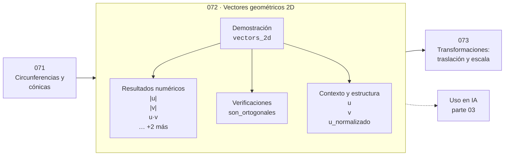

# 072 — Vectores geométricos 2D

> [⬅️ 071 Circunferencias y cónicas](../071-circunferencias-y-conicas/README.md) · [📚 Parte 03](../README.md) · [🏠 Programa](../../../README.md) · [073 Transformaciones: traslación y escala ➡️](../073-transformaciones-traslacion-y-escala/README.md)

**Parte:** 03 — Geometría, trigonometría y geometría analítica · **Nivel:** `basico-intermedio` · **Horas estimadas:** 4
**Motor:** `engines.part03` · **Demostración:** `vectors_2d` · **Clase 12 de 20** de la parte

---

## 🎯 Propósito

Del espacio a las coordenadas: distancia, ángulo, trigonometría, transformaciones lineales en el plano, coordenadas polares y proyección.

Esta clase concreta ese objetivo sobre **Vectores geométricos 2D**: qué es, cómo se
calcula a mano, cómo se implementa sin ocultar el procedimiento y cómo se verifica
que el resultado es correcto y no solo plausible.

## ✅ Resultados de aprendizaje

Al terminar podrás:

1. Explicar **Vectores geométricos 2D** con lenguaje cotidiano y con notación matemática.
2. Resolver un caso pequeño a mano y anticipar el orden de magnitud del resultado.
3. Ejecutar y modificar `lab.py`, que corre la demostración `vectors_2d`.
4. Interpretar las 9 salidas del laboratorio y decir qué comprueba cada una.
5. Detectar el error típico de esta parte: olvidar normalizar antes de comparar direcciones.

## 🗺️ Ubicación en el programa



## 🧠 Idea rectora de la parte 03

> Toda rotación 2D es una matriz ortogonal de determinante 1.

## 🔬 Qué ejecuta el laboratorio

`vectors_2d` — Vector como dirección y magnitud; ángulo entre vectores.

| Grupo | Salidas |
|---|---|
| 🔢 Resultados numéricos (5) | `|u|`, `|v|`, `u·v`, `cos_theta`, `angulo_grados` |
| ✅ Comprobaciones de invariante (1) | `son_ortogonales` |

Las claves booleanas no son adorno: si alguna fuera `False`, el resultado numérico
no sería fiable aunque el programa terminase sin error.

```bash
python classes/part-03-geometria-trigonometria-y-geometria-analitica/072-vectores-geometricos-2d/lab.py
compmath run 072
```

> [!TIP]
> Antes de ejecutar, **escribe tu predicción**. Un laboratorio que confirma lo que
> esperabas enseña tanto como uno que te contradice, pero solo si la predicción
> existía antes del resultado.

## ⚠️ Errores frecuentes en esta parte

- Mezclar grados y radianes en la misma expresión.
- Aplicar rotación y traslación en el orden equivocado.
- Olvidar normalizar antes de comparar direcciones.

## 🤖 Conexión con IA

Las transformaciones geométricas son el caso visual de las transformaciones lineales que una red aplica a sus activaciones; la similitud coseno es trigonometría en alta dimensión.

## 📓 Notebooks

| Archivo | Para qué |
|---|---|
| [`notebook.ipynb`](notebook.ipynb) | recorrido guiado con la demostración ejecutada |
| [`notebook_student.ipynb`](notebook_student.ipynb) | versión con `TODO` para resolver |
| [`notebook_solution.ipynb`](notebook_solution.ipynb) | solución de referencia verificada |

## 📝 Evaluación

| Criterio | Peso |
|---|---:|
| Comprensión conceptual | 25 % |
| Resolución manual | 25 % |
| Implementación y verificación | 25 % |
| Interpretación y comunicación | 15 % |
| Conexión con aplicación real | 10 % |

Detalle y criterios de error crítico en [`assessment.md`](assessment.md).

## ❓ Preguntas de comprobación

1. ¿Cuál es la entrada, cuál la salida y qué unidades tienen?
2. ¿Qué operación domina el comportamiento del resultado?
3. ¿Qué caso extremo revelaría un error conceptual?
4. ¿Cómo verificarías el resultado por un método independiente?
5. ¿Dónde aparece esto en gráficos por computador?

Si necesitas releer el código para responderlas, la clase todavía no está superada.

## 📥 Entregable

`notebook_student.ipynb` resuelto más un párrafo que explique el resultado **sin citar
código**: qué entra, qué sale, qué invariante se comprueba y qué pasaría en un caso límite.

## 🔗 Referencias

- Hartley, R.; Zisserman, A. *Multiple View Geometry in Computer Vision*. 2ª ed., Cambridge, 2004.
- Coxeter, H. S. M. *Introduction to Geometry*. 2ª ed., Wiley, 1989.
- Lengyel, E. *Mathematics for 3D Game Programming and Computer Graphics*. 3ª ed., 2011.

## 📂 Material de la clase

[`intuition.md`](intuition.md) · [`theory.md`](theory.md) · [`derivation.md`](derivation.md) · [`exercises.md`](exercises.md) · [`assessment.md`](assessment.md) · [`where-is-this-used.md`](where-is-this-used.md) · [`lesson.yaml`](lesson.yaml)

---

> [⬅️ 071 Circunferencias y cónicas](../071-circunferencias-y-conicas/README.md) · [📚 Parte 03](../README.md) · [🏠 Programa](../../../README.md) · [073 Transformaciones: traslación y escala ➡️](../073-transformaciones-traslacion-y-escala/README.md)
