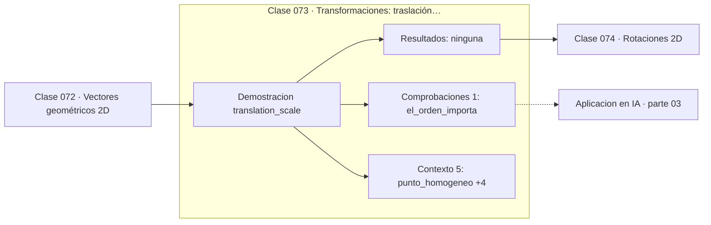

# 073 — Transformaciones: traslación y escala

> [⬅️ 072 Vectores geométricos 2D](../072-vectores-geometricos-2d/README.md) · [📚 Parte 03](../README.md) · [🏠 Programa](../../../README.md) · [074 Rotaciones 2D ➡️](../074-rotaciones-2d/README.md)

**Parte:** 03 — Geometría, trigonometría y geometría analítica · **Nivel:** `basico-intermedio` · **Horas estimadas:** 4
**Motor:** `engines.part03` · **Demostración:** `translation_scale` · **Clase 13 de 20** de la parte

---

## 🎯 Propósito

**Las coordenadas homogéneas convierten la traslación —que no es lineal— en una multiplicación de matrices.**

Del espacio a las coordenadas: distancia, ángulo, trigonometría, transformaciones lineales en el plano, coordenadas polares y proyección.

## ✅ Resultados de aprendizaje

Al terminar podrás:

1. Explicar **Transformaciones: traslación y escala** con lenguaje cotidiano y con notación matemática.
2. Resolver un caso pequeño a mano y anticipar el orden de magnitud del resultado.
3. Ejecutar y modificar `lab.py`, que corre la demostración `translation_scale`.
4. Interpretar las 6 salidas del laboratorio y decir qué comprueba cada una.
5. Detectar el error típico de esta parte: mezclar grados y radianes en la misma expresión.

## 🧩 Fórmulas de la clase

```text
punto homogéneo: (x, y, 1)
traslación: [[1,0,tx],[0,1,ty],[0,0,1]]
escala: [[sx,0,0],[0,sy,0],[0,0,1]]
```

## 🗺️ Ubicación en el programa



## 📖 Fundamentos

La traslación tiene un problema estructural: no es una transformación lineal. Una
transformación lineal debe mandar el origen al origen, y trasladar precisamente lo
mueve. Eso impide componerla con rotaciones y escalas usando un único producto de
matrices, que es lo que la hace incómoda.

Las coordenadas homogéneas resuelven el problema con un truco elegante: se añade una
coordenada extra fija a 1, de modo que un punto del plano se representa como `(x, y, 1)`
en ℝ³. En ese espacio ampliado, la traslación **sí** es lineal, y se escribe como una
matriz 3×3 cuya última columna contiene el desplazamiento.

La ganancia es enorme en la práctica. Toda la cadena de transformaciones de un vértice
—modelo, mundo, vista, proyección— se compone en una única matriz que se calcula una vez
y se aplica a millones de vértices con un solo producto. Es la razón por la que las GPU
están optimizadas para multiplicar matrices 4×4.

El orden de composición importa y es la fuente de errores más común: `T·S` escala y
luego traslada; `S·T` traslada y luego escala, con lo que el desplazamiento también se
escala. El laboratorio comprueba que ambos productos dan resultados distintos, que es
la forma más directa de recordarlo.

## 🧮 Ejemplo trabajado

Trasladar y escalar el punto (2,3), en los dos órdenes.

```text
punto homogéneo: (2, 3, 1)

T (traslación +5, −2)     S (escala ×2, ×0.5)
[1 0  5]                  [2   0 0]
[0 1 −2]                  [0 0.5 0]
[0 0  1]                  [0   0 1]

T·(2,3,1) = (7, 1, 1)
S·(2,3,1) = (4, 1.5, 1)

T·S aplicado a (2,3,1) = (9, −0.5, 1)     escala y luego traslada
S·T aplicado a (2,3,1) = (14, −0.5, 1)    traslada y luego escala

¿iguales?  No.  El orden importa.
```

## 🔬 Qué ejecuta el laboratorio

`translation_scale` — Traslación y escala en coordenadas homogéneas.

| Grupo | Salidas |
|---|---|
| 🔢 Resultados numéricos (0) | — |
| ✅ Comprobaciones de invariante (1) | `el_orden_importa` |

Las claves booleanas no son adorno: si alguna fuera `False`, el resultado numérico
no sería fiable aunque el programa terminase sin error.

```bash
python classes/part-03-geometria-trigonometria-y-geometria-analitica/073-transformaciones-traslacion-y-escala/lab.py
compmath run 073
```

> [!TIP]
> Antes de ejecutar, **escribe tu predicción**. Un laboratorio que confirma lo que
> esperabas enseña tanto como uno que te contradice, pero solo si la predicción
> existía antes del resultado.

## ⚠️ Errores conceptuales frecuentes

1. Componer transformaciones en el orden equivocado.
2. Olvidar la coordenada homogénea 1 al construir el punto.
3. Suponer que la traslación es una transformación lineal en coordenadas normales.

## 🚀 Dónde se usa de verdad

Pipeline gráfico, robótica (matrices de transformación homogénea entre articulaciones),
visión artificial y cualquier composición de transformaciones afines.

## 🤖 Conexión con IA

Las transformaciones geométricas son el caso visual de las transformaciones lineales que una red aplica a sus activaciones; la similitud coseno es trigonometría en alta dimensión.

## 📓 Notebooks

| Archivo | Para qué |
|---|---|
| [`notebook.ipynb`](notebook.ipynb) | recorrido guiado con la demostración ejecutada |
| [`notebook_student.ipynb`](notebook_student.ipynb) | versión con `TODO` para resolver |
| [`notebook_solution.ipynb`](notebook_solution.ipynb) | solución de referencia verificada |

## 📝 Evaluación

| Criterio | Peso |
|---|---:|
| Comprensión conceptual | 25 % |
| Resolución manual | 25 % |
| Implementación y verificación | 25 % |
| Interpretación y comunicación | 15 % |
| Conexión con aplicación real | 10 % |

Detalle y criterios de error crítico en [`assessment.md`](assessment.md).

## ❓ Preguntas de comprobación

1. ¿Cuál es la entrada, cuál la salida y qué unidades tienen?
2. ¿Qué operación domina el comportamiento del resultado?
3. ¿Qué caso extremo revelaría un error conceptual?
4. ¿Cómo verificarías el resultado por un método independiente?
5. ¿Dónde aparece esto en gráficos por computador?

Si necesitas releer el código para responderlas, la clase todavía no está superada.

## 📥 Entregable

`notebook_student.ipynb` resuelto más un párrafo que explique el resultado **sin citar
código**: qué entra, qué sale, qué invariante se comprueba y qué pasaría en un caso límite.

## 📚 Bibliografía de la clase

Esta clase enseña **Geometría y trigonometría**. Cada obra dice qué aporta aquí y cómo se comprobó su localizador:

- [Hartley & Zisserman. *Multiple View Geometry in Computer Vision*, 2ª ed., 2004, cap. 2](https://www.robots.ox.ac.uk/~vgg/hzbook/) — Geometría y trigonometría: el tema de esta clase · ISBN-13 `9780511186189` verificado en International ISBN Agency (2026-08-19).
- [Lengyel, E. *Mathematics for 3D Game Programming and Computer Graphics*, 3ª ed., 2011](https://www.cengage.com/c/mathematics-for-3d-game-programming-and-computer-graphics-3e-lengyel/) — Geometría y trigonometría: el tema de esta clase · URL de la fuente primaria, pendiente de resolver.

Bibliografía de todas las clases, con el porqué de cada obra, en [`docs/BIBLIOGRAPHY.md`](../../../docs/BIBLIOGRAPHY.md) · localizador y estado de cada obra en [`sources/bibliography.json`](../../../sources/bibliography.json).

## 📂 Material de la clase

[`intuition.md`](intuition.md) · [`theory.md`](theory.md) · [`derivation.md`](derivation.md) · [`exercises.md`](exercises.md) · [`assessment.md`](assessment.md) · [`where-is-this-used.md`](where-is-this-used.md) · [`lesson.yaml`](lesson.yaml)

---

> [⬅️ 072 Vectores geométricos 2D](../072-vectores-geometricos-2d/README.md) · [📚 Parte 03](../README.md) · [🏠 Programa](../../../README.md) · [074 Rotaciones 2D ➡️](../074-rotaciones-2d/README.md)
