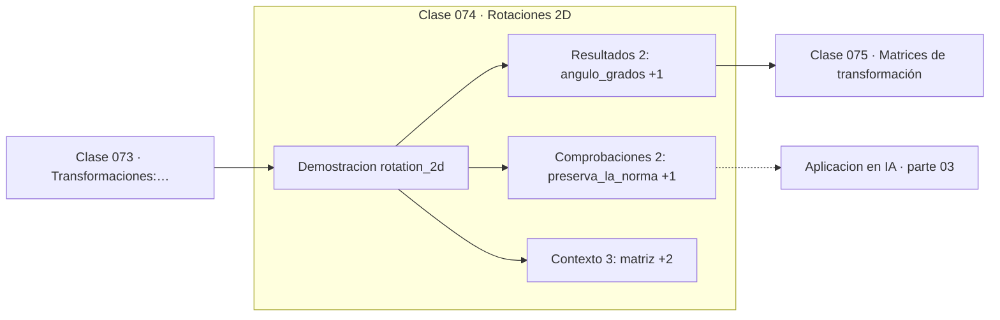

# 074 — Rotaciones 2D

> [⬅️ 073 Transformaciones: traslación y escala](../073-transformaciones-traslacion-y-escala/README.md) · [📚 Parte 03](../README.md) · [🏠 Programa](../../../README.md) · [075 Matrices de transformación ➡️](../075-matrices-de-transformacion/README.md)

**Parte:** 03 — Geometría, trigonometría y geometría analítica · **Nivel:** `basico-intermedio` · **Horas estimadas:** 4
**Motor:** `engines.part03` · **Demostración:** `rotation_2d` · **Clase 14 de 20** de la parte

---

## 🎯 Propósito

**Una matriz de rotación es ortogonal y de determinante 1: preserva normas, ángulos y orientación.**

Del espacio a las coordenadas: distancia, ángulo, trigonometría, transformaciones lineales en el plano, coordenadas polares y proyección.

## ✅ Resultados de aprendizaje

Al terminar podrás:

1. Explicar **Rotaciones 2D** con lenguaje cotidiano y con notación matemática.
2. Resolver un caso pequeño a mano y anticipar el orden de magnitud del resultado.
3. Ejecutar y modificar `lab.py`, que corre la demostración `rotation_2d`.
4. Interpretar las 7 salidas del laboratorio y decir qué comprueba cada una.
5. Detectar el error típico de esta parte: aplicar rotación y traslación en el orden equivocado.

## 🧩 Fórmulas de la clase

```text
R(θ) = [[cos θ, −sin θ], [sin θ, cos θ]]
RᵀR = I,  det R = 1
R(α)·R(β) = R(α+β)
```

## 🗺️ Ubicación en el programa



## 📖 Fundamentos

La matriz de rotación se construye viendo a dónde van los vectores de la base: `(1,0)`
va a `(cos θ, sin θ)` y `(0,1)` va a `(−sin θ, cos θ)`. Esas dos imágenes son las
columnas de la matriz. Este método —las columnas de una matriz son las imágenes de la
base— es general y es la forma correcta de leer cualquier matriz de transformación
(clase 123).

Dos propiedades la caracterizan. Es **ortogonal**, `RᵀR = I`, lo que significa que su
inversa es su transpuesta: deshacer una rotación es transponer, sin necesidad de
invertir. Y su **determinante es 1**, lo que indica que preserva áreas y orientación
(una reflexión tendría determinante −1).

La consecuencia numérica es importante: las transformaciones ortogonales **no amplifican
el error**. Su número de condición es 1, el mejor posible. Por eso los algoritmos
numéricamente estables se construyen con rotaciones y reflexiones (Givens, Householder)
en lugar de con transformaciones generales, y por eso la factorización QR es preferible
a las ecuaciones normales (clase 234).

La composición de rotaciones suma ángulos, `R(α)R(β) = R(α+β)`, lo que se demuestra con
las fórmulas de suma de la clase 066. En 2D las rotaciones conmutan; en 3D **no**, y esa
es una de las diferencias más importantes entre ambos casos.

## 🧮 Ejemplo trabajado

Rotar (1,0) noventa grados.

```text
R(90°) = [[cos 90, −sin 90], [sin 90, cos 90]]
       = [[0, −1], [1, 0]]

R·(1,0) = (0, 1)          ✓ el eje x va al eje y

det R = 0·0 − (−1)·1 = 1            ✓ preserva área y orientación
RᵀR   = [[1,0],[0,1]] = I           ✓ ortogonal

‖(1,0)‖ = 1,  ‖R(1,0)‖ = 1          ✓ preserva la norma

Cuatro rotaciones de 90° = identidad
```

## 🔬 Qué ejecuta el laboratorio

`rotation_2d` — Matriz de rotación: ortogonal y de determinante 1.

| Grupo | Salidas |
|---|---|
| 🔢 Resultados numéricos (2) | `angulo_grados`, `determinante` |
| ✅ Comprobaciones de invariante (2) | `preserva_la_norma`, `cuatro_rotaciones_vuelven_al_origen` |

Las claves booleanas no son adorno: si alguna fuera `False`, el resultado numérico
no sería fiable aunque el programa terminase sin error.

```bash
python classes/part-03-geometria-trigonometria-y-geometria-analitica/074-rotaciones-2d/lab.py
compmath run 074
```

> [!TIP]
> Antes de ejecutar, **escribe tu predicción**. Un laboratorio que confirma lo que
> esperabas enseña tanto como uno que te contradice, pero solo si la predicción
> existía antes del resultado.

## ⚠️ Errores conceptuales frecuentes

1. Colocar el signo negativo en la posición equivocada de la matriz.
2. Invertir una matriz de rotación en lugar de transponerla.
3. Suponer que las rotaciones en 3D conmutan.

## 🚀 Dónde se usa de verdad

Gráficos, robótica, aumento de datos por rotación, factorizaciones QR estables y
transformaciones ortogonales en general.

## 🤖 Conexión con IA

Las transformaciones geométricas son el caso visual de las transformaciones lineales que una red aplica a sus activaciones; la similitud coseno es trigonometría en alta dimensión.

## 📓 Notebooks

| Archivo | Para qué |
|---|---|
| [`notebook.ipynb`](notebook.ipynb) | recorrido guiado con la demostración ejecutada |
| [`notebook_student.ipynb`](notebook_student.ipynb) | versión con `TODO` para resolver |
| [`notebook_solution.ipynb`](notebook_solution.ipynb) | solución de referencia verificada |

## 📝 Evaluación

| Criterio | Peso |
|---|---:|
| Comprensión conceptual | 25 % |
| Resolución manual | 25 % |
| Implementación y verificación | 25 % |
| Interpretación y comunicación | 15 % |
| Conexión con aplicación real | 10 % |

Detalle y criterios de error crítico en [`assessment.md`](assessment.md).

## ❓ Preguntas de comprobación

1. ¿Cuál es la entrada, cuál la salida y qué unidades tienen?
2. ¿Qué operación domina el comportamiento del resultado?
3. ¿Qué caso extremo revelaría un error conceptual?
4. ¿Cómo verificarías el resultado por un método independiente?
5. ¿Dónde aparece esto en gráficos por computador?

Si necesitas releer el código para responderlas, la clase todavía no está superada.

## 📥 Entregable

`notebook_student.ipynb` resuelto más un párrafo que explique el resultado **sin citar
código**: qué entra, qué sale, qué invariante se comprueba y qué pasaría en un caso límite.

## 🔗 Referencias

- [Trefethen & Bau. *Numerical Linear Algebra*, SIAM, 1997, lecc. 10](https://epubs.siam.org/doi/book/10.1137/1.9780898719574) — *uso:* desarrollo formal del tema en «Rotaciones 2D».
- [Lengyel, E. *Mathematics for 3D Game Programming and Computer Graphics*, 3ª ed., 2011](https://www.cengage.com/c/mathematics-for-3d-game-programming-and-computer-graphics-3e-lengyel/) — *uso:* obra de referencia consultada en «Rotaciones 2D».

Bibliografía completa de la parte en [`../../../docs/BIBLIOGRAPHY.md`](../../../docs/BIBLIOGRAPHY.md) · localizador verificable de cada obra en [`sources/bibliography.json`](../../../sources/bibliography.json).

## 📂 Material de la clase

[`intuition.md`](intuition.md) · [`theory.md`](theory.md) · [`derivation.md`](derivation.md) · [`exercises.md`](exercises.md) · [`assessment.md`](assessment.md) · [`where-is-this-used.md`](where-is-this-used.md) · [`lesson.yaml`](lesson.yaml)

---

> [⬅️ 073 Transformaciones: traslación y escala](../073-transformaciones-traslacion-y-escala/README.md) · [📚 Parte 03](../README.md) · [🏠 Programa](../../../README.md) · [075 Matrices de transformación ➡️](../075-matrices-de-transformacion/README.md)
