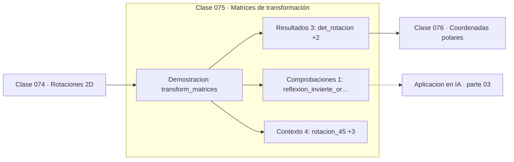

# 075 — Matrices de transformación

> [⬅️ 074 Rotaciones 2D](../074-rotaciones-2d/README.md) · [📚 Parte 03](../README.md) · [🏠 Programa](../../../README.md) · [076 Coordenadas polares ➡️](../076-coordenadas-polares/README.md)

**Parte:** 03 — Geometría, trigonometría y geometría analítica · **Nivel:** `basico-intermedio` · **Horas estimadas:** 4
**Motor:** `engines.part03` · **Demostración:** `transform_matrices` · **Clase 15 de 20** de la parte

---

## 🎯 Propósito

**El valor absoluto del determinante es el factor por el que la transformación multiplica las áreas; su signo indica si invierte la orientación.**

Del espacio a las coordenadas: distancia, ángulo, trigonometría, transformaciones lineales en el plano, coordenadas polares y proyección.

## ✅ Resultados de aprendizaje

Al terminar podrás:

1. Explicar **Matrices de transformación** con lenguaje cotidiano y con notación matemática.
2. Resolver un caso pequeño a mano y anticipar el orden de magnitud del resultado.
3. Ejecutar y modificar `lab.py`, que corre la demostración `transform_matrices`.
4. Interpretar las 8 salidas del laboratorio y decir qué comprueba cada una.
5. Detectar el error típico de esta parte: olvidar normalizar antes de comparar direcciones.

## 🧩 Fórmulas de la clase

```text
área transformada = |det M| · área original
det R = 1 (rotación),  det S = sx·sy (escala),  det F = −1 (reflexión)
```

## 🗺️ Ubicación en el programa



## 📖 Fundamentos

El determinante de una matriz 2×2 tiene una interpretación geométrica precisa: es el
área con signo del paralelogramo que forman sus columnas. Como las columnas son las
imágenes de los vectores de la base —que forman un cuadrado de área 1—, el determinante
es exactamente el factor por el que la transformación escala las áreas.

El **signo** aporta información adicional: si es negativo, la transformación invierte la
orientación, es decir, convierte un recorrido antihorario en horario. Las reflexiones
tienen determinante negativo; las rotaciones, positivo. Un determinante **nulo**
significa que la transformación aplasta el plano sobre una recta o un punto: pierde
información y no es invertible.

Esta lectura hace comprensible por qué `det(AB) = det(A)·det(B)`: aplicar dos
transformaciones escala el área por el producto de sus factores. Y por qué una matriz
con determinante cero no tiene inversa: no se puede recuperar un área a partir de algo
que quedó aplastado.

La generalización a n dimensiones es directa: el determinante es el factor de escalado
del volumen n-dimensional. Ese hecho es el que aparece en el cambio de variable de una
integral múltiple (clase 173) y en el jacobiano de una transformación de variables
aleatorias, donde el determinante corrige la densidad.

## 🧮 Ejemplo trabajado

Tres transformaciones y su determinante.

```text
Rotación 45°:   det = 1        preserva área, mantiene orientación
Escala ×2:      det = 4        cuadruplica el área (2·2)
Reflexión en x: det = −1       preserva área, INVIERTE orientación

Composición R·S aplicada a (1,1):
  primero escala ×2 → (2,2)
  luego rota 45°    → (0, 2.83)

det(R·S) = det(R)·det(S) = 1·4 = 4     ✓
```

## 🔬 Qué ejecuta el laboratorio

`transform_matrices` — Composición de rotación, escala y reflexión.

| Grupo | Salidas |
|---|---|
| 🔢 Resultados numéricos (3) | `det_rotacion`, `det_escala`, `det_reflexion` |
| ✅ Comprobaciones de invariante (1) | `reflexion_invierte_orientacion` |

Las claves booleanas no son adorno: si alguna fuera `False`, el resultado numérico
no sería fiable aunque el programa terminase sin error.

```bash
python classes/part-03-geometria-trigonometria-y-geometria-analitica/075-matrices-de-transformacion/lab.py
compmath run 075
```

> [!TIP]
> Antes de ejecutar, **escribe tu predicción**. Un laboratorio que confirma lo que
> esperabas enseña tanto como uno que te contradice, pero solo si la predicción
> existía antes del resultado.

## ⚠️ Errores conceptuales frecuentes

1. Ignorar el signo del determinante y perder la información de orientación.
2. Suponer que determinante cero significa «error» en lugar de «transformación no invertible».
3. Confundir el determinante con la traza.

## 🚀 Dónde se usa de verdad

Cambio de variable en integrales múltiples, jacobiano en transformaciones de
distribuciones, detección de degeneración en geometría computacional y normalizing flows.

## 🤖 Conexión con IA

Las transformaciones geométricas son el caso visual de las transformaciones lineales que una red aplica a sus activaciones; la similitud coseno es trigonometría en alta dimensión.

## 📓 Notebooks

| Archivo | Para qué |
|---|---|
| [`notebook.ipynb`](notebook.ipynb) | recorrido guiado con la demostración ejecutada |
| [`notebook_student.ipynb`](notebook_student.ipynb) | versión con `TODO` para resolver |
| [`notebook_solution.ipynb`](notebook_solution.ipynb) | solución de referencia verificada |

## 📝 Evaluación

| Criterio | Peso |
|---|---:|
| Comprensión conceptual | 25 % |
| Resolución manual | 25 % |
| Implementación y verificación | 25 % |
| Interpretación y comunicación | 15 % |
| Conexión con aplicación real | 10 % |

Detalle y criterios de error crítico en [`assessment.md`](assessment.md).

## ❓ Preguntas de comprobación

1. ¿Cuál es la entrada, cuál la salida y qué unidades tienen?
2. ¿Qué operación domina el comportamiento del resultado?
3. ¿Qué caso extremo revelaría un error conceptual?
4. ¿Cómo verificarías el resultado por un método independiente?
5. ¿Dónde aparece esto en gráficos por computador?

Si necesitas releer el código para responderlas, la clase todavía no está superada.

## 📥 Entregable

`notebook_student.ipynb` resuelto más un párrafo que explique el resultado **sin citar
código**: qué entra, qué sale, qué invariante se comprueba y qué pasaría en un caso límite.

## 🔗 Referencias

- [Strang, G. *Introduction to Linear Algebra*, 6ª ed., 2023, cap. 5](https://math.mit.edu/~gs/linearalgebra/) — *uso:* exposición alternativa del tema en «Matrices de transformación».
- [3Blue1Brown. *The determinant*](https://www.3blue1brown.com/lessons/determinant) — *uso:* exposición alternativa del tema en «Matrices de transformación».

Bibliografía completa de la parte en [`../../../docs/BIBLIOGRAPHY.md`](../../../docs/BIBLIOGRAPHY.md) · localizador verificable de cada obra en [`sources/bibliography.json`](../../../sources/bibliography.json).

## 📂 Material de la clase

[`intuition.md`](intuition.md) · [`theory.md`](theory.md) · [`derivation.md`](derivation.md) · [`exercises.md`](exercises.md) · [`assessment.md`](assessment.md) · [`where-is-this-used.md`](where-is-this-used.md) · [`lesson.yaml`](lesson.yaml)

---

> [⬅️ 074 Rotaciones 2D](../074-rotaciones-2d/README.md) · [📚 Parte 03](../README.md) · [🏠 Programa](../../../README.md) · [076 Coordenadas polares ➡️](../076-coordenadas-polares/README.md)
