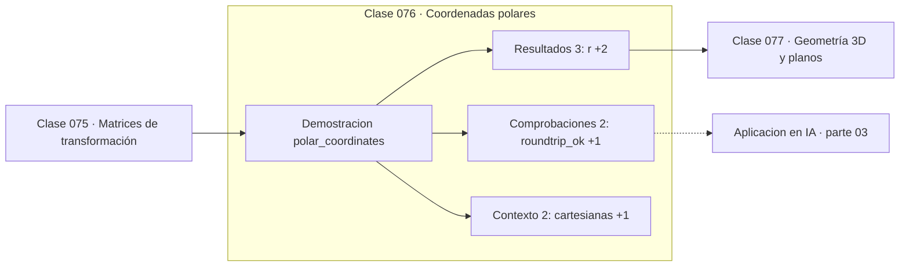

# 076 — Coordenadas polares

> [⬅️ 075 Matrices de transformación](../075-matrices-de-transformacion/README.md) · [📚 Parte 03](../README.md) · [🏠 Programa](../../../README.md) · [077 Geometría 3D y planos ➡️](../077-geometria-3d-y-planos/README.md)

**Parte:** 03 — Geometría, trigonometría y geometría analítica · **Nivel:** `basico-intermedio` · **Horas estimadas:** 4
**Motor:** `engines.part03` · **Demostración:** `polar_coordinates` · **Clase 16 de 20** de la parte

---

## 🎯 Propósito

**Las coordenadas polares describen un punto por distancia y ángulo; atan2 hace la conversión inversa correctamente.**

Del espacio a las coordenadas: distancia, ángulo, trigonometría, transformaciones lineales en el plano, coordenadas polares y proyección.

## ✅ Resultados de aprendizaje

Al terminar podrás:

1. Explicar **Coordenadas polares** con lenguaje cotidiano y con notación matemática.
2. Resolver un caso pequeño a mano y anticipar el orden de magnitud del resultado.
3. Ejecutar y modificar `lab.py`, que corre la demostración `polar_coordinates`.
4. Interpretar las 7 salidas del laboratorio y decir qué comprueba cada una.
5. Detectar el error típico de esta parte: mezclar grados y radianes en la misma expresión.

## 🧩 Fórmulas de la clase

```text
r = √(x²+y²),  θ = atan2(y, x)
x = r·cos θ,  y = r·sin θ
```

## 🗺️ Ubicación en el programa



## 📖 Fundamentos

Elegir el sistema de coordenadas adecuado puede convertir un problema difícil en uno
trivial. Una circunferencia en cartesianas es `x² + y² = r²`; en polares es simplemente
`r = constante`. Los problemas con simetría radial —campos centrales, difusión desde un
punto, patrones de radiación— se simplifican radicalmente al cambiar de coordenadas.

La conversión de cartesianas a polares exige `atan2` por la razón de la clase 065: el
cociente `y/x` no distingue cuadrantes opuestos. Con `atan2(y, x)` el ángulo sale
correcto en los cuatro cuadrantes y en los ejes, incluido el caso `x = 0` que rompería
la división.

La conversión no es biyectiva sin restricciones: el ángulo está determinado salvo
múltiplos de 2π, y el origen (r = 0) no tiene ángulo definido. Al implementar hay que
decidir el rango del ángulo —habitualmente (−π, π]— y documentarlo, porque comparar
ángulos de rangos distintos produce discrepancias.

En dimensiones superiores el análogo son las coordenadas esféricas, y en la parte 09
aparece el mismo cambio de variable al deducir la distribución normal multivariante. El
jacobiano de la transformación —`r` en polares— es el factor que la clase 075 explicó.

## 🧮 Ejemplo trabajado

Convertir (−3, 4) a polares y volver.

```text
r = √(9 + 16) = 5
θ = atan2(4, −3) = 2.2143 rad = 126.87°     (cuadrante II) ✓

Vuelta a cartesianas:
  x = 5·cos(2.2143) = −3.0
  y = 5·sin(2.2143) =  4.0                  ✓ roundtrip exacto

Con atan(4/−3) se habría obtenido −0.9273 rad = −53.13°,
que es el cuadrante IV: incorrecto.
```

## 🔬 Qué ejecuta el laboratorio

`polar_coordinates` — Conversión cartesiana ↔ polar y su ida y vuelta.

| Grupo | Salidas |
|---|---|
| 🔢 Resultados numéricos (3) | `r`, `theta_rad`, `theta_grados` |
| ✅ Comprobaciones de invariante (2) | `roundtrip_ok`, `atan2_maneja_cuadrantes` |

Las claves booleanas no son adorno: si alguna fuera `False`, el resultado numérico
no sería fiable aunque el programa terminase sin error.

```bash
python classes/part-03-geometria-trigonometria-y-geometria-analitica/076-coordenadas-polares/lab.py
compmath run 076
```

> [!TIP]
> Antes de ejecutar, **escribe tu predicción**. Un laboratorio que confirma lo que
> esperabas enseña tanto como uno que te contradice, pero solo si la predicción
> existía antes del resultado.

## ⚠️ Errores conceptuales frecuentes

1. Usar atan en lugar de atan2 y perder el cuadrante.
2. No declarar el rango del ángulo devuelto.
3. Intentar definir el ángulo del origen.

## 🚀 Dónde se usa de verdad

Problemas con simetría radial, patrones de radiación, transformadas en coordenadas
polares, robótica y representación de fase y magnitud en señales complejas.

## 🤖 Conexión con IA

Las transformaciones geométricas son el caso visual de las transformaciones lineales que una red aplica a sus activaciones; la similitud coseno es trigonometría en alta dimensión.

## 📓 Notebooks

| Archivo | Para qué |
|---|---|
| [`notebook.ipynb`](notebook.ipynb) | recorrido guiado con la demostración ejecutada |
| [`notebook_student.ipynb`](notebook_student.ipynb) | versión con `TODO` para resolver |
| [`notebook_solution.ipynb`](notebook_solution.ipynb) | solución de referencia verificada |

## 📝 Evaluación

| Criterio | Peso |
|---|---:|
| Comprensión conceptual | 25 % |
| Resolución manual | 25 % |
| Implementación y verificación | 25 % |
| Interpretación y comunicación | 15 % |
| Conexión con aplicación real | 10 % |

Detalle y criterios de error crítico en [`assessment.md`](assessment.md).

## ❓ Preguntas de comprobación

1. ¿Cuál es la entrada, cuál la salida y qué unidades tienen?
2. ¿Qué operación domina el comportamiento del resultado?
3. ¿Qué caso extremo revelaría un error conceptual?
4. ¿Cómo verificarías el resultado por un método independiente?
5. ¿Dónde aparece esto en gráficos por computador?

Si necesitas releer el código para responderlas, la clase todavía no está superada.

## 📥 Entregable

`notebook_student.ipynb` resuelto más un párrafo que explique el resultado **sin citar
código**: qué entra, qué sale, qué invariante se comprueba y qué pasaría en un caso límite.

## 🔗 Referencias

- [Python: `math.atan2` y `cmath.polar`](https://docs.python.org/3/library/cmath.html#cmath.polar) — *uso:* documentación de la herramienta que ejecuta el laboratorio en «Coordenadas polares».
- [Stewart, J. *Calculus*, 8ª ed., Cengage, 2015, cap. 10](https://www.cengage.com/c/calculus-8e-stewart/) — *uso:* obra de referencia consultada en «Coordenadas polares».

Bibliografía completa de la parte en [`../../../docs/BIBLIOGRAPHY.md`](../../../docs/BIBLIOGRAPHY.md) · localizador verificable de cada obra en [`sources/bibliography.json`](../../../sources/bibliography.json).

## 📂 Material de la clase

[`intuition.md`](intuition.md) · [`theory.md`](theory.md) · [`derivation.md`](derivation.md) · [`exercises.md`](exercises.md) · [`assessment.md`](assessment.md) · [`where-is-this-used.md`](where-is-this-used.md) · [`lesson.yaml`](lesson.yaml)

---

> [⬅️ 075 Matrices de transformación](../075-matrices-de-transformacion/README.md) · [📚 Parte 03](../README.md) · [🏠 Programa](../../../README.md) · [077 Geometría 3D y planos ➡️](../077-geometria-3d-y-planos/README.md)
