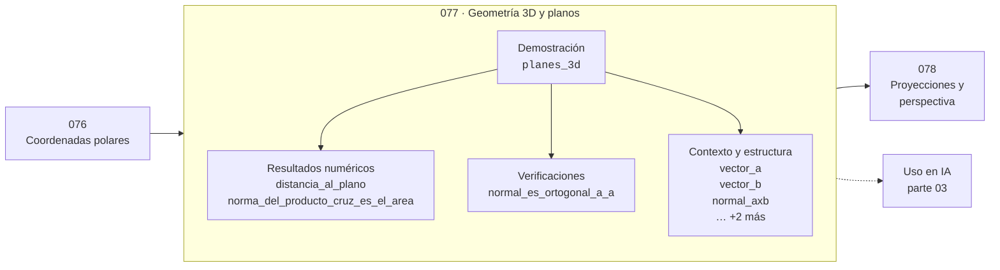

# 077 — Geometría 3D y planos

> [⬅️ 076 Coordenadas polares](../076-coordenadas-polares/README.md) · [📚 Parte 03](../README.md) · [🏠 Programa](../../../README.md) · [078 Proyecciones y perspectiva ➡️](../078-proyecciones-y-perspectiva/README.md)

**Parte:** 03 — Geometría, trigonometría y geometría analítica · **Nivel:** `basico-intermedio` · **Horas estimadas:** 4
**Motor:** `engines.part03` · **Demostración:** `planes_3d` · **Clase 17 de 20** de la parte

---

## 🎯 Propósito

**El producto cruz da un vector ortogonal a dos dados, y su norma es el área del paralelogramo que forman.**

Del espacio a las coordenadas: distancia, ángulo, trigonometría, transformaciones lineales en el plano, coordenadas polares y proyección.

## ✅ Resultados de aprendizaje

Al terminar podrás:

1. Explicar **Geometría 3D y planos** con lenguaje cotidiano y con notación matemática.
2. Resolver un caso pequeño a mano y anticipar el orden de magnitud del resultado.
3. Ejecutar y modificar `lab.py`, que corre la demostración `planes_3d`.
4. Interpretar las 8 salidas del laboratorio y decir qué comprueba cada una.
5. Detectar el error típico de esta parte: aplicar rotación y traslación en el orden equivocado.

## 🧩 Fórmulas de la clase

```text
a × b = (a₂b₃−a₃b₂, a₃b₁−a₁b₃, a₁b₂−a₂b₁)
‖a × b‖ = ‖a‖‖b‖ sin θ = área del paralelogramo
plano: n·(x − p₀) = 0
```

## 🗺️ Ubicación en el programa



## 📖 Fundamentos

En tres dimensiones aparece una operación sin análogo en 2D: el producto cruz, que a dos
vectores les asocia un tercero perpendicular a ambos. Su norma es el área del
paralelogramo que forman, y su sentido lo da la regla de la mano derecha. Es una
operación específica de ℝ³ —no se generaliza a dimensión arbitraria sin cambiar de
formalismo—, y por eso es tan característica de la geometría espacial.

Un plano queda determinado por un punto y un **vector normal**: la ecuación
`n·(x − p₀) = 0` dice que el vector que va de `p₀` a `x` es perpendicular a `n`. Como el
producto cruz de dos vectores del plano da su normal, dos direcciones bastan para
definir un plano.

La distancia de un punto a un plano se calcula con la misma estructura que la distancia
punto-recta de la clase 070: producto punto con la normal, dividido por la norma de la
normal. Cambia la dimensión, no la idea, y esa es la ventaja de haber entendido la
versión 2D correctamente.

En gráficos por computador las normales son omnipresentes: determinan la iluminación
(el brillo depende del producto punto entre la normal y la dirección de la luz), la
orientación de una cara y si un polígono mira hacia la cámara o hacia el lado opuesto
(*backface culling*).

## 🧮 Ejemplo trabajado

Normal al plano z = 0 y distancia de un punto.

```text
a = (1,0,0),  b = (0,1,0)

a × b = (0·0 − 0·1, 0·0 − 1·0, 1·1 − 0·0) = (0, 0, 1)

Verificaciones:
  (a×b)·a = 0        ✓ ortogonal a a
  (a×b)·b = 0        ✓ ortogonal a b
  ‖a×b‖ = 1          = área del cuadrado unitario ✓

Distancia de (2,3,5) al plano z = 0:
  |(0,0,1)·(2,3,5)| / ‖(0,0,1)‖ = 5/1 = 5
```

## 🔬 Qué ejecuta el laboratorio

`planes_3d` — Plano por su normal, distancia de un punto y producto cruz.

| Grupo | Salidas |
|---|---|
| 🔢 Resultados numéricos (2) | `distancia_al_plano`, `norma_del_producto_cruz_es_el_area` |
| ✅ Comprobaciones de invariante (1) | `normal_es_ortogonal_a_a` |

Las claves booleanas no son adorno: si alguna fuera `False`, el resultado numérico
no sería fiable aunque el programa terminase sin error.

```bash
python classes/part-03-geometria-trigonometria-y-geometria-analitica/077-geometria-3d-y-planos/lab.py
compmath run 077
```

> [!TIP]
> Antes de ejecutar, **escribe tu predicción**. Un laboratorio que confirma lo que
> esperabas enseña tanto como uno que te contradice, pero solo si la predicción
> existía antes del resultado.

## ⚠️ Errores conceptuales frecuentes

1. Suponer que el producto cruz es conmutativo: a×b = −(b×a).
2. Usar el producto cruz en dimensiones distintas de 3.
3. Olvidar normalizar la normal antes de usarla en cálculos de iluminación.

## 🚀 Dónde se usa de verdad

Iluminación y sombreado, orientación de superficies, detección de caras traseras,
cinemática de sólidos rígidos y momento de fuerzas en física.

## 🤖 Conexión con IA

Las transformaciones geométricas son el caso visual de las transformaciones lineales que una red aplica a sus activaciones; la similitud coseno es trigonometría en alta dimensión.

## 📓 Notebooks

| Archivo | Para qué |
|---|---|
| [`notebook.ipynb`](notebook.ipynb) | recorrido guiado con la demostración ejecutada |
| [`notebook_student.ipynb`](notebook_student.ipynb) | versión con `TODO` para resolver |
| [`notebook_solution.ipynb`](notebook_solution.ipynb) | solución de referencia verificada |

## 📝 Evaluación

| Criterio | Peso |
|---|---:|
| Comprensión conceptual | 25 % |
| Resolución manual | 25 % |
| Implementación y verificación | 25 % |
| Interpretación y comunicación | 15 % |
| Conexión con aplicación real | 10 % |

Detalle y criterios de error crítico en [`assessment.md`](assessment.md).

## ❓ Preguntas de comprobación

1. ¿Cuál es la entrada, cuál la salida y qué unidades tienen?
2. ¿Qué operación domina el comportamiento del resultado?
3. ¿Qué caso extremo revelaría un error conceptual?
4. ¿Cómo verificarías el resultado por un método independiente?
5. ¿Dónde aparece esto en gráficos por computador?

Si necesitas releer el código para responderlas, la clase todavía no está superada.

## 📥 Entregable

`notebook_student.ipynb` resuelto más un párrafo que explique el resultado **sin citar
código**: qué entra, qué sale, qué invariante se comprueba y qué pasaría en un caso límite.

## 🔗 Referencias

- [Lengyel, E. *Mathematics for 3D Game Programming and Computer Graphics*, 3ª ed., 2011](https://www.cengage.com/c/mathematics-for-3d-game-programming-and-computer-graphics-3e-lengyel/)
- [Strang, G. *Introduction to Linear Algebra*, 6ª ed., 2023](https://math.mit.edu/~gs/linearalgebra/)

Bibliografía completa de la parte en [`../../../docs/BIBLIOGRAPHY.md`](../../../docs/BIBLIOGRAPHY.md).

## 📂 Material de la clase

[`intuition.md`](intuition.md) · [`theory.md`](theory.md) · [`derivation.md`](derivation.md) · [`exercises.md`](exercises.md) · [`assessment.md`](assessment.md) · [`where-is-this-used.md`](where-is-this-used.md) · [`lesson.yaml`](lesson.yaml)

---

> [⬅️ 076 Coordenadas polares](../076-coordenadas-polares/README.md) · [📚 Parte 03](../README.md) · [🏠 Programa](../../../README.md) · [078 Proyecciones y perspectiva ➡️](../078-proyecciones-y-perspectiva/README.md)
