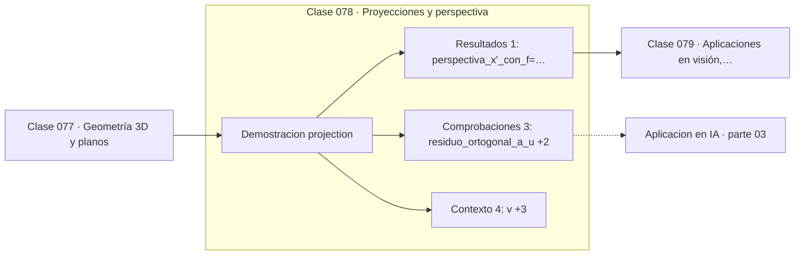

# 078 — Proyecciones y perspectiva

> [⬅️ 077 Geometría 3D y planos](../077-geometria-3d-y-planos/README.md) · [📚 Parte 03](../README.md) · [🏠 Programa](../../../README.md) · [079 Aplicaciones en visión, robótica y videojuegos ➡️](../079-aplicaciones-en-vision-robotica-y-videojuegos/README.md)

**Parte:** 03 — Geometría, trigonometría y geometría analítica · **Nivel:** `basico-intermedio` · **Horas estimadas:** 4
**Motor:** `engines.part03` · **Demostración:** `projection` · **Clase 18 de 20** de la parte

---

## 🎯 Propósito

**La perspectiva divide por la profundidad, y esa división es lo que hace que los objetos lejanos se vean pequeños.**

Del espacio a las coordenadas: distancia, ángulo, trigonometría, transformaciones lineales en el plano, coordenadas polares y proyección.

## ✅ Resultados de aprendizaje

Al terminar podrás:

1. Explicar **Proyecciones y perspectiva** con lenguaje cotidiano y con notación matemática.
2. Resolver un caso pequeño a mano y anticipar el orden de magnitud del resultado.
3. Ejecutar y modificar `lab.py`, que corre la demostración `projection`.
4. Interpretar las 8 salidas del laboratorio y decir qué comprueba cada una.
5. Detectar el error típico de esta parte: olvidar normalizar antes de comparar direcciones.

## 🧩 Fórmulas de la clase

```text
proyección ortogonal sobre u: proj_u(x) = (x·u/u·u)·u
perspectiva: x' = f·x/z,  y' = f·y/z
```

## 🗺️ Ubicación en el programa



## 📖 Fundamentos

Hay dos proyecciones distintas y conviene no mezclarlas. La **proyección ortogonal**
sobre una dirección es una operación lineal que descompone un vector en una componente
paralela y otra perpendicular. Es la base de PCA (clase 135), de mínimos cuadrados
(clase 119) y de cualquier «cuánto de esta dirección hay en este vector».

La **proyección en perspectiva** es otra cosa: divide las coordenadas por la
profundidad, y por eso **no es lineal**. Es la que reproduce cómo vemos: dos objetos del
mismo tamaño a distancias distintas ocupan ángulos distintos en la retina. La división
por z es exactamente lo que hace que las vías del tren converjan en el horizonte.

La proyección ortogonal viene acompañada de un teorema de Pitágoras: si `x = p + r` con
`p` la proyección y `r` el residuo ortogonal, entonces `‖x‖² = ‖p‖² + ‖r‖²`. Comprobar
esa identidad es la verificación estándar de que una proyección se calculó bien, y el
laboratorio la incluye.

Que la perspectiva no sea lineal explica por qué las coordenadas homogéneas de la
clase 073 son imprescindibles en gráficos: la división por z se difiere hasta el final
(la «división de perspectiva») y todo lo anterior se mantiene como productos de
matrices.

## 🧮 Ejemplo trabajado

Proyección ortogonal y perspectiva.

```text
Ortogonal de v = (4,3) sobre u = (1,0):
  coef = (v·u)/(u·u) = 4/1 = 4
  proyección = (4, 0)
  residuo    = (0, 3)
  residuo·u  = 0                    ✓ ortogonal
  Pitágoras: 25 = 16 + 9            ✓

Perspectiva con f = 2, z = 5:
  x' = 2·4/5 = 1.6
  el mismo punto a z = 10 daría 0.8
  → al doblar la distancia, el tamaño se reduce a la mitad
```

## 🔬 Qué ejecuta el laboratorio

`projection` — Proyección ortogonal de un vector y proyección en perspectiva.

| Grupo | Salidas |
|---|---|
| 🔢 Resultados numéricos (1) | `perspectiva_x'_con_f=2_z=5` |
| ✅ Comprobaciones de invariante (3) | `residuo_ortogonal_a_u`, `pitagoras`, `objetos_lejanos_se_encogen` |

Las claves booleanas no son adorno: si alguna fuera `False`, el resultado numérico
no sería fiable aunque el programa terminase sin error.

```bash
python classes/part-03-geometria-trigonometria-y-geometria-analitica/078-proyecciones-y-perspectiva/lab.py
compmath run 078
```

> [!TIP]
> Antes de ejecutar, **escribe tu predicción**. Un laboratorio que confirma lo que
> esperabas enseña tanto como uno que te contradice, pero solo si la predicción
> existía antes del resultado.

## ⚠️ Errores conceptuales frecuentes

1. Confundir proyección ortogonal (lineal) con perspectiva (no lineal).
2. Olvidar dividir por (u·u) cuando u no es unitario.
3. Dividir por z sin comprobar que es no nulo (plano de recorte cercano).

## 🚀 Dónde se usa de verdad

Pipeline gráfico, calibración de cámaras, PCA, mínimos cuadrados y descomposición
ortogonal en general.

## 🤖 Conexión con IA

Las transformaciones geométricas son el caso visual de las transformaciones lineales que una red aplica a sus activaciones; la similitud coseno es trigonometría en alta dimensión.

## 📓 Notebooks

| Archivo | Para qué |
|---|---|
| [`notebook.ipynb`](notebook.ipynb) | recorrido guiado con la demostración ejecutada |
| [`notebook_student.ipynb`](notebook_student.ipynb) | versión con `TODO` para resolver |
| [`notebook_solution.ipynb`](notebook_solution.ipynb) | solución de referencia verificada |

## 📝 Evaluación

| Criterio | Peso |
|---|---:|
| Comprensión conceptual | 25 % |
| Resolución manual | 25 % |
| Implementación y verificación | 25 % |
| Interpretación y comunicación | 15 % |
| Conexión con aplicación real | 10 % |

Detalle y criterios de error crítico en [`assessment.md`](assessment.md).

## ❓ Preguntas de comprobación

1. ¿Cuál es la entrada, cuál la salida y qué unidades tienen?
2. ¿Qué operación domina el comportamiento del resultado?
3. ¿Qué caso extremo revelaría un error conceptual?
4. ¿Cómo verificarías el resultado por un método independiente?
5. ¿Dónde aparece esto en gráficos por computador?

Si necesitas releer el código para responderlas, la clase todavía no está superada.

## 📥 Entregable

`notebook_student.ipynb` resuelto más un párrafo que explique el resultado **sin citar
código**: qué entra, qué sale, qué invariante se comprueba y qué pasaría en un caso límite.

## 🔗 Referencias

- [Hartley & Zisserman. *Multiple View Geometry in Computer Vision*, 2ª ed., 2004](https://www.robots.ox.ac.uk/~vgg/hzbook/) — *uso:* obra de referencia consultada en «Proyecciones y perspectiva».
- [Strang, G. *Introduction to Linear Algebra*, 6ª ed., 2023, cap. 4](https://math.mit.edu/~gs/linearalgebra/) — *uso:* exposición alternativa del tema en «Proyecciones y perspectiva».

Bibliografía completa de la parte en [`../../../docs/BIBLIOGRAPHY.md`](../../../docs/BIBLIOGRAPHY.md) · localizador verificable de cada obra en [`sources/bibliography.json`](../../../sources/bibliography.json).

## 📂 Material de la clase

[`intuition.md`](intuition.md) · [`theory.md`](theory.md) · [`derivation.md`](derivation.md) · [`exercises.md`](exercises.md) · [`assessment.md`](assessment.md) · [`where-is-this-used.md`](where-is-this-used.md) · [`lesson.yaml`](lesson.yaml)

---

> [⬅️ 077 Geometría 3D y planos](../077-geometria-3d-y-planos/README.md) · [📚 Parte 03](../README.md) · [🏠 Programa](../../../README.md) · [079 Aplicaciones en visión, robótica y videojuegos ➡️](../079-aplicaciones-en-vision-robotica-y-videojuegos/README.md)
