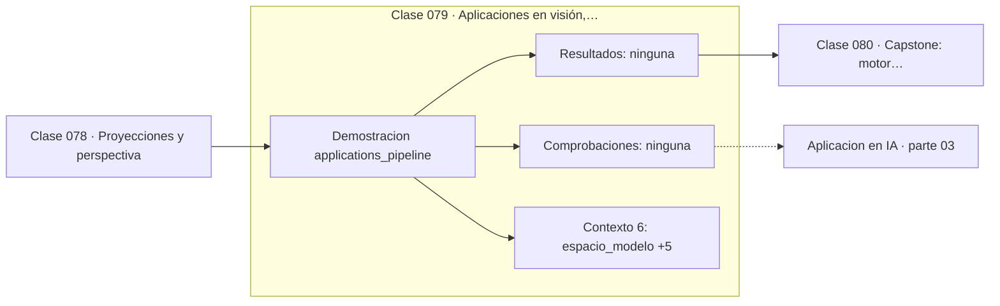

# 079 — Aplicaciones en visión, robótica y videojuegos

> [⬅️ 078 Proyecciones y perspectiva](../078-proyecciones-y-perspectiva/README.md) · [📚 Parte 03](../README.md) · [🏠 Programa](../../../README.md) · [080 Capstone: motor geométrico 2D ➡️](../080-capstone-motor-geometrico-2d/README.md)

**Parte:** 03 — Geometría, trigonometría y geometría analítica · **Nivel:** `basico-intermedio` · **Horas estimadas:** 4
**Motor:** `engines.part03` · **Demostración:** `applications_pipeline` · **Clase 19 de 20** de la parte

---

## 🎯 Propósito

**El pipeline geométrico encadena modelo, mundo, cámara y pantalla como una composición de transformaciones.**

Del espacio a las coordenadas: distancia, ángulo, trigonometría, transformaciones lineales en el plano, coordenadas polares y proyección.

## ✅ Resultados de aprendizaje

Al terminar podrás:

1. Explicar **Aplicaciones en visión, robótica y videojuegos** con lenguaje cotidiano y con notación matemática.
2. Resolver un caso pequeño a mano y anticipar el orden de magnitud del resultado.
3. Ejecutar y modificar `lab.py`, que corre la demostración `applications_pipeline`.
4. Interpretar las 6 salidas del laboratorio y decir qué comprueba cada una.
5. Detectar el error típico de esta parte: mezclar grados y radianes en la misma expresión.

## 🧩 Fórmulas de la clase

```text
x_pantalla = Proyección · Vista · Modelo · x_local
perspectiva final: (f·x/z, f·y/z)
```

## 🗺️ Ubicación en el programa



## 📖 Fundamentos

Todo sistema que dibuja o interpreta escenas tridimensionales ejecuta la misma
secuencia de cambios de coordenadas. El objeto se define en su **espacio local**; una
matriz de modelo lo coloca en el **mundo**; una matriz de vista lo lleva al sistema de
la **cámara**; y una proyección lo pasa a **pantalla**. Cada etapa es una
transformación, y componerlas es multiplicar sus matrices.

La ventaja de esta arquitectura es de reutilización: un mismo modelo 3D se puede colocar
cien veces en la escena cambiando solo la matriz de modelo, sin tocar sus vértices. Y la
composición se calcula una vez por objeto, no una vez por vértice.

El orden de multiplicación es la fuente inagotable de errores, y no hay atajo: hay que
fijar una convención (fila o columna, premultiplicar o posmultiplicar) y respetarla en
todo el sistema. Las bibliotecas difieren entre sí, y mezclar dos convenciones produce
escenas que se ven «casi bien».

El mismo pipeline, recorrido al revés, es el problema de la visión artificial:
dada una imagen, recuperar la geometría de la escena. Ahí la división por z se convierte
en la ambigüedad fundamental —no se puede distinguir un objeto pequeño y cercano de uno
grande y lejano sin información adicional— y de ahí nacen la estereovisión y la
estructura a partir del movimiento.

## 🧮 Ejemplo trabajado

Un punto recorriendo las cuatro etapas.

```text
1. espacio modelo:   (1, 1, 1)

2. rotación 30° en Z → mundo:
   (0.366, 1.366, 1.0)

3. cámara desplazada 4 en Z:
   (0.366, 1.366, 5.0)

4. proyección con f = 1.5:
   x' = 1.5·0.366/5 = 0.1098
   y' = 1.5·1.366/5 = 0.4098

Etapas: modelo → mundo → cámara → proyección → pantalla
```

## 🔬 Qué ejecuta el laboratorio

`applications_pipeline` — Pipeline geométrico típico: modelo → mundo → cámara → pantalla.

| Grupo | Salidas |
|---|---|
| 🔢 Resultados numéricos (0) | — |
| ✅ Comprobaciones de invariante (0) | — |

Las claves booleanas no son adorno: si alguna fuera `False`, el resultado numérico
no sería fiable aunque el programa terminase sin error.

```bash
python classes/part-03-geometria-trigonometria-y-geometria-analitica/079-aplicaciones-en-vision-robotica-y-videojuegos/lab.py
compmath run 079
```

> [!TIP]
> Antes de ejecutar, **escribe tu predicción**. Un laboratorio que confirma lo que
> esperabas enseña tanto como uno que te contradice, pero solo si la predicción
> existía antes del resultado.

## ⚠️ Errores conceptuales frecuentes

1. Mezclar convenciones de fila y columna entre bibliotecas.
2. Aplicar la proyección antes que la transformación de vista.
3. Olvidar el plano de recorte cercano y dividir por z ≈ 0.

## 🚀 Dónde se usa de verdad

Motores de videojuegos, realidad aumentada, calibración de cámaras, robótica y
reconstrucción 3D.

## 🤖 Conexión con IA

Las transformaciones geométricas son el caso visual de las transformaciones lineales que una red aplica a sus activaciones; la similitud coseno es trigonometría en alta dimensión.

## 📓 Notebooks

| Archivo | Para qué |
|---|---|
| [`notebook.ipynb`](notebook.ipynb) | recorrido guiado con la demostración ejecutada |
| [`notebook_student.ipynb`](notebook_student.ipynb) | versión con `TODO` para resolver |
| [`notebook_solution.ipynb`](notebook_solution.ipynb) | solución de referencia verificada |

## 📝 Evaluación

| Criterio | Peso |
|---|---:|
| Comprensión conceptual | 25 % |
| Resolución manual | 25 % |
| Implementación y verificación | 25 % |
| Interpretación y comunicación | 15 % |
| Conexión con aplicación real | 10 % |

Detalle y criterios de error crítico en [`assessment.md`](assessment.md).

## ❓ Preguntas de comprobación

1. ¿Cuál es la entrada, cuál la salida y qué unidades tienen?
2. ¿Qué operación domina el comportamiento del resultado?
3. ¿Qué caso extremo revelaría un error conceptual?
4. ¿Cómo verificarías el resultado por un método independiente?
5. ¿Dónde aparece esto en gráficos por computador?

Si necesitas releer el código para responderlas, la clase todavía no está superada.

## 📥 Entregable

`notebook_student.ipynb` resuelto más un párrafo que explique el resultado **sin citar
código**: qué entra, qué sale, qué invariante se comprueba y qué pasaría en un caso límite.

## 🔗 Referencias

- [Hartley & Zisserman. *Multiple View Geometry in Computer Vision*, 2ª ed., 2004](https://www.robots.ox.ac.uk/~vgg/hzbook/)
- [Akenine-Möller, Haines & Hoffman. *Real-Time Rendering*, 4ª ed., CRC Press, 2018](https://www.realtimerendering.com/)

Bibliografía completa de la parte en [`../../../docs/BIBLIOGRAPHY.md`](../../../docs/BIBLIOGRAPHY.md).

## 📂 Material de la clase

[`intuition.md`](intuition.md) · [`theory.md`](theory.md) · [`derivation.md`](derivation.md) · [`exercises.md`](exercises.md) · [`assessment.md`](assessment.md) · [`where-is-this-used.md`](where-is-this-used.md) · [`lesson.yaml`](lesson.yaml)

---

> [⬅️ 078 Proyecciones y perspectiva](../078-proyecciones-y-perspectiva/README.md) · [📚 Parte 03](../README.md) · [🏠 Programa](../../../README.md) · [080 Capstone: motor geométrico 2D ➡️](../080-capstone-motor-geometrico-2d/README.md)
