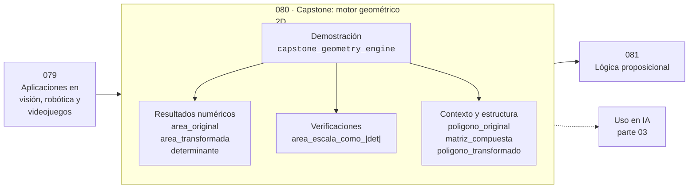

# 080 — Capstone: motor geométrico 2D

> [⬅️ 079 Aplicaciones en visión, robótica y videojuegos](../079-aplicaciones-en-vision-robotica-y-videojuegos/README.md) · [📚 Parte 03](../README.md) · [🏠 Programa](../../../README.md) · [081 Lógica proposicional ➡️](../../part-04-matematica-discreta-para-computacion/081-logica-proposicional/README.md)

**Parte:** 03 — Geometría, trigonometría y geometría analítica · **Nivel:** `basico-intermedio` · **Horas estimadas:** 4
**Motor:** `engines.part03` · **Demostración:** `capstone_geometry_engine` · **Clase 20 de 20** de la parte

---

## 🎯 Propósito

**El área de un polígono transformado es la original multiplicada por el valor absoluto del determinante.**

Del espacio a las coordenadas: distancia, ángulo, trigonometría, transformaciones lineales en el plano, coordenadas polares y proyección.

## ✅ Resultados de aprendizaje

Al terminar podrás:

1. Explicar **Capstone: motor geométrico 2D** con lenguaje cotidiano y con notación matemática.
2. Resolver un caso pequeño a mano y anticipar el orden de magnitud del resultado.
3. Ejecutar y modificar `lab.py`, que corre la demostración `capstone_geometry_engine`.
4. Interpretar las 7 salidas del laboratorio y decir qué comprueba cada una.
5. Detectar el error típico de esta parte: aplicar rotación y traslación en el orden equivocado.

## 🧩 Fórmulas de la clase

```text
fórmula del cordón: A = ½|Σ(xᵢyᵢ₊₁ − xᵢ₊₁yᵢ)|
A' = |det M| · A
```

## 🗺️ Ubicación en el programa



## 📖 Fundamentos

El capstone reúne las tres ideas centrales de la parte: una matriz es una
transformación, componerlas es multiplicarlas, y el determinante mide cómo cambian las
áreas. Se construye un motor mínimo que aplica una transformación compuesta a un
polígono y comprueba la relación entre áreas.

El área se calcula con la **fórmula del cordón** (o de Gauss), que suma productos
cruzados de vértices consecutivos. Es un resultado notable: el área de un polígono
arbitrario se obtiene recorriendo su frontera, sin necesidad de triangularlo. El signo
de la suma indica además el sentido del recorrido, información que se usa para detectar
orientación en geometría computacional.

La verificación central es que `área_transformada = |det M| · área_original`. Que se
cumpla para un cuadrado rotado y escalado no es sorprendente; que se cumpla para
**cualquier** polígono es el contenido geométrico del determinante, y comprobarlo
numéricamente cierra la parte con una relación que se usará en integración múltiple y en
transformación de densidades.

Un motor así, con unas pocas decenas de líneas, es el núcleo de cualquier sistema de
gráficos 2D. Lo que añaden las bibliotecas reales es rendimiento, antialiasing y
gestión de recursos; la matemática es exactamente esta.

## 🧮 Ejemplo trabajado

Cuadrado unitario rotado 45° y escalado ×2.

```text
polígono original: (0,0), (1,0), (1,1), (0,1)
área (cordón): 1.0

M = R(45°) · S(2)
  = [[1.414, −1.414], [1.414, 1.414]]

polígono transformado:
  (0,0), (1.414, 1.414), (0, 2.828), (−1.414, 1.414)

área transformada: 4.0
det M = 1.414² + 1.414² = 4.0

Verificación: 1.0 × |4.0| = 4.0     ✓
```

## 🔬 Qué ejecuta el laboratorio

`capstone_geometry_engine` — Capstone: motor 2D que compone transformaciones sobre un polígono.

| Grupo | Salidas |
|---|---|
| 🔢 Resultados numéricos (3) | `area_original`, `area_transformada`, `determinante` |
| ✅ Comprobaciones de invariante (1) | `area_escala_como_|det|` |

Las claves booleanas no son adorno: si alguna fuera `False`, el resultado numérico
no sería fiable aunque el programa terminase sin error.

```bash
python classes/part-03-geometria-trigonometria-y-geometria-analitica/080-capstone-motor-geometrico-2d/lab.py
compmath run 080
```

> [!TIP]
> Antes de ejecutar, **escribe tu predicción**. Un laboratorio que confirma lo que
> esperabas enseña tanto como uno que te contradice, pero solo si la predicción
> existía antes del resultado.

## ⚠️ Errores conceptuales frecuentes

1. Recorrer los vértices del polígono en orden no consecutivo al aplicar la fórmula del cordón.
2. Olvidar el valor absoluto y obtener áreas negativas.
3. Aplicar las transformaciones en el orden equivocado al componerlas.

## 🚀 Dónde se usa de verdad

Motores gráficos 2D, cálculo de áreas en SIG, detección de orientación de polígonos y
cambio de variable en integrales.

## 🤖 Conexión con IA

Las transformaciones geométricas son el caso visual de las transformaciones lineales que una red aplica a sus activaciones; la similitud coseno es trigonometría en alta dimensión.

## 📓 Notebooks

| Archivo | Para qué |
|---|---|
| [`notebook.ipynb`](notebook.ipynb) | recorrido guiado con la demostración ejecutada |
| [`notebook_student.ipynb`](notebook_student.ipynb) | versión con `TODO` para resolver |
| [`notebook_solution.ipynb`](notebook_solution.ipynb) | solución de referencia verificada |

## 📝 Evaluación

| Criterio | Peso |
|---|---:|
| Comprensión conceptual | 25 % |
| Resolución manual | 25 % |
| Implementación y verificación | 25 % |
| Interpretación y comunicación | 15 % |
| Conexión con aplicación real | 10 % |

Detalle y criterios de error crítico en [`assessment.md`](assessment.md).

## ❓ Preguntas de comprobación

1. ¿Cuál es la entrada, cuál la salida y qué unidades tienen?
2. ¿Qué operación domina el comportamiento del resultado?
3. ¿Qué caso extremo revelaría un error conceptual?
4. ¿Cómo verificarías el resultado por un método independiente?
5. ¿Dónde aparece esto en gráficos por computador?

Si necesitas releer el código para responderlas, la clase todavía no está superada.

## 📥 Entregable

`notebook_student.ipynb` resuelto más un párrafo que explique el resultado **sin citar
código**: qué entra, qué sale, qué invariante se comprueba y qué pasaría en un caso límite.

## 🔗 Referencias

- [Shoelace formula — Wolfram MathWorld](https://mathworld.wolfram.com/PolygonArea.html)
- [de Berg, M. et al. *Computational Geometry*, 3ª ed., Springer, 2008](https://link.springer.com/book/10.1007/978-3-540-77974-2)

Bibliografía completa de la parte en [`../../../docs/BIBLIOGRAPHY.md`](../../../docs/BIBLIOGRAPHY.md).

## 📂 Material de la clase

[`intuition.md`](intuition.md) · [`theory.md`](theory.md) · [`derivation.md`](derivation.md) · [`exercises.md`](exercises.md) · [`assessment.md`](assessment.md) · [`where-is-this-used.md`](where-is-this-used.md) · [`lesson.yaml`](lesson.yaml)

---

> [⬅️ 079 Aplicaciones en visión, robótica y videojuegos](../079-aplicaciones-en-vision-robotica-y-videojuegos/README.md) · [📚 Parte 03](../README.md) · [🏠 Programa](../../../README.md) · [081 Lógica proposicional ➡️](../../part-04-matematica-discreta-para-computacion/081-logica-proposicional/README.md)
