# 📏 Parte 03 — Geometría, trigonometría y geometría analítica

> [⬅️ Parte 02 — Álgebra y funciones](../part-02-algebra-y-funciones/README.md) · [🏠 Programa](../../README.md) · [📇 Catálogo](../README.md) · [Parte 04 — Matemática discreta para computación ➡️](../part-04-matematica-discreta-para-computacion/README.md)

**Nivel:** `basico-intermedio` · **Clases:** 20 · **Horas estimadas:** 80 · **Motor:** [`part03.py`](../../src/computational_math/engines/part03.py)

---

## 🎯 De qué trata esta parte

Del espacio a las coordenadas: distancia, ángulo, trigonometría, transformaciones lineales en el plano, coordenadas polares y proyección.

## 🧠 Ideas centrales

- El radián no es una unidad decorativa: es la que hace que d(sin x)/dx = cos x.
- Toda rotación 2D es una matriz ortogonal de determinante 1.
- El producto punto mide alineación; la norma mide magnitud.
- Componer transformaciones es multiplicar matrices, y el orden importa.
- Las coordenadas homogéneas convierten la traslación en multiplicación.

## 🤖 Por qué importa en IA

> [!IMPORTANT]
> Las transformaciones geométricas son el caso visual de las transformaciones lineales que una red aplica a sus activaciones; la similitud coseno es trigonometría en alta dimensión.

## ⚠️ Errores frecuentes de esta parte

- Mezclar grados y radianes en la misma expresión.
- Aplicar rotación y traslación en el orden equivocado.
- Olvidar normalizar antes de comparar direcciones.

## 🧭 Secuencia de la parte

```mermaid
flowchart LR
    subgraph B1["Bloque 1"]
        direction TB
        L061["061<br/>Puntos, segmentos y<br/>distancias"]
        L062["062<br/>Ángulos y radianes"]
        L063["063<br/>Triángulos y semejanza"]
        L064["064<br/>Teorema de Pitágoras"]
        L065["065<br/>Seno, coseno y tangente"]
        L061 --> L062
        L062 --> L063
        L063 --> L064
        L064 --> L065
    end
    subgraph B2["Bloque 2"]
        direction TB
        L066["066<br/>Identidades<br/>trigonométricas básicas"]
        L067["067<br/>Círculo unitario"]
        L068["068<br/>Coordenadas cartesianas"]
        L069["069<br/>Pendiente y ecuación de<br/>la recta"]
        L070["070<br/>Distancia punto-recta"]
        L066 --> L067
        L067 --> L068
        L068 --> L069
        L069 --> L070
    end
    subgraph B3["Bloque 3"]
        direction TB
        L071["071<br/>Circunferencias y<br/>cónicas"]
        L072["072<br/>Vectores geométricos 2D"]
        L073["073<br/>Transformaciones:<br/>traslación y escala"]
        L074["074<br/>Rotaciones 2D"]
        L075["075<br/>Matrices de<br/>transformación"]
        L071 --> L072
        L072 --> L073
        L073 --> L074
        L074 --> L075
    end
    subgraph B4["Bloque 4"]
        direction TB
        L076["076<br/>Coordenadas polares"]
        L077["077<br/>Geometría 3D y planos"]
        L078["078<br/>Proyecciones y<br/>perspectiva"]
        L079["079<br/>Aplicaciones en visión,<br/>robótica y videojuegos"]
        L080["080<br/>Capstone: motor<br/>geométrico 2D"]
        L076 --> L077
        L077 --> L078
        L078 --> L079
        L079 --> L080
    end
    L065 --> L066
    L070 --> L071
    L075 --> L076
```



## 📚 Las clases

| # | Clase | Demostración | Idea central |
|---|---|---|---|
| `061` | [Puntos, segmentos y distancias](061-puntos-segmentos-y-distancias/README.md) | `distances` | Distancia euclídea, Manhattan y Chebyshev sobre los mismos puntos. |
| `062` | [Ángulos y radianes](062-angulos-y-radianes/README.md) | `angles_radians` | Grados y radianes: por qué el radián es la unidad natural. |
| `063` | [Triángulos y semejanza](063-triangulos-y-semejanza/README.md) | `similar_triangles` | Semejanza: los ángulos se conservan, las longitudes escalan. |
| `064` | [Teorema de Pitágoras](064-teorema-de-pitagoras/README.md) | `pythagoras` | Pitágoras, su recíproco y una terna pitagórica generada. |
| `065` | [Seno, coseno y tangente](065-seno-coseno-y-tangente/README.md) | `trig_ratios` | Seno, coseno y tangente sobre un triángulo rectángulo concreto. |
| `066` | [Identidades trigonométricas básicas](066-identidades-trigonometricas-basicas/README.md) | `trig_identities` | Identidades fundamentales verificadas en varios ángulos. |
| `067` | [Círculo unitario](067-circulo-unitario/README.md) | `unit_circle` | El círculo unitario como diccionario de ángulos notables. |
| `068` | [Coordenadas cartesianas](068-coordenadas-cartesianas/README.md) | `cartesian_coordinates` | Cuadrantes, simetrías y traslación de origen. |
| `069` | [Pendiente y ecuación de la recta](069-pendiente-y-ecuacion-de-la-recta/README.md) | `line_equation` | Recta en forma pendiente-intercepto y en forma general. |
| `070` | [Distancia punto-recta](070-distancia-punto-recta/README.md) | `point_line_distance` | Distancia de un punto a una recta y su proyección. |
| `071` | [Circunferencias y cónicas](071-circunferencias-y-conicas/README.md) | `conics` | Circunferencia, elipse y parábola desde su ecuación. |
| `072` | [Vectores geométricos 2D](072-vectores-geometricos-2d/README.md) | `vectors_2d` | Vector como dirección y magnitud; ángulo entre vectores. |
| `073` | [Transformaciones: traslación y escala](073-transformaciones-traslacion-y-escala/README.md) | `translation_scale` | Traslación y escala en coordenadas homogéneas. |
| `074` | [Rotaciones 2D](074-rotaciones-2d/README.md) | `rotation_2d` | Matriz de rotación: ortogonal y de determinante 1. |
| `075` | [Matrices de transformación](075-matrices-de-transformacion/README.md) | `transform_matrices` | Composición de rotación, escala y reflexión. |
| `076` | [Coordenadas polares](076-coordenadas-polares/README.md) | `polar_coordinates` | Conversión cartesiana ↔ polar y su ida y vuelta. |
| `077` | [Geometría 3D y planos](077-geometria-3d-y-planos/README.md) | `planes_3d` | Plano por su normal, distancia de un punto y producto cruz. |
| `078` | [Proyecciones y perspectiva](078-proyecciones-y-perspectiva/README.md) | `projection` | Proyección ortogonal de un vector y proyección en perspectiva. |
| `079` | [Aplicaciones en visión, robótica y videojuegos](079-aplicaciones-en-vision-robotica-y-videojuegos/README.md) | `applications_pipeline` | Pipeline geométrico típico: modelo → mundo → cámara → pantalla. |
| `080` | [Capstone: motor geométrico 2D](080-capstone-motor-geometrico-2d/README.md) | `capstone_geometry_engine` | Capstone: motor 2D que compone transformaciones sobre un polígono. |

## 🧰 Stack de referencia

`math`, `numpy (opcional)`

Los laboratorios se ejecutan con biblioteca estándar; estas herramientas aparecen
como contraste profesional, no como requisito.

## 🧪 Ejecutar toda la parte

```bash
compmath run --part 03
compmath catalog --part 03
```

## 📊 Evaluación de la parte

| Componente | Peso |
|---|---:|
| Clases y ejercicios | 40 % |
| Laboratorios y notebooks | 25 % |
| Explicación oral o escrita | 15 % |
| Capstone ([080](080-capstone-motor-geometrico-2d/README.md)) | 20 % |

## 📖 Bibliografía

- Hartley, R.; Zisserman, A. *Multiple View Geometry in Computer Vision*. 2ª ed., Cambridge, 2004.
- Coxeter, H. S. M. *Introduction to Geometry*. 2ª ed., Wiley, 1989.
- Lengyel, E. *Mathematics for 3D Game Programming and Computer Graphics*. 3ª ed., 2011.

---

> [⬅️ Parte 02 — Álgebra y funciones](../part-02-algebra-y-funciones/README.md) · [🏠 Programa](../../README.md) · [📇 Catálogo](../README.md) · [Parte 04 — Matemática discreta para computación ➡️](../part-04-matematica-discreta-para-computacion/README.md)
