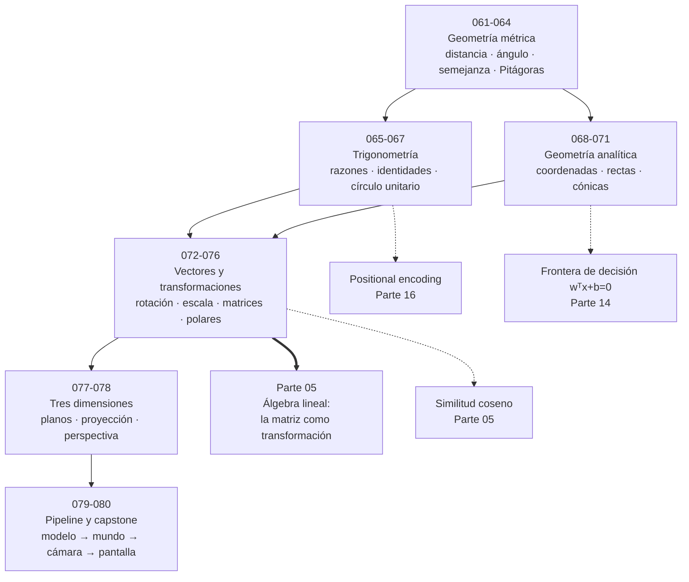

# 📏 Parte 03 — Geometría, trigonometría y geometría analítica

> [⬅️ Parte 02 — Álgebra y funciones](../part-02-algebra-y-funciones/README.md) · [🏠 Programa](../../README.md) · [📇 Catálogo](../README.md) · [Parte 04 — Matemática discreta para computación ➡️](../part-04-matematica-discreta-para-computacion/README.md)

**Nivel:** `basico-intermedio` · **Clases:** 20 · **Horas estimadas:** 80 · **Motor:** [`part03.py`](../../src/computational_math/engines/part03.py)

---

## 🎯 De qué trata esta parte

Del espacio a las coordenadas: distancia, ángulo, trigonometría, transformaciones lineales en el plano, coordenadas polares y proyección.

Descartes hizo en 1637 el movimiento que define esta parte: identificar un punto del
plano con un par de números. A partir de ahí, toda pregunta geométrica se convierte en
una pregunta algebraica, y toda respuesta algebraica tiene lectura geométrica. Esa doble
vía es la que permite que un ordenador —que solo sabe operar con números— haga gráficos,
robótica y visión artificial.

Las clases 061 a 067 construyen la trigonometría desde la geometría del triángulo y del
círculo unitario. El punto que conviene no perder es por qué el **radián** es la unidad
correcta: es la única en la que la derivada del seno es el coseno, sin factores de
conversión. Trabajar en grados obliga a arrastrar un π/180 en cada derivada, y de ahí
salen errores que no producen excepción, solo resultados escalados.

Las clases 068 a 071 son geometría analítica clásica: coordenadas, rectas, distancias y
cónicas. La distancia punto-recta de la clase 070 es la misma fórmula que define el
margen de una SVM (clase 289), y la ecuación general `Ax + By + C = 0` es exactamente
`wᵀx + b = 0`, la frontera de decisión de cualquier clasificador lineal.

Las clases 072 a 078 son el corazón computacional: vectores, transformaciones, matrices
de transformación, coordenadas polares, planos y proyección. Aquí aparece por primera vez
una **matriz como transformación** —no como tabla— y aparecen dos hechos que la parte 05
formalizará: componer transformaciones es multiplicar matrices, y el orden importa.

Las coordenadas homogéneas de la clase 073 son un truco brillante y poco intuitivo:
añadiendo una dimensión, la traslación —que no es lineal— se convierte en una
multiplicación de matrices. Es la razón por la que las GPU pueden aplicar toda la cadena
de transformaciones de un vértice con un único producto matricial.

El cierre (079 y 080) monta el pipeline completo: modelo → mundo → cámara → pantalla, el
mismo que ejecuta cualquier motor de videojuego y cualquier sistema de visión. Y el
capstone comprueba una relación que resume la parte: el área de un polígono transformado
es el área original multiplicada por el valor absoluto del determinante.

## 🗺️ Mapa conceptual



## 🧠 Ideas centrales

- El radián no es una unidad decorativa: es la que hace que d(sin x)/dx = cos x.
- Toda rotación 2D es una matriz ortogonal de determinante 1.
- El producto punto mide alineación; la norma mide magnitud.
- Componer transformaciones es multiplicar matrices, y el orden importa.
- Las coordenadas homogéneas convierten la traslación en multiplicación.

## 🤖 Por qué importa en IA

> [!IMPORTANT]
> Las transformaciones geométricas son el caso visual de las transformaciones lineales que una red aplica a sus activaciones; la similitud coseno es trigonometría en alta dimensión.

## ⚠️ Errores frecuentes de esta parte

- Mezclar grados y radianes en la misma expresión.
- Aplicar rotación y traslación en el orden equivocado.
- Olvidar normalizar antes de comparar direcciones.

## 🧭 Secuencia de la parte

```mermaid
flowchart LR
    subgraph B1["Bloque 1"]
        direction TB
        L061["061<br/>Puntos, segmentos y<br/>distancias"]
        L062["062<br/>Ángulos y radianes"]
        L063["063<br/>Triángulos y semejanza"]
        L064["064<br/>Teorema de Pitágoras"]
        L065["065<br/>Seno, coseno y tangente"]
        L061 --> L062
        L062 --> L063
        L063 --> L064
        L064 --> L065
    end
    subgraph B2["Bloque 2"]
        direction TB
        L066["066<br/>Identidades<br/>trigonométricas básicas"]
        L067["067<br/>Círculo unitario"]
        L068["068<br/>Coordenadas cartesianas"]
        L069["069<br/>Pendiente y ecuación de<br/>la recta"]
        L070["070<br/>Distancia punto-recta"]
        L066 --> L067
        L067 --> L068
        L068 --> L069
        L069 --> L070
    end
    subgraph B3["Bloque 3"]
        direction TB
        L071["071<br/>Circunferencias y<br/>cónicas"]
        L072["072<br/>Vectores geométricos 2D"]
        L073["073<br/>Transformaciones:<br/>traslación y escala"]
        L074["074<br/>Rotaciones 2D"]
        L075["075<br/>Matrices de<br/>transformación"]
        L071 --> L072
        L072 --> L073
        L073 --> L074
        L074 --> L075
    end
    subgraph B4["Bloque 4"]
        direction TB
        L076["076<br/>Coordenadas polares"]
        L077["077<br/>Geometría 3D y planos"]
        L078["078<br/>Proyecciones y<br/>perspectiva"]
        L079["079<br/>Aplicaciones en visión,<br/>robótica y videojuegos"]
        L080["080<br/>Capstone: motor<br/>geométrico 2D"]
        L076 --> L077
        L077 --> L078
        L078 --> L079
        L079 --> L080
    end
    L065 --> L066
    L070 --> L071
    L075 --> L076
```



## 📚 Las clases

| # | Clase | Demostración | Idea central |
|---|---|---|---|
| `061` | [Puntos, segmentos y distancias](061-puntos-segmentos-y-distancias/README.md) | `distances` | La distancia euclídea es una de varias métricas posibles; cuál se elige cambia qué está cerca. |
| `062` | [Ángulos y radianes](062-angulos-y-radianes/README.md) | `angles_radians` | El radián es la unidad natural del ángulo: en ella, la derivada del seno es el coseno sin factores de conversión. |
| `063` | [Triángulos y semejanza](063-triangulos-y-semejanza/README.md) | `similar_triangles` | En figuras semejantes los ángulos se conservan, las longitudes escalan con k y las áreas con k². |
| `064` | [Teorema de Pitágoras](064-teorema-de-pitagoras/README.md) | `pythagoras` | El teorema de Pitágoras y su recíproco caracterizan el ángulo recto; las ternas se generan sistemáticamente. |
| `065` | [Seno, coseno y tangente](065-seno-coseno-y-tangente/README.md) | `trig_ratios` | Seno, coseno y tangente son razones que dependen solo del ángulo, por semejanza de triángulos. |
| `066` | [Identidades trigonométricas básicas](066-identidades-trigonometricas-basicas/README.md) | `trig_identities` | La identidad pitagórica es el teorema de Pitágoras sobre el círculo unitario; de ella se derivan las demás. |
| `067` | [Círculo unitario](067-circulo-unitario/README.md) | `unit_circle` | El círculo unitario extiende seno y coseno a cualquier ángulo real y muestra su periodicidad y paridad. |
| `068` | [Coordenadas cartesianas](068-coordenadas-cartesianas/README.md) | `cartesian_coordinates` | Las coordenadas convierten preguntas geométricas en preguntas algebraicas. |
| `069` | [Pendiente y ecuación de la recta](069-pendiente-y-ecuacion-de-la-recta/README.md) | `line_equation` | La forma general Ax + By + C = 0 es la misma expresión que la frontera de decisión de un clasificador lineal. |
| `070` | [Distancia punto-recta](070-distancia-punto-recta/README.md) | `point_line_distance` | La distancia de un punto a una recta es la misma fórmula que define el margen de una SVM. |
| `071` | [Circunferencias y cónicas](071-circunferencias-y-conicas/README.md) | `conics` | La excentricidad clasifica las cónicas en una única familia continua. |
| `072` | [Vectores geométricos 2D](072-vectores-geometricos-2d/README.md) | `vectors_2d` | El producto punto mide alineación; la norma mide magnitud; juntos dan el ángulo. |
| `073` | [Transformaciones: traslación y escala](073-transformaciones-traslacion-y-escala/README.md) | `translation_scale` | Las coordenadas homogéneas convierten la traslación —que no es lineal— en una multiplicación de matrices. |
| `074` | [Rotaciones 2D](074-rotaciones-2d/README.md) | `rotation_2d` | Una matriz de rotación es ortogonal y de determinante 1: preserva normas, ángulos y orientación. |
| `075` | [Matrices de transformación](075-matrices-de-transformacion/README.md) | `transform_matrices` | El valor absoluto del determinante es el factor por el que la transformación multiplica las áreas; su signo indica si invierte la orientación. |
| `076` | [Coordenadas polares](076-coordenadas-polares/README.md) | `polar_coordinates` | Las coordenadas polares describen un punto por distancia y ángulo; atan2 hace la conversión inversa correctamente. |
| `077` | [Geometría 3D y planos](077-geometria-3d-y-planos/README.md) | `planes_3d` | El producto cruz da un vector ortogonal a dos dados, y su norma es el área del paralelogramo que forman. |
| `078` | [Proyecciones y perspectiva](078-proyecciones-y-perspectiva/README.md) | `projection` | La perspectiva divide por la profundidad, y esa división es lo que hace que los objetos lejanos se vean pequeños. |
| `079` | [Aplicaciones en visión, robótica y videojuegos](079-aplicaciones-en-vision-robotica-y-videojuegos/README.md) | `applications_pipeline` | El pipeline geométrico encadena modelo, mundo, cámara y pantalla como una composición de transformaciones. |
| `080` | [Capstone: motor geométrico 2D](080-capstone-motor-geometrico-2d/README.md) | `capstone_geometry_engine` | El área de un polígono transformado es la original multiplicada por el valor absoluto del determinante. |

## 📖 Glosario de la parte (18 términos)

Definiciones precisas en [`GLOSARIO.md`](GLOSARIO.md).

## 🧰 Stack de referencia

`math`, `numpy (opcional)`

Los laboratorios se ejecutan con biblioteca estándar; estas herramientas aparecen
como contraste profesional, no como requisito.

## 🧪 Ejecutar toda la parte

```bash
compmath run --part 03
compmath catalog --part 03
```

## 📊 Evaluación de la parte

| Componente | Peso |
|---|---:|
| Clases y ejercicios | 40 % |
| Laboratorios y notebooks | 25 % |
| Explicación oral o escrita | 15 % |
| Capstone ([080](080-capstone-motor-geometrico-2d/README.md)) | 20 % |

## 📖 Bibliografía

- Hartley, R.; Zisserman, A. *Multiple View Geometry in Computer Vision*. 2ª ed., Cambridge, 2004.
- Coxeter, H. S. M. *Introduction to Geometry*. 2ª ed., Wiley, 1989.
- Lengyel, E. *Mathematics for 3D Game Programming and Computer Graphics*. 3ª ed., 2011.

---

> [⬅️ Parte 02 — Álgebra y funciones](../part-02-algebra-y-funciones/README.md) · [🏠 Programa](../../README.md) · [📇 Catálogo](../README.md) · [Parte 04 — Matemática discreta para computación ➡️](../part-04-matematica-discreta-para-computacion/README.md)
