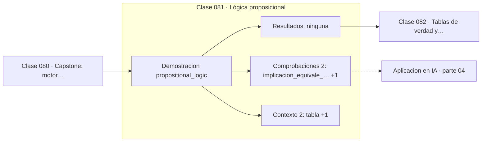

# 081 — Lógica proposicional

> [⬅️ 080 Capstone: motor geométrico 2D](../../part-03-geometria-trigonometria-y-geometria-analitica/080-capstone-motor-geometrico-2d/README.md) · [📚 Parte 04](../README.md) · [🏠 Programa](../../../README.md) · [082 Tablas de verdad y equivalencias ➡️](../082-tablas-de-verdad-y-equivalencias/README.md)

**Parte:** 04 — Matemática discreta para computación · **Nivel:** `intermedio` · **Horas estimadas:** 4
**Motor:** `engines.part04` · **Demostración:** `propositional_logic` · **Clase 1 de 20** de la parte

---

## 🎯 Propósito

**Una implicación equivale a su contrarrecíproca, nunca a su recíproca.**

Lógica, conjuntos, conteo, inducción, recurrencias, grafos y aritmética modular: la matemática que hace demostrable un programa.

## ✅ Resultados de aprendizaje

Al terminar podrás:

1. Explicar **Lógica proposicional** con lenguaje cotidiano y con notación matemática.
2. Resolver un caso pequeño a mano y anticipar el orden de magnitud del resultado.
3. Ejecutar y modificar `lab.py`, que corre la demostración `propositional_logic`.
4. Interpretar las 4 salidas del laboratorio y decir qué comprueba cada una.
5. Detectar el error típico de esta parte: contar dos veces al aplicar el principio de inclusión-exclusión.

## 🧩 Fórmulas de la clase

```text
p → q ≡ ¬p ∨ q
p → q ≡ ¬q → ¬p   (contrarrecíproca)
p → q ≢ q → p     (recíproca)
```

## 🗺️ Ubicación en el programa



## 📖 Fundamentos

La lógica proposicional asigna un valor de verdad a cada enunciado y define cómo se
combinan. El conector que causa más problemas es la implicación, porque su definición
formal no coincide con el uso coloquial: `p → q` es **falsa únicamente** cuando p es
verdadera y q falsa. Si p es falsa, la implicación es verdadera sea cual sea q, lo que
se llama verdad vacua.

Esa definición tiene una consecuencia práctica inmediata: «todos los elementos de la
lista vacía cumplen la condición» es cierto, y por eso `all([])` devuelve `True` en
Python. No es una rareza del lenguaje: es la lógica correcta.

La equivalencia con la contrarrecíproca es la herramienta de demostración más útil de
toda la matemática. Probar «si n² es par entonces n es par» directamente es incómodo;
probar «si n es impar entonces n² es impar» es inmediato. Ambas afirmaciones son la
misma, y elegir la más fácil es legítimo.

Confundir una implicación con su recíproca es la falacia más extendida. «Si llueve, el
suelo está mojado» no permite concluir «si el suelo está mojado, llovió». En estadística
la misma confusión es la falacia del fiscal: `P(evidencia | inocente)` pequeña no
implica `P(inocente | evidencia)` pequeña, tema de la clase 186.

## 🧮 Ejemplo trabajado

Tabla de verdad de las tres formas.

```text
p      q      p→q    q→p (recíproca)   ¬q→¬p (contrarrecíproca)
V      V       V           V                    V
V      F       F           V                    F
F      V       V           F                    V
F      F       V           V                    V

¿p→q ≡ contrarrecíproca?  Sí, columnas idénticas      ✓
¿p→q ≡ recíproca?         No, difieren en 2 filas     ✗

Verdad vacua: si p es falsa, p→q es verdadera siempre.
Por eso all([]) == True.
```

## 🔬 Qué ejecuta el laboratorio

`propositional_logic` — Implicación, contrarrecíproca y recíproca no son lo mismo.

| Grupo | Salidas |
|---|---|
| 🔢 Resultados numéricos (0) | — |
| ✅ Comprobaciones de invariante (2) | `implicacion_equivale_a_contrarreciproca`, `implicacion_equivale_a_reciproca` |

Las claves booleanas no son adorno: si alguna fuera `False`, el resultado numérico
no sería fiable aunque el programa terminase sin error.

```bash
python classes/part-04-matematica-discreta-para-computacion/081-logica-proposicional/lab.py
compmath run 081
```

> [!TIP]
> Antes de ejecutar, **escribe tu predicción**. Un laboratorio que confirma lo que
> esperabas enseña tanto como uno que te contradice, pero solo si la predicción
> existía antes del resultado.

## ⚠️ Errores conceptuales frecuentes

1. Concluir la recíproca a partir de una implicación demostrada.
2. Interpretar la verdad vacua como un error del sistema formal.
3. Leer «si p entonces q» como «p si y solo si q».

## 🚀 Dónde se usa de verdad

Demostración por contrarrecíproca, diseño de condiciones en código, especificación de
contratos y la lógica de las pruebas de hipótesis (parte 10).

## 🤖 Conexión con IA

Los grafos de cómputo, la búsqueda en árbol y las GNN son estructuras discretas; el conteo sostiene la probabilidad que después usa todo modelo generativo.

## 📓 Notebooks

| Archivo | Para qué |
|---|---|
| [`notebook.ipynb`](notebook.ipynb) | recorrido guiado con la demostración ejecutada |
| [`notebook_student.ipynb`](notebook_student.ipynb) | versión con `TODO` para resolver |
| [`notebook_solution.ipynb`](notebook_solution.ipynb) | solución de referencia verificada |

## 📝 Evaluación

| Criterio | Peso |
|---|---:|
| Comprensión conceptual | 25 % |
| Resolución manual | 25 % |
| Implementación y verificación | 25 % |
| Interpretación y comunicación | 15 % |
| Conexión con aplicación real | 10 % |

Detalle y criterios de error crítico en [`assessment.md`](assessment.md).

## ❓ Preguntas de comprobación

1. ¿Cuál es la entrada, cuál la salida y qué unidades tienen?
2. ¿Qué operación domina el comportamiento del resultado?
3. ¿Qué caso extremo revelaría un error conceptual?
4. ¿Cómo verificarías el resultado por un método independiente?
5. ¿Dónde aparece esto en algoritmos?

Si necesitas releer el código para responderlas, la clase todavía no está superada.

## 📥 Entregable

`notebook_student.ipynb` resuelto más un párrafo que explique el resultado **sin citar
código**: qué entra, qué sale, qué invariante se comprueba y qué pasaría en un caso límite.

## 🔗 Referencias

- [Rosen, K. *Discrete Mathematics and Its Applications*, 8ª ed., McGraw-Hill, 2019, cap. 1](https://www.mheducation.com/highered/product/discrete-mathematics-applications-rosen.html) — *uso:* obra de referencia consultada en «Lógica proposicional».
- [Velleman, D. *How to Prove It*, 3ª ed., Cambridge, 2019](https://www.cambridge.org/core/books/how-to-prove-it/6D2965D625C6836CD4A785A2C843B19A) — *uso:* obra de referencia consultada en «Lógica proposicional».

Bibliografía completa de la parte en [`../../../docs/BIBLIOGRAPHY.md`](../../../docs/BIBLIOGRAPHY.md) · localizador verificable de cada obra en [`sources/bibliography.json`](../../../sources/bibliography.json).

## 📂 Material de la clase

[`intuition.md`](intuition.md) · [`theory.md`](theory.md) · [`derivation.md`](derivation.md) · [`exercises.md`](exercises.md) · [`assessment.md`](assessment.md) · [`where-is-this-used.md`](where-is-this-used.md) · [`lesson.yaml`](lesson.yaml)

---

> [⬅️ 080 Capstone: motor geométrico 2D](../../part-03-geometria-trigonometria-y-geometria-analitica/080-capstone-motor-geometrico-2d/README.md) · [📚 Parte 04](../README.md) · [🏠 Programa](../../../README.md) · [082 Tablas de verdad y equivalencias ➡️](../082-tablas-de-verdad-y-equivalencias/README.md)
