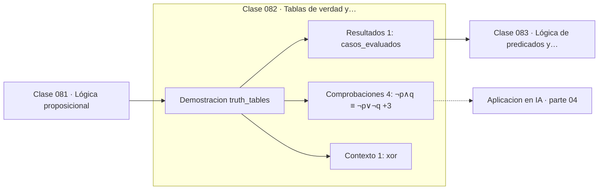

# 082 — Tablas de verdad y equivalencias

> [⬅️ 081 Lógica proposicional](../081-logica-proposicional/README.md) · [📚 Parte 04](../README.md) · [🏠 Programa](../../../README.md) · [083 Lógica de predicados y cuantificadores ➡️](../083-logica-de-predicados-y-cuantificadores/README.md)

**Parte:** 04 — Matemática discreta para computación · **Nivel:** `intermedio` · **Horas estimadas:** 4
**Motor:** `engines.part04` · **Demostración:** `truth_tables` · **Clase 2 de 20** de la parte

---

## 🎯 Propósito

**Las leyes de De Morgan rigen cómo se niega una condición compuesta.**

Lógica, conjuntos, conteo, inducción, recurrencias, grafos y aritmética modular: la matemática que hace demostrable un programa.

## ✅ Resultados de aprendizaje

Al terminar podrás:

1. Explicar **Tablas de verdad y equivalencias** con lenguaje cotidiano y con notación matemática.
2. Resolver un caso pequeño a mano y anticipar el orden de magnitud del resultado.
3. Ejecutar y modificar `lab.py`, que corre la demostración `truth_tables`.
4. Interpretar las 6 salidas del laboratorio y decir qué comprueba cada una.
5. Detectar el error típico de esta parte: confundir implicación con equivalencia lógica.

## 🧩 Fórmulas de la clase

```text
¬(p ∧ q) ≡ ¬p ∨ ¬q
¬(p ∨ q) ≡ ¬p ∧ ¬q
p ⊕ q ≡ (p ∨ q) ∧ ¬(p ∧ q)
```

## 🗺️ Ubicación en el programa



## 📖 Fundamentos

Una tabla de verdad decide cualquier equivalencia proposicional por fuerza bruta: se
evalúan las dos fórmulas en las 2ⁿ asignaciones posibles y se comparan. Es un método
completo —siempre da respuesta— y de coste exponencial, lo que anticipa por qué SAT es
un problema difícil (clase 097).

Las leyes de De Morgan son las que más se usan sin nombrarlas. Al negar una condición
compuesta, la conjunción se convierte en disyunción y viceversa, y cada término se
niega. En código: la negación de `edad >= 18 and tiene_permiso` es
`edad < 18 or not tiene_permiso`, **no** `edad < 18 and not tiene_permiso`. Ese error
produce condiciones que parecen razonables y filtran mal.

Una tautología es verdadera bajo toda asignación; una contradicción, falsa bajo todas.
Detectarlas importa porque señalan código muerto: una condición tautológica siempre se
cumple y su rama alternativa nunca se ejecuta.

El XOR merece mención aparte: es verdadero cuando los operandos difieren, y tiene la
propiedad de ser su propia inversa, `(a ⊕ b) ⊕ b = a`. Esa propiedad lo hace
omnipresente en criptografía, en sumas de comprobación y en el intercambio de variables
sin memoria auxiliar.

## 🧮 Ejemplo trabajado

Verificar De Morgan exhaustivamente.

```text
4 casos evaluados (2² asignaciones)

p  q  | ¬(p∧q)  ¬p∨¬q  | ¬(p∨q)  ¬p∧¬q
V  V  |   F       F    |   F       F
V  F  |   V       V    |   F       F
F  V  |   V       V    |   F       F
F  F  |   V       V    |   V       V

Ambas leyes: columnas idénticas    ✓

Tautología:    p ∨ ¬p  → V en las 4 filas
Contradicción: p ∧ ¬p  → F en las 4 filas

XOR: (V,V)→F  (V,F)→V  (F,V)→V  (F,F)→F
```

## 🔬 Qué ejecuta el laboratorio

`truth_tables` — Leyes de De Morgan verificadas exhaustivamente.

| Grupo | Salidas |
|---|---|
| 🔢 Resultados numéricos (1) | `casos_evaluados` |
| ✅ Comprobaciones de invariante (4) | `¬(p∧q) ≡ ¬p∨¬q`, `¬(p∨q) ≡ ¬p∧¬q`, `tautologia_p∨¬p`, `contradiccion_p∧¬p` |

Las claves booleanas no son adorno: si alguna fuera `False`, el resultado numérico
no sería fiable aunque el programa terminase sin error.

```bash
python classes/part-04-matematica-discreta-para-computacion/082-tablas-de-verdad-y-equivalencias/lab.py
compmath run 082
```

> [!TIP]
> Antes de ejecutar, **escribe tu predicción**. Un laboratorio que confirma lo que
> esperabas enseña tanto como uno que te contradice, pero solo si la predicción
> existía antes del resultado.

## ⚠️ Errores conceptuales frecuentes

1. Negar una conjunción sin cambiarla por disyunción.
2. Olvidar negar todos los términos al aplicar De Morgan.
3. Usar & y | (bit a bit) donde correspondía and y or (lógicos) en Python.

## 🚀 Dónde se usa de verdad

Simplificación de condiciones, optimización de consultas SQL, diseño de circuitos
digitales y refactorización de código con lógica compleja.

## 🤖 Conexión con IA

Los grafos de cómputo, la búsqueda en árbol y las GNN son estructuras discretas; el conteo sostiene la probabilidad que después usa todo modelo generativo.

## 📓 Notebooks

| Archivo | Para qué |
|---|---|
| [`notebook.ipynb`](notebook.ipynb) | recorrido guiado con la demostración ejecutada |
| [`notebook_student.ipynb`](notebook_student.ipynb) | versión con `TODO` para resolver |
| [`notebook_solution.ipynb`](notebook_solution.ipynb) | solución de referencia verificada |

## 📝 Evaluación

| Criterio | Peso |
|---|---:|
| Comprensión conceptual | 25 % |
| Resolución manual | 25 % |
| Implementación y verificación | 25 % |
| Interpretación y comunicación | 15 % |
| Conexión con aplicación real | 10 % |

Detalle y criterios de error crítico en [`assessment.md`](assessment.md).

## ❓ Preguntas de comprobación

1. ¿Cuál es la entrada, cuál la salida y qué unidades tienen?
2. ¿Qué operación domina el comportamiento del resultado?
3. ¿Qué caso extremo revelaría un error conceptual?
4. ¿Cómo verificarías el resultado por un método independiente?
5. ¿Dónde aparece esto en algoritmos?

Si necesitas releer el código para responderlas, la clase todavía no está superada.

## 📥 Entregable

`notebook_student.ipynb` resuelto más un párrafo que explique el resultado **sin citar
código**: qué entra, qué sale, qué invariante se comprueba y qué pasaría en un caso límite.

## 🔗 Referencias

- [Rosen, K. *Discrete Mathematics and Its Applications*, 8ª ed., 2019](https://www.mheducation.com/highered/product/discrete-mathematics-applications-rosen.html) — *uso:* obra de referencia consultada en «Tablas de verdad y equivalencias».
- [Knuth, D. *The Art of Computer Programming*, vol. 4A, 2011](https://www-cs-faculty.stanford.edu/~knuth/taocp.html) — *uso:* obra de referencia consultada en «Tablas de verdad y equivalencias».

Bibliografía completa de la parte en [`../../../docs/BIBLIOGRAPHY.md`](../../../docs/BIBLIOGRAPHY.md) · localizador verificable de cada obra en [`sources/bibliography.json`](../../../sources/bibliography.json).

## 📂 Material de la clase

[`intuition.md`](intuition.md) · [`theory.md`](theory.md) · [`derivation.md`](derivation.md) · [`exercises.md`](exercises.md) · [`assessment.md`](assessment.md) · [`where-is-this-used.md`](where-is-this-used.md) · [`lesson.yaml`](lesson.yaml)

---

> [⬅️ 081 Lógica proposicional](../081-logica-proposicional/README.md) · [📚 Parte 04](../README.md) · [🏠 Programa](../../../README.md) · [083 Lógica de predicados y cuantificadores ➡️](../083-logica-de-predicados-y-cuantificadores/README.md)
