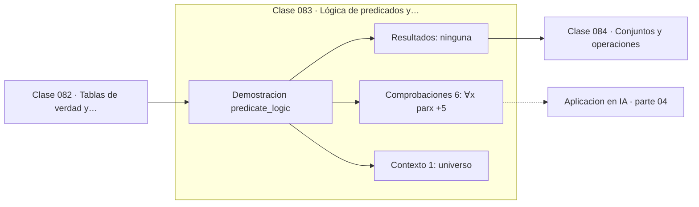

# 083 — Lógica de predicados y cuantificadores

> [⬅️ 082 Tablas de verdad y equivalencias](../082-tablas-de-verdad-y-equivalencias/README.md) · [📚 Parte 04](../README.md) · [🏠 Programa](../../../README.md) · [084 Conjuntos y operaciones ➡️](../084-conjuntos-y-operaciones/README.md)

**Parte:** 04 — Matemática discreta para computación · **Nivel:** `intermedio` · **Horas estimadas:** 4
**Motor:** `engines.part04` · **Demostración:** `predicate_logic` · **Clase 3 de 20** de la parte

---

## 🎯 Propósito

**Intercambiar dos cuantificadores cambia el significado de la afirmación.**

Lógica, conjuntos, conteo, inducción, recurrencias, grafos y aritmética modular: la matemática que hace demostrable un programa.

## ✅ Resultados de aprendizaje

Al terminar podrás:

1. Explicar **Lógica de predicados y cuantificadores** con lenguaje cotidiano y con notación matemática.
2. Resolver un caso pequeño a mano y anticipar el orden de magnitud del resultado.
3. Ejecutar y modificar `lab.py`, que corre la demostración `predicate_logic`.
4. Interpretar las 7 salidas del laboratorio y decir qué comprueba cada una.
5. Detectar el error típico de esta parte: asumir que un grafo dirigido es acíclico sin verificarlo.

## 🧩 Fórmulas de la clase

```text
¬(∀x P(x)) ≡ ∃x ¬P(x)
∀x ∃y Q(x,y)   ≢   ∃y ∀x Q(x,y)
```

## 🗺️ Ubicación en el programa



## 📖 Fundamentos

La lógica de predicados añade a la proposicional la capacidad de hablar sobre objetos
de un universo. `∀x P(x)` afirma que P vale para todos; `∃x P(x)`, que vale para al
menos uno. La negación intercambia los cuantificadores y niega el predicado, que es la
forma general de la regla que la clase 019 aplicó al contraejemplo.

El punto delicado es el **orden**. `∀x ∃y (y > x)` dice que para cada x existe alguien
mayor —cierto en los naturales—. `∃y ∀x (y > x)` dice que existe un número mayor que
todos —falso—. Las mismas palabras en distinto orden afirman cosas distintas, y en un
conjunto finito la segunda puede ser cierta mientras que en uno infinito no.

Esta distinción no es académica. La definición de límite —«para todo ε existe un δ»—
tiene ese orden y no el contrario: δ puede depender de ε. La convergencia uniforme
exige el orden inverso —«existe un δ que sirve para todo ε»— y por eso es una condición
más fuerte. Toda la parte 07 se apoya en leer esos cuantificadores correctamente.

En teoría del aprendizaje (parte 17) los enunciados PAC tienen la misma estructura: para
todo ε y δ, existe un tamaño muestral m tal que... Leer mal el orden convierte una
garantía útil en una afirmación trivial o imposible.

## 🧮 Ejemplo trabajado

El orden de los cuantificadores en {1,...,6}.

```text
Universo: {1, 2, 3, 4, 5, 6}

∀x par(x)   → Falso  (1 no es par)
∃x par(x)   → Verdadero

Negación: ¬(∀x par(x)) ≡ ∃x ¬par(x)  → Verdadero  ✓

∀x ∃y (y > x):  ¿para cada x hay alguien mayor?
  x=6 → no hay ninguno mayor en el universo → Falso

∃y ∀x (y > x):  ¿hay uno mayor que todos?
  ningún y supera a sí mismo → Falso

En ℕ (infinito): el primero sería Verdadero y el segundo Falso.
El orden importa.
```

## 🔬 Qué ejecuta el laboratorio

`predicate_logic` — Cuantificadores: el orden cambia el significado.

| Grupo | Salidas |
|---|---|
| 🔢 Resultados numéricos (0) | — |
| ✅ Comprobaciones de invariante (6) | `∀x par(x)`, `∃x par(x)`, `negacion_de_∀_es_∃¬`, `∀x∃y y>x`, `∃y∀x y>x`, `el_orden_de_cuantificadores_importa` |

Las claves booleanas no son adorno: si alguna fuera `False`, el resultado numérico
no sería fiable aunque el programa terminase sin error.

```bash
python classes/part-04-matematica-discreta-para-computacion/083-logica-de-predicados-y-cuantificadores/lab.py
compmath run 083
```

> [!TIP]
> Antes de ejecutar, **escribe tu predicción**. Un laboratorio que confirma lo que
> esperabas enseña tanto como uno que te contradice, pero solo si la predicción
> existía antes del resultado.

## ⚠️ Errores conceptuales frecuentes

1. Intercambiar cuantificadores al reescribir una definición.
2. Negar un cuantificador sin cambiarlo por el otro.
3. Olvidar declarar el universo sobre el que se cuantifica.

## 🚀 Dónde se usa de verdad

Definiciones de límite y continuidad, especificación formal de sistemas, cotas de
aprendizaje PAC y verificación de programas.

## 🤖 Conexión con IA

Los grafos de cómputo, la búsqueda en árbol y las GNN son estructuras discretas; el conteo sostiene la probabilidad que después usa todo modelo generativo.

## 📓 Notebooks

| Archivo | Para qué |
|---|---|
| [`notebook.ipynb`](notebook.ipynb) | recorrido guiado con la demostración ejecutada |
| [`notebook_student.ipynb`](notebook_student.ipynb) | versión con `TODO` para resolver |
| [`notebook_solution.ipynb`](notebook_solution.ipynb) | solución de referencia verificada |

## 📝 Evaluación

| Criterio | Peso |
|---|---:|
| Comprensión conceptual | 25 % |
| Resolución manual | 25 % |
| Implementación y verificación | 25 % |
| Interpretación y comunicación | 15 % |
| Conexión con aplicación real | 10 % |

Detalle y criterios de error crítico en [`assessment.md`](assessment.md).

## ❓ Preguntas de comprobación

1. ¿Cuál es la entrada, cuál la salida y qué unidades tienen?
2. ¿Qué operación domina el comportamiento del resultado?
3. ¿Qué caso extremo revelaría un error conceptual?
4. ¿Cómo verificarías el resultado por un método independiente?
5. ¿Dónde aparece esto en algoritmos?

Si necesitas releer el código para responderlas, la clase todavía no está superada.

## 📥 Entregable

`notebook_student.ipynb` resuelto más un párrafo que explique el resultado **sin citar
código**: qué entra, qué sale, qué invariante se comprueba y qué pasaría en un caso límite.

## 🔗 Referencias

- [Velleman, D. *How to Prove It*, 3ª ed., Cambridge, 2019](https://www.cambridge.org/core/books/how-to-prove-it/6D2965D625C6836CD4A785A2C843B19A) — *uso:* obra de referencia consultada en «Lógica de predicados y cuantificadores».
- [Shalev-Shwartz & Ben-David. *Understanding Machine Learning*. Cambridge, 2014](https://www.cs.huji.ac.il/~shais/UnderstandingMachineLearning/) — *uso:* obra de referencia consultada en «Lógica de predicados y cuantificadores».

Bibliografía completa de la parte en [`../../../docs/BIBLIOGRAPHY.md`](../../../docs/BIBLIOGRAPHY.md) · localizador verificable de cada obra en [`sources/bibliography.json`](../../../sources/bibliography.json).

## 📂 Material de la clase

[`intuition.md`](intuition.md) · [`theory.md`](theory.md) · [`derivation.md`](derivation.md) · [`exercises.md`](exercises.md) · [`assessment.md`](assessment.md) · [`where-is-this-used.md`](where-is-this-used.md) · [`lesson.yaml`](lesson.yaml)

---

> [⬅️ 082 Tablas de verdad y equivalencias](../082-tablas-de-verdad-y-equivalencias/README.md) · [📚 Parte 04](../README.md) · [🏠 Programa](../../../README.md) · [084 Conjuntos y operaciones ➡️](../084-conjuntos-y-operaciones/README.md)
