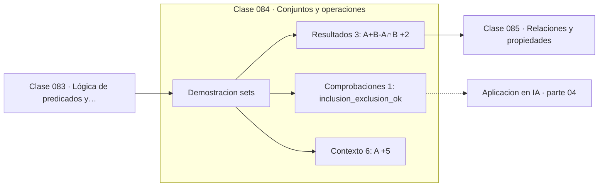

# 084 — Conjuntos y operaciones

> [⬅️ 083 Lógica de predicados y cuantificadores](../083-logica-de-predicados-y-cuantificadores/README.md) · [📚 Parte 04](../README.md) · [🏠 Programa](../../../README.md) · [085 Relaciones y propiedades ➡️](../085-relaciones-y-propiedades/README.md)

**Parte:** 04 — Matemática discreta para computación · **Nivel:** `intermedio` · **Horas estimadas:** 4
**Motor:** `engines.part04` · **Demostración:** `sets` · **Clase 4 de 20** de la parte

---

## 🎯 Propósito

**Inclusión-exclusión corrige el doble conteo al unir conjuntos que se solapan.**

Lógica, conjuntos, conteo, inducción, recurrencias, grafos y aritmética modular: la matemática que hace demostrable un programa.

## ✅ Resultados de aprendizaje

Al terminar podrás:

1. Explicar **Conjuntos y operaciones** con lenguaje cotidiano y con notación matemática.
2. Resolver un caso pequeño a mano y anticipar el orden de magnitud del resultado.
3. Ejecutar y modificar `lab.py`, que corre la demostración `sets`.
4. Interpretar las 10 salidas del laboratorio y decir qué comprueba cada una.
5. Detectar el error típico de esta parte: contar dos veces al aplicar el principio de inclusión-exclusión.

## 🧩 Fórmulas de la clase

```text
|A ∪ B| = |A| + |B| − |A ∩ B|
|P(A)| = 2^|A|
```

## 🗺️ Ubicación en el programa



## 📖 Fundamentos

Un conjunto es una colección sin orden y sin repeticiones. Esa doble propiedad lo
distingue de una lista y determina qué operaciones tienen sentido: unión, intersección,
diferencia y diferencia simétrica, todas con implementación directa y eficiente en
Python mediante `set`.

El principio de inclusión-exclusión responde a una pregunta que la suma ingenua
contesta mal: al contar los elementos de una unión, los que están en ambos conjuntos se
cuentan dos veces, y hay que restarlos una. Con tres conjuntos la fórmula alterna signos
—se suman los individuales, se restan las intersecciones dos a dos y se suma la triple—,
patrón que generaliza a n conjuntos.

El conjunto de partes de un conjunto de n elementos tiene 2ⁿ elementos, porque cada
elemento está o no está: es la regla del producto aplicada n veces. Esa cifra explica
por qué la búsqueda exhaustiva sobre subconjuntos es inviable salvo para n pequeño, y
por qué la selección de características es un problema difícil.

En probabilidad (parte 09), inclusión-exclusión reaparece intacta como la regla de la
suma: `P(A∪B) = P(A) + P(B) − P(A∩B)`. Los conjuntos se convierten en eventos y los
cardinales en probabilidades, pero la estructura es la misma.

## 🧮 Ejemplo trabajado

Operaciones e inclusión-exclusión con dos conjuntos.

```text
A = {1,2,3,4,5}       |A| = 5
B = {4,5,6,7}         |B| = 4

A ∪ B = {1,2,3,4,5,6,7}    |A∪B| = 7
A ∩ B = {4,5}              |A∩B| = 2
A − B = {1,2,3}
A △ B = {1,2,3,6,7}        (diferencia simétrica)

Inclusión-exclusión: 5 + 4 − 2 = 7 = |A∪B|      ✓
Suma ingenua:        5 + 4     = 9              ✗ cuenta 4 y 5 dos veces

Partes de A: 2⁵ = 32 subconjuntos
```

## 🔬 Qué ejecuta el laboratorio

`sets` — Operaciones de conjuntos e inclusión-exclusión.

| Grupo | Salidas |
|---|---|
| 🔢 Resultados numéricos (3) | `|A|+|B|-|A∩B|`, `|A∪B|`, `partes_de_A` |
| ✅ Comprobaciones de invariante (1) | `inclusion_exclusion_ok` |

Las claves booleanas no son adorno: si alguna fuera `False`, el resultado numérico
no sería fiable aunque el programa terminase sin error.

```bash
python classes/part-04-matematica-discreta-para-computacion/084-conjuntos-y-operaciones/lab.py
compmath run 084
```

> [!TIP]
> Antes de ejecutar, **escribe tu predicción**. Un laboratorio que confirma lo que
> esperabas enseña tanto como uno que te contradice, pero solo si la predicción
> existía antes del resultado.

## ⚠️ Errores conceptuales frecuentes

1. Sumar cardinales de conjuntos que se solapan sin restar la intersección.
2. Tratar un conjunto como una lista y esperar orden o repeticiones.
3. Olvidar el conjunto vacío y el total al contar subconjuntos.

## 🚀 Dónde se usa de verdad

Consultas con condiciones múltiples, deduplicación, conteo de casos favorables en
probabilidad y análisis de solapamiento entre poblaciones.

## 🤖 Conexión con IA

Los grafos de cómputo, la búsqueda en árbol y las GNN son estructuras discretas; el conteo sostiene la probabilidad que después usa todo modelo generativo.

## 📓 Notebooks

| Archivo | Para qué |
|---|---|
| [`notebook.ipynb`](notebook.ipynb) | recorrido guiado con la demostración ejecutada |
| [`notebook_student.ipynb`](notebook_student.ipynb) | versión con `TODO` para resolver |
| [`notebook_solution.ipynb`](notebook_solution.ipynb) | solución de referencia verificada |

## 📝 Evaluación

| Criterio | Peso |
|---|---:|
| Comprensión conceptual | 25 % |
| Resolución manual | 25 % |
| Implementación y verificación | 25 % |
| Interpretación y comunicación | 15 % |
| Conexión con aplicación real | 10 % |

Detalle y criterios de error crítico en [`assessment.md`](assessment.md).

## ❓ Preguntas de comprobación

1. ¿Cuál es la entrada, cuál la salida y qué unidades tienen?
2. ¿Qué operación domina el comportamiento del resultado?
3. ¿Qué caso extremo revelaría un error conceptual?
4. ¿Cómo verificarías el resultado por un método independiente?
5. ¿Dónde aparece esto en algoritmos?

Si necesitas releer el código para responderlas, la clase todavía no está superada.

## 📥 Entregable

`notebook_student.ipynb` resuelto más un párrafo que explique el resultado **sin citar
código**: qué entra, qué sale, qué invariante se comprueba y qué pasaría en un caso límite.

## 🔗 Referencias

- [Rosen, K. *Discrete Mathematics and Its Applications*, 8ª ed., 2019, cap. 2](https://www.mheducation.com/highered/product/discrete-mathematics-applications-rosen.html) — *uso:* obra de referencia consultada en «Conjuntos y operaciones».
- [Python: tipo `set`](https://docs.python.org/3/library/stdtypes.html#set) — *uso:* documentación de la herramienta que ejecuta el laboratorio en «Conjuntos y operaciones».

Bibliografía completa de la parte en [`../../../docs/BIBLIOGRAPHY.md`](../../../docs/BIBLIOGRAPHY.md) · localizador verificable de cada obra en [`sources/bibliography.json`](../../../sources/bibliography.json).

## 📂 Material de la clase

[`intuition.md`](intuition.md) · [`theory.md`](theory.md) · [`derivation.md`](derivation.md) · [`exercises.md`](exercises.md) · [`assessment.md`](assessment.md) · [`where-is-this-used.md`](where-is-this-used.md) · [`lesson.yaml`](lesson.yaml)

---

> [⬅️ 083 Lógica de predicados y cuantificadores](../083-logica-de-predicados-y-cuantificadores/README.md) · [📚 Parte 04](../README.md) · [🏠 Programa](../../../README.md) · [085 Relaciones y propiedades ➡️](../085-relaciones-y-propiedades/README.md)
