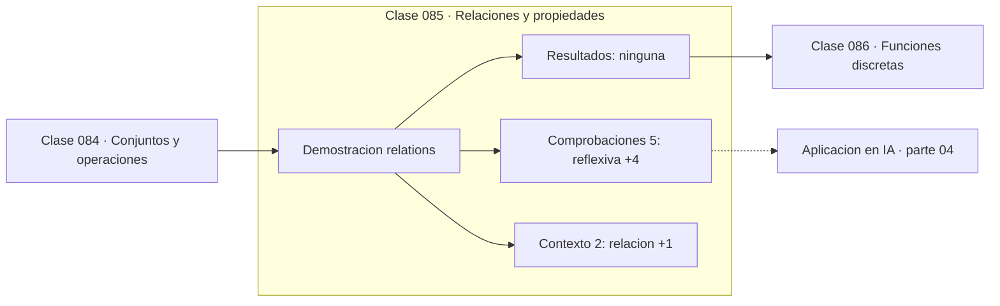

# 085 — Relaciones y propiedades

> [⬅️ 084 Conjuntos y operaciones](../084-conjuntos-y-operaciones/README.md) · [📚 Parte 04](../README.md) · [🏠 Programa](../../../README.md) · [086 Funciones discretas ➡️](../086-funciones-discretas/README.md)

**Parte:** 04 — Matemática discreta para computación · **Nivel:** `intermedio` · **Horas estimadas:** 4
**Motor:** `engines.part04` · **Demostración:** `relations` · **Clase 5 de 20** de la parte

---

## 🎯 Propósito

**Reflexiva, simétrica y transitiva son las tres condiciones que hacen de una relación una equivalencia, y toda equivalencia particiona el conjunto.**

Lógica, conjuntos, conteo, inducción, recurrencias, grafos y aritmética modular: la matemática que hace demostrable un programa.

## ✅ Resultados de aprendizaje

Al terminar podrás:

1. Explicar **Relaciones y propiedades** con lenguaje cotidiano y con notación matemática.
2. Resolver un caso pequeño a mano y anticipar el orden de magnitud del resultado.
3. Ejecutar y modificar `lab.py`, que corre la demostración `relations`.
4. Interpretar las 7 salidas del laboratorio y decir qué comprueba cada una.
5. Detectar el error típico de esta parte: confundir implicación con equivalencia lógica.

## 🧩 Fórmulas de la clase

```text
reflexiva: ∀a, aRa
simétrica: aRb ⟹ bRa
transitiva: aRb ∧ bRc ⟹ aRc
```

## 🗺️ Ubicación en el programa



## 📖 Fundamentos

Una relación es un conjunto de pares. Las tres propiedades clásicas se comprueban por
separado y su combinación tiene consecuencias muy fuertes: si una relación es
reflexiva, simétrica y transitiva, **particiona** el conjunto en clases disjuntas cuya
unión es el total. No hay que demostrar la partición: se sigue de las tres propiedades.

El ejemplo canónico es la congruencia módulo n: `x ≡ y (mod 3)` si `x − y` es múltiplo
de 3. Sus clases de equivalencia son los restos {0,1,2}, y esa partición es
exactamente la estructura sobre la que se define la aritmética modular de la clase 098.

La utilidad práctica es de modelado. Cuando se decide que dos objetos son «el mismo» a
efectos de un sistema —dos URLs que apuntan al mismo recurso, dos registros del mismo
cliente, dos representaciones del mismo número racional—, se está definiendo una
relación de equivalencia, y conviene comprobar que cumple las tres propiedades. Una
relación de «similitud» que no es transitiva produce agrupamientos inconsistentes.

Ese fallo es real y frecuente: la deduplicación por umbral de similitud no es
transitiva —A parecido a B y B parecido a C no implica A parecido a C— y por eso los
algoritmos de agrupamiento por similitud necesitan una definición explícita de
transitividad, como el cierre transitivo o el enlace completo.

## 🧮 Ejemplo trabajado

Congruencia módulo 3 sobre {0,...,5}.

```text
Relación: x ~ y  si  (x − y) mod 3 == 0

reflexiva:  (x−x) mod 3 = 0                    ✓
simétrica:  si (x−y)≡0 entonces (y−x)≡0        ✓
transitiva: (x−y)≡0 y (y−z)≡0 ⟹ (x−z)≡0        ✓

→ es una relación de equivalencia

Clases de equivalencia:
  [0] = {0, 3}
  [1] = {1, 4}
  [2] = {2, 5}

Disjuntas y su unión es todo el conjunto        ✓
```

## 🔬 Qué ejecuta el laboratorio

`relations` — Reflexiva, simétrica y transitiva: la receta de una relación de equivalencia.

| Grupo | Salidas |
|---|---|
| 🔢 Resultados numéricos (0) | — |
| ✅ Comprobaciones de invariante (5) | `reflexiva`, `simetrica`, `transitiva`, `es_equivalencia`, `particiona_el_universo` |

Las claves booleanas no son adorno: si alguna fuera `False`, el resultado numérico
no sería fiable aunque el programa terminase sin error.

```bash
python classes/part-04-matematica-discreta-para-computacion/085-relaciones-y-propiedades/lab.py
compmath run 085
```

> [!TIP]
> Antes de ejecutar, **escribe tu predicción**. Un laboratorio que confirma lo que
> esperabas enseña tanto como uno que te contradice, pero solo si la predicción
> existía antes del resultado.

## ⚠️ Errores conceptuales frecuentes

1. Suponer transitividad en relaciones de similitud por umbral.
2. Comprobar solo una o dos de las tres propiedades.
3. Confundir relación de equivalencia con relación de orden (que es antisimétrica, no simétrica).

## 🚀 Dónde se usa de verdad

Deduplicación de registros, normalización de datos, particiones de un conjunto,
aritmética modular y clases de equivalencia de fracciones.

## 🤖 Conexión con IA

Los grafos de cómputo, la búsqueda en árbol y las GNN son estructuras discretas; el conteo sostiene la probabilidad que después usa todo modelo generativo.

## 📓 Notebooks

| Archivo | Para qué |
|---|---|
| [`notebook.ipynb`](notebook.ipynb) | recorrido guiado con la demostración ejecutada |
| [`notebook_student.ipynb`](notebook_student.ipynb) | versión con `TODO` para resolver |
| [`notebook_solution.ipynb`](notebook_solution.ipynb) | solución de referencia verificada |

## 📝 Evaluación

| Criterio | Peso |
|---|---:|
| Comprensión conceptual | 25 % |
| Resolución manual | 25 % |
| Implementación y verificación | 25 % |
| Interpretación y comunicación | 15 % |
| Conexión con aplicación real | 10 % |

Detalle y criterios de error crítico en [`assessment.md`](assessment.md).

## ❓ Preguntas de comprobación

1. ¿Cuál es la entrada, cuál la salida y qué unidades tienen?
2. ¿Qué operación domina el comportamiento del resultado?
3. ¿Qué caso extremo revelaría un error conceptual?
4. ¿Cómo verificarías el resultado por un método independiente?
5. ¿Dónde aparece esto en algoritmos?

Si necesitas releer el código para responderlas, la clase todavía no está superada.

## 📥 Entregable

`notebook_student.ipynb` resuelto más un párrafo que explique el resultado **sin citar
código**: qué entra, qué sale, qué invariante se comprueba y qué pasaría en un caso límite.

## 🔗 Referencias

- [Rosen, K. *Discrete Mathematics and Its Applications*, 8ª ed., 2019, cap. 9](https://www.mheducation.com/highered/product/discrete-mathematics-applications-rosen.html) — *uso:* obra de referencia consultada en «Relaciones y propiedades».
- [Halmos, P. *Naive Set Theory*. Springer, 1974](https://link.springer.com/book/10.1007/978-1-4757-1645-0) — *uso:* desarrollo formal del tema en «Relaciones y propiedades».

Bibliografía completa de la parte en [`../../../docs/BIBLIOGRAPHY.md`](../../../docs/BIBLIOGRAPHY.md) · localizador verificable de cada obra en [`sources/bibliography.json`](../../../sources/bibliography.json).

## 📂 Material de la clase

[`intuition.md`](intuition.md) · [`theory.md`](theory.md) · [`derivation.md`](derivation.md) · [`exercises.md`](exercises.md) · [`assessment.md`](assessment.md) · [`where-is-this-used.md`](where-is-this-used.md) · [`lesson.yaml`](lesson.yaml)

---

> [⬅️ 084 Conjuntos y operaciones](../084-conjuntos-y-operaciones/README.md) · [📚 Parte 04](../README.md) · [🏠 Programa](../../../README.md) · [086 Funciones discretas ➡️](../086-funciones-discretas/README.md)
