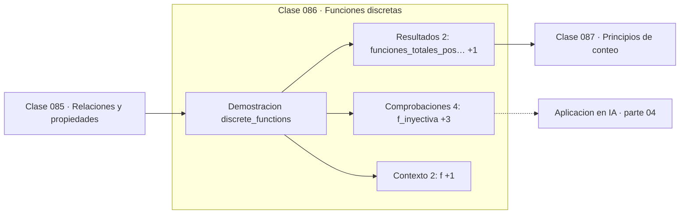

# 086 — Funciones discretas

> [⬅️ 085 Relaciones y propiedades](../085-relaciones-y-propiedades/README.md) · [📚 Parte 04](../README.md) · [🏠 Programa](../../../README.md) · [087 Principios de conteo ➡️](../087-principios-de-conteo/README.md)

**Parte:** 04 — Matemática discreta para computación · **Nivel:** `intermedio` · **Horas estimadas:** 4
**Motor:** `engines.part04` · **Demostración:** `discrete_functions` · **Clase 6 de 20** de la parte

---

## 🎯 Propósito

**Inyectiva, sobreyectiva y biyectiva describen qué información conserva una función.**

Lógica, conjuntos, conteo, inducción, recurrencias, grafos y aritmética modular: la matemática que hace demostrable un programa.

## ✅ Resultados de aprendizaje

Al terminar podrás:

1. Explicar **Funciones discretas** con lenguaje cotidiano y con notación matemática.
2. Resolver un caso pequeño a mano y anticipar el orden de magnitud del resultado.
3. Ejecutar y modificar `lab.py`, que corre la demostración `discrete_functions`.
4. Interpretar las 8 salidas del laboratorio y decir qué comprueba cada una.
5. Detectar el error típico de esta parte: asumir que un grafo dirigido es acíclico sin verificarlo.

## 🧩 Fórmulas de la clase

```text
funciones totales de A a B: |B|^|A|
biyecciones de A en A: |A|!
```

## 🗺️ Ubicación en el programa



## 📖 Fundamentos

Sobre conjuntos finitos, las tres propiedades se cuentan. Una función es **inyectiva**
si no repite salidas, **sobreyectiva** si alcanza todo el codominio y **biyectiva** si
ambas. Entre conjuntos del mismo tamaño finito, inyectiva y sobreyectiva son
equivalentes —hecho que falla en conjuntos infinitos y da lugar a las paradojas de
Hilbert—.

El conteo de funciones ilustra la regla del producto: cada uno de los `|A|` elementos
puede ir a cualquiera de los `|B|` destinos, luego hay `|B|^|A|` funciones. Las
biyecciones de un conjunto en sí mismo son `|A|!`, que es el conteo de permutaciones de
la clase 088.

La inyectividad es la condición que hace invertible una función (clase 058) y la que
define una función hash **perfecta**. Como una función hash mapea un dominio enorme en
un rango pequeño, no puede ser inyectiva, y de ahí las colisiones que el palomar
garantiza en la clase 090.

En machine learning, la pérdida de inyectividad es lo que hace que una capa no sea
invertible: si la dimensión de salida es menor que la de entrada, información se pierde
irremediablemente. Los *normalizing flows* se construyen precisamente con capas
biyectivas para poder invertirlas y calcular densidades exactas.

## 🧮 Ejemplo trabajado

Dos funciones sobre un dominio de tres elementos.

```text
dominio = {1,2,3},  codominio = {a,b,c}

f = {1→a, 2→b, 3→c}
  inyectiva:   3 salidas distintas         ✓
  sobreyectiva: alcanza a, b y c           ✓
  biyectiva                                ✓

g = {1→a, 2→a, 3→b}
  inyectiva:   1 y 2 comparten salida      ✗
  sobreyectiva: no alcanza c               ✗

Conteo:
  funciones totales posibles: 3³ = 27
  biyecciones posibles:       3! = 6
```

## 🔬 Qué ejecuta el laboratorio

`discrete_functions` — Inyectiva, sobreyectiva y biyectiva sobre conjuntos finitos.

| Grupo | Salidas |
|---|---|
| 🔢 Resultados numéricos (2) | `funciones_totales_posibles`, `biyecciones_posibles` |
| ✅ Comprobaciones de invariante (4) | `f_inyectiva`, `f_sobreyectiva`, `f_biyectiva`, `g_inyectiva` |

Las claves booleanas no son adorno: si alguna fuera `False`, el resultado numérico
no sería fiable aunque el programa terminase sin error.

```bash
python classes/part-04-matematica-discreta-para-computacion/086-funciones-discretas/lab.py
compmath run 086
```

> [!TIP]
> Antes de ejecutar, **escribe tu predicción**. Un laboratorio que confirma lo que
> esperabas enseña tanto como uno que te contradice, pero solo si la predicción
> existía antes del resultado.

## ⚠️ Errores conceptuales frecuentes

1. Suponer que inyectiva implica sobreyectiva en conjuntos de distinto tamaño.
2. Extender a conjuntos infinitos la equivalencia entre inyectiva y sobreyectiva.
3. Esperar que una función hash sea inyectiva.

## 🚀 Dónde se usa de verdad

Funciones hash y colisiones, invertibilidad de capas, codificación sin pérdida y
normalizing flows.

## 🤖 Conexión con IA

Los grafos de cómputo, la búsqueda en árbol y las GNN son estructuras discretas; el conteo sostiene la probabilidad que después usa todo modelo generativo.

## 📓 Notebooks

| Archivo | Para qué |
|---|---|
| [`notebook.ipynb`](notebook.ipynb) | recorrido guiado con la demostración ejecutada |
| [`notebook_student.ipynb`](notebook_student.ipynb) | versión con `TODO` para resolver |
| [`notebook_solution.ipynb`](notebook_solution.ipynb) | solución de referencia verificada |

## 📝 Evaluación

| Criterio | Peso |
|---|---:|
| Comprensión conceptual | 25 % |
| Resolución manual | 25 % |
| Implementación y verificación | 25 % |
| Interpretación y comunicación | 15 % |
| Conexión con aplicación real | 10 % |

Detalle y criterios de error crítico en [`assessment.md`](assessment.md).

## ❓ Preguntas de comprobación

1. ¿Cuál es la entrada, cuál la salida y qué unidades tienen?
2. ¿Qué operación domina el comportamiento del resultado?
3. ¿Qué caso extremo revelaría un error conceptual?
4. ¿Cómo verificarías el resultado por un método independiente?
5. ¿Dónde aparece esto en algoritmos?

Si necesitas releer el código para responderlas, la clase todavía no está superada.

## 📥 Entregable

`notebook_student.ipynb` resuelto más un párrafo que explique el resultado **sin citar
código**: qué entra, qué sale, qué invariante se comprueba y qué pasaría en un caso límite.

## 📚 Bibliografía de la clase

Esta clase enseña **Matemática discreta · Lógica y demostración · Algoritmos y complejidad · Teoría de números**. Cada obra dice qué aporta aquí y cómo se comprobó su localizador:

- [Rosen, K. *Discrete Mathematics and Its Applications*, 8ª ed., 2019](https://www.mheducation.com/highered/product/discrete-mathematics-applications-rosen.html) — Lógica y demostración y Matemática discreta: el tema de esta clase · URL de la fuente primaria comprobada en sitio de la obra o de su editorial (2026-08-19).
- [Papamakarios, G. et al. *Normalizing Flows for Probabilistic Modeling and Inference*. JMLR, 2021](https://jmlr.org/papers/v22/19-1028.html) — Deep learning y Modelos generativos y Probabilidad: conexión declarada de esta parte · URL de la fuente primaria comprobada en Journal of Machine Learning Research (2026-08-19).

Bibliografía de todas las clases, con el porqué de cada obra, en [`docs/BIBLIOGRAPHY.md`](../../../docs/BIBLIOGRAPHY.md) · localizador y estado de cada obra en [`sources/bibliography.json`](../../../sources/bibliography.json).

## 📂 Material de la clase

[`intuition.md`](intuition.md) · [`theory.md`](theory.md) · [`derivation.md`](derivation.md) · [`exercises.md`](exercises.md) · [`assessment.md`](assessment.md) · [`where-is-this-used.md`](where-is-this-used.md) · [`lesson.yaml`](lesson.yaml)

---

> [⬅️ 085 Relaciones y propiedades](../085-relaciones-y-propiedades/README.md) · [📚 Parte 04](../README.md) · [🏠 Programa](../../../README.md) · [087 Principios de conteo ➡️](../087-principios-de-conteo/README.md)
