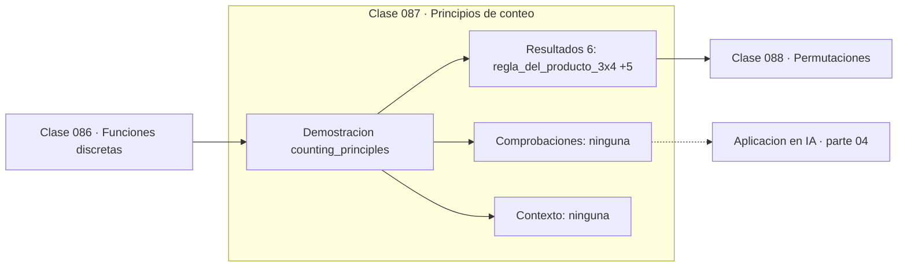

# 087 — Principios de conteo

> [⬅️ 086 Funciones discretas](../086-funciones-discretas/README.md) · [📚 Parte 04](../README.md) · [🏠 Programa](../../../README.md) · [088 Permutaciones ➡️](../088-permutaciones/README.md)

**Parte:** 04 — Matemática discreta para computación · **Nivel:** `intermedio` · **Horas estimadas:** 4
**Motor:** `engines.part04` · **Demostración:** `counting_principles` · **Clase 7 de 20** de la parte

---

## 🎯 Propósito

**La regla del producto multiplica opciones independientes; la de la suma las suma cuando son excluyentes.**

Lógica, conjuntos, conteo, inducción, recurrencias, grafos y aritmética modular: la matemática que hace demostrable un programa.

## ✅ Resultados de aprendizaje

Al terminar podrás:

1. Explicar **Principios de conteo** con lenguaje cotidiano y con notación matemática.
2. Resolver un caso pequeño a mano y anticipar el orden de magnitud del resultado.
3. Ejecutar y modificar `lab.py`, que corre la demostración `counting_principles`.
4. Interpretar las 6 salidas del laboratorio y decir qué comprueba cada una.
5. Detectar el error típico de esta parte: contar dos veces al aplicar el principio de inclusión-exclusión.

## 🧩 Fórmulas de la clase

```text
producto: |A × B| = |A| · |B|
suma (excluyentes): |A ∪ B| = |A| + |B|
entropía de una contraseña: log₂(espacio)
```

## 🗺️ Ubicación en el programa



## 📖 Fundamentos

Los dos principios básicos del conteo se distinguen por una palabra: si las decisiones
son **sucesivas** (esto **y** aquello), se multiplican; si son **alternativas**
excluyentes (esto **o** aquello), se suman. Casi todo error de conteo viene de aplicar
uno donde correspondía el otro.

La aplicación más ilustrativa es el espacio de contraseñas. Con un alfabeto de 36
caracteres y longitud 8, hay 36⁸ ≈ 2.8·10¹² combinaciones; con solo 10 dígitos, 10⁸.
La razón entre ambos es de más de 28 000, y ese factor es lo que separa una contraseña
débil de una razonable frente a fuerza bruta.

Medir el espacio en **bits de entropía** —`log₂` del número de combinaciones— es más
informativo que dar el número, porque los bits se suman al añadir caracteres. Cada
carácter adicional de un alfabeto de 36 símbolos añade `log₂36 ≈ 5.17` bits. Esa es la
cuenta que hace un estimador de fortaleza de contraseñas.

La misma regla es la que da 2ⁿ estados para n bits (clase 021), `|B|^|A|` funciones
(clase 086) y el tamaño del espacio de búsqueda de cualquier problema combinatorio. En
machine learning aparece al contar configuraciones de hiperparámetros: cinco parámetros
con diez valores cada uno dan 10⁵ combinaciones, que es por lo que la búsqueda
exhaustiva se abandona en favor de la aleatoria o bayesiana.

## 🧮 Ejemplo trabajado

Espacio de contraseñas de 8 caracteres.

```text
Alfanumérico (26 letras + 10 dígitos = 36 símbolos):
  36⁸ = 2 821 109 907 456 ≈ 2.8·10¹²
  entropía = 8·log₂(36) = 41.4 bits

Solo dígitos (10 símbolos):
  10⁸ = 100 000 000 = 10⁸
  entropía = 8·log₂(10) = 26.6 bits

Factor de ventaja: 2.8·10¹² / 10⁸ = 28 211

Regla del producto:  3 camisas × 4 pantalones = 12 conjuntos
Regla de la suma:    3 camisas o 4 pantalones = 7 prendas
```

## 🔬 Qué ejecuta el laboratorio

`counting_principles` — Regla del producto, de la suma y conteo de contraseñas.

| Grupo | Salidas |
|---|---|
| 🔢 Resultados numéricos (6) | `regla_del_producto_3x4`, `regla_de_la_suma_3+4`, `contraseñas_alfanumericas_8`, `contraseñas_solo_digitos_8`, `factor_de_ventaja`, `bits_de_entropia` |
| ✅ Comprobaciones de invariante (0) | — |

Las claves booleanas no son adorno: si alguna fuera `False`, el resultado numérico
no sería fiable aunque el programa terminase sin error.

```bash
python classes/part-04-matematica-discreta-para-computacion/087-principios-de-conteo/lab.py
compmath run 087
```

> [!TIP]
> Antes de ejecutar, **escribe tu predicción**. Un laboratorio que confirma lo que
> esperabas enseña tanto como uno que te contradice, pero solo si la predicción
> existía antes del resultado.

## ⚠️ Errores conceptuales frecuentes

1. Sumar cuando las decisiones son sucesivas o multiplicar cuando son excluyentes.
2. Contar dos veces casos que pertenecen a ambas alternativas.
3. Reportar el tamaño del espacio en lugar de su logaritmo al comparar órdenes de magnitud.

## 🚀 Dónde se usa de verdad

Estimación de fortaleza de contraseñas, tamaño de espacios de búsqueda, conteo de
configuraciones de hiperparámetros y cardinalidad de esquemas de datos.

## 🤖 Conexión con IA

Los grafos de cómputo, la búsqueda en árbol y las GNN son estructuras discretas; el conteo sostiene la probabilidad que después usa todo modelo generativo.

## 📓 Notebooks

| Archivo | Para qué |
|---|---|
| [`notebook.ipynb`](notebook.ipynb) | recorrido guiado con la demostración ejecutada |
| [`notebook_student.ipynb`](notebook_student.ipynb) | versión con `TODO` para resolver |
| [`notebook_solution.ipynb`](notebook_solution.ipynb) | solución de referencia verificada |

## 📝 Evaluación

| Criterio | Peso |
|---|---:|
| Comprensión conceptual | 25 % |
| Resolución manual | 25 % |
| Implementación y verificación | 25 % |
| Interpretación y comunicación | 15 % |
| Conexión con aplicación real | 10 % |

Detalle y criterios de error crítico en [`assessment.md`](assessment.md).

## ❓ Preguntas de comprobación

1. ¿Cuál es la entrada, cuál la salida y qué unidades tienen?
2. ¿Qué operación domina el comportamiento del resultado?
3. ¿Qué caso extremo revelaría un error conceptual?
4. ¿Cómo verificarías el resultado por un método independiente?
5. ¿Dónde aparece esto en algoritmos?

Si necesitas releer el código para responderlas, la clase todavía no está superada.

## 📥 Entregable

`notebook_student.ipynb` resuelto más un párrafo que explique el resultado **sin citar
código**: qué entra, qué sale, qué invariante se comprueba y qué pasaría en un caso límite.

## 📚 Bibliografía de la clase

Esta clase enseña **Matemática discreta · Lógica y demostración · Algoritmos y complejidad · Teoría de números**. Cada obra dice qué aporta aquí y cómo se comprobó su localizador:

- [NIST SP 800-63B: Digital Identity Guidelines — Authentication](https://pages.nist.gov/800-63-3/sp800-63b.html) — Criptografía y Ingeniería de software y fallos reales: conexión declarada de esta parte · URL de la fuente primaria comprobada en National Institute of Standards and Technology (2026-08-19).
- [Rosen, K. *Discrete Mathematics and Its Applications*, 8ª ed., 2019, cap. 6](https://www.mheducation.com/highered/product/discrete-mathematics-applications-rosen.html) — Lógica y demostración y Matemática discreta: el tema de esta clase · URL de la fuente primaria comprobada en sitio de la obra o de su editorial (2026-08-19).

Bibliografía de todas las clases, con el porqué de cada obra, en [`docs/BIBLIOGRAPHY.md`](../../../docs/BIBLIOGRAPHY.md) · localizador y estado de cada obra en [`sources/bibliography.json`](../../../sources/bibliography.json).

## 📂 Material de la clase

[`intuition.md`](intuition.md) · [`theory.md`](theory.md) · [`derivation.md`](derivation.md) · [`exercises.md`](exercises.md) · [`assessment.md`](assessment.md) · [`where-is-this-used.md`](where-is-this-used.md) · [`lesson.yaml`](lesson.yaml)

---

> [⬅️ 086 Funciones discretas](../086-funciones-discretas/README.md) · [📚 Parte 04](../README.md) · [🏠 Programa](../../../README.md) · [088 Permutaciones ➡️](../088-permutaciones/README.md)
