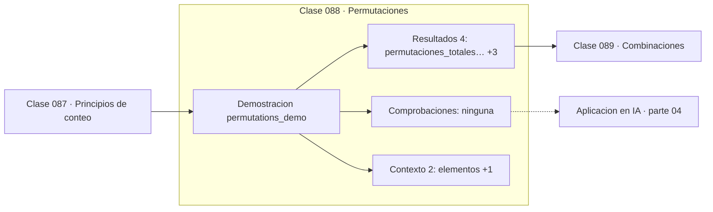

# 088 — Permutaciones

> [⬅️ 087 Principios de conteo](../087-principios-de-conteo/README.md) · [📚 Parte 04](../README.md) · [🏠 Programa](../../../README.md) · [089 Combinaciones ➡️](../089-combinaciones/README.md)

**Parte:** 04 — Matemática discreta para computación · **Nivel:** `intermedio` · **Horas estimadas:** 4
**Motor:** `engines.part04` · **Demostración:** `permutations_demo` · **Clase 8 de 20** de la parte

---

## 🎯 Propósito

**Una permutación cuenta selecciones donde el orden importa.**

Lógica, conjuntos, conteo, inducción, recurrencias, grafos y aritmética modular: la matemática que hace demostrable un programa.

## ✅ Resultados de aprendizaje

Al terminar podrás:

1. Explicar **Permutaciones** con lenguaje cotidiano y con notación matemática.
2. Resolver un caso pequeño a mano y anticipar el orden de magnitud del resultado.
3. Ejecutar y modificar `lab.py`, que corre la demostración `permutations_demo`.
4. Interpretar las 6 salidas del laboratorio y decir qué comprueba cada una.
5. Detectar el error típico de esta parte: confundir implicación con equivalencia lógica.

## 🧩 Fórmulas de la clase

```text
P(n) = n!
P(n,k) = n!/(n−k)!
con repetición: nᵏ
```

## 🗺️ Ubicación en el programa



## 📖 Fundamentos

Permutar es ordenar. El número de ordenaciones completas de n objetos distintos es
`n!`, y el argumento es la regla del producto: hay n opciones para la primera posición,
n−1 para la segunda —ya se usó una— y así sucesivamente.

Las permutaciones **parciales** `P(n,k)` cuentan las formas de elegir k objetos en
orden entre n disponibles: `n!/(n−k)!`. Si además se permite repetir, el conteo es
`nᵏ`, porque cada posición vuelve a tener n opciones. Distinguir los tres casos —total,
parcial sin repetición, parcial con repetición— es la mitad de la combinatoria
elemental.

El factorial crece brutalmente: `10! ≈ 3.6·10⁶`, `20! ≈ 2.4·10¹⁸`, `70!` ya supera el
mayor float64 representable. Ese crecimiento es la razón por la que el problema del
viajante no se resuelve por fuerza bruta y por la que cualquier algoritmo con coste
factorial es inviable más allá de una veintena de elementos.

En deep learning las permutaciones aparecen de forma indirecta pero relevante: la
atención es **permutación-equivariante**, es decir, permutar los tokens de entrada
permuta la salida de la misma forma. Esa propiedad es la que hace necesario el
positional encoding (clase 323), porque sin él el modelo no distinguiría el orden.

## 🧮 Ejemplo trabajado

Permutaciones de cuatro elementos.

```text
elementos: A, B, C, D

permutaciones totales:  4! = 24
P(4,2) = 4!/2! = 12     (elegir 2 en orden)
  AB AC AD BA BC BD CA CB CD DA DB DC

con repetición: 4² = 16   (AA, AB, ..., DD)

Crecimiento del factorial:
  10! = 3 628 800
  20! = 2.43·10¹⁸
  70! > 1.8·10³⁰⁸ → desborda float64
```

## 🔬 Qué ejecuta el laboratorio

`permutations_demo` — Permutaciones: el orden importa.

| Grupo | Salidas |
|---|---|
| 🔢 Resultados numéricos (4) | `permutaciones_totales_4!`, `P(4,2)`, `formula_n!/(n-k)!`, `con_repeticion_4^2` |
| ✅ Comprobaciones de invariante (0) | — |

Las claves booleanas no son adorno: si alguna fuera `False`, el resultado numérico
no sería fiable aunque el programa terminase sin error.

```bash
python classes/part-04-matematica-discreta-para-computacion/088-permutaciones/lab.py
compmath run 088
```

> [!TIP]
> Antes de ejecutar, **escribe tu predicción**. Un laboratorio que confirma lo que
> esperabas enseña tanto como uno que te contradice, pero solo si la predicción
> existía antes del resultado.

## ⚠️ Errores conceptuales frecuentes

1. Usar permutaciones donde el orden no importa (corresponde combinación).
2. Olvidar si se permite repetición al elegir la fórmula.
3. Calcular factoriales grandes en float en lugar de en entero exacto.

## 🚀 Dónde se usa de verdad

Barajado y muestreo sin reemplazo, problemas de ordenación y planificación, y
equivarianza a permutaciones en arquitecturas de atención y GNN.

## 🤖 Conexión con IA

Los grafos de cómputo, la búsqueda en árbol y las GNN son estructuras discretas; el conteo sostiene la probabilidad que después usa todo modelo generativo.

## 📓 Notebooks

| Archivo | Para qué |
|---|---|
| [`notebook.ipynb`](notebook.ipynb) | recorrido guiado con la demostración ejecutada |
| [`notebook_student.ipynb`](notebook_student.ipynb) | versión con `TODO` para resolver |
| [`notebook_solution.ipynb`](notebook_solution.ipynb) | solución de referencia verificada |

## 📝 Evaluación

| Criterio | Peso |
|---|---:|
| Comprensión conceptual | 25 % |
| Resolución manual | 25 % |
| Implementación y verificación | 25 % |
| Interpretación y comunicación | 15 % |
| Conexión con aplicación real | 10 % |

Detalle y criterios de error crítico en [`assessment.md`](assessment.md).

## ❓ Preguntas de comprobación

1. ¿Cuál es la entrada, cuál la salida y qué unidades tienen?
2. ¿Qué operación domina el comportamiento del resultado?
3. ¿Qué caso extremo revelaría un error conceptual?
4. ¿Cómo verificarías el resultado por un método independiente?
5. ¿Dónde aparece esto en algoritmos?

Si necesitas releer el código para responderlas, la clase todavía no está superada.

## 📥 Entregable

`notebook_student.ipynb` resuelto más un párrafo que explique el resultado **sin citar
código**: qué entra, qué sale, qué invariante se comprueba y qué pasaría en un caso límite.

## 📚 Bibliografía de la clase

Esta clase enseña **Matemática discreta · Lógica y demostración · Algoritmos y complejidad · Teoría de números**. Cada obra dice qué aporta aquí y cómo se comprobó su localizador:

- [Python: `math.perm` e `itertools.permutations`](https://docs.python.org/3/library/math.html#math.perm) — documentación de la herramienta que ejecuta el laboratorio · URL de la fuente primaria comprobada en Python Software Foundation (2026-08-19).
- [Graham, Knuth & Patashnik. *Concrete Mathematics*, 2ª ed., 1994](https://www-cs-faculty.stanford.edu/~knuth/gkp.html) — Algoritmos y complejidad y Matemática discreta: el tema de esta clase · ISBN-13 `9788131708415` verificado en International ISBN Agency (2026-08-19).

Bibliografía de todas las clases, con el porqué de cada obra, en [`docs/BIBLIOGRAPHY.md`](../../../docs/BIBLIOGRAPHY.md) · localizador y estado de cada obra en [`sources/bibliography.json`](../../../sources/bibliography.json).

## 📂 Material de la clase

[`intuition.md`](intuition.md) · [`theory.md`](theory.md) · [`derivation.md`](derivation.md) · [`exercises.md`](exercises.md) · [`assessment.md`](assessment.md) · [`where-is-this-used.md`](where-is-this-used.md) · [`lesson.yaml`](lesson.yaml)

---

> [⬅️ 087 Principios de conteo](../087-principios-de-conteo/README.md) · [📚 Parte 04](../README.md) · [🏠 Programa](../../../README.md) · [089 Combinaciones ➡️](../089-combinaciones/README.md)
